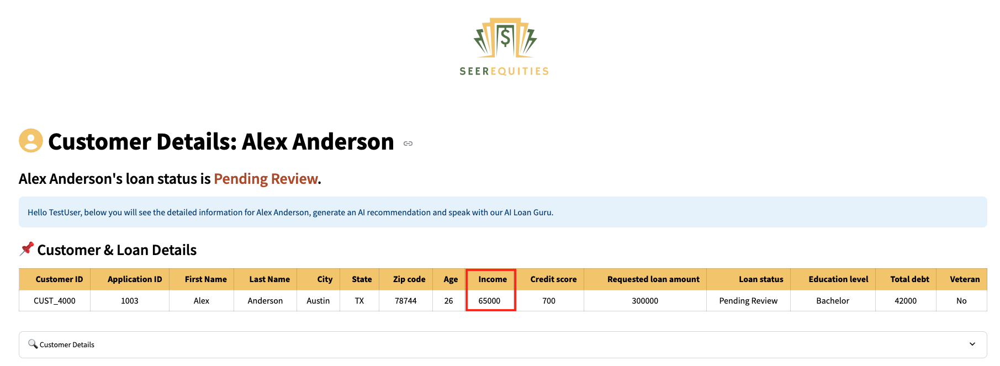

# Run the Demo

## Introduction

Step into the role of a provider or claims analyst authorizing an MRI and specialty medication using an AI-powered application. Built on Oracle Database 23ai, this demo highlights how Generative AI, AI Vector Search, Graph Analytics, and JSON Duality Views come together to streamline documentation, surface policy-aligned insights, and produce regulator-compliant outputs—all without data movement

**Disclaimer**: Please note that your results may vary. The information provided is generated by OCI Generative AI services, and your outcomes may differ from those presented.

Estimated Lab Time: 30 minutes

### Objectives

In this lab, you will:

* Review how the Seer Healthcare prior authorization app incorporates the use of  JSON Duality Views, Graph analytics, and other converged database features, all without requiring complex data movement or separate systems.

### Prerequisites

This lab assumes you have:

* An Oracle account to submit your a LiveLabs Sandbox reservation.

## Task 1: Launch the application

1. To access the demo environment, click **View Login Info** in the top left corner of the page. Click the **Start the Demo** link.

    

2. Enter in a username and click **Login**.

    

3. Welcome to the Seer Healthcare Prior Authorization application! Congratulations, you are now connected to the demo environment. You can now execute the different tasks for this Lab.

    

## Task 2: Demo - Patient with low authorization risk score

In this first example, you will use the application to approve a patient with a low authorization risk score. The first user on your to-do list is James Smith.

1. On the Dashboard page, from the pending review list, select the Patient ID for **James Smith**.

    

2. Opening James Smith’s profile reveals his prior authorization request details—name, physcian, physician's notes, and patient condition.  

    

3. At the bottom of James Smith’s profile, you will find the **AI Healthcare Guru**—a chatbot built on Oracle Database 23ai and Vector search. When prompted, the system uses **RAG** to generate a response. It converts the question and healthcare data into embeddings, performs a similarity search, and then uses the **GenAI service** to turn the enriched context into a clear, natural language answer. If the customer calls with a question, you can quickly enter it into the AI Healthcare Guru to generate a relevant response. 
 

    **Copy** the question below into the AI chatbot and press **Enter**. What does the AI Healthcare Guru respond?

    ```text
    <copy>
    Why was this request denied?
    </copy>
    ```

    

>💡 In Oracle Database 23ai, **AI Vector Search** allows you to combine your business data with a Large Language Model (LLM) to reduce hallucinations and get accurate answers from your data.

4. Select the **Navigate To Decisions** button.

    

    After navigating to the decisions page, the AI evaluation runs in the background. Clinical documents (e.g., EHR notes, radiology reports, lab results) are stored in Oracle Database 23ai and modeled with JSON Duality Views. These documents are vectorized and searched using AI Vector Search to identify semantically relevant prior cases and policy criteria. The results are passed to OCI Generative AI, which uses retrieval-augmented generation (RAG) to generate a natural-language explanation, formatted for both internal review and external (regulatory or provider) communication. 

5. In the **Select Final Prior Authorization Option** section, the available options are displayed. If more data is needed, the reviewer can upload documents, add missing codes, and trigger a re-evaluation. The system dynamically updates the risk graph, adjusts the recommendation, and generates a decision letter sent directly to the provider

    

6. Select the AI-recommended authorization decision. In this example, that is **Approved**. 

    >Please note that your results may vary. The information provided is generated by OCI Generative AI services, and your outcomes may differ from those presented.

    

7. Set the final authorization status to **Approved**, then click **Save Final Approval & Authorization Status** to complete the process.

    The authorization status has been updated to 'Approved' and saved to the patient profile.

    

8.  Click the **Generate Decision as PDF** button.

    

9.  Click **Download PDF**

    

10. Display the message the patient would see by opening the downloaded PDF.

    

11. Click the **Return to Dashboard** button to navigate back to the Dashboard.

    

12. Expand **View Approved Patients**. We can see that James Smith has been removed from the Pending Prior Authorization Requests list and has been added to the Approved Authorization Requests list.

    

**Task Summary**

Once you select and save one of the 3 authorization options recommended by the AI: 

✅ The patient's authorization status is updated.

✅ A finalized PDF decision document is generated.  

✅ The dashboard reflects the change in real-time — marking James as Approved.

Congratulations, you have just approved your first patient authorization! Proceed to the next task.

## Task 3: Demo - Denying a patient with high risk
In this example, you will navigate the application to review a customer and deny them as part of the exercise. The second user on your to-do list is James Woods.

1. On the Dashboard page, from the pending review list, select the Patient ID for **James Woods**.

    

2. Opening James Woods’s profile displays his patient history details. Within a few seconds, the AI automatically generates recommendations. In this case, the system evaluates a less favorable profile and identifies key risk factors.

    This customer has: [Placeholder]

    * **several case similarities**
    * A **minimal policy**
    * And is requesting a **high lab threshold**

    The AI evaluates the profile and suggests next steps. In this case, it recommends a denial—but also provides clear, actionable guidance to help the patient improve their chances of approval in the future.

    

3. Select the **Navigate to Decisions** button.

    

>⁉️ **What are two reasons that the AI decided to deny this applicant?** ⁉️


4. Expand **View Dot Plot: Diagnosis-Policy Relationships** to view the graph.

    

    On the decision page, the healthcare claim reviewer can use **Operational Property Graph** to explore near-approval authorization scenarios. Built with **Oracle Graph**, this feature visually maps authorizations just out of reach and highlights what adjustments—like adding missing codes or re-evaluation could improve eligibility.

    

>💡 In Oracle Database 23ai, **Property Graph** allows you to treat your data like a network of connected points, where each point (called a node) and each link (called an edge) has its own details or properties. This setup helps you run graph analytics, like to find important connections or patterns, directly within the database.

5. The authorization status is set to **Denied**. Click the **Save Final Approval & Authorization Status** button.

    The authorization status has been updated to 'Denied' and saved to the patient profile.

    

6. Press the **Generate Decision as PDF** button to save the AI responses and proceed to the final authorization disposition.

    

7. Click the **Download PDF** button.

    

8. Display the message the patient would see by opening the downloaded PDF.

    

9. Click the **Return to Dashboard** button to navigate back to the Dashboard.

    

10. Expand **View Denied Patients**. You will see that James Woods has been moved from the **Pending Prior Authorization Requests** list to the **Denied Authorization Requests** list.

    

**Task Summary**

Congratulations, you have finished reviewing a patient with high fraudulent risk! Proceed to the next task.

## Task 4: Demo - Update patient details

Lastly, let’s explore how the system uses JSON Duality Views to handle profile updates. In this task, you will edit a patient's details. In this example, the patient was asked to submit updated lab results.

1. On the Dashboard page, from the **Pending Prior Authorization Requests** list, select the patient ID for **Alex Anderson**.

    

2. We will upload a document to update Alex's lab results. Before uploading the document, note that the patient's labs is currently listed as **none**. On the Patient Details page, click the **Upload Document** button.

    

3. The PDF file has been loaded. Click the **Process Selected PDF** button.

    

>💡 **JSON Duality Views** in 23ai let's you update unstructured data in an easy, high-level format while automatically handling the technical details behind the scenes. This makes it faster and simpler to work with messy data and connect it to structured systems.

4. The patient profile has been updated.

    

5. Refresh the page and note that the labs has been updated to [placeholder]. Thanks to JSON Transform and JSON Duality Views, only the relevant field is modified — leaving the rest of the profile UNTOUCHED.

    

**Task Summary**

Once the document is uploaded:

✅ The system automatically detects the new lab data.

✅ Then their profile will be updated from **none** to [placeholder].

✅ And thanks to JSON Transform and JSON Duality Views, only the relevant field is modified — leaving the rest of the profile UNTOUCHED.

## Conlusion

In conclusion our Prior Authorizations Management App was able to leverage Oracle database 23ai technologies such as **AI Vector Search, Property Graph and JSON Duality Views** to:

✅ Automate profile evaluations

✅ Provide AI-driven authorization recommendations by using an RAG model powered by a Oracle Database 23ai's AI Vector Search and OCI Generative AI service

✅ Enable seamless profile updates with JSON Duality Views

✅ And empower healthcare claim reviewers  with actionable insights through Operational Property Graphs 

By combining these advanced tools, the application enables faster, smarter decisions and delivers clear guidance on how patients can improve their eligibility.
 
**Next:** How about learning how the application was implemented in Python? Continue with the next labs and start developing!

## Learn More

* [Oracle Database 23ai Documentation](https://docs.oracle.com/en/database/oracle/oracle-database/23/)

## Acknowledgements
* **Authors** - Kamryn Vinson, Linda Foinding, Francis Regalado
* **Contributors** - Kevin Lazarz, Eddie Ambler, Ramona Magadan, Mark Nelson, Andy Tael, Anders Swanson, Rahul Tasker
* **Last Updated By/Date** - Linda Foinding, June 2025