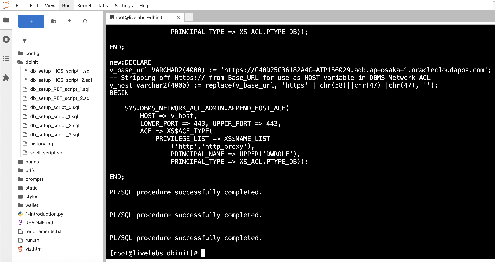
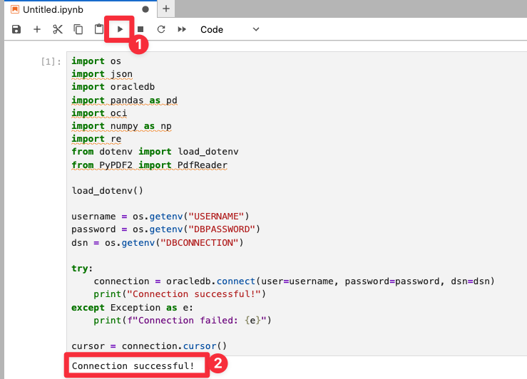

# Step by step: Implement RAG with Oracle Database 23ai 

## Introduction

In this lab, you’ll build a purchase order approval engine on Oracle Database 23ai plus OCI Generative AI. You’ll connect to procurement data, investigate supplier and pricing patterns, and employ an LLM to suggest approving, escalating, or requoting. Using Python, you’ll deliver a fully integrated AI solution that streamlines manufacturing purchasing workflows. 

This lab uses some of the basic coding samples you created in lab 3, such as `cursor.execute` and more.

Estimated Time: 30 minutes

### Objectives

* Build the complete purchase order approval application as seen in lab 1
* Use OCI Generative AI to generate personalized product recommendations
* Use Python to connect to an Oracle Database 23ai instance and run queries
* Explore supplier data and extract relevant information

### Prerequisites

This lab assumes you have:

* An Oracle Cloud account
* Completed lab 1: Run the demo
* Completed lab 2: Connect to the Development Environment

## Task 1: Build the application in Jupyter Notebook
>💡**Note**: Review Lab 2: Connect to the Development Environment for instructions on accessing JupyterLab.

1. You should see a terminal pop up once you are logged in. 

    


2. Navigate to the `dbinit` directory by running the following command.

    ```bash
    <copy>
    cd dbinit
    </copy>
    ```

    

3. Copy and run the following command to create tables in the database. There will be a lot of output. You should see the following output once complete.

    ```bash
    <copy>
    ./shell_script.sh
    </copy>
    ```

    

    

## Task 2: Connect to Database

2. Click the **+** sign on the top left to open the Launcher.

    

3. Open a new notebook.

    

1. Copy the following code block into an empty cell in your notebook. This code block imports the `oracledb` Python driver and other libraries.

    ```python
    <copy>
    import os
    import json
    import oracledb
    import pandas as pd
    import oci
    import numpy as np
    import re
    from dotenv import load_dotenv
    from PyPDF2 import PdfReader

    load_dotenv()

    username = os.getenv("USERNAME")
    password = os.getenv("DBPASSWORD")
    dsn = os.getenv("DBCONNECTION")

    try:
        connection = oracledb.connect(user=username, password=password, dsn=dsn)
        print("Connection successful!")
    except Exception as e:
        print(f"Connection failed: {e}")

    cursor = connection.cursor()
    </copy>
    ```

2. Run the code block to connect to the database. 

    

## Task 3: Pull purchase order data from the database

You will query customer data from the `manufacturing_dv` JSON duality view, which combines data from REQUESTS and related tables. This task will:

- **Define a Function**: Create a reusable function a to query the database by PO ID, extracting the JSON data for a specific request.

- **Use an Example**: Fetch data for customer `501` (Global Metals) to demonstrate the process.

- **Display the Results**: Format the retrieved data into a pandas DataFrame for a clear, tabular presentation, showing key details like supplier, requestor name, part name, price, and more.

1. Copy and paste the code below into the new notebook:

    ```python
    <copy>
    # Task 3 — Purchase Order Profile (Manufacturing)

    def fetch_po_data(po_id: int):
        """
        Fetch a single JSON document from MANUFACTURING_DV for the given po_id.
        Returns a Python dict (or None if not found).
        """
        cursor.execute("""
            SELECT data
            FROM MANUFACTURING_DV
            WHERE JSON_VALUE(data, '$._id') = :po_id
        """, {'po_id': po_id})
        row = cursor.fetchone()
        if not row:
            return None
        return json.loads(row[0]) if isinstance(row[0], str) else row[0]

    # Example PO
    selected_po_id = 501
    po_json = fetch_po_data(selected_po_id)

    if po_json:
        supplier  = po_json.get("supplier") or {}
        requestor = po_json.get("requestor") or {}
        dept      = (requestor.get("department") or {})
        lines     = po_json.get("poLines") or []
        line      = lines[0] if lines else {}
        part      = (line.get("part") or {})
        rec       = (line.get("recommendation") or {})
        dec       = (rec.get("decision") or {})
        docs      = po_json.get("documents") or []
        doc       = docs[0] if docs else {}

        # convenience values
        qty        = line.get("qty", 0) or 0
        unit_price = line.get("unitPrice", 0) or 0.0
        line_total = float(qty) * float(unit_price)

        print(f"PO: {po_json.get('_id')} | Supplier: {supplier.get('name','')} "
            f"| Request Status: {po_json.get('requestStatus','Pending Review')} "
            f"| Risk: {rec.get('riskLevel','Unknown')}")

        desired_fields = [
            ("PO ID", po_json.get("_id")),
            ("Request Date", po_json.get("requestDate", "")),
            ("Request Status", po_json.get("requestStatus", "")),
            ("Decision Date", po_json.get("decisionDate", "")),
            ("Final Decision", po_json.get("finalDecision", "")),

            ("Supplier Name", supplier.get("name", "")),
            ("Supplier Category", supplier.get("category", "")),
            ("Supplier Active", supplier.get("active", "")),

            ("Requestor Name", requestor.get("name", "")),
            ("Requestor Role", requestor.get("role", "")),
            ("Department", dept.get("name", "")),

            ("PO Line ID", line.get("poLineId", "")),
            ("Line No", line.get("lineNo", "")),
            ("Part No", part.get("partNo", "")),
            ("Part Name", part.get("partName", "")),
            ("Qty", qty),
            ("Unit Price ($)", unit_price),
            ("Line Total ($)", round(line_total, 2)),
            ("Need By Date", line.get("needByDate", "")),

            ("Risk Level", rec.get("riskLevel", "")),
            ("Generated Date", rec.get("generatedDate", "")),


            ("First Document", doc.get("fileName", "")),
            ("Document Type", doc.get("docType", ""))
        ]

        df_po_details = pd.DataFrame({k: [v] for k, v in desired_fields})
        display(df_po_details)
    else:
        print("No data found for PO ID:", selected_po_id)

    </copy>
    ```

2. Click the "Run" button to execute the code.

    

3. The output will display a DataFrame containing the PO details for the selected purchase order ID.

    

## Task 4: Generate Recommendations for the Purchase Order

In a new cell, we will build a prompt from request data, price history, and contract items. We will get a decision from the recommendation : **Approve, Deny, Request Info**. Calling OCI Generative AI as our provider, using model meta.llama-3.2-90b-vision-instruct to recommend a DER decision, update the tables, and display the results. 

With purchase order profiles in place, you will use OCI Generative AI to generate personalized purchase order approval recommendations. 

Here’s what we’ll do:

1. Copy and paste the code in a new cell:

    ```python
    <copy>
    # Task 4 — Generate PO Approval Recommendations (Manufacturing)

    # -- 1) Pull catalog/context from the DB

    # Contract catalog: supplier ↔ part ↔ contract price
    cursor.execute("""
        SELECT
            ci.contract_id,
            c.supplier_id,
            s.name        AS supplier_name,
            ci.part_id,
            p.part_no,
            p.part_name,
            ci.contract_price,
            c.start_date,
            c.end_date
        FROM MFG_CONTRACT_ITEMS ci
        JOIN MFG_CONTRACTS      c  ON c.contract_id  = ci.contract_id
        JOIN MFG_SUPPLIERS      s  ON s.supplier_id  = c.supplier_id
        JOIN MFG_PARTS          p  ON p.part_id      = ci.part_id
    """)
    df_catalog = pd.DataFrame(cursor.fetchall(), columns=[
        "CONTRACT_ID","SUPPLIER_ID","SUPPLIER_NAME","PART_ID","PART_NO","PART_NAME",
        "CONTRACT_PRICE","START_DATE","END_DATE"
    ])

    # Price history context: last quotes/POs/invoices by supplier & part
    cursor.execute("""
        SELECT
            ph.price_id,
            ph.supplier_id,
            s.name        AS supplier_name,
            ph.part_id,
            p.part_no,
            p.part_name,
            ph.price,
            ph.quote_date,
            ph.source
        FROM MFG_PRICE_HISTORY ph
        JOIN MFG_SUPPLIERS s ON s.supplier_id = ph.supplier_id
        JOIN MFG_PARTS     p ON p.part_id     = ph.part_id
    """)
    df_history = pd.DataFrame(cursor.fetchall(), columns=[
        "PRICE_ID","SUPPLIER_ID","SUPPLIER_NAME","PART_ID","PART_NO","PART_NAME",
        "PRICE","QUOTE_DATE","SOURCE"
    ])

    # -- 2) Utilities for prompt building & signals

    def _first_po_bundle(po_json: dict):
        supplier  = po_json.get("supplier") or {}
        requestor = po_json.get("requestor") or {}
        dept      = requestor.get("department") or {}
        lines     = po_json.get("poLines") or []
        line      = lines[0] if lines else {}
        part      = line.get("part") or {}
        rec       = line.get("recommendation") or {}
        dec       = rec.get("decision") or {}
        docs      = po_json.get("documents") or []
        doc       = docs[0] if docs else {}
        return supplier, requestor, dept, line, part, rec, dec, doc

    def _kv_lines(d: dict, skip_keys=()):
        return "\n".join([f"- {k}: {v}" for k, v in d.items() if k not in skip_keys])

    def _catalog_text(df: pd.DataFrame) -> str:
        if df.empty:
            return "No contract catalog available."
        rows = df.fillna("").to_dict(orient="records")
        out = []
        for r in rows:
            out.append(
                f"{r['SUPPLIER_NAME']} ⇄ {r['PART_NO']} ({r['PART_NAME']}): "
                f"Contract ${r['CONTRACT_PRICE']} (Contract #{r['CONTRACT_ID']}, {str(r['START_DATE'])[:10]}–{str(r['END_DATE'])[:10]})"
            )
        return "\n".join(out)

    def _history_text(df: pd.DataFrame) -> str:
        if df.empty:
            return "No historical prices available."
        # Group by (supplier, part), show last 3 points
        df2 = df.sort_values("QUOTE_DATE")
        blocks = []
        for (sid, pid), g in df2.groupby(["SUPPLIER_ID","PART_ID"]):
            g = g.tail(3)
            head = g.iloc[-1]
            lines = [f"• {str(r['QUOTE_DATE'])[:10]}: ${r['PRICE']} ({r['SOURCE']})" for _, r in g.iterrows()]
            blocks.append(
                f"{head['SUPPLIER_NAME']} ⇄ {head['PART_NO']} ({head['PART_NAME']}):\n  " + "\n  ".join(lines)
            )
        return "\n\n".join(blocks)

    def _derived_signals(line: dict, part: dict, supplier: dict) -> dict:
        """Compute contract delta and simple historical statistics for the selected line."""
        part_id = part.get("partId")
        sup_id  = supplier.get("supplierId")
        qty     = float(line.get("qty", 0) or 0)
        unit    = float(line.get("unitPrice", 0.0) or 0.0)

        # Contract lookup for (supplier, part)
        df_c = df_catalog[(df_catalog["SUPPLIER_ID"] == sup_id) & (df_catalog["PART_ID"] == part_id)]
        contract_price = float(df_c["CONTRACT_PRICE"].iloc[0]) if not df_c.empty else None
        contract_delta_pct = None
        if contract_price and contract_price > 0:
            contract_delta_pct = round((unit - contract_price) / contract_price * 100.0, 2)

        # History median for same supplier/part; if none, use all suppliers for part
        df_h = df_history[(df_history["SUPPLIER_ID"] == sup_id) & (df_history["PART_ID"] == part_id)]
        if df_h.empty:
            df_h = df_history[(df_history["PART_ID"] == part_id)]
        hist_median = float(df_h["PRICE"].median()) if not df_h.empty else None
        hist_delta_pct = None
        if hist_median and hist_median > 0:
            hist_delta_pct = round((unit - hist_median) / hist_median * 100.0, 2)

        return {
            "qty": int(qty),
            "unit": unit,
            "line_total": round(qty * unit, 2),
            "contract_price": contract_price,
            "contract_delta_pct": contract_delta_pct,
            "history_median": hist_median,
            "history_delta_pct": hist_delta_pct,
        }

    # -- 3) Build and send the recommendation prompt

    def generate_mfg_recommendation(po_id: int, po_json: dict,
                                    df_catalog: pd.DataFrame, df_history: pd.DataFrame) -> str:
        supplier, requestor, dept, line, part, rec, dec, doc = _first_po_bundle(po_json)

        # Strings for prompt
        po_overview = _kv_lines({
            "PoId": po_json.get("_id",""),
            "RequestDate": po_json.get("requestDate",""),
            "RequestStatus": po_json.get("requestStatus",""),
            "DecisionDate": po_json.get("decisionDate",""),
            "FinalDecision": po_json.get("finalDecision","")
        })

        supplier_text = _kv_lines({
            "SupplierId": supplier.get("supplierId",""),
            "SupplierName": supplier.get("name",""),
            "Category": supplier.get("category",""),
            "Active": supplier.get("active","")
        })

        requestor_text = _kv_lines({
            "Requestor": requestor.get("name",""),
            "Role": requestor.get("role",""),
            "Department": (dept.get("name","") if isinstance(dept, dict) else dept)
        })

        line_text = _kv_lines({
            "PoLineId": line.get("poLineId",""),
            "LineNo": line.get("lineNo",""),
            "Qty": line.get("qty",""),
            "UnitPrice": line.get("unitPrice",""),
            "NeedByDate": line.get("needByDate",""),
            "PartNo": part.get("partNo",""),
            "PartName": part.get("partName","")
        })

        # Derived signals for the FIRST line (the one most users inspect first)
        sig = _derived_signals(line, part, supplier)

        catalog_block = _catalog_text(df_catalog)
        history_block = _history_text(df_history)

        prompt = f"""<s>[INST] <<SYS>>
    You are a **Manufacturing PO Approval Advisor**. Use ONLY the provided context to recommend **APPROVE / DENY / REQUEST INFO**.
    Rules (do NOT show these rules in the output):
    - Favor APPROVE when contract price exists and PO unit price is within ±5% of contract, supplier active='Y', and no red flags.
    - Favor DENY when unit price exceeds contract by >20% or exceeds historical median by >30% AND risk noted (High/Very High) OR supplier inactive.
    - Use REQUEST INFO only when essential evidence is missing (e.g., no contract and sparse history) that prevents APPROVE or DENY.
    - Keep under 500 words, ~90% concise. Output EXACTLY the four sections below with headings. No extra prose.
    <</SYS>> [/INST]

    Available Data (Contract & Catalog):
    {catalog_block}

    Supplier & Price History Context:
    {history_block}

    PO Overview:
    {po_overview}

    Supplier:
    {supplier_text}

    Requestor:
    {requestor_text}

    Line Item (focus):
    {line_text}

    Derived Signals (for model use; do not quote verbatim unless helpful):
    - Qty: {sig['qty']}, Unit: ${sig['unit']}, LineTotal: ${sig['line_total']}
    - ContractPrice: {"$" + str(sig['contract_price']) if sig['contract_price'] is not None else "None"}
    - ContractDeltaPct: {sig['contract_delta_pct']}%
    - HistoryMedian: {"$" + str(sig['history_median']) if sig['history_median'] is not None else "None"}
    - HistoryDeltaPct: {sig['history_delta_pct']}%

    Question:
    What is your decision for this PO?

    Return ONLY these four sections (in order):

    **Suggested Action**
    Suggested Action: APPROVE / DENY / REQUEST INFO

    **Comprehensive Evaluation**
    Supplier: [name], [category], active [Y/N]. Contract: [present/absent]; contract price if present.  
    Price Analysis (sampled line): Qty: [Q], Unit: $[U], Total: $[T]. Contract delta: [±X% or N/A]; Historical median delta: [±Y% or N/A].  
    Operational Factors: Need-by: [date]; Status: [NEW/IN_REVIEW/APPROVED/REJECTED]; Prior escalations/notes if any.  
    Risk: [1–10] ([Very High|High|Medium|Low]).

    **Top 3 PO Lines**
    Recommendation: <AutoApprove|Escalate|Requote|Reject>. PO Line [poLineId]: [PartName] ([PartNo]), Qty [Q] @ $[U] → $[T]. Risk Level: [Low|Medium|High|Very High]. Approval Probability: [0–100]%.  
    Recommendation: <AutoApprove|Escalate|Requote|Reject>. PO Line [poLineId]: [PartName] ([PartNo]), Qty [Q] @ $[U] → $[T]. Risk Level: [Low|Medium|High|Very High]. Approval Probability: [0–100]%.  
    Recommendation: <AutoApprove|Escalate|Requote|Reject>. PO Line [poLineId]: [PartName] ([PartNo]), Qty [Q] @ $[U] → $[T]. Risk Level: [Low|Medium|High|Very High]. Approval Probability: [0–100]%.  

    **Recommendations Explanations**
    • Price variance vs. contract/history and why it drives the recommendation.  
    • Supplier considerations (category, active flag, recent issues if any).  
    • What evidence would change the decision (e.g., updated quote, valid contract, corrected quantity).  
    [/INST]"""

        print("Generating AI response...\n")
        genai_client = oci.generative_ai_inference.GenerativeAiInferenceClient(
            config=oci.config.from_file(os.getenv("OCI_CONFIG_PATH", "~/.oci/config")),
            service_endpoint=os.getenv("ENDPOINT")
        )
        chat_detail = oci.generative_ai_inference.models.ChatDetails(
            compartment_id=os.getenv("COMPARTMENT_OCID"),
            chat_request=oci.generative_ai_inference.models.GenericChatRequest(
                messages=[oci.generative_ai_inference.models.UserMessage(
                    content=[oci.generative_ai_inference.models.TextContent(text=prompt)]
                )],
                temperature=0.0,
                top_p=1.0
            ),
            serving_mode=oci.generative_ai_inference.models.OnDemandServingMode(
                model_id="meta.llama-3.2-90b-vision-instruct"
            )
        )
        chat_response = genai_client.chat(chat_detail)
        return chat_response.data.chat_response.choices[0].message.content[0].text

    # ---- Call it using the JSON from Task 2 (po_json) ----
    recommendations = generate_mfg_recommendation(selected_po_id, po_json, df_catalog, df_history)
    print(recommendations)

     </copy>
    ```

2. Click the "Run" button to execute the code. Note that this will take time to run.

    

3. Review the output. In the demo, this is where you selected the "Navigate to Purchase Order Decisions" button as the PO Approval Manager. You just used AI to get recommendations for the approval manager which would have taken her hours to do, congratulations!

    

>Note: Your result may be different. This is because of generative AI and the model's ability to generate new content based on your input. The output may contain different recommendations or suggestions.

## Task 5: Chunk & Store Recommendations

To handle follow-up questions, you will enhance the system with an AI Guru powered by Oracle 23ai’s Vector Search and Retrieval-Augmented Generation (RAG). The AI Guru will be able to answer questions about the purchase order application and provide recommendations based on the data.

Before answering questions, we need to prepare the data by vectoring the PO recommendations. This step:

   - Stores Recommendations: Inserts the full recommendation text (from previous cell) as a single chunk if not already present.
   - We delete prior chunks for this authorization.
   - We use `VECTOR_CHUNKS` to split the recommendation text.
   - The chunks will be inserted into `MFG_CHUNKS` (`CHUNK_ID`, `DOC_ID`, `CHUNK_TEXT`)
   - We display a data frame summary to show the chunks.


1. Copy the following code and run:

    ```python
        <copy>
        # Task 5 — Chunk & store AI recommendation, then SHOW the chunks (Manufacturing)
        # --- Inputs expected from prior tasks ---
        # - `recommendations`: AI text from Task 3
        # - `po_json`: JSON doc from Task 2
        # - `selected_po_id`: PO ID from Task 2

        def _ensure_doc_for_po(po_id: int) -> int:
            """
            Ensure there's a MFG_DOCUMENTS row for the given PO_ID.
            If one exists, return its DOC_ID.
            If none exists, create a placeholder 'AI_RECOMMENDATION' doc and return the new DOC_ID.
            """
            cursor.execute(
                "SELECT DOC_ID FROM MFG_DOCUMENTS WHERE PO_ID = :po ORDER BY DOC_ID FETCH FIRST 1 ROW ONLY",
                {"po": po_id}
            )
            row = cursor.fetchone()
            if row:
                return row[0]

            # Create a placeholder doc if none exists (choose next DOC_ID after the current max)
            cursor.execute("SELECT NVL(MAX(DOC_ID), 700) + 1 FROM MFG_DOCUMENTS")
            new_doc_id = cursor.fetchone()[0]
            cursor.execute("""
                INSERT INTO MFG_DOCUMENTS (DOC_ID, PO_ID, DOC_TYPE, FILE_NAME, OCR_TEXT)
                VALUES (:doc_id, :po, 'AI_RECOMMENDATION', :fname, NULL)
            """, {"doc_id": new_doc_id, "po": po_id, "fname": f"recommendation_{po_id}.txt"})
            connection.commit()
            return new_doc_id

        # --- 0) Prepare inputs ---
        po_id = selected_po_id
        if not po_id:
            raise ValueError("No PO ID available. Please run Task 2 first.")

        doc_id = _ensure_doc_for_po(po_id)

        # Normalize the AI text to chunk; provide a minimal fallback string if empty.
        text_to_chunk = (recommendations or "").strip()
        if not text_to_chunk:
            text_to_chunk = "Recommendation: (empty model output)."

        # --- 1) Clear old chunks for this DOC_ID (deterministic demo) ---
        cursor.execute("DELETE FROM MFG_CHUNKS WHERE DOC_ID = :doc_id", {"doc_id": doc_id})
        connection.commit()

        # --- 2) Chunk via VECTOR_CHUNKS (word-based) with globally unique CHUNK_IDs ---
        chunk_size = 25  # words per chunk

        inserted = 0
        insert_chunks_sql = f"""
            INSERT INTO MFG_CHUNKS (CHUNK_ID, DOC_ID, CHUNK_TEXT)
            WITH base AS (SELECT NVL(MAX(CHUNK_ID), 0) AS base_id FROM MFG_CHUNKS)
            SELECT base.base_id + c.chunk_offset + 1 AS chunk_id,
                :doc_id,
                c.chunk_text
            FROM (SELECT :txt AS c FROM dual) s,
                base,
                VECTOR_CHUNKS(
                    dbms_vector_chain.utl_to_text(s.c)
                    BY words
                    MAX {int(chunk_size)}
                    OVERLAP 0
                    SPLIT BY sentence
                    LANGUAGE american
                    NORMALIZE all
                ) c
        """
        try:
            cursor.execute(insert_chunks_sql, {"doc_id": doc_id, "txt": text_to_chunk})
            inserted = cursor.rowcount or 0
            connection.commit()
        except oracledb.DatabaseError as e:
            # Fallback path: Python chunking if VECTOR_CHUNKS is unavailable
            print(f"VECTOR_CHUNKS error, falling back to Python chunking. Details: {e}")
            # Get a global base so CHUNK_ID stays unique (PK is CHUNK_ID only)
            cursor.execute("SELECT NVL(MAX(CHUNK_ID), 0) FROM MFG_CHUNKS")
            base_id = cursor.fetchone()[0] or 0

            words = re.findall(r"\S+", text_to_chunk)
            chunk_texts = [" ".join(words[i:i+chunk_size]) for i in range(0, len(words), chunk_size)] or [text_to_chunk]
            rows = [(base_id + i + 1, doc_id, t) for i, t in enumerate(chunk_texts)]
            cursor.executemany("INSERT INTO MFG_CHUNKS (CHUNK_ID, DOC_ID, CHUNK_TEXT) VALUES (:1, :2, :3)", rows)
            inserted = len(rows)
            connection.commit()

        print(f"Stored {inserted} chunk(s) for DOC_ID={doc_id}.")

        # --- 3) Fetch & SHOW the chunks for this doc ---
        cursor.execute("""
            SELECT CHUNK_ID, CHUNK_TEXT
            FROM MFG_CHUNKS
            WHERE DOC_ID = :doc_id
        ORDER BY CHUNK_ID
        """, {"doc_id": doc_id})
        rows = cursor.fetchall()

        def _lob_to_str(v):
            return v.read() if isinstance(v, oracledb.LOB) else v

        items = []
        for cid, ctext in rows:
            txt = _lob_to_str(ctext) or ""
            items.append({
                "CHUNK_ID": cid,
                "Chars": len(txt),
                "Words": len(txt.split()),
                "Preview": (txt[:160] + "…") if len(txt) > 160 else txt
            })

        df_chunks = pd.DataFrame(items).sort_values("CHUNK_ID")
        display(df_chunks)  # Jupyter display

        print(f"\nStored {inserted} chunk(s) for DOC_ID={doc_id}.")

        </copy>
    ```

2. Click the "Run" button to execute the code.

    

3. Review the output.

    

## Task 6: Create Embeddings

Now we must generate and store vector embeddings. This allows us to use Vector Search and RAG to enhance AI Guru's answers. 

In this step:

   - **Generates Embeddings**: This is a new feature in Oracle Database 23ai that allows you to create embeddings directly within the database, eliminating the need for external tools or APIs. The `dbms_vector_chain.utl_to_embedding` function takes the recommendation text as input and returns an embedding vector.

   - **Stores Embeddings**: We update `MFG_CHUNKS.CHUNK_VECTOR` by embedding each `CHUNK_TEXT` using `dbms_vector_chain.utl_to_embedding` with `DEMO_MODEL`. A short verification output is printed.

1. Copy the following code into a new cell block:

    ```python
        <copy>
        # Task 6 — Create embeddings for MFG_CHUNKS rows (Manufacturing)

        # Expecting `doc_id` from Task 5 (the AI_RECOMMENDATION document you created/ensured)
        doc_id = doc_id  # <-- ensure this is defined from Task 4
        vp = json.dumps({"provider": "database", "model": "DEMO_MODEL", "dimensions": 384})

        # 1) Embed all chunks for this document
        try:
            cursor.execute(
                """
                UPDATE MFG_CHUNKS
                SET CHUNK_VECTOR = dbms_vector_chain.utl_to_embedding(CHUNK_TEXT, JSON(:vp))
                WHERE DOC_ID = :doc_id
                """,
                {"vp": vp, "doc_id": doc_id}
            )
            updated = cursor.rowcount or 0
            connection.commit()
            print(f"Embedded vectors for {updated} chunk(s) (DOC_ID={doc_id}).")
        except oracledb.DatabaseError as e:
            connection.rollback()
            print("Embedding failed. Ensure DEMO_MODEL (ONNX) is loaded and available.")
            raise

        # 2) Verify counts: total chunks vs vectorized chunks
        cursor.execute("""
            SELECT COUNT(*) FROM MFG_CHUNKS WHERE DOC_ID = :doc_id
        """, {"doc_id": doc_id})
        total_rows = cursor.fetchone()[0] or 0

        cursor.execute("""
            SELECT COUNT(*) FROM MFG_CHUNKS
            WHERE DOC_ID = :doc_id
            AND CHUNK_VECTOR IS NOT NULL
        """, {"doc_id": doc_id})
        have_vec = cursor.fetchone()[0] or 0

        print(f"Vectors present: {have_vec}/{total_rows}")

        </copy>
    ```

2. Click the "Run" button to execute the code.

    

3. Review the output.

    

## Task 7: Implement RAG with Oracle Database 23ai's Vector Search

Now that the recommendations are vectorized, we can process a user’s question:

 ```Why was this approved or denied?``` 

   - **Vectorizes the question**: Embeds the question using `DEMO_MODEL` via `dbms_vector_chain.utl_to_embedding`.
   - **Performs AI Vector Search**: Finds the most relevant using similarity search over the stored chunks.
   - **Use RAG**: Combines the purchase order profile and relevant chunk information into a prompt for OCI Generative AI, producing a concise answer. Here you implement the RAG process.
   - **Prints**: An answer is returned with citations from the LLM

1. Copy the code and run:

    ```python
        <copy>
        # Task 7 — RAG for Manufacturing: retrieve relevant chunk(s) and answer a question (fixed)

        # --- 0) Ensure we have the PO JSON doc in scope ---
        try:
            po_json  # was created in Task 2
        except NameError:
            # Recover: try selected_po_id from Task 2; else grab any PO
            try:
                po_json = fetch_po_data(selected_po_id)
            except Exception:
                cursor.execute("SELECT data FROM MANUFACTURING_DV FETCH FIRST 1 ROW ONLY")
                r = cursor.fetchone()
                po_json = json.loads(r[0]) if isinstance(r[0], str) else r[0]

        if not po_json:
            raise ValueError("po_json is missing. Re-run Task 2 to fetch the PO profile.")

        # --- 1) Question (edit as desired) ---
        question = "Why was this approved or denied?"
        print("Running vector search…")

        # --- 2) Ensure we have a DOC_ID from Task 5 (or recover it) ---
        try:
            doc_id
        except NameError:
            doc_id = None

        if not doc_id:
            po_id = po_json.get("_id")
            if not po_id:
                raise ValueError("_id (PO_ID) missing in MANUFACTURING_DV document. Re-run Task 2.")
            cursor.execute(
                "SELECT DOC_ID FROM MFG_DOCUMENTS WHERE PO_ID = :poid ORDER BY DOC_ID FETCH FIRST 1 ROW ONLY",
                {"poid": po_id}
            )
            row = cursor.fetchone()
            if not row:
                raise ValueError("No MFG_DOCUMENTS found for this PO. Re-run Task 5 to create the AI_RECOMMENDATION doc.")
            doc_id = row[0]

        # --- 3) Embed the question with the same model used in Task 6 ---
        vp = json.dumps({"provider": "database", "model": "DEMO_MODEL", "dimensions": 384})
        cursor.execute(
            "SELECT dbms_vector_chain.utl_to_embedding(:q, JSON(:vp)) FROM dual",
            {"q": question, "vp": vp}
        )
        qvec = cursor.fetchone()[0]

        # --- 4) Retrieve the most relevant chunk(s) for this DOC_ID ---
        cursor.execute("""
            SELECT CHUNK_ID,
                CHUNK_TEXT,
                VECTOR_DISTANCE(CHUNK_VECTOR, :qv, COSINE) AS dist
            FROM MFG_CHUNKS
            WHERE DOC_ID = :doc_id
            AND CHUNK_VECTOR IS NOT NULL
        ORDER BY dist
            FETCH FIRST 3 ROWS ONLY
        """, {"doc_id": doc_id, "qv": qvec})
        rows = cursor.fetchall()

        def _lob_to_str(v):
            return v.read() if isinstance(v, oracledb.LOB) else v

        retrieved = []
        for cid, ctext, dist in rows or []:
            txt = _lob_to_str(ctext) or ""
            retrieved.append((cid, txt, float(dist)))

        if not retrieved:
            raise ValueError("No vectorized chunks found for this document. Re-run Task 5 then Task 6.")

        # --- 5) Build a compact RAG prompt tailored to PO approvals ---
        def _normalize_ws(s: str) -> str:
            return re.sub(r"\s+", " ", s or "").strip()

        context_lines = [f"[Chunk {cid}] {_normalize_ws(txt)}" for cid, txt, _ in retrieved]
        context_block = "\n\n".join(context_lines)

        # Header fields from MANUFACTURING_DV JSON
        po_id       = po_json.get("_id", "")
        status      = po_json.get("requestStatus", "")
        final_dec   = po_json.get("finalDecision", "")
        req_date    = po_json.get("requestDate", "")
        supplier    = (po_json.get("supplier") or {}).get("name", "")
        sup_cat     = (po_json.get("supplier") or {}).get("category", "")
        requestor   = (po_json.get("requestor") or {}).get("name", "")

        po_lines    = po_json.get("poLines") or []
        first_line  = (po_lines[0] if po_lines else {}) or {}
        part        = (first_line.get("part") or {}).get("partName", "")
        part_no     = (first_line.get("part") or {}).get("partNo", "")
        qty         = first_line.get("qty", "")
        unit_price  = first_line.get("unitPrice", "")
        need_by     = first_line.get("needByDate", "")
        rec         = (first_line.get("recommendation") or {})
        risk_level  = rec.get("riskLevel", "")

        prompt = f"""<s>[INST] <<SYS>>
        You are a Purchase Order Approvals AI for Manufacturing.
        Use ONLY the provided context to answer precisely and cite chunk ids inline like [Chunk 2] for facts.
        Keep it under 350 words. Do not add disclaimers. If asked, respond in the user's language.
        <</SYS>> [/INST]

        Purchase Order:
        - PO: {po_id} | Status: {status} | FinalDecision: {final_dec}
        - Requestor: {requestor}
        - Supplier: {supplier} ({sup_cat})
        - First Line: {part} ({part_no}), Qty {qty}, Unit ${unit_price}, Need-by {need_by}
        - Current Risk (if any): {risk_level}
        - Request Date: {req_date}

        Question: {question}

        Context:
        {context_block}

        First print back the users question. {question}
        Return this exact plain-text format:

        Why:
        - reason 1 (cite [Chunk N])
        - reason 2 (cite [Chunk N])
        - reason 3 (cite [Chunk N])
        Evidence:
        - contract/price history/supplier status references (cite [Chunk N])
        Next:
        - actionable step 1
        - actionable step 2
        - actionable step 3
        """.strip()

        # --- 6) Generate the final RAG answer with OCI GenAI ---
        print("\nGenerating final RAG answer…")
        rag_answer = "(no output)"
        try:
            genai_client = oci.generative_ai_inference.GenerativeAiInferenceClient(
                config=oci.config.from_file(os.path.expanduser(os.getenv("OCI_CONFIG_PATH","~/.oci/config")), "DEFAULT"),
                service_endpoint=os.getenv("ENDPOINT")
            )
            chat_detail = oci.generative_ai_inference.models.ChatDetails(
                compartment_id=os.getenv("COMPARTMENT_OCID"),
                chat_request=oci.generative_ai_inference.models.GenericChatRequest(
                    messages=[oci.generative_ai_inference.models.UserMessage(
                        content=[oci.generative_ai_inference.models.TextContent(text=prompt)]
                    )],
                    temperature=0.0,
                    top_p=1.0
                ),
                serving_mode=oci.generative_ai_inference.models.OnDemandServingMode(
                    model_id="meta.llama-3.2-90b-vision-instruct"
                )
            )
            chat_resp = genai_client.chat(chat_detail)
            rag_answer = chat_resp.data.chat_response.choices[0].message.content[0].text
        except Exception as e:
            print(f"GenAI error: {e}")
            rag_answer = (
                "Decision: REQUEST INFO\n"
                "Why:\n"
                "- Placeholder: model currently unavailable. (cite [Chunk 0])\n"
                "- Please retry after verifying OCI config. (cite [Chunk 0])\n"
                "- Ensure ENDPOINT & COMPARTMENT_OCID are set. (cite [Chunk 0])\n"
                "Evidence:\n"
                "- (none)\n"
                "Next:\n"
                "- Retry generation\n"
                "- Verify model access\n"
                "- Re-run Task 6"
            )

        print("\n🤖 RAG Answer:\n", rag_answer)

        </copy>
    ```

2. Click the "Run" button to execute the code.

    

3. Review the result.

    >*Note:* Your result may be different due to non-deterministic character of generative AI.

    

## Conclusion
Congratulations! You implemented a RAG process in Oracle Database 23ai using Python.

to summarize:

* Connected with oracledb
* Retrieved a purchase order profile via a JSON duality view
* Generated a PO recommendation using OCI GenAI
* Chunked and embedded both recommendations and document text
* Performed vector search and produced a RAG answer grounded in retrieved chunks (with chunk IDs printed for traceability)

Congratulations, you completed the lab!

You may now proceed to the next lab.

## Learn More

* [Code with Python](https://www.oracle.com/developer/python-developers/)
* [Oracle Database 23ai Documentation](https://docs.oracle.com/en/database/oracle/oracle-database/23/)

## Acknowledgements
* **Authors** - Francis Regalado Database Product Manager
* **Contributors** - Kevin Lazarz, Hanna Rakhsha, Ley Sylvester
* **Last Updated By/Date** - Uma Kumar, September 2025