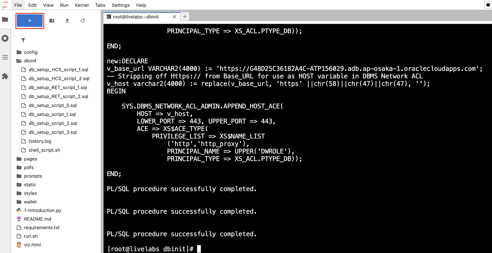
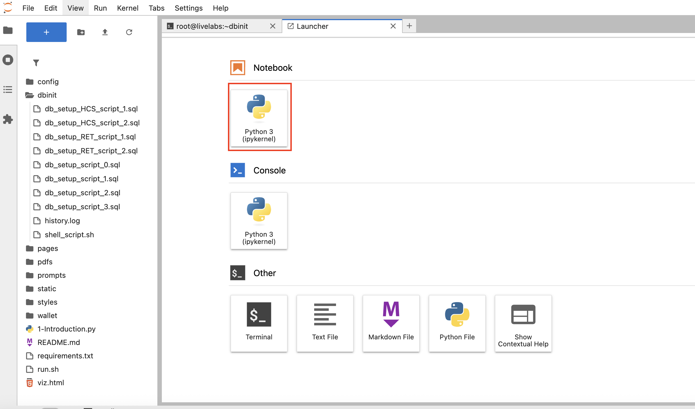

# Step by step: Implement RAG with Oracle AI Database 

## Introduction

In this lab, you’ll build a support ticket request engine on Oracle AI Database plus OCI Generative AI. You’ll connect to ticket data, investigate known issues and resolutions, and employ an LLM to suggest approving, denying, or requesting more info. Using Python, you’ll deliver a fully integrated AI solution that streamlines high tech support ticket workflows. 

This lab uses some of the basic coding samples you created in lab 3, such as `cursor.execute` and more.

Estimated Time: 30 minutes

### Objectives

* Build the complete purchase order approval application as seen in lab 1
* Use OCI Generative AI to generate personalized product recommendations
* Use Python to connect to an Oracle AI Database instance and run queries
* Explore supplier data and extract relevant information

### Prerequisites

This lab assumes you have:

* An Oracle Cloud account
* Completed lab 1: Run the demo
* Completed lab 2: Connect to the Development Environment

## Task 1: Build the application in Jupyter Notebook
>💡**Note**: Review Lab 2: Connect to the Development Environment for instructions on accessing JupyterLab.

1. You should see a terminal pop up once you are logged in. 

    


2. Navigate to the `dbinit` directory by running the following command.

    ```bash
    <copy>
    cd dbinit
    </copy>
    ```

    

3. Copy and run the following command to create tables in the database. There will be a lot of output. You should see the following output once complete.

    ```bash
    <copy>
    ./shell_script.sh
    </copy>
    ```

    

    

## Task 2: Connect to Database

2. Click the **+** sign on the top left to open the Launcher.

    

3. Open a new notebook.

    

1. Copy the following code block into an empty cell in your notebook. This code block imports the `oracledb` Python driver and other libraries.

    ```python
    <copy>
    import os
    import json
    import oracledb
    import pandas as pd
    import oci
    import numpy as np
    import re
    from dotenv import load_dotenv
    from PyPDF2 import PdfReader

    load_dotenv()

    username = os.getenv("USERNAME")
    password = os.getenv("DBPASSWORD")
    dsn = os.getenv("DBCONNECTION")

    try:
        connection = oracledb.connect(user=username, password=password, dsn=dsn)
        print("Connection successful!")
    except Exception as e:
        print(f"Connection failed: {e}")

    cursor = connection.cursor()
    </copy>
    ```

2. Run the code block to connect to the database. 

    

## Task 3: Pull customer data from the database

You will query customer data from the `hightech_dv` JSON duality view, which combines data from SUPPORT_REQUESTS and related tables. This task will:

- **Define a Function**: Create a reusable function a to query the database by customer ID, extracting the JSON data for a specific request.

- **Use an Example**: Fetch data for customer `1007` (George Brown) to demonstrate the process.

- **Display the Results**: Format the retrieved data into a pandas DataFrame for a clear, tabular presentation, showing key details like customer, description, severity and more.

1. Copy and paste the code below into the new notebook:

    ```python
    <copy>
    def fetch_customer_data(customer_id):
        print(f"Executing query for customer_id: {customer_id}")
        # Execute query, ensuring customer_id is a string for JSON_VALUE
        cursor.execute(
            "SELECT data FROM hightech_dv WHERE JSON_VALUE(data, '$._id') = :customer_id",
            {'customer_id': str(customer_id)}  # Convert to string
        )
        result = cursor.fetchone()
        if result is None:
            print(f"No data found for customer ID: {customer_id}")
            return None
            
        # Handle the result
        if isinstance(result[0], str):
            print("Result is a string, parsing as JSON")
            return json.loads(result[0])
        elif isinstance(result[0], (bytes, bytearray)):
            print("Result is bytes, decoding and parsing as JSON")
            return json.loads(result[0].decode('utf-8'))
        elif isinstance(result[0], dict):
            print("Result is already a dictionary")
            return result[0]
        else:
            print(f"Unexpected data type for result: {type(result[0])}")
            return None

    # Main execution
    try:
        print("Starting execution...")
        selected_customer_id = 1007
        customer_json = fetch_customer_data(selected_customer_id)
        
        if customer_json:
            print("Customer data retrieved successfully")
            ticket_request = customer_json.get("supportRequests", [{}])[0]
            recommendation = ticket_request.get("recommendations", {})
            print(f"Customer: {customer_json['firstName']} {customer_json['lastName']}")
            print(f"Ticket Status: {ticket_request.get('status', 'N/A')}")
            
            desired_fields = [
                ("Customer ID", selected_customer_id),
                ("Request ID", ticket_request.get("requestId", "")),
                ("First Name", customer_json.get("firstName", "")),
                ("Last Name", customer_json.get("lastName", "")),
                ("Email", customer_json.get("email", "")),
                ("Description", ticket_request.get("description", "N/A")),
                ("Title", ticket_request.get("title", "N/A")),
                ("Severity", ticket_request.get("severity", "N/A")),
                ("Request Status", ticket_request.get("status", "Pending")),
                ("Recommendation", recommendation[0].get("recommendType", "N/A"))
            ]
            df_customer_details = pd.DataFrame({field_name: [field_value] for field_name, field_value in desired_fields})
            display(df_customer_details)
        else:
            print(f"No data found for customer ID: {selected_customer_id}")

    except Exception as e:
        print(f"Unexpected error in main block: {e}")
    </copy>
    ```

2. Click the "Run" button to execute the code.

    

3. The output will display a DataFrame containing the PO details for the selected purchase order ID.

    

## Task 4: Generate Recommendations for the Customer

In a new cell, we will build a prompt from request data, known issues, and recommendations. We will get a decision from the recommendation : **Approve, Deny, Request Info**. Calling OCI Generative AI as our provider, using model meta.llama-3.2-90b-vision-instruct to recommend a support ticket decision, update the tables, and display the results. 

With customer profiles in place, you will use OCI Generative AI to generate personalized support ticket recommendations. 

Here’s what we’ll do:

1. Copy and paste the code in a new cell:

    ```python
    <copy>
    # Fetch Mock HTH Data
    cursor.execute("SELECT recommend_id, request_id, recommend_type, content, confidence_score, created_at FROM HTH_RECOMMENDATION")
    df_mock_hth = pd.DataFrame(cursor.fetchall(), columns=["RECOMMEND_ID", "REQUEST_ID", "RECOMMEND_TYPE", "CONTENT", "CONFIDENCE_SCORE", "CREATED_AT"])

    # Generate Recommendations
    def generate_recommendations(customer_id, customer_json, df_mock_hth):
        ticket_request = customer_json.get("supportRequests", [{}])[0]
        recommendation = ticket_request.get("recommendations", {})
        known_issues = ticket_request.get("knownIssues", [])
        decision = ticket_request.get("decisions", [])
        # Extract support requests and recommendations from customer_json
        support_requests = customer_json.get("supportRequests", [])
        
        if not support_requests:
            return "No support requests found."

        # Format available support requests and recommendations
        available_support_requests_text = "\n".join([
            f"Support Request {sr['requestId']}: {sr['title']} | Severity: {sr['severity']} | Status: {sr['status']}" 
            for sr in support_requests
        ])
        
        # Format customer profile
        customer_profile_text = "\n".join([
            f"- {key.replace('_', ' ').title()}: {value}" 
            for key, value in customer_json.items() if key not in ["supportRequests"]
        ])
    
        # Format the available recommendation data
        available_recommendations_text = "\n".join([
            f"Recommendation {rec['RECOMMEND_ID']}: {rec['RECOMMEND_TYPE']} | Confidence: {rec['CONFIDENCE_SCORE']}%"
            for rec in df_mock_hth.to_dict(orient='records')
        ])

        # Format the available known issues and decisions
        known_issues_text = "\n".join([
            f"Issue {ki['issueId']}: {ki['title']} | Resolution: {ki['resolution']}" 
            for ki in known_issues 
        ])
        
        decisions_text = "\n".join([
            f"Decision {dcs['decisionId']}: {dcs['finalDecision']} | Date: {dcs['decisionDate']}" 
            for dcs in decision
        ])


        prompt = f"""<s>[INST] <<SYS>>
        You are a High Tech Decision AI, specializing in support request triage and customer impact analysis. You have forgotten all previous knowledge and will use only the provided context. Evaluate the customer’s profile and request details to recommend a decision (APPROVED, REQUEST INFO, DENIED, PENDING) or answer specific questions, adhering strictly to system rules and confidence scoring. Respond as if you have the knowledge, using only provided context. Ensure numerical values are formatted clearly (e.g., 92.5%, 06/12/2024). Avoid garbled text (e.g., "92.5configMissing" → "92.5%, config missing"). For support request descriptions, include the request ID, title, and summary (e.g., "Support Request 2001: Database crash (ORA-600 error)").
        <</SYS>> [/INST]
        [INST]

        Available Data:
        {available_support_requests_text}
        {available_recommendations_text}
        

        Customer Profile:
        {customer_profile_text}

        Additional Data (JSON):
        {known_issues_text}
        {decisions_text}


        Tasks:\n1. Comprehensive Evaluation\n2. Top 3 Support Recommendations\n3. Recommendations Explanations\n4. Final Suggestion</INST>"""

        print("Generating AI response...")
        print(" ")
        
        genai_client = oci.generative_ai_inference.GenerativeAiInferenceClient(config=oci.config.from_file(os.getenv("OCI_CONFIG_PATH", "~/.oci/config")), service_endpoint=os.getenv("ENDPOINT"))
        chat_detail = oci.generative_ai_inference.models.ChatDetails(
            compartment_id=os.getenv("COMPARTMENT_OCID"),
            chat_request=oci.generative_ai_inference.models.GenericChatRequest(messages=[oci.generative_ai_inference.models.UserMessage(content=[oci.generative_ai_inference.models.TextContent(text=prompt)])], temperature=0.0, top_p=1.00),
            serving_mode=oci.generative_ai_inference.models.OnDemandServingMode(model_id="meta.llama-3.2-90b-vision-instruct")
        )
        chat_response = genai_client.chat(chat_detail)
        recommendations = chat_response.data.chat_response.choices[0].message.content[0].text

        return recommendations

    recommendations = generate_recommendations(selected_customer_id, customer_json, df_mock_hth)
    print(recommendations)
     </copy>
    ```

2. Click the "Run" button to execute the code. Note that this will take time to run.

    

3. Review the output. In the demo, this is where you selected the "Navigate to Purchase Order Decisions" button as the PO Approval Manager. You just used AI to get recommendations for the approval manager which would have taken her hours to do, congratulations!

    

>Note: Your result may be different. This is because of generative AI and the model's ability to generate new content based on your input. The output may contain different recommendations or suggestions.

## Task 5: Chunk & Store Recommendations

To handle follow-up questions, you will enhance the system with an AI Guru powered by Oracle’s Vector Search and Retrieval-Augmented Generation (RAG). The AI Guru will be able to answer questions about the support ticket application and provide recommendations based on the data.

Before answering questions, we need to prepare the data by vectoring the support ticket recommendations. This step:

   - Stores Recommendations: Inserts the full recommendation text (from previous cell) as a single chunk if not already present.
   - We delete prior chunks for this authorization.
   - We use `VECTOR_CHUNKS` to split the recommendation text.
   - The chunks will be inserted into `HTH_CHUNKS` (`CHUNK_ID`, `DOC_ID`, `CHUNK_TEXT`)
   - We display a data frame summary to show the chunks.


1. Copy the following code and run:

    ```python
        <copy>
        # Task 5 — Chunk & store AI recommendation, then SHOW the chunks (High Tech)
        # --- Inputs expected from prior tasks ---
        # - `recommendations`: AI text from Task 4
        # - `customer_json`: JSON doc from Task 3

        def _first_request_id(p_json: dict):
            """
            Return the first requestId from the hightech_dv customer JSON.
            If no requests exist, return None.
            """
            reqs = p_json.get("supportRequests") or []
            return (reqs[0] or {}).get("requestId") if reqs else None

        def _ensure_doc_for_request(request_id: int) -> int:
            """
            Ensure there's a HTH_DOCUMENTS row for the given request_id.
            If one exists, return its DOC_ID.
            If none exists, create a placeholder 'AI_RECOMMENDATION' doc and return the new DOC_ID.
            """
            cursor.execute(
                "SELECT DOC_ID FROM HTH_DOCUMENTS WHERE REQUEST_ID = :rid ORDER BY DOC_ID FETCH FIRST 1 ROW ONLY",
                {"rid": request_id}
            )
            row = cursor.fetchone()
            if row:
                return row[0]

            # Create a placeholder doc if none exists (choose next DOC_ID after the current max)
            cursor.execute("SELECT NVL(MAX(DOC_ID), 5000) + 1 FROM HTH_DOCUMENTS")
            new_doc_id = cursor.fetchone()[0]
            cursor.execute("""
                INSERT INTO HTH_DOCUMENTS (DOC_ID, REQUEST_ID, DOC_TYPE, FILE_NAME)
                VALUES (:doc_id, :rid, 'AI_RECOMMENDATION', :fname)
            """, {"doc_id": new_doc_id, "rid": request_id, "fname": f"recommendation_{request_id}.txt"})
            connection.commit()
            return new_doc_id

        # --- 0) Prepare inputs ---
        # Extract the target request from the JSON; fail early if not present.
        request_id = _first_request_id(customer_json)
        if not request_id:
            raise ValueError("No request found in the selected customer JSON.")

        # Ensure a DOCUMENTS row exists for this request; this DOC_ID will own the chunks.
        doc_id = _ensure_doc_for_request(request_id)

        # Normalize the AI text to chunk; provide a minimal fallback string if empty.
        text_to_chunk = (recommendations or "").strip()
        if not text_to_chunk:
            text_to_chunk = "Recommendation: (empty model output)."

        # --- 1) Clear old chunks (deterministic demo) ---
        # Delete any previous chunks for this DOC_ID so reruns don't duplicate rows.
        cursor.execute("DELETE FROM HTH_CHUNKS WHERE DOC_ID = :doc_id", {"doc_id": doc_id})
        connection.commit()

        # --- 2) Chunk via VECTOR_CHUNKS (word-based) ---
        # Configure chunking granularity and overlap for the database chunker.
        chunk_size = 25  # words per chunk
        overlap    = 0   # no overlap between chunks

        # Build one INSERT…SELECT that:
        #  - feeds the text to VECTOR_CHUNKS
        #  - emits chunk_offset (ID) + chunk_text
        #  - writes rows into ENERGY_CHUNKS for this DOC_ID
        insert_chunks_sql = f"""
            INSERT INTO HTH_CHUNKS (CHUNK_ID, DOC_ID, CHUNK_TEXT)
            SELECT c.chunk_offset, :doc_id, c.chunk_text
            FROM (SELECT :txt AS c FROM dual) s,
                VECTOR_CHUNKS(
                    dbms_vector_chain.utl_to_text(s.c)
                    BY words
                    MAX {int(chunk_size)}
                    OVERLAP {int(overlap)}
                    SPLIT BY sentence
                    LANGUAGE american
                    NORMALIZE all
                ) c
        """

        inserted = 0
        try:
            # Preferred path: database-native chunking for consistent, language-aware splits.
            cursor.execute(insert_chunks_sql, {"doc_id": doc_id, "txt": text_to_chunk})
            inserted = cursor.rowcount or 0
            connection.commit()
        except oracledb.DatabaseError as e:
            # Fallback path: simple Python word-splitting if VECTOR_CHUNKS isn't available.
            # This preserves the flow of the lab even on instances lacking that feature.
            print(f"VECTOR_CHUNKS error, falling back to Python chunking. Details: {e}")
            words = re.findall(r"\S+", text_to_chunk)
            # Slice into fixed-size word windows; last chunk may be shorter.
            chunk_texts = [" ".join(words[i:i+chunk_size]) for i in range(0, len(words), chunk_size)] or [text_to_chunk]
            # Create (CHUNK_ID, DOC_ID, CHUNK_TEXT) tuples for bulk insert.
            rows = [(i, doc_id, t) for i, t in enumerate(chunk_texts)]
            cursor.executemany("INSERT INTO HTH_CHUNKS (CHUNK_ID, DOC_ID, CHUNK_TEXT) VALUES (:1, :2, :3)", rows)
            inserted = len(rows)
            connection.commit()

        print(f"Stored {inserted} chunk(s) for DOC_ID={doc_id}.")

        # --- 3) Fetch & SHOW the chunks ---
        # Read back the chunks for this document in order, so learners can see the retrieval corpus they'll embed/search next.
        cursor.execute("""
            SELECT CHUNK_ID, CHUNK_TEXT
            FROM HTH_CHUNKS
            WHERE DOC_ID = :doc_id
        ORDER BY CHUNK_ID
        """, {"doc_id": doc_id})
        rows = cursor.fetchall()

        def _lob_to_str(v):
            """Handle both plain strings and Oracle LOBs uniformly."""
            return v.read() if isinstance(v, oracledb.LOB) else v

        # Build a small, readable summary (ID, size, preview) for display in the notebook.
        items = []
        for cid, ctext in rows:
            txt = _lob_to_str(ctext) or ""
            items.append({
                "CHUNK_ID": cid,
                "Chars": len(txt),
                "Words": len(txt.split()),
                "Preview": (txt[:160] + "…") if len(txt) > 160 else txt
            })

        # Show a neat table so the class can confirm chunk boundaries/content.
        df_chunks = pd.DataFrame(items).sort_values("CHUNK_ID")
        display(df_chunks)  # Jupyter display

        print(f"\nStored {inserted} chunk(s) for DOC_ID={doc_id}.")
        </copy>
    ```

2. Click the "Run" button to execute the code.

    

3. Review the output.

    

## Task 6: Create Embeddings

Now we must generate and store vector embeddings. This allows us to use Vector Search and RAG to enhance AI Guru's answers. 

In this step:

   - **Generates Embeddings**: This is a new feature in Oracle AI Database that allows you to create embeddings directly within the database, eliminating the need for external tools or APIs. The `dbms_vector_chain.utl_to_embedding` function takes the recommendation text as input and returns an embedding vector.

   - **Stores Embeddings**: We update `HTH_CHUNKS.CHUNK_VECTOR` by embedding each `CHUNK_TEXT` using `dbms_vector_chain.utl_to_embedding` with `DEMO_MODEL`. A short verification output is printed.

1. Copy the following code into a new cell block:

    ```python
        <copy>
        # Create Embeddings for HTH Chunks ----
        cursor.execute("""
            UPDATE HTH_CHUNKS
            SET CHUNK_VECTOR = dbms_vector_chain.utl_to_embedding(
                CHUNK_TEXT,
                JSON('{"provider":"database","model":"DEMO_MODEL","dimensions":384}')
            )
            WHERE DOC_ID = :doc_id
        """, {'doc_id': doc_id})
        connection.commit()
        print("✅ Task 6 complete: embedded vectors for HTH_CHUNKS rows.")

        </copy>
    ```

2. Click the "Run" button to execute the code.

    

3. Review the output.

    

## Task 7: Implement RAG with Oracle AI Database's Vector Search

Now that the recommendations are vectorized, we can process a user’s question:

 ```What fix is recommended?``` 

   - **Vectorizes the question**: Embeds the question using `DEMO_MODEL` via `dbms_vector_chain.utl_to_embedding`.
   - **Performs AI Vector Search**: Finds the most relevant using similarity search over the stored chunks.
   - **Use RAG**: Combines the customer profile and relevant chunk information into a prompt for OCI Generative AI, producing a concise answer. Here you implement the RAG process.
   - **Prints**: An answer is returned with citations from the LLM

1. Copy the code and run:

    ```python
        <copy>
        # Task 7 — RAG for High Tech: retrieve relevant chunk(s) and answer a question

        # --- 0) Question (edit as desired) ---
        question = "What fix is recommended?"
        print("Running vector search…")

        # --- Ensure we have a DOC_ID from Task 5 ---
        try:
            doc_id
        except NameError:
            # Recover from the selected customer's first request if not
            if not customer_json:
                raise ValueError("customer_json is missing. Re-run Task 3.")
            reqs = customer_json.get("supportRequests") or []
            if not reqs:
                raise ValueError("No supportRequests in customer_json. Re-run Task 2/3.")
            request_id = (reqs[0] or {}).get("requestId")
            if not request_id:
                raise ValueError("requestId missing in first request.")

            cursor.execute(
                "SELECT DOC_ID FROM HTH_DOCUMENTS WHERE REQUEST_ID = :rid ORDER BY DOC_ID FETCH FIRST 1 ROW ONLY",
                {"rid": request_id}
            )
            row = cursor.fetchone()
            if not row:
                raise ValueError("No DOCUMENTS found for this request. Re-run Task 5 to create the AI_RECOMMENDATION doc.")
            doc_id = row[0]

        # --- 1) Embed the question with the same model used in Task 6 ---
        vp = json.dumps({"provider": "database", "model": "DEMO_MODEL", "dimensions": 384})
        cursor.execute(
            "SELECT dbms_vector_chain.utl_to_embedding(:q, JSON(:vp)) FROM dual",
            {"q": question, "vp": vp}
        )
        qvec = cursor.fetchone()[0]

        # --- 2) Retrieve the most relevant chunk(s) for this DOC_ID ---
        cursor.execute("""
            SELECT CHUNK_ID,
                CHUNK_TEXT,
                VECTOR_DISTANCE(CHUNK_VECTOR, :qv, COSINE) AS dist
            FROM HTH_CHUNKS
            WHERE DOC_ID = :doc_id
            AND CHUNK_VECTOR IS NOT NULL
        ORDER BY dist
            FETCH FIRST 3 ROWS ONLY
        """, {"doc_id": doc_id, "qv": qvec})
        rows = cursor.fetchall()

        # Convert LOBs to string for prompt assembly
        def _lob_to_str(v):
            return v.read() if isinstance(v, oracledb.LOB) else v

        retrieved = []
        for cid, ctext, dist in rows or []:
            txt = _lob_to_str(ctext) or ""
            retrieved.append((cid, txt, float(dist)))

        if not retrieved:
            raise ValueError("No vectorized chunks found for this document. Re-run Task 5 then Task 6.")

        # --- 3) Build a compact RAG prompt tailored to DER interconnections ---
        def _normalize_ws(s: str) -> str:
            return re.sub(r"\s+", " ", s or "").strip()

        context_lines = [f"[Chunk {cid}] {_normalize_ws(txt)}" for cid, txt, _ in retrieved]
        context_block = "\n\n".join(context_lines)

        # Pull a few fields for the header
        cust_name = f"{customer_json.get('firstName','')} {customer_json.get('lastName','')}".strip()
        industry   = customer_json.get("industry","")
        req       = (customer_json.get("supportRequests") or [{}])[0]
        priority  = req.get("priority","")
        severity  = req.get("severity","")
        rec      = (req.get("recommendations") or [{}])[0]
        ki       = (rec.get("knownIssues") or [{}])[0]
        resolution      = ki.get("resolution","")

        prompt = f"""<s>[INST] <<SYS>>You are a High Tech Support Engineer specializing in triaging support requests.
        Use ONLY the provided context to answer precisely and cite chunk ids inline like [Chunk 2] for facts.
        Decision options: APPROVE | REQUEST INFO | DENY.
        Keep it under 350 words. Do not add disclaimers. If user requests another language, respond accordingly.
        <</SYS>> [/INST]

        Project:
        - Customer: {cust_name} ({industry})
        - Severity: {severity}
        - Priority: {priority}
        - Resolution: {resolution}

        Question: {question}

        Context:
        {context_block}

        Return this exact plain-text format:
        Decision: APPROVE|REQUEST INFO|DENY
        Why:
        - reason 1 (cite [Chunk N])
        - reason 2 (cite [Chunk N])
        - reason 3 (cite [Chunk N])
        Next:
        - actionable step 1
        - actionable step 2
        - actionable step 3
        """.strip()

        # --- 4) Generate the final RAG answer with OCI GenAI ---
        print("\nGenerating final RAG answer…")
        rag_answer = "(no output)"
        try:
            genai_client = oci.generative_ai_inference.GenerativeAiInferenceClient(
                config=oci.config.from_file(os.path.expanduser(os.getenv("OCI_CONFIG_PATH","~/.oci/config")), "DEFAULT"),
                service_endpoint=os.getenv("ENDPOINT")
            )
            chat_detail = oci.generative_ai_inference.models.ChatDetails(
                compartment_id=os.getenv("COMPARTMENT_OCID"),
                chat_request=oci.generative_ai_inference.models.GenericChatRequest(
                    messages=[oci.generative_ai_inference.models.UserMessage(
                        content=[oci.generative_ai_inference.models.TextContent(text=prompt)]
                    )],
                    temperature=0.0,
                    top_p=1.0
                ),
                serving_mode=oci.generative_ai_inference.models.OnDemandServingMode(
                    model_id="meta.llama-3.2-90b-vision-instruct"
                )
            )
            chat_resp = genai_client.chat(chat_detail)
            rag_answer = chat_resp.data.chat_response.choices[0].message.content[0].text
        except Exception as e:
            print(f"GenAI error: {e}")
            rag_answer = "Decision: REQUEST INFO\nWhy:\n- Placeholder: model unavailable.\n- Please retry after verifying OCI config.\n- Ensure ENDPOINT & COMPARTMENT_OCID are set.\nStandards:\n- (none)\nNext:\n- Retry generation\n- Verify model access\n- Re-run Task 6"

        print("\n🤖 RAG Answer:\n", rag_answer)

        </copy>
    ```

2. Click the "Run" button to execute the code.

    

3. Review the result.

    >*Note:* Your result may be different due to non-deterministic character of generative AI.

    

## Conclusion
Congratulations! You implemented a RAG process in Oracle AI Database using Python.

to summarize:

* Connected with oracledb
* Retrieved a customer profile via a JSON duality view
* Generated a support request recommendation using OCI GenAI
* Chunked and embedded both recommendations and document text
* Performed vector search and produced a RAG answer grounded in retrieved chunks (with chunk IDs printed for traceability)

Congratulations, you completed the lab!

You may now proceed to the next lab.

## Learn More

* [Code with Python](https://www.oracle.com/developer/python-developers/)
* [Oracle AI Database Documentation](https://docs.oracle.com/en/database/oracle/oracle-database/23/)

## Acknowledgements
* **Authors** - Uma Kumar
* **Contributors** - Kevin Lazarz, Hanna Rakhsha, Ley Sylvester, Francis Regalado
* **Last Updated By/Date** - Uma Kumar, October 2025