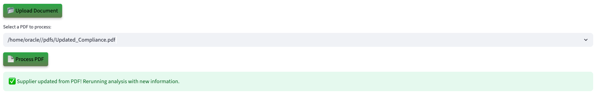

# Run the Demo

## Introduction

Step into the role of a support engineer at Seer: HighTech. Use the AI-powered triage app to process tickets, identify likely causes, and generate resolution notes. See how AI reduces hours of log analysis to seconds.

**Disclaimer**: Please note that your results may vary. The information provided is generated by OCI Generative AI services, and your outcomes may differ from those presented.

Estimated Lab Time: 30 minutes

### Objectives

In this lab, you will:

* Review how the Seer High Tech Support Ticket app incorporates the use of JSON Duality Views, Graph analytics, and other converged database features, all without requiring complex data movement or separate systems.

### Prerequisites

This lab assumes you have:

* An Oracle account to submit your a LiveLabs Sandbox reservation.

## Task 1: Launch the application

1. To access the demo environment, click **View Login Info** in the top left corner of the page. Click the **Start the Demo** link.

    

2. Select **High Tech** under Industry and **Approval Officer** under Role. Enter in a username and click **Login**.

    

3. Welcome to the Seer Manufacturing Purchase Order application! Congratulations, you are now connected to the demo environment. You can now execute the different tasks for this Lab.

    

## Task 2: Demo - Request info for a support ticket with low severity

In this first example, you will use the application to approve a purchase order with a low risk score. The third customer on your to-do list is George Brown from Quantum Works.

1. On the Dashboard page, from the pending review list, select the review button for customer **George Brown**.

    

2. Opening George Brown's profile reveals customer details like company, industry, and ticket severity. You will also be able to see detailed AI analysis on the request consisting of a comprehensive evaluation, and top 3 recommendations with approval probability. 

    

3. At the bottom of the customer profile, you will find the **AI Guru**—a chatbot built on Oracle Database 23ai and Vector search. When prompted, the system uses **RAG** to generate a response. It converts the question and support ticket data into embeddings, performs a similarity search, and then uses the **GenAI service** to turn the enriched context into a clear, natural language answer. If the customer calls with a question, you can quickly enter it into the AI Guru to generate a relevant response. 
 

    **Copy** the question below into the AI chatbot and press **Enter**. What does the AI Guru respond?

    ```text
    <copy>
    What fix is recommended?
    </copy>
    ```

    

>💡 In Oracle Database 23ai, **AI Vector Search** allows you to combine your business data with a Large Language Model (LLM) to reduce hallucinations and get accurate answers from your data.

4. Select the **Navigate To Customer Decisions** button.

    

    After navigating to the decisions page, the AI evaluation runs in the background. Support ticket documents containing information such as industry, JSON logs, and telemetry snapshots are stored in Oracle Database 23ai and modeled with JSON Duality Views. These documents are vectorized and searched using AI Vector Search to identify semantically relevant prior support tickets and product data. The results are passed to OCI Generative AI, which uses retrieval-augmented generation (RAG) to generate a natural-language explanation, formatted for both internal review and external communication. 

5. In the **Select Your Desired Option** section, the available options are displayed. If more data is needed, the reviewer can upload documents, add missing information, and trigger a re-evaluation. The system dynamically adjusts the recommendation, and generates a decision letter sent directly to the customer.

    

6. Select the AI-recommended decision. In this example, that is **Request Info**. 

    >Please note that your results may vary. The information provided is generated by OCI Generative AI services, and your outcomes may differ from those presented.

    

7. Set the final decision status to **Request Info**, then click **Confirm Decision** to complete the process.

    The decision status has been updated to 'Request Info' and saved to the customer profile.

    

8.  Click the **Download Decision as PDF** button.

    

9.  Click **Download PDF**

    

10. Display the message the customer would see by opening the downloaded PDF.

    

11. Click the **Return to Dashboard** button to navigate back to the Dashboard.

    

12. Expand **View In Progress Customers**. We can see that George Brown has been removed from the Pending Customers list and has been added to the In Progress list.

    

**Task Summary**

Once you select and save one of the 3 desired options recommended by the AI: 

✅ The customer's support ticket request is updated.

✅ A finalized PDF decision document is generated.  

✅ The dashboard reflects the change in real-time — marking George as Approved.

Congratulations, you have just updated your first customer support ticket! Proceed to the next task.

## Task 3: Demo - Escalate a support ticket
In this example, you will navigate the application to review a customer and escalate their ticket as part of the exercise. The second user on your to-do list is Fiona Zhang.

1. On the Dashboard page, from the pending review list, select the review button for **Fiona Zhang**.

    

2. Opening Fiona Zhang’s profile displays her customer details. Within a few seconds, the AI automatically generates a suggested action. In this case, the system evaluates the profile and assigns it to critical severity with explanations outlining key risk factors.

    This customer has: 

    * One support ticket already open for **data corruption**
    * An attached **error log**
    * And a confidence level of **93.6%**

    The AI evaluates the profile and suggests next steps. In this case, it recommends escalating the request and also provides clear explanations for the recommendations.

    

3. Select the **Navigate to Customer Decisions** button.

    

>⁉️ **What are two reasons that the AI escalated this request?** ⁉️

4. Expand **Interactive Graph: Support Requests & Decisions** to view the graph.

    

    On the decision page, the support engineer can use **Interactive Graph: Support Requests & Decisions** to explore relationships in support ticket scenarios. Built with **Oracle Graph**, this feature visually maps decisions and highlights important features of the request like the company and known issues.

    

    This graph shows how CyberDyne Robotics’ support request for data corruption links to a known backup issue, triggering an escalation. By connecting the customer, request, error logs, and recommendations, the Operational Property Graph makes the root cause and next steps clear. Support teams can see instantly why a ticket was escalated and ensure faster, evidence-based resolutions.

>💡 In Oracle Database 23ai, **Property Graph** allows you to treat your data like a network of connected points, where each point (called a node) and each link (called an edge) has its own details or properties. This setup helps you run graph analytics, to find important connections or patterns, directly within the database.


5. On the decisions page you can view the AI recommendation for Fiona Zhang. It shows the suggested action, comprehensive evaluation, and recommendations explanations. 

    

6. In **Select Your Desired Option** choose second option for authentication issue. The decision is set to **Approve**. Click the **Confirm Decision** button.

    The decision has been updated to 'Approve' and saved to the customer profile.

    

7. Press the **Download Decision PDF** button to save the AI responses and proceed to the final authorization disposition.

    

8. Click the **Download PDF** button.

    

9. Display the message the patient would see by opening the downloaded PDF.

    

10. Click the **Return to Dashboard** button to navigate back to the Dashboard.

    

11. Expand **View Approved Customers**. You will see that Fiona Zhang has been moved from the **Pending Customers** list to the **Approved** list.

    

**Task Summary**

Congratulations, you have finished approving a customer! Proceed to the next task.

## Task 4: Demo - Update customer details

Lastly, let’s explore how the system uses JSON Duality Views to handle profile updates. In this task, you will edit a customer's details. In this example, the customer was asked to submit updated lab results.

1. On the Dashboard page, from the **Pending Customers** list, select the review button for **Charlie Lee**.

    

2. We will upload a document to update 's physician's note. On the Customer Details page, click the **Upload Document** button. The PDF file has been loaded. Then click the **Process PDF** button

    

>💡 **JSON Duality Views** in 23ai let's you update unstructured data in an easy, high-level format while automatically handling the technical details behind the scenes. This makes it faster and simpler to work with messy data and connect it to structured systems.

4. The customer profile has been updated.

    

**Task Summary**

Once the document is uploaded:

✅ The system automatically detects the customer data.

✅ The profile will be updated with compliance documentation.

✅ Thanks to JSON Transform and JSON Duality Views, only the relevant field is modified — leaving the rest of the profile UNTOUCHED.

## Conclusion

In conclusion our Support Ticket App was able to leverage Oracle database 23ai technologies such as **AI Vector Search, Property Graph and JSON Duality Views** to:

✅ Automate profile evaluations

✅ Provide AI-driven high tech recommendations by using a RAG model powered by a Oracle Database 23ai's AI Vector Search and OCI Generative AI service

✅ Enable seamless profile updates with JSON Duality Views

✅ And empower support engineers with actionable insights through Operational Property Graphs 

By combining these advanced tools, the application enables faster, smarter decisions and delivers clear guidance on how customers can resolve their support tickets

**Next:** How about learning how the application was implemented in Python? Continue with the next labs and start developing!

## Learn More

* [Oracle Database 23ai Documentation](https://docs.oracle.com/en/database/oracle/oracle-database/23/)

## Acknowledgements
* **Authors** - Uma Kumar
* **Contributors** - Kevin Lazarz, Francis Regalado, Hanna Rakhsha, Ley Sylvester
* **Last Updated By/Date** - Uma Kumar, September 2025