# Step by step: Implement RAG with Oracle Database 23ai 

## Introduction

Here you’ll construct a State & Local Government service request assessment tool powered by Oracle Database 23ai and OCI Generative AI. Connect to citizen requests and city infrastructure data, analyze service priority and policy compliance, and use an LLM to draft resolution recommendations with regulatory references. Leveraging Python from prior labs, you’ll deploy a fully integrated AI app that accelerates public works service decisions.

This lab uses some of the basic coding samples you created in lab 3, such as `cursor.execute` and more.

Estimated Time: 30 minutes

### Objectives

* Build the complete service approval application as seen in lab 1
* Use OCI Generative AI to generate personalized product recommendations
* Use Python to connect to an Oracle Database 23ai instance and run queries
* Explore supplier data and extract relevant information

### Prerequisites

This lab assumes you have:

* An Oracle Cloud account
* Completed lab 1: Run the demo
* Completed lab 2: Connect to the Development Environment

## Task 1: Build the application in Jupyter Notebook
>💡**Note**: Review Lab 2: Connect to the Development Environment for instructions on accessing JupyterLab.

1. You should see a terminal pop up once you are logged in. 

    


2. Navigate to the `dbinit` directory by running the following command.

    ```bash
    <copy>
    cd dbinit
    </copy>
    ```

    

3. Copy and run the following command to create tables in the database. There will be a lot of output. You should see the following output once complete.

    ```bash
    <copy>
    ./shell_script.sh
    </copy>
    ```

    

    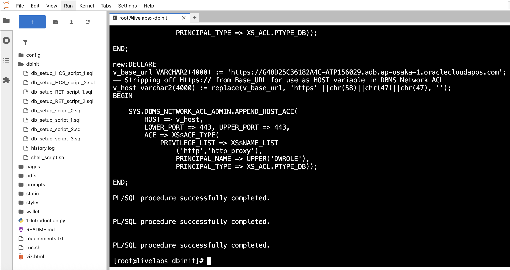

## Task 2: Connect to Database

1. Click the **+** sign on the top left to open the Launcher.

    

2. Open a new notebook.

    

3. Copy the following code block into an empty cell in your notebook. This code block imports the `oracledb` Python driver and other libraries.

    ```python
    <copy>
    import os
    import json
    import oracledb
    import pandas as pd
    import oci
    import numpy as np
    import re
    from dotenv import load_dotenv
    from PyPDF2 import PdfReader

    load_dotenv()

    username = os.getenv("USERNAME")
    password = os.getenv("DBPASSWORD")
    dsn = os.getenv("DBCONNECTION")

    try:
        connection = oracledb.connect(user=username, password=password, dsn=dsn)
        print("Connection successful!")
    except Exception as e:
        print(f"Connection failed: {e}")

    cursor = connection.cursor()
    </copy>
    ```

4. Run the code block to connect to the database. 

    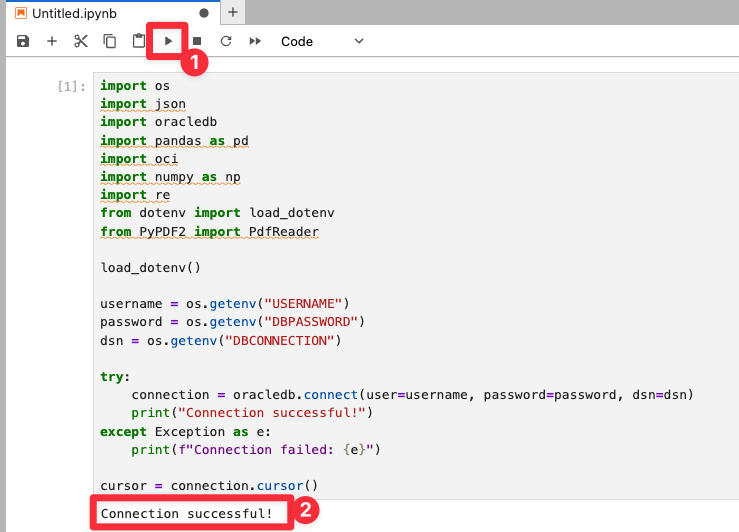

## Task 3: Pull patient data from the database

You will query patient data from the `lsc_patients_dv` JSON duality view, which combines data from PATIENTS and related tables. This task will:

- **Define a Function**: Create a reusable function a to query the database by patient ID, extracting the JSON data for a specific patient.

- **Use an Example**: Fetch data for patient `2001` (John Miller) to demonstrate the process.

- **Display the Results**: Format the retrieved data into a pandas DataFrame for a clear tabular view, highlighting key details such as patient name, email, request type, and severity.

1. Copy and paste the code below into the new notebook:

    ```python
    <copy>
    # Task 3: Fetch patient JSON from lsc_patients_dv + shared helpers

    # Pull single patient JSON document from DV
    def fetch_patient_life(patient_id: int):
        cursor.execute(
            "SELECT data FROM lsc_patients_dv WHERE JSON_VALUE(data,'$._id') = :pid",
            {'pid': str(patient_id)}
        )
        row = cursor.fetchone()
        if not row:
            return None
        return json.loads(row[0]) if isinstance(row[0], str) else row[0]

    # Load clinical requests into a DataFrame
    def load_clinical_requests():
        cursor.execute("""
            SELECT request_id, patient_id, request_date, status, request_type
            FROM LSC_REQUESTS
        """)
        rows = cursor.fetchall()
        cols = ["REQUEST_ID","PATIENT_ID","REQUEST_DATE","STATUS","REQUEST_TYPE"]
        return pd.DataFrame(rows, columns=cols) if rows else pd.DataFrame(columns=cols)

    # Pull first request/recommendation/decision bundle
    def extract_first_request_bundle_life(p_json):
        p = p_json or {}
        requests = p.get("requests") or []
        req0 = requests[0] if requests else {}
        rec = req0.get("recommendation") or {}
        dec = rec.get("decision") or {}
        return req0, rec, dec

    # --- Let's select a Life Sciences patient ---
    selected_patient_id = 2001   # John Miller
    pat_json = fetch_patient_life(selected_patient_id)
    df_reqs  = load_clinical_requests()

    # Print summary of current case
    if pat_json:
        req0, rec0, dec0 = extract_first_request_bundle_life(pat_json)
        print(f"Patient: {pat_json.get('firstName')} {pat_json.get('lastName')} | Gender: {pat_json.get('gender')} | Physician: {pat_json.get('physician',{}).get('lastName')}")
        print(f"Request ID: {req0.get('requestId')} | Type: {req0.get('requestType')} | Status: {req0.get('status')}")
        print(f"Recommendation: {rec0.get('recommendation')} | Explanation: {rec0.get('explanation')}")
        print(f"Decision: {dec0.get('finalDecision')} | Notes: {dec0.get('decisionText')}")
    else:
        print("No patient found.")

    </copy>
    ```

2. Click the "Run" button to execute the code.

    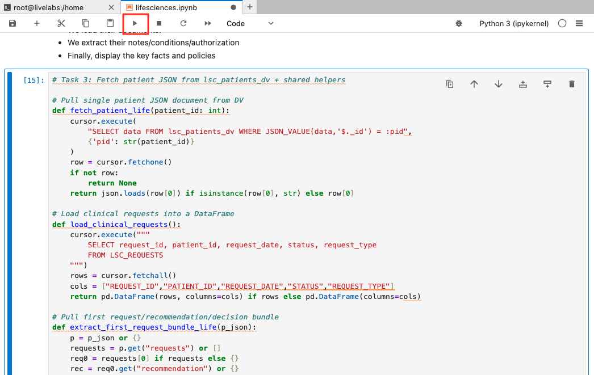

3. The output will display a DataFrame containing the patient details for the selected patient ID.

    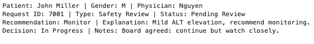

## Task 4: Generate Recommendations for the patients/Supplier

In a new cell, build a prompt using the patient’s request, uploaded supporting documents, and Operational Property Graph analysis. Retrieve compliance policy rules and risk indicators, then generate a decision from the recommendation: **Approved, Denied, Request Info, or Pending Review**. Call OCI Generative AI as the provider, using the model meta.llama-3.2-90b-vision-instruct to recommend a public works service decision, update the State & Local Government tables, and display the results.

With patient profiles in place, you will use OCI Generative AI to generate personalized service request recommendations. 

Here’s what we’ll do:

1. Copy and paste the code in a new cell:

    ```python
    <copy>
    # 🔹 Task 4: Simple Life Sciences recommendation using helpers from Task 3

    # Map Numeric Score to Risk Label
    def _risk_bucket(n):
        try:
            n = int(n)
        except:
            return "Medium"
        if n <= 3: return "High"
        if n <= 6: return "Medium"
        if n <= 8: return "Low"
        return "Very Low"

    # Reuse outputs from Task 3 (Life Sciences)
    req0, rec0, dec0 = extract_first_request_bundle_life(pat_json or {})

    # IDs we will persist back into db
    request_id   = (req0 or {}).get("requestId")
    recommend_id = (rec0 or {}).get("recommendId")

    # Build content blocks for our LLM
    # Requests to help the model
    requests_block = "\n".join([
        f"- Request {r.REQUEST_ID}: Type={r.REQUEST_TYPE}, Status={r.STATUS}, Date={r.REQUEST_DATE}"
        for _, r in df_reqs.iterrows()
    ]) or "None"

    # Patient demographics
    pat_block = "\n".join([
        f"- {k}: {v}"
        for k, v in (pat_json or {}).items() if k not in ["requests","_metadata","notes","labResults"]
    ]) or "None"

    # Request details
    req_block = "\n".join([f"- {k}: {v}" for k, v in (req0 or {}).items() if k != "recommendation"]) or "None"

    # Recommendation details (if present)
    rec_block = "\n".join([f"- {k}: {v}" for k, v in (rec0 or {}).items() if k != "decision"]) or "None"

    prompt = f"""
    You are a Clinical Trial Decision Advisor. Use ONLY this context.
    Decide APPROVED / DENIED / REQUEST INFO. Prefer APPROVED or DENIED; use REQUEST INFO only if neither can be justified.

    Clinical Requests:
    {requests_block}

    Patient:
    {pat_block}

    Request:
    {req_block}

    Recommendation:
    {rec_block}

    Decision rules:
    - APPROVED if: request complies with protocol AND evidence supports safety.
    - DENIED if: unsafe, protocol violation, or invalid.
    - REQUEST INFO only if key clinical data is missing/ambiguous.
    - If no valid request plausibly matches, prefer DENIED over REQUEST INFO.

    Return EXACTLY this layout (no extra text):
    Suggested Action: APPROVED|DENIED|REQUEST INFO
    Risk: N (Very Low|Low|Medium|High)
    Rationale:
    - one reason
    - second reason
    - third reason
    NextSteps:
    - step 1 (empty if Approved)
    - step 2
    - step 3
    """

    print("Generating AI recommendations …")
    try:
        genai_client = oci.generative_ai_inference.GenerativeAiInferenceClient(
            config=oci.config.from_file(os.path.expanduser(os.getenv("OCI_CONFIG_PATH","~/.oci/config")), "DEFAULT"),
            service_endpoint=os.getenv("ENDPOINT")
        )
        chat_detail = oci.generative_ai_inference.models.ChatDetails(
            compartment_id=os.getenv("COMPARTMENT_OCID"),
            chat_request=oci.generative_ai_inference.models.GenericChatRequest(
                messages=[oci.generative_ai_inference.models.UserMessage(
                    content=[oci.generative_ai_inference.models.TextContent(text=prompt)]
                )],
                temperature=0.0, top_p=1.0
            ),
            serving_mode=oci.generative_ai_inference.models.OnDemandServingMode(
                model_id="meta.llama-3.2-90b-vision-instruct"
            )
        )
        chat_resp = genai_client.chat(chat_detail)
        recommendation_text = chat_resp.data.chat_response.choices[0].message.content[0].text
    except Exception as e:
        print(f"OCI GenAI error: {e}")
        recommendation_text = ""

    print("\n--- AI Recommendation ---\n", recommendation_text[:1000])

    # Parse the simple block
    act = re.search(r"Suggested\s*Action:\s*(APPROVED|DENIED|REQUEST INFO)\b", recommendation_text, re.I)
    risk_num = re.search(r"Risk:\s*([0-9]+)", recommendation_text, re.I)
    risk_lbl = re.search(r"Risk:\s*[0-9N]+\s*\((Very Low|Low|Medium|High)\)", recommendation_text, re.I)

    action_norm = (act.group(1).upper() if act else "REQUEST INFO")
    risk_n = risk_num.group(1) if risk_num else ("7" if action_norm == "APPROVED" else "5")
    risk_l = (risk_lbl.group(1).title() if risk_lbl else _risk_bucket(risk_n))

    # Map to dashboard vocab
    table_status = "Approved" if action_norm == "APPROVED" else ("Denied" if action_norm == "DENIED" else "In Progress")

    # update new values into the DB
    try:
        # Insert / Update LSC_RECOMMENDATION
        cursor.execute("""
            MERGE INTO LSC_RECOMMENDATION t
            USING (SELECT :rid AS RECOMMEND_ID FROM dual) s
            ON (t.RECOMMEND_ID = s.RECOMMEND_ID)
            WHEN MATCHED THEN UPDATE SET
                t.REQUEST_ID     = :req_id,
                t.RECOMMENDATION = :rec,
                t.EXPLANATION    = :exp,
                t.SAFETY_LEVEL   = t.SAFETY_LEVEL
            WHEN NOT MATCHED THEN INSERT
                (RECOMMEND_ID, REQUEST_ID, RECOMMENDATION, SAFETY_LEVEL, EXPLANATION)
                VALUES (:rid, :req_id, :rec, 'Medium', :exp)
        """, {
            'rid': recommend_id or 81001,  # stable fallback ID
            'req_id': request_id,
            'rec': table_status,
            'exp': recommendation_text
        })

        # Update LSC_REQUESTS with STATUS
        cursor.execute("""
            UPDATE LSC_REQUESTS
            SET STATUS = :status
            WHERE REQUEST_ID = :req_id
        """, {'status': table_status.upper(), 'req_id': request_id})

        connection.commit()
        print(f"Stored recommendation -> {table_status} (risk={risk_l}); linked to LSC_REQUESTS {request_id}.")
    except Exception as e:
        connection.rollback()
        print("Failed to store recommendation:", e)

     </copy>
    ```

2. Click the "Run" button to execute the code. Note that this will take time to run.

    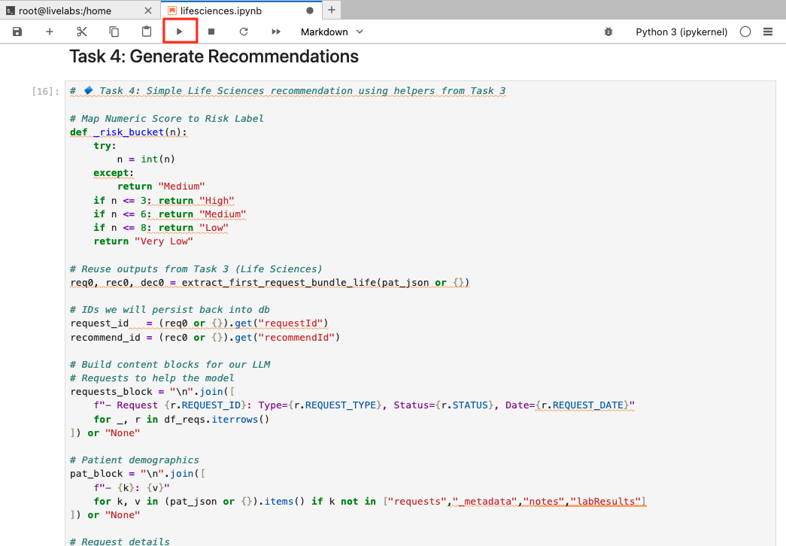

3. Review the output. In the demo, this is where you selected the “Navigate to Decisions” button as the Clinical Reviewer. You just used AI to generate service activation recommendations that would have taken hours to complete manually—congratulations!

    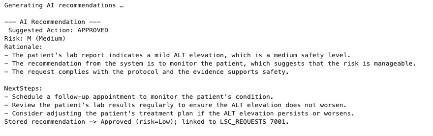

>Note: Your result may be different. This is because of generative AI and the model's ability to generate new content based on your input. The output may contain different recommendations or suggestions.

## Task 5: Chunk & Store Recommendations

To handle follow-up questions, you will enhance the system with an AI Guru powered by Oracle 23ai’s Vector Search and Retrieval-Augmented Generation (RAG). The AI Guru will be able to answer questions about the grid interconnection application and provide recommendations based on the data.

Before answering questions, we need to prepare the data by vectoring the claims recommendations. This step:

   - Stores Recommendations: Inserts the full recommendation text (from previous cell) as a single chunk if not already present.
   - We delete prior chunks for this authorization.
   - We use `VECTOR_CHUNKS` to split the recommendation text.
   - The chunks will be inserted into `LSC_VECTOR_CHUNK`
   - We display a data frame summary to show the chunks.


1. Copy the following code and run:

    ```python
        <copy>
        # 🔹 Task 5: Chunk & store AI recommendation, then SHOW the chunks (Life Sciences)

        req_id = request_id   # from Task 4
        text_to_chunk = (recommendation_text or "").strip()
        if not text_to_chunk:
            text_to_chunk = f"SuggestedAction: {table_status}\nRationale: (empty model output)."

        # 0) Find a DOC_ID for this request (attach chunks to it)
        cursor.execute("""
            SELECT DOC_ID 
            FROM LSC_DOCUMENTS 
            WHERE PATIENT_ID = (
                SELECT PATIENT_ID FROM LSC_REQUESTS WHERE REQUEST_ID = :rid
            )
        ORDER BY DOC_ID DESC FETCH FIRST 1 ROWS ONLY
        """, {'rid': req_id})
        doc_row = cursor.fetchone()
        doc_id = doc_row[0] if doc_row else None

        # 1) Clear old chunks
        if doc_id:
            cursor.execute("DELETE FROM LSC_VECTOR_CHUNK WHERE DOC_ID = :docid", {'docid': doc_id})
            connection.commit()

        # 2) Chunk via VECTOR_CHUNKS
        chunk_size = 25
        overlap    = 0

        insert_chunks_sql = f"""
            INSERT INTO LSC_VECTOR_CHUNK (DOC_ID, CHUNK_ID, CHUNK_TEXT)
            SELECT :docid, c.chunk_offset, c.chunk_text
            FROM (SELECT :txt AS c FROM dual) s,
                VECTOR_CHUNKS(
                    dbms_vector_chain.utl_to_text(s.c)
                    BY words
                    MAX {int(chunk_size)}
                    OVERLAP {int(overlap)}
                    SPLIT BY sentence
                    LANGUAGE american
                    NORMALIZE all
                ) c
        """

        inserted = 0
        try:
            if doc_id:
                cursor.execute(insert_chunks_sql, {'docid': doc_id, 'txt': text_to_chunk})
                inserted = cursor.rowcount or 0
                connection.commit()
            else:
                print(f"No document found for REQUEST_ID={req_id}, skipping chunk insert.")
        except oracledb.DatabaseError as e:
            print(f"VECTOR_CHUNKS error, {e}")
            inserted = 0

        print(f"Stored {inserted} chunk(s) for REQUEST_ID={req_id}.")

        # 3) Fetch & SHOW the chunks
        cursor.execute("""
            SELECT c.CHUNK_ID AS CHUNK_ID, c.CHUNK_TEXT AS CHUNK_TEXT
            FROM LSC_VECTOR_CHUNK c
            JOIN LSC_DOCUMENTS d ON c.DOC_ID = d.DOC_ID
            WHERE d.PATIENT_ID = (
                SELECT PATIENT_ID FROM LSC_REQUESTS WHERE REQUEST_ID = :rid
            )
        ORDER BY c.CHUNK_ID
        """, {'rid': req_id})
        rows = cursor.fetchall()
        cols = [c[0] for c in cursor.description]

        # Build DataFrame
        def _lob_to_str(v):
            return v.read() if isinstance(v, oracledb.LOB) else v

        items = []
        for row in rows:
            cid, ctext = row
            txt = _lob_to_str(ctext) or ""
            items.append({
                "CHUNK_ID": cid,
                "Chars": len(txt),
                "Words": len(txt.split()),
                "Preview": (txt[:160] + "…") if len(txt) > 160 else txt
            })

        df_chunks = pd.DataFrame(items).sort_values("CHUNK_ID")

        # Display in notebook
        display(df_chunks)

        print(f"\nStored {inserted} chunk(s) for REQUEST_ID={req_id}.")

        </copy>
    ```

2. Click the "Run" button to execute the code.

    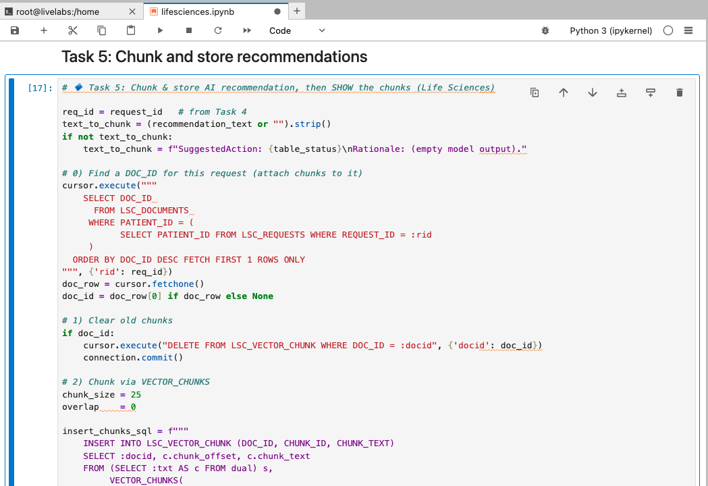

3. Review the output.

    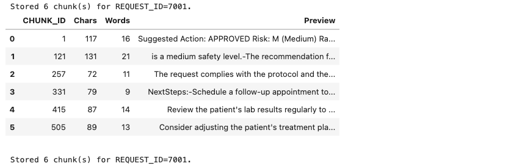

## Task 6: Create Embeddings

Now we must generate and store vector embeddings. This allows us to use Vector Search and RAG to enhance AI Guru's answers. 

In this step:

   - **Generates Embeddings**: This is a new feature in Oracle Database 23ai that allows you to create embeddings directly within the database, eliminating the need for external tools or APIs. The `dbms_vector_chain.utl_to_embedding` function takes the recommendation text as input and returns an embedding vector.

   - **Stores Embeddings**: We update `SLG_CHUNK.CHUNK_VECTOR` by embedding each `CHUNK_TEXT` using `dbms_vector_chain.utl_to_embedding` with `DEMO_MODEL`. A short verification output is printed.

1. Copy the following code into a new cell block:

    ```python
        <copy>
        # 🔹 Task 6: Create embeddings for LSC_VECTOR_CHUNK rows
        req_id = request_id  # from Task 4/5
        vp = json.dumps({"provider": "database", "model": "DEMO_MODEL", "dimensions": 384})

        # 1) Embed all chunks for this Life Sciences request (via PATIENT_ID → DOC_ID)
        try:
            cursor.execute(
                """
                UPDATE LSC_VECTOR_CHUNK c
                SET c.CHUNK_VECTOR = dbms_vector_chain.utl_to_embedding(c.CHUNK_TEXT, JSON(:vp))
                WHERE c.DOC_ID IN (
                    SELECT d.DOC_ID
                        FROM LSC_DOCUMENTS d
                        WHERE d.PATIENT_ID = (
                            SELECT r.PATIENT_ID
                                FROM LSC_REQUESTS r
                            WHERE r.REQUEST_ID = :rid
                        )
                )
                """,
                {"vp": vp, "rid": req_id}
            )
            updated = cursor.rowcount or 0
            connection.commit()
            print(f"Embedded vectors for {updated} chunk(s) (REQUEST_ID={req_id}).")
        except oracledb.DatabaseError as e:
            connection.rollback()
            print("Embedding failed. Make sure DEMO_MODEL is loaded in Task 2.")
            raise

        # 2) Sanity check: how many rows have vectors now?
        cursor.execute("""
            SELECT COUNT(*) 
            FROM LSC_VECTOR_CHUNK c
            JOIN LSC_DOCUMENTS d ON c.DOC_ID = d.DOC_ID
            WHERE d.PATIENT_ID = (
                SELECT r.PATIENT_ID FROM LSC_REQUESTS r WHERE r.REQUEST_ID = :rid
            )
            AND c.CHUNK_VECTOR IS NOT NULL
        """, {"rid": req_id})
        have_vec = cursor.fetchone()[0]

        cursor.execute("""
            SELECT COUNT(*) 
            FROM LSC_VECTOR_CHUNK c
            JOIN LSC_DOCUMENTS d ON c.DOC_ID = d.DOC_ID
            WHERE d.PATIENT_ID = (
                SELECT r.PATIENT_ID FROM LSC_REQUESTS r WHERE r.REQUEST_ID = :rid
            )
        """, {"rid": req_id})
        total_rows = cursor.fetchone()[0]

        print(f"Vectors present: {have_vec}/{total_rows}")

        </copy>
    ```

2. Click the "Run" button to execute the code.

    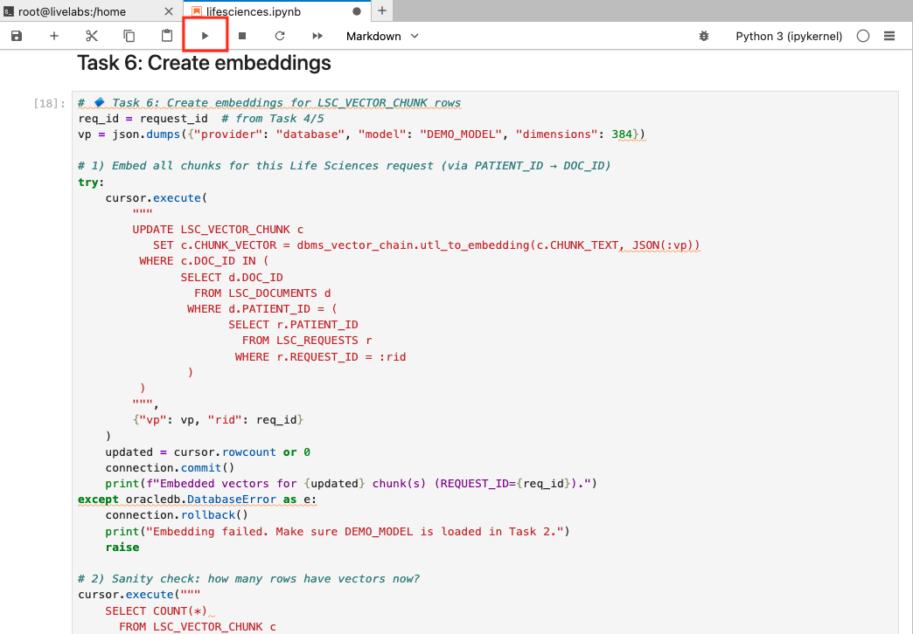

3. Review the output.

    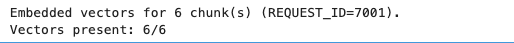

## Task 7: Implement RAG with Oracle Database 23ai's Vector Search

Now that the recommendations are vectorized, we can process a user’s question:

 ```Why was this clinical request approved?``` 

   - **Vectorizes the question**: Embeds the question using `DEMO_MODEL` via `dbms_vector_chain.utl_to_embedding`.
   - **Performs AI Vector Search**: Finds the most relevant using similarity search over the stored chunks.
   - **Use RAG**: Combines the patient profile and relevant chunk information into a prompt for OCI Generative AI, producing a concise answer. Here you implement the RAG process.
   - **Prints**: An answer is returned with citations from the LLM

1. Copy the code and run:

    ```python
        <copy>
        # 🔹 Helper: extract first life sciences bundle (requests → recommendation → decision)
        def extract_first_request_bundle_life(pat_json):
            c = pat_json or {}
            requests = c.get("requests") or []
            req0 = requests[0] if requests else {}

            rec0 = req0.get("recommendation") or {}
            dec0 = rec0.get("decision") or {}

            return req0, rec0, dec0


        # Task 7: RAG — retrieve most relevant chunk(s) and answer a question (Life Sciences)

        # 🔹 Prep: Extract a consistent bundle from pat_json
        req0, rec_block, dec_block = extract_first_request_bundle_life(pat_json)

        # 0) Question (edit as needed)
        question = "Why was this clinical request approved?"
        print("Running vector search…")

        # 1) Embed the question with the same model used earlier
        vp = json.dumps({"provider": "database", "model": "DEMO_MODEL", "dimensions": 384})
        cursor.execute(
            "SELECT dbms_vector_chain.utl_to_embedding(:q, JSON(:vp)) FROM dual",
            {"q": question, "vp": vp}
        )
        qvec = cursor.fetchone()[0]

        # 2) Retrieve chunks from LSC_VECTOR_CHUNK for this request's patient
        cursor.execute(f"""
            SELECT c.CHUNK_ID,
                c.CHUNK_TEXT,
                VECTOR_DISTANCE(c.CHUNK_VECTOR, :qv, COSINE) AS dist
            FROM LSC_VECTOR_CHUNK c
            JOIN LSC_DOCUMENTS d ON c.DOC_ID = d.DOC_ID
            WHERE d.PATIENT_ID = (
                SELECT r.PATIENT_ID FROM LSC_REQUESTS r WHERE r.REQUEST_ID = :rid
            )
            AND c.CHUNK_VECTOR IS NOT NULL
        ORDER BY dist
            FETCH FIRST 1 ROWS ONLY
        """, {"rid": req0.get("requestId"), "qv": qvec})
        rows = cursor.fetchall()

        def _lob_to_str(v): 
            return v.read() if isinstance(v, oracledb.LOB) else v

        retrieved = []
        for cid, ctext, dist in rows:
            txt = _lob_to_str(ctext) or ""
            retrieved.append((cid, txt, float(dist)))


        # 3) Build a compact RAG prompt
        def _normalize_ws(s: str) -> str:
            return re.sub(r"\s+", " ", s or "").strip()

        context_lines = [f"[Chunk {cid}] {_normalize_ws(txt)}" for cid, txt, _ in retrieved]
        context_block = "\n\n".join(context_lines)

        patient_name = f"{pat_json.get('firstName','')} {pat_json.get('lastName','')}".strip()
        physician    = f"{pat_json.get('physician',{}).get('firstName','')} {pat_json.get('physician',{}).get('lastName','')}".strip()
        req_type     = req0.get("requestType", "")
        status       = req0.get("status", "")

        prompt = f"""<s>[INST] <<SYS>>You are a Clinical Trial AI Reviewer. Be precise, cite the chunk ids inline like [Chunk 2] when referring to specific facts.
        Do not mention sources outside of the provided context. Respond in under 400 words.
        ALWAYS respond as if you have the knowledge yourself.
        Do NOT provide warnings, disclaimers, or exceed the specified response length.
        <</SYS>> [/INST]

        Patient: {patient_name}, Physician={physician}
        Request: {req_type}, Status={status}

        Question: {question}

        Context:
        {context_block}

        Return this format (plain text, no extra lines):
        Decision: APPROVED|DENIED|REQUEST INFO
        Why:
        - reason 1 (cite [Chunk N])
        - reason 2 (cite [Chunk N])
        - reason 3 (cite [Chunk N])
        Next:
        - actionable step 1
        - actionable step 2
        - actionable step 3
        """.strip()

        # 4) Generate the final answer with OCI GenAI 
        print("\nGenerating final RAG answer…")
        try:
            genai_client = oci.generative_ai_inference.GenerativeAiInferenceClient(
                config=oci.config.from_file(os.path.expanduser(os.getenv("OCI_CONFIG_PATH","~/.oci/config")), "DEFAULT"),
                service_endpoint=os.getenv("ENDPOINT")
            )
            chat_detail = oci.generative_ai_inference.models.ChatDetails(
                compartment_id=os.getenv("COMPARTMENT_OCID"),
                chat_request=oci.generative_ai_inference.models.GenericChatRequest(
                    messages=[oci.generative_ai_inference.models.UserMessage(
                        content=[oci.generative_ai_inference.models.TextContent(text=prompt)]
                    )],
                    temperature=0.0, 
                    top_p=1.0
                ),
                serving_mode=oci.generative_ai_inference.models.OnDemandServingMode(
                    model_id="meta.llama-3.2-90b-vision-instruct"
                )
            )
            chat_resp = genai_client.chat(chat_detail)
            rag_answer = chat_resp.data.chat_response.choices[0].message.content[0].text
        except Exception as e:
            print("Something is off...", e)   
            rag_answer = "[No AI answer generated]"

        print("\n🤖 RAG Answer:\n", rag_answer)

        </copy>
    ```

2. Click the "Run" button to execute the code.

    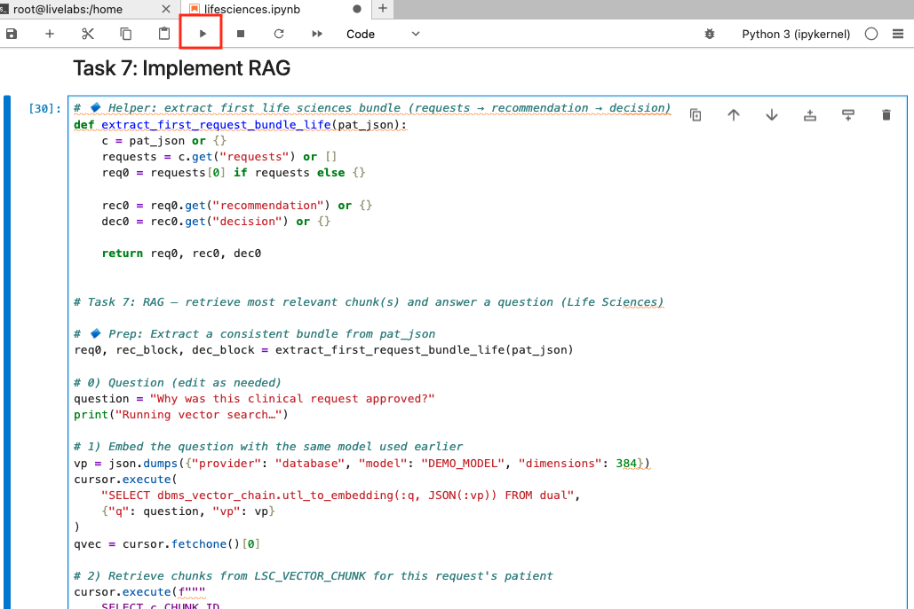

3. Review the result.

    >*Note:* Your result may be different due to non-deterministic character of generative AI.

    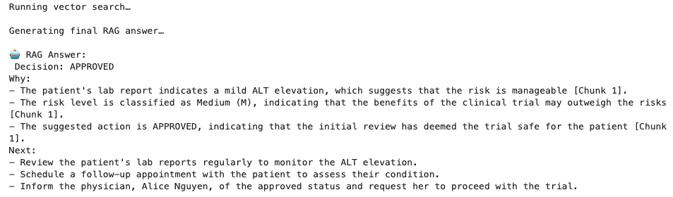

## Conclusion
Congratulations! You implemented a RAG process in Oracle Database 23ai using Python.

to summarize:

* Connected with oracledb
* Retrieved a patient profile via a JSON duality view
* Generated a clinical review recommendation using OCI GenAI
* Chunked and embedded both recommendations and document text
* Performed vector search and produced a RAG answer grounded in retrieved chunks (with chunk IDs printed for traceability)

Congratulations, you completed the lab!

You may now proceed to the next lab.

## Learn More

* [Code with Python](https://www.oracle.com/developer/python-developers/)
* [Oracle Database 23ai Documentation](https://docs.oracle.com/en/database/oracle/oracle-database/23/)

## Acknowledgements
* **Authors** - Ley Sylvester
* **Contributors** - Kevin Lazarz, Hanna Rakhsha, Francis Regalado, Uma Kumar