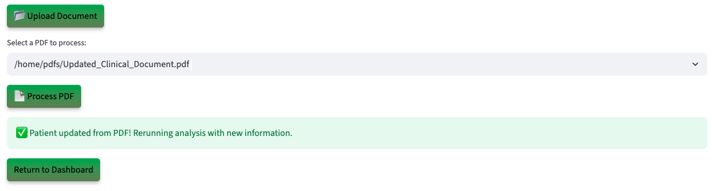

# Run the Demo

## Introduction

Act as a Clinical Reviewer using an AI-powered trial safety platform running on Oracle Database 23ai. Discover how Generative AI, Vector Search, Graph Analytics, and JSON Duality Views instantly analyze clinical requests, lab results, physician notes, and supporting documents—replacing weeks of manual review with automated, data-in-place insights.

**Disclaimer**: Please note that your results may vary. The information provided is generated by OCI Generative AI services, and your outcomes may differ from those presented.

Estimated Lab Time: 30 minutes

### Objectives

In this lab, you will:

* Review how the Seer Sciences Clinical Review app incorporates the use of JSON Duality Views, Graph Analytics, and other converged database features, all without requiring complex data movement or separate systems.

### Prerequisites

This lab assumes you have:

* An Oracle account to submit your a LiveLabs Sandbox reservation.

## Task 1: Launch the application

1. To access the demo environment, click **View Login Info** in the top left corner of the page. Click the **Start the Demo** link.

    

2. Select **Life Sciences** under Industry and **Approval Officer** under Role. Enter in a username and click **Login**.

    

3. Welcome to the Seer Sciences application! Congratulations, you are now connected to the demo environment. You can now execute the different tasks for this Lab.

    

## Task 2: Demo – Deny a Patient's Request

In this first example, you will use the application to review a Clinical Trial Safety Review request. The system evaluates patient records, lab results, physician notes, and protocol rules, then provides an AI-generated recommendation for patient safety actions. The first patient on your to-do list is Liam Chen.

1. On the Dashboard page, from the pending review list, select the review button for **Liam Chen**.

    

2. Opening Liam Chen’s profile reveals his clinical request details—patient name, email, request ID, physician, request type, and current status. You will also be able to see the AI-powered analysis of the case, including a comprehensive evaluation and the top 3 safety recommendations with approval probability.

    

3. At the bottom of Liam Chen’s profile, you will find the **AI Guru**—a chatbot built on Oracle Database 23ai and Vector search. When prompted, the system uses **RAG** to generate a response. It converts the question and energy data into embeddings, performs a similarity search, and then uses the **GenAI service** to turn the enriched context into a clear, natural language answer. If the patient calls with a question, you can quickly enter it into the AI Guru to generate a relevant response. 
 

    **Copy** the question below into the AI chatbot and press **Enter**. What does the AI Guru respond?

    ```text
    <copy>
    Why was this not approved?
    </copy>
    ```

    

>💡 In Oracle Database 23ai, **AI Vector Search** allows you to combine your business data with a Large Language Model (LLM) to reduce hallucinations and get accurate answers from your data.

4. Select the **Navigate To Patient Decisions** button.

    

    After navigating to the decisions page, the AI evaluation runs in the background. Clinical trial documents containing details such as lab results, physician notes, adverse event reports, and deviation logs are stored in Oracle Database 23ai and modeled with JSON Duality Views. These documents are vectorized and searched using AI Vector Search to identify semantically relevant prior cases and protocol criteria. The results are passed to OCI Generative AI, which uses retrieval-augmented generation (RAG) to generate a natural-language explanation, formatted for both internal safety board review and external regulatory communication.

5. In the **Select Your Desired Option** section, the available options are displayed. If more data is needed, the reviewer can upload documents, add missing information, and trigger a re-evaluation. The system dynamically adjusts the recommendation, and generates a decision letter sent directly to the patient.

    

6. Select the AI-recommended authorization decision. In this example, that is **Denied**. 

    >Please note that your results may vary. The information provided is generated by OCI Generative AI services, and your outcomes may differ from those presented.

    

7. Set the final authorization status to **Denied**, then click **Confirm Decision** to complete the process.

    The authorization status has been updated to 'Denied' and saved to the patient's profile.

    

8.  Click the **Download Decision as PDF** button.

    

9.  Click **Download PDF**

    

10. Display the message the patient would see by opening the downloaded PDF.

    

11. Click the **Return to Dashboard** button to navigate back to the Dashboard.

    

12. Expand **View Denied Patients**. We can see that Liam Chen has been removed from the Pending Patients list and has been added to the Denied Patients list.

    

**Task Summary**

Once you select and save one of the 3 desired options recommended by the AI: 

✅ The patient's service request is updated.

✅ A finalized PDF decision document is generated.  

✅ The dashboard reflects the change in real-time — marking Liam as Denied.

Congratulations, you have just made a decision on your first patient review request! Proceed to the next task.

## Task 3: Demo - Approve a Patient's request
In this example, you will navigate the application to review a patient and approve them as part of the exercise. The next user on your to-do list is Olivia Wilson.

1. On the Dashboard page, from the pending review list, select the review button for **Olivia Wilson**.

    

2. Opening Olivia Wilson’s profile displays her clinical trial request details. Within a few seconds, the AI automatically generates a suggested action. In this case, the system evaluates the request and assigns it a low safety-risk rating, with explanations outlining the key clinical factors.

    This patient has:

    * A recent **safety review request** submitted by the physician
    * Supporting **lab and symptom reports uploaded** to the trial system
    * A compliance check that matches study protocol rules, making the request **eligible for approval**

    The AI evaluates the profile and suggests next steps. In this case, it recommends approving the request, noting that the clinical evidence supports safe continuation in the trial.

    

3. Select the **Navigate to Patient Decisions** button.

    

>⁉️ **Why did AI approve this request?**

4. Expand **Interactive Graph: Patient Requests & Decisions** to view the graph.

    On the decision page, the clinical reviewer can use **Interactive Graph: Patient Requests & Decisions** how different elements of a trial case connect. Powered by **Oracle Graph**, this feature visually maps the review process and highlights key aspects such as physician notes, lab results, adverse events, and supporting documents.
    

    This graph shows how Olivia Wilson’s clinical trial request connects across the workflow and is flagged with a Low safety-risk rating and pending board review. Instead of hidden backend validations, the Operational Property Graph makes the reasoning visual by linking the patient, lab results, physician notes, adverse events, AI recommendation, and board decision in one view. Clinical reviewers can instantly see why the system recommends approval, helping build confidence and transparency in the review process.

>💡 In Oracle Database 23ai, **Property Graph** allows you to treat your data like a network of connected points, where each point (called a node) and each link (called an edge) has its own details or properties. This setup helps you run graph analytics, to find important connections or patterns, directly within the database.


5. On the decisions page you can view the AI recommendation for Olivia Wilson. It shows the suggested action, comprehensive evaluation, and recommendations explanations.

    

6. The authorization status is set to **Approved**. Click the **Confirm Decision** button.

    The authorization status has been updated to 'Approved' and saved to the patient profile.

    

7. Press the **Download Decision PDF** button to save the AI responses and proceed to the final authorization disposition.

    

8. Click the **Download PDF** button.

    

9. Display the message the patient would see by opening the downloaded PDF.

    

10. Click **Return to Dashboard** button. Expand **View Approved Patients**. You will see that Olivia Wilson has been moved from the **Pending Patients** list to the **Approved** list.

    

**Task Summary**

Congratulations, you have finished approving a patient! Proceed to the next task.

## Task 4: Demo - Update patient details

Lastly, let’s explore how the system uses JSON Duality Views to handle profile updates. In this task, you will edit a patient’s clinical profile. In this example, Ava Taylor was asked to submit updated clinical documents, such as lab reports or physician notes.

1. On the Dashboard page, from the **In Progress Patients** list, select the review button for **Ava Taylor**.

    

2. We will upload a document to update patient's service note. On the Patient Details page, click the **Upload Document** button. The PDF file has been loaded. Then click the **Process PDF** button

    

>💡 **JSON Duality Views** in 23ai let's you update unstructured data in an easy, high-level format while automatically handling the technical details behind the scenes. This makes it faster and simpler to work with messy data and connect it to structured systems.

4. The patient profile has been updated.

    

**Task Summary**

Once the document is uploaded:

✅ The system automatically detects the new data.

✅ The profile will be updated with clinical review documentation.

✅ Thanks to JSON Transform and JSON Duality Views, only the relevant field is modified — leaving the rest of the profile UNTOUCHED.

## Conclusion

In conclusion our Service Request Approval App was able to leverage Oracle database 23ai technologies such as **AI Vector Search, Property Graph and JSON Duality Views** to:

✅ Automate profile evaluations

✅ Provide AI-driven recommendations by using a RAG model powered by a Oracle Database 23ai's AI Vector Search and OCI Generative AI service

✅ Enable seamless profile updates with JSON Duality Views

✅ Leverage Operational Property Graphs to equip public works officers with actionable insights

By combining these advanced tools, the application enables faster, smarter decisions and delivers clear guidance on how patients can improve their eligibility.

**Next:** How about learning how the application was implemented in Python? Continue with the next labs and start developing!

## Learn More

* [Oracle Database 23ai Documentation](https://docs.oracle.com/en/database/oracle/oracle-database/23/)

## Acknowledgements
* **Authors** - Ley Sylvester
* **Contributors** - Kevin Lazarz, Francis Regalado, Hanna Rakhsha, Uma Kumar