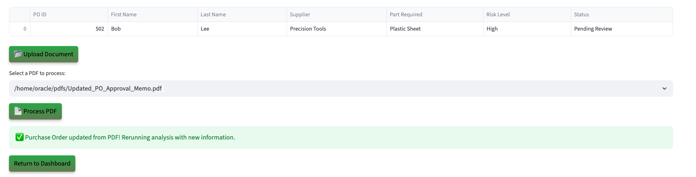

# Run the Demo

## Introduction

Take on the role of a Purchase Order Approval Manager working with an AI enabled procurement dashboard built on Oracle Database 23ai. Experience how Generative AI, Vector Search, Graph Analytics, and JSON Duality Views automate price‐variance checks, budget impacts, and supplier risk scoring - all within one unified data store, no ETL required.


**Disclaimer**: Please note that your results may vary. The information provided is generated by OCI Generative AI services, and your outcomes may differ from those presented.

Estimated Lab Time: 30 minutes

### Objectives

In this lab, you will:

* Review how the Seer Manufacturing Purchase Order app incorporates the use of JSON Duality Views, Graph analytics, and other converged database features, all without requiring complex data movement or separate systems.

### Prerequisites

This lab assumes you have:

* An Oracle account to submit your a LiveLabs Sandbox reservation.

## Task 1: Launch the application

1. To access the demo environment, click **View Login Info** in the top left corner of the page. Click the **Start the Demo** link.

    

2. Select **Manufacturing** under Industry and **PO Approval Officer** under Role. Enter in a username and click **Login**.

    

3. Welcome to the Seer Manufacturing Purchase Order application! Congratulations, you are now connected to the demo environment. You can now execute the different tasks for this Lab.

    

## Task 2: Demo - Approving a purchase order with a low risk score

In this first example, you will use the application to approve a purchase order with a low risk score. The first on your to-do list is Alice Kim from Volt Global Metals.

1. On the Dashboard page, from the pending review list, select the review button for PO ID **501**.

    

2. Opening PO 501 reveals the purchase order request details—requestor name, supplier, part required, and risk level. You will also be able to see detailed AI analysis on the request consisting of a comprehensive evaluation, and top PO line with approval probability. 

    

3. At the bottom of the purchase order profile, you will find the **AI Guru**—a chatbot built on Oracle Database 23ai and Vector search. When prompted, the system uses **RAG** to generate a response. It converts the question and manufacturing data into embeddings, performs a similarity search, and then uses the **GenAI service** to turn the enriched context into a clear, natural language answer. If the requestor calls with a question, you can quickly enter it into the AI Guru to generate a relevant response. 
 

    **Copy** the question below into the AI chatbot and press **Enter**. What does the AI Guru respond?

    ```text
    <copy>
    Why was this PO approved?
    </copy>
    ```

    

>💡 In Oracle Database 23ai, **AI Vector Search** allows you to combine your business data with a Large Language Model (LLM) to reduce hallucinations and get accurate answers from your data.

4. Select the **Navigate To Purchase Order Decisions** button.

    

    After navigating to the decisions page, the AI evaluation runs in the background. Energy documents containing  information such as contract history, price variance, and contract price are stored in Oracle Database 23ai and modeled with JSON Duality Views. These documents are vectorized and searched using AI Vector Search to identify semantically relevant prior purchase order and contract data. The results are passed to OCI Generative AI, which uses retrieval-augmented generation (RAG) to generate a natural-language explanation, formatted for both internal review and external communication. 

5. In the **Select Your Desired Option** section, the available options are displayed. If more data is needed, the reviewer can upload documents, add missing information, and trigger a re-evaluation. The system dynamically adjusts the recommendation, and generates a decision letter sent directly to the requestor.

    

6. Select the AI-recommended authorization decision. In this example, that is **Approved**. 

    >Please note that your results may vary. The information provided is generated by OCI Generative AI services, and your outcomes may differ from those presented.

    

7. Set the final decision status to **Approved**, then click **Confirm Decision** to complete the process.

    The decision status has been updated to 'Approved' and saved to the patient profile.

    

8.  Click the **Download Decision as PDF** button.

    

9.  Click **Download PDF**

    

10. Display the message the patient would see by opening the downloaded PDF.

    

11. Click the **Return to Dashboard** button to navigate back to the Dashboard.

    

12. Expand **View Approved Purchase Orders**. We can see that Alice Kim has been removed from the Pending Purchase Orders list and has been added to the Approved Purchase Orders list.

    

**Task Summary**

Once you select and save the desired option recommended by the AI: 

✅ The purchase order request is updated.

✅ A finalized PDF decision document is generated.  

✅ The dashboard reflects the change in real-time — marking 501 as Approved.

Congratulations, you have just approved your first purchase order! Proceed to the next task.

## Task 3: Demo - Deny a purchase order
In this example, you will navigate the application to review a customer and deny them as part of the exercise. The last PO on your to-do list is Jake Ross.

1. On the Dashboard page, from the pending review list, select the review button for **510**.

    

2. Opening Jake Ross's profile displays purchase order details. Within a few seconds, the AI automatically generates a suggested action. In this case, the system evaluates the profile and suggests "Deny" with explanations outlining key risk factors.

    This purchase order has: 

    * No **contract price** available
    * A **historical median delta** of +15% (Steel Bolt price slightly above average historical rate)
    * And a risk level of **6(medium)**

    The AI evaluates the profile and suggests next steps. In this case, it recommends denying and also provides clear explanations on why the recommendation is to deny

    

3. Select the **Navigate to Purchase Order Decisions** button.

    

>⁉️ **What are two reasons that the AI denied this purchase order?** ⁉️

4. Expand **Interactive Graph: Purchase Orders and Approvals** to view the graph.

    

    On the decision page, the return specialist can use **Interactive Graph: Purchase Orders and Approvals** to explore relationships in PO approval scenarios. Built with **Oracle Graph**, this feature visually maps decisions and highlights important features of the request part requested and PO documents.

    

>💡 In Oracle Database 23ai, **Property Graph** allows you to treat your data like a network of connected points, where each point (called a node) and each link (called an edge) has its own details or properties. This setup helps you run graph analytics, to find important connections or patterns, directly within the database.


5. On the decisions page you can view the AI recommendation for PO 510. It shows the suggested action, comprehensive evaluation, and recommendations explanations. 

    

6. The decision status is set to **Denied**. Click the **Confirm Decision** button.

    The authorization status has been updated to 'Deny' and saved to the patient profile.

    

7. Press the **Download Decision PDF** button to save the AI responses and proceed to the final authorization disposition.

    

8. Click the **Download PDF** button.

    

9. Display the message the patient would see by opening the downloaded PDF.

    

10. Click the **Return to Dashboard** button to navigate back to the Dashboard.

    

11. Expand **View Denied Purchase Orders**. You will see that Jake Ross has been moved from the **Pending Purchase Orders** list to the **Denied Purchase Orders** list.

    

**Task Summary**

Congratulations, you have finished denying a purchase order! Proceed to the next task.

## Task 4: Demo - Update purchase order details

Lastly, let’s explore how the system uses JSON Duality Views to handle profile updates. In this task, you will edit a purchase order's details. In this example, the approval manager was asked to submit an updated PO approval.

1. On the Dashboard page, from the **Pending Purchase Orders** list, select the review button for **Bob Lee**.

    

2. We will upload a document to update the PO. On the PO Details page, click the **Upload Document** button. The PDF file has been loaded. Then click the **Process PDF** button

    

>💡 **JSON Duality Views** in 23ai let's you update unstructured data in an easy, high-level format while automatically handling the technical details behind the scenes. This makes it faster and simpler to work with messy data and connect it to structured systems.

4. The purchase order has been updated.

    

**Task Summary**

Once the document is uploaded:

✅ The system automatically detects the new data.

✅ The profile will be updated with PO documentation.

✅ Thanks to JSON Transform and JSON Duality Views, only the relevant field is modified — leaving the rest of the profile UNTOUCHED.

## Conclusion

In conclusion our Purchase Order Approval App was able to leverage Oracle database 23ai technologies such as **AI Vector Search, Property Graph and JSON Duality Views** to:

✅ Automate profile evaluations

✅ Provide AI-driven energy recommendations by using a RAG model powered by a Oracle Database 23ai's AI Vector Search and OCI Generative AI service

✅ Enable seamless profile updates with JSON Duality Views

✅ And empower PO Approval Managers with actionable insights through Operational Property Graphs 

By combining these advanced tools, the application enables faster, smarter decisions and delivers clear guidance on how requestors can improve their eligibility.

**Next:** How about learning how the application was implemented in Python? Continue with the next labs and start developing!

## Learn More

* [Oracle Database 23ai Documentation](https://docs.oracle.com/en/database/oracle/oracle-database/23/)

## Acknowledgements
* **Authors** - Uma Kumar
* **Contributors** - Kevin Lazarz, Francis Regalado, Hanna Rakhsha, Ley Sylvester, Vahn Kessler
* **Last Updated By/Date** - Uma Kumar, October 2025