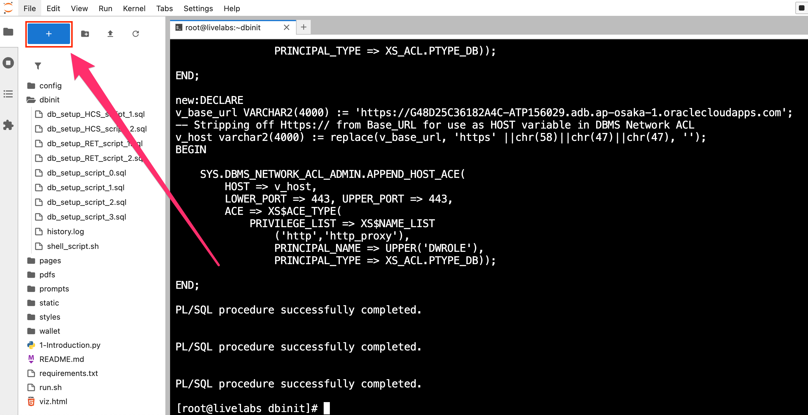
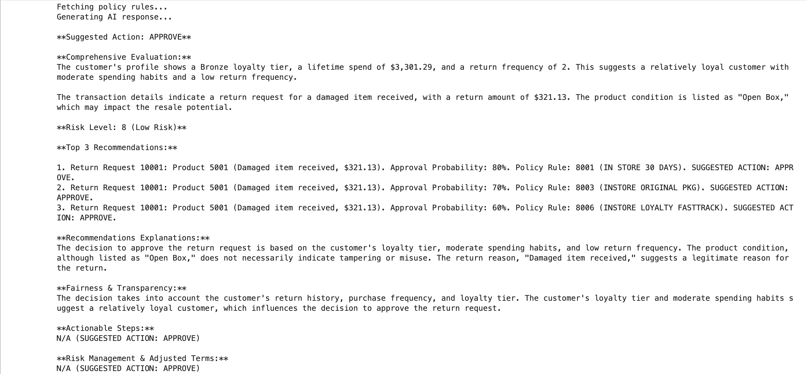
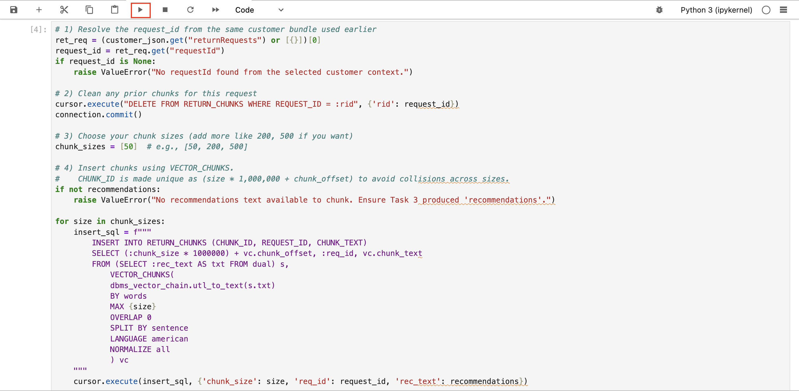

# Step by step: Implement a RAG application 

## Introduction

In this lab, you build a complete retail return recommendation engine. You'll connect to the database, explore order and image data, and invoke an LLM (Large Language Model) to generate personalized return allowance decisions and policy explanations. Building on earlier exercises, you’ll use Python to deliver a fully integrated, AI-powered retail returns application.

This lab uses some of the basic coding samples you created in lab 2, such as `cursor.execute` and more.

Estimated Time: 30 minutes

### Objectives

* Build the complete return authorization application as seen in lab 1
* Use OCI Generative AI to generate personalized risk score and return recommendations
* Use Python to connect to an Oracle AI Database instance and run queries
* Explore customer data and extract relevant information

### Prerequisites

This lab assumes you have:

* An Oracle Cloud account
* Completed lab 1: Connect to the Development Environment

## Task 1: Build the application in Jupyter Notebook
>💡**Note**: Review Lab 1: Connect to the development environment for instructions on accessing JupyterLab.

1. You should see a terminal pop up once you are logged into LiveLabs. (You can always create a new one by clicking on the blue + and select terminal)

    


2. Navigate to the `~/dbinit` directory by running the following command.

    ```bash
    <copy>
    cd ~/dbinit
    </copy>
    ```

    

3. Copy and run the following command to create tables in the database. There will be a lot of output. 

    ```bash
    <copy>
    ./shell_script.sh
    </copy>
    ```

    You should see the following output once complete.

    

    

## Task 2: Connect to Database

2. Click the blue **+** sign on the top left to open the Launcher.

    

3. Open a new notebook.

    

1. Copy the following code block into an empty cell in your notebook. This code block imports the `oracledb` Python driver and other libraries.

    ```python
    <copy>
    import os
    import json
    import oracledb
    import pandas as pd
    import oci
    import numpy as np
    import re
    from dotenv import load_dotenv
    from PyPDF2 import PdfReader

    load_dotenv()

    username = os.getenv("USERNAME")
    password = os.getenv("DBPASSWORD")
    dsn = os.getenv("DBCONNECTION")

    try:
        connection = oracledb.connect(user=username, password=password, dsn=dsn)
        print("Connection successful!")
    except Exception as e:
        print(f"Connection failed: {e}")

    cursor = connection.cursor()
    </copy>
    ```

2. Run the code block to connect to the database. 

    

## Task 3: Create a function to retrieve data from the database.

You will query customer data from the `customer_returns_dv` JSON duality view, which combines data from `CUSTOMERS`, `RETURN_REQUESTS`, and related tables. This task will:

- **Define a function**: Create a reusable function `fetch_customer_data` to query the database by customer ID, extracting the JSON data for a specific customer.

- **Use an example**: Fetch data for customer `1000` (Alice Smith) to demonstrate the process.

- **Display the results**: Format the retrieved data into a pandas DataFrame for a clear, tabular presentation, showing key details like name, LifeTime Spend, Return Amount, and Loyalty Tier.

1. Copy and paste the code below into the new notebook.

    ```python
    <copy>
    def fetch_customer_data(customer_id):
        print(f"Executing query for customer_id: {customer_id}")
        # Execute query, ensuring customer_id is a string for JSON_VALUE
        cursor.execute(
            "SELECT data FROM customer_returns_dv WHERE JSON_VALUE(data, '$._id') = :customer_id",
            {'customer_id': str(customer_id)}  # Convert to string
        )
        result = cursor.fetchone()
        if result is None:
            print(f"No data found for customer ID: {customer_id}")
            return None

        # Handle the result
        if isinstance(result[0], str):
            print("Result is a string, parsing as JSON")
            return json.loads(result[0])
        elif isinstance(result[0], (bytes, bytearray)):
            print("Result is bytes, decoding and parsing as JSON")
            return json.loads(result[0].decode('utf-8'))
        elif isinstance(result[0], dict):
            print("Result is already a dictionary")
            return result[0]
        else:
            print(f"Unexpected data type for result: {type(result[0])}")
            return None

    # Main execution
    try:
        print("Starting execution...")
        selected_customer_id = 1001
        customer_json = fetch_customer_data(selected_customer_id)

        if customer_json:
            print("Customer data retrieved successfully")
            return_request = customer_json.get("returnRequests", [{}])[0]
            recommendation = return_request.get("recommendation", {})
            print(f"Customer: {customer_json['firstName']} {customer_json['lastName']}")
            print(f"Return Status: {return_request.get('requestStatus', 'N/A')}")

            desired_fields = [
                ("Customer ID", selected_customer_id),
                ("Request ID", return_request.get("requestId", "")),
                ("First Name", customer_json.get("firstName", "")),
                ("Last Name", customer_json.get("lastName", "")),
                ("Loyalty Tier", customer_json.get("loyaltyTier", "")),
                ("Lifetime Spend", f"${customer_json.get('lifetimeSpend', 0):,.2f}"),
                ("Refund Count", customer_json.get("refundCount", 0)),
                ("Return Amount", return_request.get("returnAmount", "N/A")),
                ("Return Reason", recommendation.get("reason", {}).get("description", "")),
                ("Request Status", return_request.get("requestStatus", "Pending")),
                ("Recommendation", recommendation.get("recommendation", "N/A"))
            ]
            df_customer_details = pd.DataFrame({field_name: [field_value] for field_name, field_value in desired_fields})
            display(df_customer_details)
        else:
            print(f"No data found for customer ID: {selected_customer_id}")

    except Exception as e:
        print(f"Unexpected error in main block: {e}")
    </copy>
    ```

2. Click the "Run" button to see Alice Smith’s profile. The output will include a brief summary of the return, (name and return status) followed by a detailed table. If no data is found for the specified ID, a message will indicate this, helping you debug potential issues like an incorrect ID or empty database. 

    

3. The output will display a DataFrame containing the customer details for the selected customer ID.

    

If you saw or ran the demo lab "Run the Demo" earlier, this is what gets printed out when the Return officer clicks on the customer 1000. You just built it.

## Task 4: Create a function to generate recommendations for the customer

In a new cell, define a function `generate_recommendations` to fetch policy rules from `RETURN_POLICY_RULES` and combine them with customer data. Construct a prompt the OCI Generative AI model(meta.llama-3.2-90b-vision-instruct) to recommend a return decision(APPROVE, REQUEST INFO, DENY) based on customer profile, return requests, and policy rules. **Note**: The model we are using is an older one, but it still checks out.

With customer profiles in place, you will use OCI Generative AI to generate personalized return decision recommendations. 

Here’s what we’ll do:
- **Fetch Policy Rules**: Retrieve all policy rules from `RETURN_POLICY_RULES` and combine them with customer data..
- **Build a Prompt**: Construct a structured prompt that combines the customer’s profile with return requests, and policy rules, instructing the LLM to evaluate and recommend a return decision (APPROVE, REQUEST INFO, DENY) based solely on this data.
- **Use OCI Generative AI**: Send the prompt to the `meta.llama-3.2-90b-vision-instruct` model via OCI’s inference client, which will process the input and generate a response.
- **Format the Output**: Display the recommendations with styled headers and lists, covering evaluation, top picks, and explanations—making it easy to read and understand.

1. Copy and paste the code in a new cell:

    ```python
    <copy>
    def generate_recommendations(customer_id, customer_json, df_policy_rules):
        try: 
            # Extract return request and recommendation data
            return_request = customer_json.get("returnRequests", [{}])[0]
            recommendation = return_request.get("recommendation", {})
            reason = recommendation.get("reason", {})

            # Fetch product name from PRODUCTS table using ORDERITEMS
            cursor.execute("""
                SELECT p.PRODUCT_NAME
                FROM PRODUCTS p
                JOIN ORDERITEMS oi ON p.PRODUCT_ID = oi.PRODUCT_ID
                JOIN RETURN_REASONS rr ON oi.ORDERITEMS_ID = rr.ORDERITEMS_ID
                WHERE rr.REASON_ID = :reason_id
            """, {'reason_id': int(recommendation.get('reason', {}).get('reasonId', 0))})
            product_result = cursor.fetchone()
            product_name = product_result[0] if product_result else "Unknown Product"

            # Format data for prompt
            available_rules_text = "\n".join([
                f"{rule['RULE_ID']}: {rule['RULE_CODE']} | {rule['RULE_DESCRIPTION']} | Applies To: {rule['APPLIES_TO']}"
                for rule in df_policy_rules.to_dict(orient='records')
            ])
            customer_profile_text = "\n".join([
                f"- {key.replace('_', ' ').title()}: {value}"
                for key, value in customer_json.items() if key not in ["returnRequests", "_metadata"]
            ])
            return_request_text = "\n".join([
                f"- {key.replace('_', ' ').title()}: {value}"
                for key, value in return_request.items() if key not in ["recommendation"]
            ])
            reason_text = f"- Return Reason: {reason.get('description', 'N/A')}"

            # Construct prompt without HTML tags
            prompt = f"""<s>[INST] <<SYS>>You are a Retail Decision AI, specializing in return request recommendations. 
            \nYou have forgotten all previous knowledge and will use only the provided context. 
            \nEvaluate the customer’s profile and transaction details to recommend a return decision (APPROVE, REQUEST INFO, DENY), adhering strictly to business rules and risk assessment. 
            \nEnsure numerical values are formatted clearly (e.g., $499.99). 
            \nFor return request descriptions, include the product name and return reason (e.g., "Product O630 (Damaged item received, $394.53)"). Keep total output under 500 words, 90% spartan style.</SYS>>

    Available Data:
    {available_rules_text}

    Customer Profile:
    {customer_profile_text}

    Return Request:
    {return_request_text}
    {reason_text}

    Tasks:

    Suggested Action
    - State a clear decision: "Suggested Action: APPROVE", "Suggested Action: REQUEST INFO", or "Suggested Action: DENY".

    Comprehensive Evaluation
    - Assess the customer’s profile holistically, noting loyalty tier, lifetime spend, and return frequency.
    - Evaluate transaction details, including return reason, receipt, product condition, and return amount.
    - Rate risk level (1-10 scale) and classify as High Risk (1-3), Medium Risk (4-6), Low Risk (7-8), or Very Low Risk (9-10).

    Top 3 Recommendations
    - Recommend a decision (APPROVE, REQUEST INFO, DENY) for the return request:
    - APPROVE: Valid receipt, untampered product, within 30 days.
    - REQUEST INFO: Missing receipt, unclear photo, or incomplete return reason.
    - DENY: Late return, tampered product, or high return frequency (>5/year).
    Format each recommendation as: Return Request [Request ID]: Product [Product Name] ([Return Reason], $[Return Amount]). Approval Probability: Y%. Policy Rule: Rule Z. SUGGESTED ACTION: APPROVE/REQUEST INFO/DENY.
    - If risk level < 4, return "SUGGESTED ACTION: DENY".

    Recommendations Explanations
    - Explain the decision’s fit, including return history, product condition, and evidence impacts.

    Risk Management & Adjusted Terms
    - Suggest adjustments (e.g., partial refund, store credit) for high-risk profiles.
    - Note if adjustments could flip "DENY" to "APPROVE".
    Hide unless SUGGESTED ACTION: DENY.

    Fairness & Transparency
    - Consider return history, purchase frequency, and loyalty fairly.
    - Explain how each factor influenced the decision.

    Actionable Steps
    - Provide 3+ steps to improve eligibility (e.g., upload clear receipt, clarify return reason, provide untampered product).
    Hide unless SUGGESTED ACTION: DENY.

    Response:
    KEEP TOTAL OUTPUT AT 500 WORDS MAXIMUM. Numerical values formatted as $X,XXX.XX. Each recommendation on a new line.</INST>"""

            print("Generating AI response...")
            print(" ")

            # Initialize OCI Generative AI client
            genai_client = oci.generative_ai_inference.GenerativeAiInferenceClient(
                config=oci.config.from_file(os.getenv("OCI_CONFIG_PATH", "~/.oci/config")),
                service_endpoint=os.getenv("ENDPOINT")
            )
            chat_detail = oci.generative_ai_inference.models.ChatDetails(
                compartment_id=os.getenv("COMPARTMENT_OCID"),
                chat_request=oci.generative_ai_inference.models.GenericChatRequest(
                    messages=[oci.generative_ai_inference.models.UserMessage(
                        content=[oci.generative_ai_inference.models.TextContent(text=prompt)]
                    )],
                    temperature=0.0,
                    top_p=1.00
                ),
                serving_mode=oci.generative_ai_inference.models.OnDemandServingMode(
                    model_id="meta.llama-3.2-90b-vision-instruct"
                )
            )
            chat_response = genai_client.chat(chat_detail)
            recommendations = chat_response.data.chat_response.choices[0].message.content[0].text

            return recommendations

        except oracledb.DatabaseError as e:
            print(f"Database error: {e}")
            return None
        except Exception as e:
            print(f"Unexpected error in generate_recommendations: {e}")
            return None

    # Execute the function
    try:
        print("Fetching policy rules...")
        cursor.execute("SELECT rule_id, rule_code, rule_description, applies_to, is_active FROM RETURN_POLICY_RULES")
        df_policy_rules = pd.DataFrame(cursor.fetchall(), columns=["RULE_ID", "RULE_CODE", "RULE_DESCRIPTION", "APPLIES_TO", "IS_ACTIVE"])

        recommendations = generate_recommendations(selected_customer_id, customer_json, df_policy_rules)
        print(recommendations)

    except Exception as e:
        print(f"Unexpected error: {e}")
    </copy>
    ```

2. Click the "Run" button to execute the code. Note that this will take time to run. Be patient, you will get the recommendations from the LLM shortly.

    

3. Review the output. In the demo you may have seen earlier, this is where you selected the "Navigate to Decisions" button as the Approval Specialist. You just used AI to get recommendations for the approval officer which would have taken them hours to do, congratulations!

    >*Note:* Your result may be different due to non-deterministic nature of generative AI.

    
    
## Task 5: Chunk & store the recommendations for repeated use

To handle follow-up questions, you will enhance the system with an "AI Guru" powered by Oracle AI Database Vector Search and Retrieval-Augmented Generation (RAG). The AI Guru will be able to answer questions about the return application and provide recommendations based on the data.

Before answering questions, we need to prepare the data by creating vectors from the claims recommendations using Oracle's built in embedding model. This step:

   - Stores recommendations: Inserts the full recommendation text (from previous cell) as a single chunk if not already present.
   - We delete prior chunks for this authorization.
   - We use `VECTOR_CHUNKS` to split the recommendation text.
   - The chunks will be inserted into `RETURN_CHUNK` with `CHUNK_ID= chunk_offset`.
   - We display a data frame summary to show the chunks.

1. Copy the following code and run:

    ```python
    <copy>
    # 1) Resolve the request_id from the same customer bundle used earlier
    ret_req = (customer_json.get("returnRequests") or [{}])[0]
    request_id = ret_req.get("requestId")
    if request_id is None:
        raise ValueError("No requestId found from the selected customer context.")

    # 2) Clean any prior chunks for this request
    cursor.execute("DELETE FROM RETURN_CHUNKS WHERE REQUEST_ID = :rid", {'rid': request_id})
    connection.commit()

    # 3) Choose your chunk sizes (add more like 200, 500 if you want)
    chunk_sizes = [50]  # e.g., [50, 200, 500]

    # 4) Insert chunks using VECTOR_CHUNKS.
    #    CHUNK_ID is made unique as (size * 1,000,000 + chunk_offset) to avoid collisions across sizes.
    if not recommendations:
        raise ValueError("No recommendations text available to chunk. Ensure Task 3 produced 'recommendations'.")

    for size in chunk_sizes:
        insert_sql = f"""
            INSERT INTO RETURN_CHUNKS (CHUNK_ID, REQUEST_ID, CHUNK_TEXT)
            SELECT (:chunk_size * 1000000) + vc.chunk_offset, :req_id, vc.chunk_text
            FROM (SELECT :rec_text AS txt FROM dual) s,
                VECTOR_CHUNKS(
                dbms_vector_chain.utl_to_text(s.txt)
                BY words
                MAX {size}
                OVERLAP 0
                SPLIT BY sentence
                LANGUAGE american
                NORMALIZE all
                ) vc
        """
        cursor.execute(insert_sql, {'chunk_size': size, 'req_id': request_id, 'rec_text': recommendations})

    connection.commit()

    # 5) Fetch chunks for preview (similar to finance example)
    cursor.execute("""
        SELECT CHUNK_ID, CHUNK_TEXT
        FROM RETURN_CHUNKS
        WHERE REQUEST_ID = :rid
    ORDER BY CHUNK_ID
    """, {'rid': request_id})
    rows = cursor.fetchall()

    # 6) Build a compact dataframe with a short preview
    def _lob_to_str(v):
        try:
            import oracledb
            return v.read() if isinstance(v, oracledb.LOB) else v
        except Exception:
            # Fallback if oracledb not imported here or if type check fails
            try:
                return v.read()
            except Exception:
                return v

    items = []
    for cid, ctext in rows:
        txt = _lob_to_str(ctext) or ""
        preview = (txt[:160] + "…") if len(txt) > 160 else txt
        items.append({
            "CHUNK_ID": int(cid),
            "Chars": len(txt),
            "Words": len(txt.split()),
            "Preview": preview
        })

    df_return_chunks = pd.DataFrame(items).sort_values("CHUNK_ID").reset_index(drop=True)

    print(f"✅ Task 5 complete: recommendation chunked and stored for request {request_id} (sizes: {chunk_sizes}).")
    display(df_return_chunks)
    </copy>
    ```

2. Click the "Run" button to execute the code.

    

3. Review the output.

    


## Task 6: Create a function to create vector embeddings - Use Oracle AI Database to create vector data 

To handle follow-up questions, you will enhance the system with an "AI Guru" powered by Oracle AI Database Vector Search and Retrieval-Augmented Generation (RAG). The AI Guru will be able to answer questions about the return application and provide recommendations based on the data.

Before answering questions, we need to prepare the data by vectoring the recommendations chunks. This step:

   - **Generates Embeddings**: This is a new feature in Oracle AI Database that allows you to create embeddings directly within the database, eliminating the need for external tools or APIs. The `dbms_vector_chain.utl_to_embedding` function takes the recommendation text as input and returns an embedding vector.

   - **Stores Embeddings**: Inserts the generated embedding vector into a table called `RETURN_CHUNKS`.

1. Run and review the code in a new cell to chunk and store recommendations:

    ```python
    <copy>
    # --- Task 6 — Create embeddings for RETURN_CHUNKS rows (Retail) ---

    # Expecting `request_id` from Task 4 (the return request we chunked)
    req_id = request_id  # <-- ensure this is defined from Task 4
    vp = json.dumps({"provider": "database", "model": "DEMO_MODEL", "dimensions": 384})

    # 1) Embed all chunks for this request
    try:
        cursor.execute(
            """
            UPDATE RETURN_CHUNKS
            SET CHUNK_VECTOR = dbms_vector_chain.utl_to_embedding(CHUNK_TEXT, JSON(:vp))
            WHERE REQUEST_ID = :rid
            """,
            {"vp": vp, "rid": req_id}
        )
        updated = cursor.rowcount or 0
        connection.commit()
        print(f"Embedded vectors for {updated} chunk(s) (REQUEST_ID={req_id}).")
    except oracledb.DatabaseError as e:
        connection.rollback()
        print("Embedding failed. Ensure DEMO_MODEL (ONNX) is loaded and available.")
        raise

    # 2) Verify counts: total chunks vs vectorized chunks
    cursor.execute("""
        SELECT COUNT(*) FROM RETURN_CHUNKS WHERE REQUEST_ID = :rid
    """, {"rid": req_id})
    total_rows = cursor.fetchone()[0] or 0

    cursor.execute("""
        SELECT COUNT(*) FROM RETURN_CHUNKS
        WHERE REQUEST_ID = :rid
        AND CHUNK_VECTOR IS NOT NULL
    """, {"rid": req_id})
    have_vec = cursor.fetchone()[0] or 0

    print(f"Vectors present: {have_vec}/{total_rows}")
    </copy>
    ```

2. Click the "Run" button to execute the code.

    

3. Review the output.

    

## Task 7: Implement RAG with Oracle AI Database's Vector Search

Now that the recommendations are vectorized, we can process a user’s question:

``` What’s the best action for a high-risk return request?```

This step:

   - **Vectorizes the question**: Embeds the question using `DEMO_MODEL` via `dbms_vector_chain.utl_to_embedding`.
   - **Performs AI Vector Search**: Retrieve the relevant recommendation text from `RETURN_CHUNKS` table. Then find the most relevant recommendations using similarity search.
   - **Use RAG**: Combines the customer profile, policy rules using the retrieved recommendation context.

1. Review

    ```python
    <copy>
    question = "What’s the best action for a high-risk return request?"

    def vectorize_question(q):
        cursor.execute("""
            SELECT dbms_vector_chain.utl_to_embedding(
                :q,
                JSON('{"provider":"database","model":"DEMO_MODEL","dimensions":384}')
            ) FROM DUAL
        """, {'q': q})
        return cursor.fetchone()[0]

    print("Processing question using AI Vector Search...")

    try:
        q_vec = vectorize_question(question)

        # Retrieve the top recommendation chunks for THIS request (both sizes mixed),
        # ranked by vector similarity to the question.
        cursor.execute("""
            SELECT CHUNK_ID, CHUNK_TEXT
            FROM RETURN_CHUNKS
            WHERE REQUEST_ID = :rid
            AND CHUNK_VECTOR IS NOT NULL
            ORDER BY VECTOR_DISTANCE(CHUNK_VECTOR, :qv, COSINE)
            FETCH FIRST 5 ROWS ONLY
        """, {'rid': request_id, 'qv': q_vec})
        rec_hits = [
            (r[0], r[1].read() if isinstance(r[1], oracledb.LOB) else r[1])
            for r in cursor.fetchall()
        ]

        # If for some reason we didn't find chunks, fall back to the full recommendation text
        if not rec_hits:
            rec_hits = [(0, recommendations)]

        # Clean text for prompting
        cleaned = [re.sub(r'[^\w\s\d.,\-\'"]', ' ', t).strip() for _, t in rec_hits]
        docs_as_one_string = "\n=========\n".join(cleaned) + "\n=========\n"

        # Prepare compact RAG prompt (re-using the policy rules already loaded earlier)
        available_rules_text = "\n".join([
            f"{row['RULE_ID']}: {row['RULE_CODE']} | {row['RULE_DESCRIPTION']} | Applies To: {row['APPLIES_TO']}"
            for _, row in df_policy_rules.iterrows()
        ])
        customer_profile_text = "\n".join([
            f"- {k.replace('_',' ').title()}: {v}"
            for k, v in customer_json.items() if k not in ["returnRequests", "_metadata"]
        ])
        return_request_text = "\n".join([
            f"- {k.replace('_',' ').title()}: {v}"
            for k, v in ret_req.items() if k != "recommendation"
        ])

        rag_prompt = f"""<s>[INST] <<SYS>>You are a Retail Decision AI.
    Use only the provided context (below). No outside sources. Keep output under 300 words.
    Be specific and actionable. Have the ability to respond in whatever language the user needs. </SYS>> [/INST]
    [INST]
    Question: "{question}"

    Available Policy Rules:
    {available_rules_text}

    Customer Profile:
    {customer_profile_text}

    Return Request:
    {return_request_text}

    Context:
    {docs_as_one_string}

    Tasks:

    * Answer the question to the best of our abilities, use real world logic if applicable.
    * Note any evidence gaps and what to collect (if applicable).
    [/INST]"""

        print("Generating AI response...")

        genai_client = oci.generative_ai_inference.GenerativeAiInferenceClient(
            config=oci.config.from_file(os.getenv("OCI_CONFIG_PATH","~/.oci/config")),
            service_endpoint=os.getenv("ENDPOINT")
        )
        chat_detail = oci.generative_ai_inference.models.ChatDetails(
            compartment_id=os.getenv("COMPARTMENT_OCID"),
            chat_request=oci.generative_ai_inference.models.GenericChatRequest(
                messages=[oci.generative_ai_inference.models.UserMessage(
                    content=[oci.generative_ai_inference.models.TextContent(text=rag_prompt)]
                )],
                temperature=0.0,
                top_p=0.9
            ),
            serving_mode=oci.generative_ai_inference.models.OnDemandServingMode(
                model_id="meta.llama-3.2-90b-vision-instruct"
            )
        )

        chat_response = genai_client.chat(chat_detail)
        rag_answer = chat_response.data.chat_response.choices[0].message.content[0].text
        rag_answer = re.sub(r'[^\w\s\d.,\-\'"]', ' ', rag_answer)

        print("\n🤖 AI Retail RAG Response:")
        print(rag_answer)

        # Traceability: print which chunks were retrieved
        print("\n📑 Retrieved Chunks Used in Response:")
        for cid, text in rec_hits:
            # decode our synthetic CHUNK_ID so you can see the source size & offset
            # CHUNK_ID = size * 1,000,000 + offset
            size = cid // 1000000
            offset = cid % 1000000
            preview = text[:120].replace("\n", " ") + ("..." if len(text) > 120 else "")
            print(f"[Chunk {cid} | size={size}w | offset={offset}] : {preview}")

    except Exception as e:
        print(f"RAG flow error: {e}")
    </copy>
    ```

2. Click the "Run" button to execute the code.

    

3. Review the result.

    >*Note:* Your result may be different due to non-deterministic character of generative AI.

    

## Summary

Congratulations! You implemented a RAG process in Oracle AI Database using Python.

To summarize:

* You created a function to connect to Oracle AI Database using the Oracle Python driver `oracledb`.
* You created a function to retrieve customer data.
* You created a function to connect to OCI Generative AI and create a first recommendation.
* You created a function to create embeddings of the customer data using Oracle AI Database.
* And finally, you implemented a RAG process in Oracle AI Database using Python.

Congratulations, you completed the lab!

You may now proceed to the next lab.

## Learn More

* [Code with Python](https://www.oracle.com/developer/python-developers/)
* [Oracle AI Database Documentation](https://docs.oracle.com/en/database/oracle/oracle-database/26/)

## Acknowledgements
* **Authors** - Francis Regalado, Uma Kumar
* **Last Updated By/Date** - Kirk Kirkconnell, February 2026