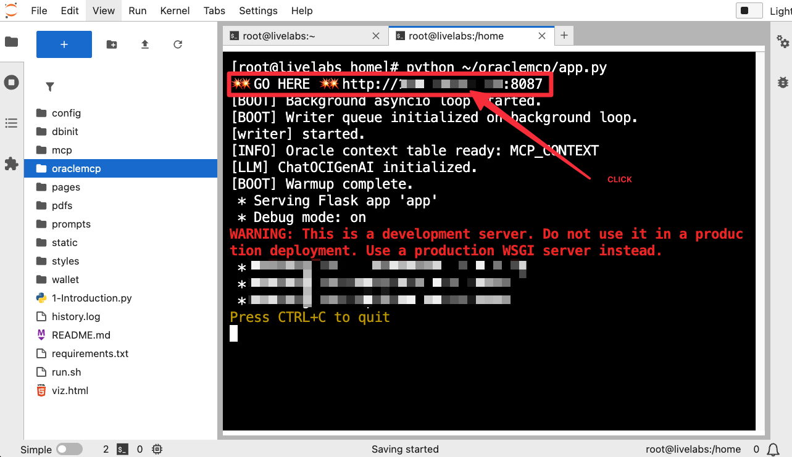
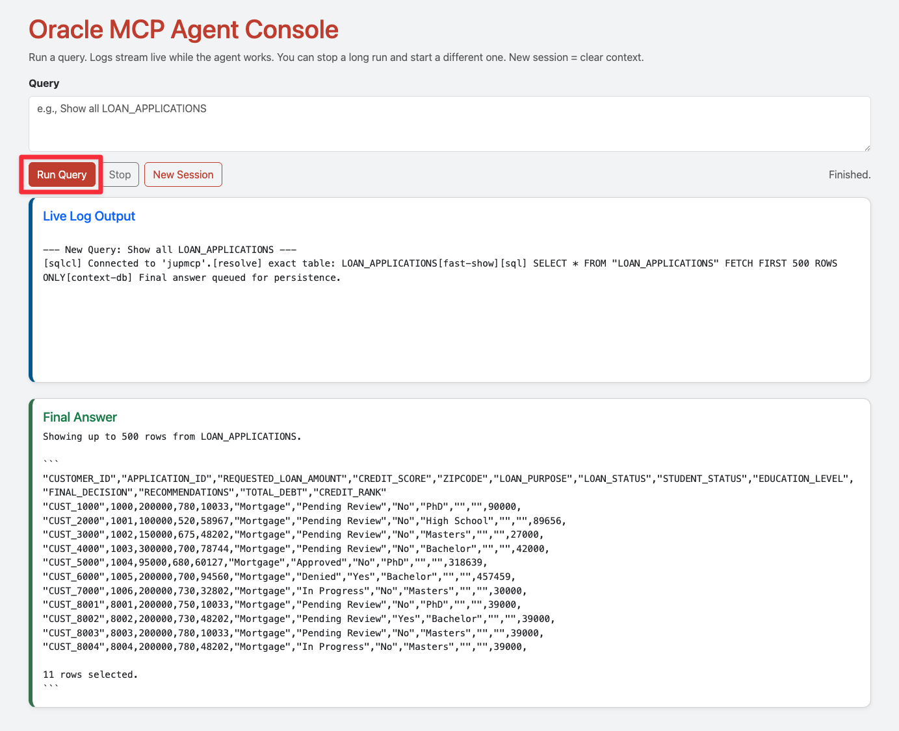
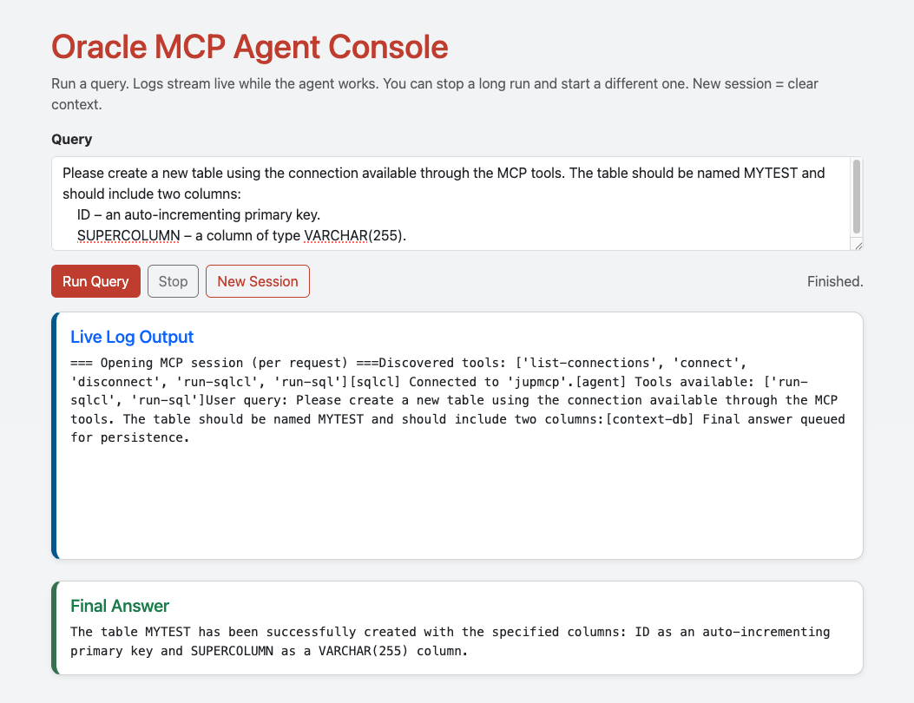
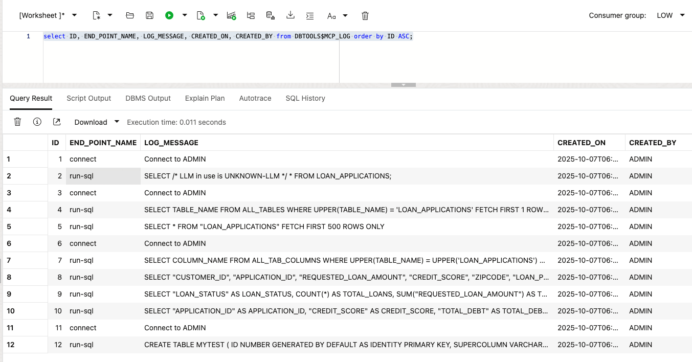

# Build Agentic AI apps using LangChain and Oracle MCP

## Introduction

You’re a developer at SeerHolding, supporting multiple SeerGroup divisions such as SeerEquities, SeerRetail, SeerEnergy, and SeerHealth. Each business unit wants AI-driven apps that interact directly with Oracle AI Database to query data and trigger workflows.

Your job: Build a common agentic AI foundation so teams can query data, trigger workflows, and build copilots—without changing existing back-end logic.

This lab connects Oracle MCP to LangChain and exposes it through a Flask web console. It also exposes SQL operations and analytics as AI-discoverable tools (the building blocks for SeerHolding’s enterprise agentic systems). Division-ready examples reference SeerHolding sample schemas so you can run prompts relevant to your domain.

### What is Oracle MCP (Model Context Protocol)?

Oracle MCP is a lightweight protocol and tool server that exposes pre-approved database operations as **AI-discoverable tools**. In this lab, SQLcl runs with `-mcp` to register those tools so agents (via LangChain and Cohere Command A hosted on OCI GenAI Service) can discover, call, and trace them **with guardrails**.


**What business challenges it helps address:**

- **Slow delivery across divisions**: Publish a shared, vetted tool catalog once; reuse it in SeerEquities, SeerRetail, SeerEnergy, and beyond.

- **Shadow SQL & ticket backlogs**: Shift from ad-hoc queries to self-serve tools that encapsulate approved operations.

- **Compliance and auditability**: Centralized logging and traceability (e.g., tool name, inputs, user, timestamp) support audits and incident reviews.

- **Risk control**: Tools execute with least-privilege access, reducing exposure from free-form SQL against production data.

- **Inconsistent integrations**: A single protocol for tool discovery and invocation cuts custom glue code and drift between teams.

- **Faster prototyping**: Copilots can be assembled quickly by composing existing tools rather than rewriting back-end logic.

>Note: MCP is not a model; it’s the contract between your agents and trusted operations. Models generate intent; MCP tools execute it—safely and consistently.


Estimated Time: 45-60 minutes

### Objectives

- Create and store a reusable SQLcl connection for Oracle MCP.

- Run LangChain as an MCP client to access Oracle Database tools.

- Use a Flask web interface to interact with the database in natural language.

- Observe secure logging and traceability through MCP.

### Who should use this

- **Data/platform engineers**: publish vetted SQL operations as MCP tools for all divisions.

- **Dev teams**: assemble copilots without touching back-end logic; focus on prompts and UI.

- **Risk/compliance partners**: review MCP logs and tool catalogs for least-privilege and audit readiness.

### Prerequisites

- Completed Lab 2: Jupyter Environment Setup

- (Optional) Completed Labs 3–4 on RAG and AI Vector Search

## Task 1: Create a SQLcl connection for MCP

Create a saved connection that Oracle MCP reuses for all tool calls.

1. Open a new terminal session. Click the **blue +** in the top left corner and select **Terminal**.

    

2. Run:

    ```bash
    <copy>
    ./oraclemcp/mcpsql.sh
    </copy>
    ```

    You should see:

    ```bash
    ✅ SQLcl connection 'jupmcp' was saved successfully.
    ```

    > What does the script do?
    
    The script runs *sql -nolog* and executes:

    ```sql
    conn -save jupmcp -replace -savepwd ${USERNAME}/${DBPASSWORD}@"${DBCONNECTION}"
    ```

This creates a persistent, password-protected connection named jupmcp. The MCP agent can discover and use it in later steps if SQLcl runs with -mcp and the saved connection is on the active client path.

## Task 2: Use LangChain as the Oracle MCP Runner

Launch LangChain as the client to connect to Oracle MCP, discover tools, and run your first agentic query.

1. Run:

    ```bash
    <copy>
    python ~/oraclemcp/oralanmcp.py
    </copy>
    ```

    What the script does:

    - Starts an MCP client with SQLcl: {"command":"sql","args":["-mcp"],"transport":"stdio"}.

    - Initializes ChatOCIGenAI with your OCI Generative AI endpoint.

    - Discover available MCP tools

    - Send a natural language query: “Show all LOAN_APPLICATIONS.”
  
2. Expected outcome:

    

✅ **Checkpoint** You successfully invoked MCP tools from LangChain and received a model-generated answer.

## Task 3 (Optional): Use LangChain as the Oracle MCP Runner with a Reasoning Agent

Run a reasoning agent—a more advanced MCP client that plans, explains, and justifies each step before acting. The reasoning agent typically runs longer and can show why it chose each tool and how the decision flow unfolds, depending on model settings and tracing configuration. This is useful for debugging, auditing, and optimizing multi-tool workflows in production.

Why Does It Matter?

- **Reasoning agents think before they act.**
    They plan tool usage step by step instead of responding immediately — making their logic visible and traceable.

- **LangChain turns reasoning into a workflow.**
    It coordinates multiple MCP tools automatically, showing each intermediate thought and action along the way.

- **Transparency builds trust.**
    For enterprise developers, seeing how an agent reached a result is as important as the result itself — essential for debugging, auditing, and compliance.

1. Open a new terminal session. Click the **blue +** in the top left corner and select **Terminal**.

    

2. Run (**Note**: It can take up to 1 minute to complete):
    
    ```python
    <copy>
    python ~/oraclemcp/oralanmcp_reasoning.py
    </copy>
    ```

3. The script will:

    * Launch a new MCP client session for SQLcl

    * Load all available Oracle MCP tools

    * Initialize a reasoning-capable agent using the cohere.command-a-03-2025 model

    * Execute the query: *Show all LOAN_APPLICATIONS*.

4. Expected outcome:

    

💡**Developer insight**
For SeerHolding’s development teams, reasoning agents add more than verbosity. They provide explainability.
When you deploy AI copilots with Oracle MCP for any of SeerHolding's divisions, you can trace each database interaction step by step.
That visibility helps you debug complex chains, document behavior for audits, and build trust in production AI systems.


✅ **Checkpoint**
You’ve successfully run a reasoning-enabled MCP agent.
Compare its detailed reasoning flow with the faster agent from Task 2 to see how planning affects performance and interpretability.

## Task 4: Interact through a web console

Now you’ll use a simple web console built in Flask to interact with the Oracle MCP agent through your browser.

1. Open a new terminal session. Click the **blue +** in the top left corner and select **Terminal**.

    


2. Start the Flask app:

    ```bash
    <copy>
    python ~/oraclemcp/app.py
    </copy>
    ```

3. Open the web application:

    


    

4. Click **Run Query** to run the default "Show all LOAN_APPLICATIONS"

    


5. Next, enter the following query:

    ```text
    <copy>
    Show top 5 entries from LOAN_APPLICATIONS.
    Summarize total loans by status; return a compact table.
    Rank the 5 highest-risk applications with reasons.
    Please create an executive summary in Markdown.
    </copy>
    ```

    Click Run Query.

    You’ll see:

    


💡 **Developer insight**
When you click New Session, you reset the conversation context and prevent older responses from influencing new prompts.
Meanwhile, the app automatically stores your latest answer in Oracle allowing future queries to include prior context without extra code.

Here’s what this app wires together:

* **Oracle MCP**: runs as the tool server through sql -mcp, exposing database operations as callable tools.

* **LangChain Agent**: dynamically discovers those tools and orchestrates them at runtime.

* **OCI GenAI**: uses the cohere.command-a-03-2025 model for reasoning and summarization.

Together, these layers turn a standard Flask app into an agentic web interface — one that remembers, reasons, and interacts with Oracle AI Database in natural language.


## Task 5: Create and modify database objects via MCP

1. Click **New Session** and run:

    ```text
    <copy>
    Please create a new table using the connection available through the MCP tools. The table should be named MYTEST and should include two columns:
    ID – an auto-incrementing primary key.
    SUPERCOLUMN – a column of type VARCHAR(255).   
    </copy>
    ```


    


The agent translates your request into SQL, executes it through MCP, and confirms creation.

This shows how developers can delegate common schema tasks to secure, explainable AI assistants without writing SQL manually.

## Task 6: Explore logging and security

Oracle MCP logs every interaction automatically. You can review the logs directly in the database.

1. Open SQL Developer Web. You can find the login information in the **View login info** section of this workshop. *Your username is: admin*

    

2. In Database Actions, select the **Development** tab, then **SQL**, and click **Open**:

    

3. Execute the following query:

    ```sql
    <copy>
    select ID, END_POINT_NAME, LOG_MESSAGE, CREATED_ON, CREATED_BY from DBTOOLS$MCP_LOG order by ID ASC;
    </copy>
    ```

4. Review the results and see that everything is logged.

    

You’ll see a record of each MCP action with timestamps and user IDs — ideal for auditing and traceability.

💡 **Developer insight**

Every MCP call leaves a trace.
Oracle MCP automatically logs the tools used, parameters passed, and responses generated, creating a transparent audit trail for every AI-driven database action.

For developers, this means:

* Debugging becomes data-driven. You can inspect exact tool sequences when troubleshooting complex agent runs.

* Security stays enforceable. Each call links to the authenticated user, timestamp, and endpoint.

* Compliance is built-in. You can prove what data was accessed, when, and by which agent. This is a must for regulated industries.

Logging isn’t an afterthought; it’s how agentic systems at SeerHolding stay explainable, auditable, and production-ready.

## Conclusion

You built SeerHolding’s first agentic AI development framework.

You learned how to:

* Connect Oracle MCP through SQLcl

* Use LangChain to orchestrate Oracle Database tools

* Add reasoning agents for transparent decision flows

* Build a Flask-based agentic UI for natural-language queries

* Leverage OCI GenAI for reasoning and summarization


**What this means for SeerHolding developers**

* Build once, reuse everywhere: expose SQL scripts or APIs as shared MCP tools for all SeerGroup divisions.

* Integrate fast: create AI copilots that reason across SeerEquities, SeerRetail, or SeerEnergy using one architecture.

* Stay compliant: every MCP call is logged, versioned, and explainable.

* Deliver faster: prototype enterprise-grade AI assistants in hours, not weeks.

You’ve laid the foundation for SeerHolding’s agentic AI platform: turning Oracle AI Database into the intelligent core of SeerGroup’s future applications.

## Learn more

  [User's guide SQLcl MCP Server](https://docs.oracle.com/en/database/oracle/sql-developer-command-line/25.2/sqcug/using-oracle-sqlcl-mcp-server.html)

  [Jeff Smith's Getting Started Guide](https://docs.oracle.com/en/database/oracle/sql-developer-command-line/25.2/sqcug/using-oracle-sqlcl-mcp-server.html)


## Acknowledgements
* **Authors** -  Kevin Lazarz
* **Last Updated By/Date** - Kirk Kirkconnell, February 2026
