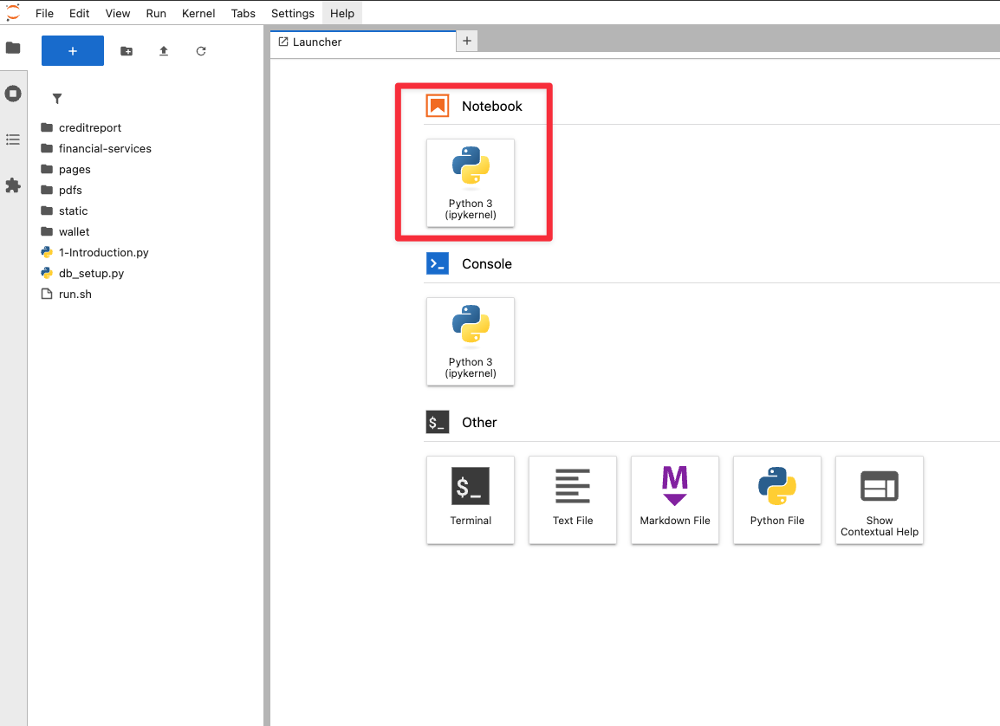
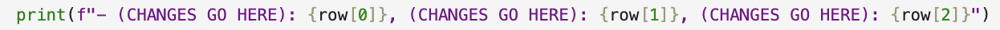
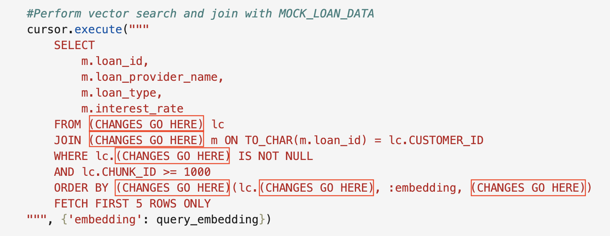

# Coding Challenge - AI Vector Search

## **Introduction**

**Welcome to the Code with AI Vector Search Challenge!**

In this lab, you upgrade a retail returns portal by adding a similar return search powered by AI Vector Search in Oracle Database 23ai. Working in a Jupyter Notebook, you’ll finish partially written Python that vectorizes product images, damage descriptions, and order notes so a new request can be matched to semantically similar past returns. The exercise shows how vector search spots fraud patterns and fast track approvals far better than basic keyword filters.


At Seer Retail, the data science team is building a smarter return recommendation system using vector similarity. They started implementing a feature that vectorizes return packages and matches them to user queries—**but the code is incomplete**. ❗Key sections are marked (**"CHANGES GO HERE"**) and it is up to you to finish the job and make the feature work.❗

**Why AI Vector Search?**

Keyword searches often miss context. For example, "Damaged Return" and "Missing Returns" mean similar things but use different terms. AI Vector Search solves this by converting text into vectors (embeddings) that capture meaning. With Oracle Database 23ai, you will use similarity search to match user queries to loan descriptions based on semantics, not just keywords. If you're ready to dive in, proceed with this lab and start coding. If you prefer a more guided approach with a detailed walkthrough, you can continue to Lab 5b Step-by-step: Code with AI Vector Search for step-by-step instructions.

Good luck, and enjoy the process. Let’s get coding!

Estimated Time: 45 minutes

### Objective:

In this lab, you will:

- Vectorize loan data from the `MOCK_LOAN_DATA` table into `LOAN_CHUNK` table.
- Verify the data was vectorized.
- Implement a similarity search to find the top 5 matching returns based on a user’s query.

### Prerequisites:

This lab assumes you have:

- An Oracle Cloud account.
- Basic knowledge of Python and SQL.
- Completed Lab 1: Run the Demo.
- Completed Lab 2: Connect to Development Environment.
- Completed Lab 3: Coding Basics on Oracle Database 23ai.
- Completed Lab 4: Step by step: Implement RAG with Oracle Database 23ai.

>💡 **Note:** You can download the code and run this lab on your own time here: [AI Vector Search Code](https://objectstorage.us-ashburn-1.oraclecloud.com/p/yiZgIeQQptaFaDMHUQ_623UuChmv1jf_9dCj10wwgjmsQitUMb5QP7mPv1Z1med8/n/c4u04/b/gen-ai/o/ai_vector_search_code)

## Task 1: Challenge requirements

The data science team at Seer Retail has provided a Jupyter notebook called `ai_vector_search_challenge.ipynb` with four key code cells. The first cell sets up the environment, but the next three cells which are responsible for vectorizing data, verifiying it and performing similarity search contain errors marked as ❗**"CHANGES GO HERE"**❗. Your job is to fix these cells in order to make the feature work. The notebook will:

- **Connect to the database and import the necessary libraries and drivers.**
- **Vectorize the `loan_type` column from the `MOCK_LOAN_DATA` table into the `LOAN_CHUNK` table.**
- **Verify the vectorized data by displaying an output.**
- **Implement a Similarity Search to match a user's query to loans.**


## Task 2: Create a new Jupyter Notebook

All of the coding examples will be executed in a new Jupyter Notebook.

1. Open a new **Jupyter Notebook** by clicking on **Python(ipykernel)** notebook.

    


## Task 3: Connect to the database

1. Copy the following code block into an empty cell and execute it.

    ```python
    <copy>
    import os
    import json
    import oracledb
    import oci
    from dotenv import load_dotenv

    # load the environment variables from the .env file
    load_dotenv()

    # Retrieve the database credentials from environment variables
    username = os.getenv("USERNAME")
    password = os.getenv("DBPASSWORD")
    dsn = os.getenv("DBCONNECTION")

    # Attempting to connect to our Oracle database
    try:
        connection = oracledb.connect(user=username, password=password, dsn=dsn)
        print("Connection successful!")
    except Exception as e:
        print(f"Connection failed: {e}")

    # Create a cursor object to execute SQL commands
    cursor = connection.cursor()
    </copy>
    ```

    You should see the expected output: 

    ```text
    Connection successful!
    ```

## Task 4: Vectorizing loan data

The second function, `vectorize_loan_data()`, converts loan descriptions into vectors and stores them in the `LOAN_CHUNK` table.It's suppose to:

- Clear existing data in `LOAN_CHUNK` where `CHUNK_ID >= 1000`.
- Insert each `loan_type` from `MOCK_LOAN_DATA` into `LOAN_CHUNK` with a vector embedding. 
- Commit the changes.

However, the SQL `INSERT` statement has missing code where the vector is generated. 


1. Copy and paste the following code block into an empty cell

    ```python
    <copy>
    # function to vectorize the loan data
    def vectorize_loan_data():
        with connection.cursor() as cursor:
            # clear existing loan chunks to avoid duplicates
            cursor.execute("DELETE FROM LOAN_CHUNK WHERE CHUNK_ID >= 1000")

            # insert loan_type data into LOAN_CHUNK with vector embeddings
            cursor.execute("""
                INSERT INTO LOAN_CHUNK (CUSTOMER_ID, CHUNK_ID, CHUNK_TEXT, CHUNK_VECTOR)
                SELECT
                    TO_CHAR(loan_id),
                    1000 + loan_id,
                    loan_type,
                    (CHANGES GO HERE) (
                        loan_type,
                        (CHANGES GO HERE) 
                    )
                FROM MOCK_LOAN_DATA
            """)
            connection.commit()
            print("Vectorized 'loan_data' from 'MOCK_LOAN_DATA' and stored in 'LOAN_CHUNK'.")
    vectorize_loan_data()
    </copy>
    ```

2. ❗Look for the lines with **(CHANGES GO HERE)** inside the INSERT statement:❗

     

3. Replace the placeholders to generate a 384-dimensional vector for `loan_type`. You'll need a function that converts text to embeddings using the `DEMO_MODEL` provided by the database.


    >**Hint:** Oracle Database 23ai has a utility called DBMS\_VECTOR\_CHAIN package to create embeddings. The function takes the text(loan_type) and a JSON configuration specifying the model name and the dimensions. Check Lab 4 for clues on how to use it.


4. Run the cell after making the changes. Your expected output should be:

    ```text
    Vectorized loan_data from MOCK_LOAN_DATA and stored in LOAN_CHUNK.
    ```

## Task 5: Verify the vectorized data

The third function verifies vectorization by querying the `LOAN_CHUNK` table for the first three entries (`CHUNK_ID >= 1000`). It should return `CUSTOMER_ID`, `CHUNK_ID`, and `CHUNK_TEXT`(the loan type). ❗The SQL query is incomplete and contains several **"CHANGES GO HERE"** placeholders that you need to fix.❗

1. Create a new cell and paste the following code into it:

    ```python
    <copy>
    # Fetch sample data from LOAN_CHUNK
    cursor.execute("""
        SELECT (CHANGES GO HERE) 
        FROM (CHANGES GO HERE)
        WHERE (CHANGES GO HERE) >= 1000 
        FETCH FIRST 3 ROWS ONLY
    """)

    # Fetch all query results into a list
    results = cursor.fetchall()
    print("Sample data in (CHANGES GO HERE):")

    # Iterate though results and print each row
    for row in results:
        print(f"- (CHANGES GO HERE): {row[0]}, (CHANGES GO HERE): {row[1]}, (CHANGES GO HERE): {row[2]}")
    </copy>
    ```

    Note the placeholders that you need to fill in.

    

2. Check the cursor.executed SQL query first:

    - Select the columns `CUSTOMER_ID`, `CHUNK_ID`, and `CHUNK_TEXT`.
    - Specify the table `LOAN_CHUNK`.
    - Set the condition filter `CHUNK_ID >= 1000`.

3. Next, update the print statement below the query to match the columns you selected:

    

    Replace the placeholders with meaningful labels like `Loan ID`, `Chunk ID`, and `Text`.

4. Once all the changes have been made, Run the cell. You should expect to see an output similar to:

    ```text
    Sample data in LOAN_CHUNK:
    - Loan ID: 28, CHUNK ID: 1028, Text: Affordable housing zone loan (1% interest, max income $100k)
    - Loan ID: 29, CHUNK ID: 1029, Text: Construction loan for new builds
    - Loan ID: 30, Chunk ID: 1030, Text: Stated income loan (for self-employed)
    ```

## Task 6: Implement similarity search

The fourth code block is the core of the challenge: letting users enter a return description and retrieve the top 5 most similar returns. The function looking\_for_similar\_loans(query) should:

- Convert the user’s input into a vector.

- Search the `LOAN_CHUNK` table for similar vectors using cosine distance (you can also try Euclidean or dot product).

- Join the results with `MOCK_LOAN_DATA` to fetch full loan details.

- Display the top matches clearly.

- ❗The cell has two incomplete SQL queries with **"CHANGES GO HERE"**.❗

1. Create a new cell and paste the following code into it.

    ```python
    <copy>
    def looking_for_similar_loans(query):
        # Generate vector embeddings for users query
        cursor.execute("""
            SElECT (CHANGES GO HERE)(
                :query,
                JSON('{"provider":"database", "model":"DEMO_MODEL", "dimensions":384}')
            )
        """, {'query':query})

        # Fetch embedding result
        query_embedding = cursor.fetchone()[0]

        # Perform vector search and join with MOCK_LOAN_DATA
        cursor.execute("""
            SELECT
                m.loan_id,
                m.loan_provider_name,
                m.loan_type,
                m.interest_rate
            FROM (CHANGES GO HERE) lc
            JOIN (CHANGES GO HERE) m ON TO_CHAR(m.loan_id) = lc.CUSTOMER_ID
            WHERE lc.(CHANGES GO HERE) IS NOT NULL
            AND lc.CHUNK_ID >= 1000
            ORDER BY (CHANGES GO HERE)(lc.(CHANGES GO HERE), :embedding, (CHANGES GO HERE))
            FETCH FIRST 5 ROWS ONLY
        """, {'embedding': query_embedding})

        # Fetch the top 5 similar loans
        similar_loans = cursor.fetchall()

        # Prints header with query
        print(f"Top 5 similar loans for query: '{query}'")

        # Iterate thorugh results and print each loan
        for loan in similar_loans:
            print(f"Loan ID: {loan[0]}, Provider: {loan[1]}, Type: {loan[2]}, Interest Rate: {loan[3]}%")

    # Prompt user for a loan description
    query = input("Enter a loan type to search for (ex., 'First time home owner loan'): ")

    # check if query is provided
    if query:
        looking_for_similar_loans(query) # this will run our similarity search
    else:
        print("Please enter a query.")
    </copy>
    ```

2. Find the first query that vectorizes the user's query:

    ```sql
    cursor.execute("""
    SElECT (CHANGES GO HERE)(
        :query,
        (CHANGES GO HERE)
    )
    """, {'query':query})
    ```

    >**Hint:** Replace the placeholder with the vectorization function from Task 4 to convert the query text into a vector.

3. Find the second query for the similarity search:

    ```sql
    SELECT
        m.loan_id,
        m.loan_provider_name,
        m.loan_type,
        m.interest_rate
    FROM (CHANGES GO HERE) lc
    JOIN (CHANGES GO HERE) m ON TO_CHAR(m.loan_id) = lc.CUSTOMER_ID
    WHERE lc.(CHANGES GO HERE) IS NOT NULL
    AND lc.CHUNK_ID >= 1000
    ORDER BY (CHANGES GO HERE)(lc.(CHANGES GO HERE), :embedding, (CHANGES GO HERE))
    FETCH FIRST 5 ROWS ONLY
    ```

    

    Fill in the placeholders to:
    - Specify the tables `LOAN_CHUNK` and `MOCK_LOAN_DATA`.
    - Check that the vector column isn't null.
    - Use a function to compute cosine distance between the stored vectors and the query's embedding.
    - Identify the vector column in `LOAN_CHUNK`.

    >**Hint:** Oracle Database 23ai provides a **`VECTOR_DISTANCE`** function to compare vectors. You need to specify the vector column in LOAN_CHUNK, the query’s embedding (bound as :embedding), and the distance metric (COSINE). Look at the WHERE and ORDER BY clauses to understand what’s being filtered and sorted.

4. Once you updated the query enter a sample query when prompted, ex. "First Time Home Owner Loan."

    

    Expected Output:

    ```text
    Enter a loan type to search for (ex., 'First time home owner loan'): 

    Military Veteran

    Top 5 similar loans for query: 'Military Veteran'

    Loan ID: 50, Provider: provider1, Type: Military Veteran loan (0% down, military only), Interest Rate: 4.75%

    Loan ID: 26, Provider: provider5, Type: Military Veteran loan (0% down, military only), Interest Rate: 3.47%

    Loan ID: 55, Provider: provider6, Type: RenoMilitary Veterantion loan, Interest Rate: 5.82%

    Loan ID: 59, Provider: provider3, Type: RenoMilitary Veterantion loan, Interest Rate: 5.98%

    Loan ID: 22, Provider: provider1, Type: Jumbo loan for high-Military Veteranlue properties, Interest Rate: 5.07% 
    ```

    (**Note:** Results may vary.)


## Conclusion

**Congratulations, you have successfully completed the AI Vector Search Challenge!** 

You have successfully:

- Connected to Oracle Database 23ai.
- Vectorized return descriptions into embeddings.
- Verified the stored data.
- Built a Similarity Search to match user queries to returns.

Fixing the code allowed Seer Retail to recommend return based on meaning, not keywords, using AI Vector Search in Oracle Database 23ai. You learned to generate embeddings, query vectors, and integrate AI with SQL—skills you can apply to other projects.

## Learn More

- [Oracle Database 23ai Documentation](https://docs.oracle.com/en/database/oracle/oracle-database/23/)
- [Oracle Database 23ai Vector Search](https://www.oracle.com/database/ai-vector-search/)
- [Oracle Ai Vector Search User's Guide](https://docs.oracle.com/en/database/oracle/oracle-database/23/vecse/ai-vector-search-users-guide.pdf)


## Acknowledgements

- **Authors** - Francis Regalado, Database Product Manager
- **Contributors** - Linda Foinding, Kamryn Vinson, Kevin Lazarz
- **Last Updated By/Date** - Francis Regalado, April 2025