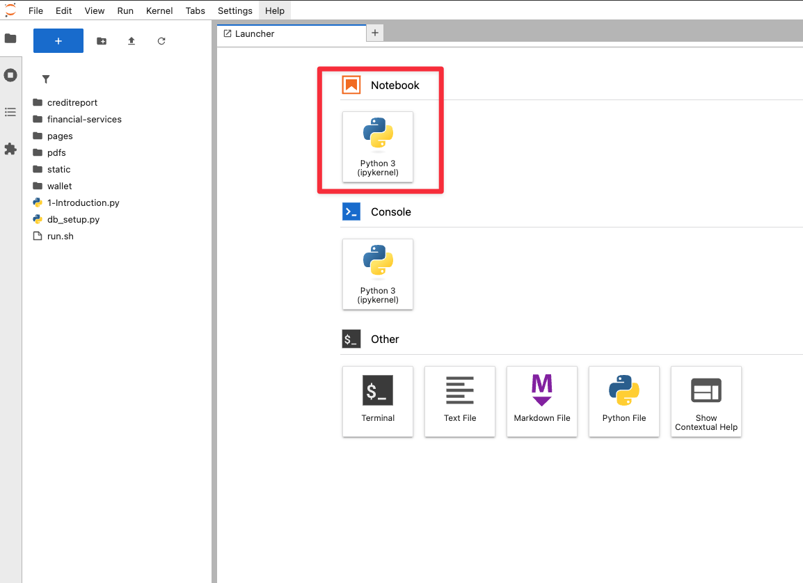
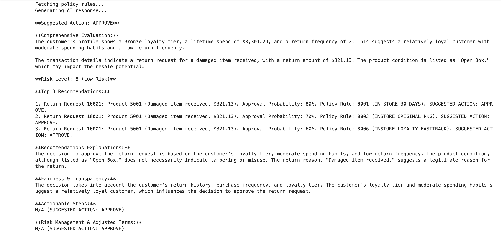
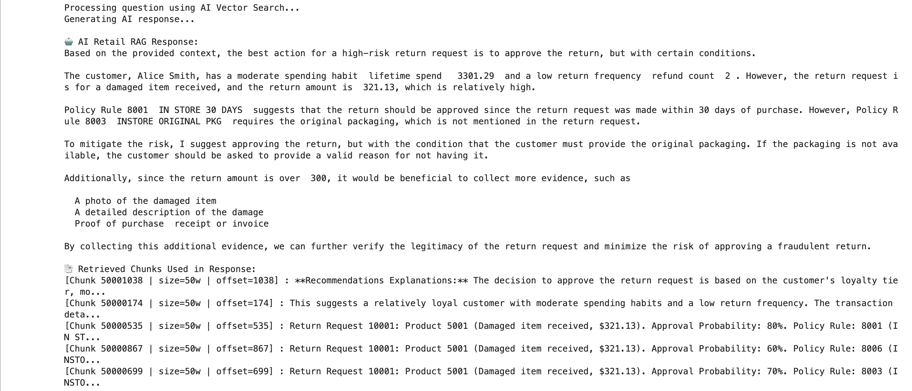

# Step by step: Implement RAG with Oracle Database 23ai 

## Introduction

In this lab, you build a complete return recommendation engine with Oracle Database 23ai and OCI Generative AI. Connect to the database, explore order and image data, and invoke a large language model to generate personalized return decisions and policy explanations. Building on earlier exercises, you’ll apply Python to deliver a fully integrated, AI-powered retail returns application.

This lab uses some of the basic coding samples you created in lab 3, such as cursor.execute and more.

Estimated Time: 30 minutes

### Objectives

* Build the complete return authorization application as seen in lab 1
* Use OCI Generative AI to generate personalized risk score and return recommendations
* Use Python to connect to an Oracle Database 23ai instance and run queries
* Explore customer data and extract relevant information

### Prerequisites

This lab assumes you have:

* An Oracle Cloud account
* Completed lab 1: Run the demo
* Completed lab 2: Connect to the Development Environment

## Task 1: Build the application in Jupyter Notebook
>💡**Note**: Review Lab 2: Connect to the Development Environment for instructions on accessing JupyterLab.

1. Click the blue "+". This will open the Launcher. 

    


2. Open a new **Jupyter Notebook** by clicking on **Python(ipykernel)** notebook.

    


## Task 2: Connect to the database using oracledb Python driver

1. Copy the following code block into an empty cell in your notebook. This code block imports the `oracledb` Python driver and other libraries. 

    ```python
    <copy>
    import os
    import json
    import oracledb
    import pandas as pd
    import oci
    import numpy as np
    import re
    from dotenv import load_dotenv
    from PyPDF2 import PdfReader

    load_dotenv()

    username = os.getenv("USERNAME")
    password = os.getenv("DBPASSWORD")
    dsn = os.getenv("DBCONNECTION")

    try:
        connection = oracledb.connect(user=username, password=password, dsn=dsn)
        print("Connection successful!")
    except Exception as e:
        print(f"Connection failed: {e}")

    cursor = connection.cursor()
    </copy>
    ```

2. Run the code block to connect to the database. 

    


## Task 3: Create tables in the database

1. Copy the following code block into the next empty cell in your notebook. This will create all tables in the database. 

    ```python
    <copy>
    #🔹 SQL Statements
    DROP_TABLES_SQL = [
        "DROP TABLE IF EXISTS CUSTOMERS CASCADE CONSTRAINTS PURGE",
        "DROP TABLE IF EXISTS ORDERS CASCADE CONSTRAINTS PURGE",
        "DROP TABLE IF EXISTS PRODUCTS CASCADE CONSTRAINTS PURGE",
        "DROP TABLE IF EXISTS PRODUCT_RETURN_HISTORY CASCADE CONSTRAINTS PURGE",
        "DROP TABLE IF EXISTS ORDERITEMS CASCADE CONSTRAINTS PURGE",
        "DROP TABLE IF EXISTS RETURN_REASONS CASCADE CONSTRAINTS PURGE",
        "DROP TABLE IF EXISTS RETURN_IMAGES CASCADE CONSTRAINTS PURGE",
        "DROP TABLE IF EXISTS RETURN_POLICY_RULES CASCADE CONSTRAINTS PURGE",
        "DROP TABLE IF EXISTS RETURN_RECOMMENDATION CASCADE CONSTRAINTS PURGE",
        "DROP TABLE IF EXISTS RETURN_REQUESTS CASCADE CONSTRAINTS PURGE",
        "DROP TABLE IF EXISTS RETURN_LOGS CASCADE CONSTRAINTS PURGE",
        "DROP TABLE IF EXISTS RETURN_CHUNKS CASCADE CONSTRAINTS PURGE",
        "DROP TABLE IF EXISTS DECISION CASCADE CONSTRAINTS PURGE",
        "DROP VIEW IF EXISTS CUSTOMER_RETURNS_DV"
    ]

    CREATE_CUSTOMERS_TABLE_SQL = """
    CREATE TABLE IF NOT EXISTS CUSTOMERS (
        CUSTOMER_ID NUMBER PRIMARY KEY,
        First_Name VARCHAR2(50),
        last_name VARCHAR2(50),
        EMAIL VARCHAR2(100),
        PHONE_NUMBER VARCHAR2(20),
        LOYALTY_TIER VARCHAR2(20),
        LIFETIME_SPEND NUMBER(12,2),
        REFUND_COUNT NUMBER
    )
    """

    CREATE_ORDERS_TABLE_SQL = """
    CREATE TABLE IF NOT EXISTS ORDERS (
        ORDER_ID NUMBER PRIMARY KEY,
        CUSTOMER_ID NUMBER REFERENCES CUSTOMERS(CUSTOMER_ID),
        ORDER_DATE DATE,
        ORDER_TOTAL NUMBER(9,2)
    )
    """

    CREATE_PRODUCTS_TABLE_SQL = """
    CREATE TABLE IF NOT EXISTS PRODUCTS (
        PRODUCT_ID NUMBER PRIMARY KEY,
        PRODUCT_NAME VARCHAR2(200),
        PRICE NUMBER(10,2),
        DESCRIPTION VARCHAR2(4000)
    )
    """

    CREATE_PRODUCT_RETURN_HISTORY_TABLE_SQL = """
    CREATE TABLE IF NOT EXISTS PRODUCT_RETURN_HISTORY (
        HISTORY_ID NUMBER PRIMARY KEY,
        PRODUCT_ID NUMBER REFERENCES PRODUCTS(PRODUCT_ID),
        SKU_CONDITION VARCHAR2(50),
        RESALE_POTENTIAL VARCHAR2(30),
        HISTORICAL_RETURN_RATE NUMBER(9,2),
        LAST_EVALUATED DATE
    )
    """

    CREATE_ORDERITEMS_TABLE_SQL = """
    CREATE TABLE IF NOT EXISTS ORDERITEMS (
        ORDERITEMS_ID NUMBER PRIMARY KEY,
        ORDER_ID NUMBER REFERENCES ORDERS(ORDER_ID),
        PRODUCT_ID NUMBER REFERENCES PRODUCTS(PRODUCT_ID),
        QUANTITY NUMBER,
        UNIT_PRICE NUMBER(9,2)
    )
    """

    CREATE_RETURN_REASONS_TABLE_SQL = """
    CREATE TABLE IF NOT EXISTS RETURN_REASONS (
        REASON_ID NUMBER PRIMARY KEY,
        REASON_DESCRIPTION VARCHAR2(2000),
        ORDERITEMS_ID NUMBER REFERENCES ORDERITEMS(ORDERITEMS_ID),
        RECEIPT_FILE_NAME VARCHAR2(255),
        PHOTO_FILE_NAME VARCHAR2(255)
    )
    """

    CREATE_RETURN_IMAGES_TABLE_SQL = """
    CREATE TABLE IF NOT EXISTS RETURN_IMAGES (
        IMAGE_ID NUMBER PRIMARY KEY,
        REASON_ID NUMBER REFERENCES RETURN_REASONS(REASON_ID),
        IMAGE_FILE_NAME VARCHAR2(255),
        QUALITY_SCORE NUMBER(5,2),
        TAMPER_FLAG CHAR(1),
        DETECTION_SOURCE VARCHAR2(100),
        EVALUATED_AT TIMESTAMP
    )
    """

    CREATE_RETURN_POLICY_RULES_TABLE_SQL = """
    CREATE TABLE IF NOT EXISTS RETURN_POLICY_RULES (
        RULE_ID NUMBER PRIMARY KEY,
        RULE_CODE VARCHAR2(50),
        RULE_DESCRIPTION VARCHAR2(1000),
        APPLIES_TO VARCHAR2(100),
        IS_ACTIVE CHAR(1) CHECK (IS_ACTIVE IN ('Y', 'N'))
    )
    """

    CREATE_RETURN_RECOMMENDATION_TABLE_SQL = """
    CREATE TABLE IF NOT EXISTS RETURN_RECOMMENDATION (
        RECOMMEND_ID NUMBER PRIMARY KEY,
        REASON_ID NUMBER REFERENCES RETURN_REASONS(REASON_ID),
        RULE_ID NUMBER REFERENCES RETURN_POLICY_RULES(RULE_ID),
        RECOMMENDATION VARCHAR2(50),
        EXPLANATION CLOB,
        RISK_LEVEL VARCHAR2(50),
        GENERATED_DATE DATE
    )
    """

    CREATE_RETURN_REQUESTS_TABLE_SQL = """
    CREATE TABLE IF NOT EXISTS RETURN_REQUESTS (
        REQUEST_ID NUMBER PRIMARY KEY,
        CUSTOMER_ID NUMBER REFERENCES CUSTOMERS(CUSTOMER_ID),
        RECOMMEND_ID NUMBER REFERENCES RETURN_RECOMMENDATION(RECOMMEND_ID),
        REQUEST_DATE DATE,
        PURCHASE_CHANNEL VARCHAR2(30),
        RETURN_METHOD VARCHAR2(30),
        REQUEST_STATUS VARCHAR2(30),
        DECISION_DATE DATE,
        FINAL_DECISION VARCHAR2(50),
        RETURN_AMOUNT NUMBER(9,2)
    )
    """

    CREATE_RETURN_LOGS_TABLE_SQL = """
    CREATE TABLE IF NOT EXISTS RETURN_LOGS (
        LOG_ID NUMBER PRIMARY KEY,
        REQUEST_ID NUMBER REFERENCES RETURN_REQUESTS(REQUEST_ID),
        EVENT_TYPE VARCHAR2(50),
        EVENT_TIME TIMESTAMP,
        HANDLED_BY VARCHAR2(100)
    )
    """

    CREATE_RETURN_CHUNKS_TABLE_SQL = """
    CREATE TABLE IF NOT EXISTS RETURN_CHUNKS (
        CHUNK_ID NUMBER PRIMARY KEY,
        REQUEST_ID NUMBER REFERENCES RETURN_REQUESTS(REQUEST_ID),
        CHUNK_TEXT CLOB,
        CHUNK_VECTOR VECTOR(384,*,DENSE)
    )
    """

    CREATE_DECISION_TABLE_SQL = """
    CREATE TABLE IF NOT EXISTS DECISION (
        DEC_ID NUMBER PRIMARY KEY,
        REQUEST_ID NUMBER REFERENCES RETURN_REQUESTS(REQUEST_ID),
        DEC_TYPE VARCHAR2(50),
        LETTER_TEXT CLOB,
        GENERATED_ON DATE DEFAULT SYSDATE
    )
    """

    CREATE_DUALITY_VIEW_SQL = """
    CREATE OR REPLACE JSON RELATIONAL DUALITY VIEW customer_returns_dv AS
    SELECT JSON {
    '_id': c.customer_id,
    'firstName': c.first_name,
    'lastName': c.last_name,
    'email': c.email,
    'phone': c.phone_number,
    'loyaltyTier': c.loyalty_tier,
    'lifetimeSpend': c.lifetime_spend,
    'refundCount': c.refund_count,
    'returnRequests': [
        SELECT JSON {
        'requestId': rr.request_id,
        'requestDate': rr.request_date,
        'purchaseChannel': rr.purchase_channel,
        'returnMethod': rr.return_method,
        'requestStatus': rr.request_status,
        'decisionDate': rr.decision_date,
        'finalDecision': rr.final_decision,
        'returnAmount': TO_CHAR(rr.return_amount, '$999,999.99'),
        'recommendation': (
            SELECT JSON {
            'recommendId': rec.recommend_id,
            'recommendation': rec.recommendation,
            'explanation': rec.explanation,
            'riskLevel': rec.risk_level,
            'generatedDate': rec.generated_date,
            'rule': (
                SELECT JSON {
                'ruleId': rpr.rule_id,
                'ruleCode': rpr.rule_code,
                'ruleDescription': rpr.rule_description,
                'appliesTo': rpr.applies_to,
                'isActive': rpr.is_active
                }
                FROM RETURN_POLICY_RULES rpr
                WHERE rpr.rule_id = rec.rule_id
            ),
            'reason': (
                SELECT JSON {
                'reasonId': rsn.reason_id,
                'description': rsn.reason_description,
                'receiptFile': rsn.receipt_file_name,
                'photoFile': rsn.photo_file_name
                }
                FROM RETURN_REASONS rsn
                WHERE rsn.reason_id = rec.reason_id
            )
            }
            FROM RETURN_RECOMMENDATION rec
            WHERE rec.recommend_id = rr.recommend_id
        )
        }
        FROM RETURN_REQUESTS rr WITH INSERT UPDATE DELETE
        WHERE rr.customer_id = c.customer_id
    ]
    }
    FROM CUSTOMERS c WITH INSERT UPDATE DELETE
    """

    ONNX_MODEL_SQL = """
    DECLARE
        model_count INT;
    BEGIN
        SELECT COUNT(*) INTO model_count FROM user_mining_models WHERE model_name = 'DEMO_MODEL';
        IF (model_count < 1) THEN
            EXECUTE IMMEDIATE 'CREATE OR REPLACE DIRECTORY DEMO_DIR AS ''demodir''';
            DBMS_CLOUD.GET_OBJECT(
                object_uri => 'https://objectstorage.us-ashburn-1.oraclecloud.com/p/mFBJq8UCjdar89xJpTQVOy_tONdxyrQI-B8UT0OS-nllmg8xyVAIIOTbGyIVJ1iJ/n/c4u04/b/llm/o/all_MiniLM_L12_v2.onnx',
                directory_name => 'DEMO_DIR',
                file_name => 'all_minilm_l12_v2.onnx'
            );
            DBMS_DATA_MINING.DROP_MODEL(model_name => 'DEMO_MODEL', force => TRUE);
            DBMS_VECTOR.LOAD_ONNX_MODEL('DEMO_DIR', 'all_minilm_l12_v2.onnx', 'DEMO_MODEL');
        END IF;
    END;
    """

    # 🔹 Sample Data
    CUSTOMERS_DATA = [
        (1001, 'Alice', 'Smith', 'alice.smith@example.com', '415-555-0198', 'Bronze', 3301.29, 2),
        (1002, 'Bob', 'Johnson', 'bob.johnson@example.com', '312-555-0142', 'Silver', 3512.77, 1),
        (1003, 'Carla', 'Brown', 'carla.brown@example.com', '213-555-0175', 'Gold', 3623.25, 3),
        (1004, 'David', 'Williams', 'david.williams@example.com', '646-555-0164', 'Bronze', 3162.38, 8),
        (1005, 'Emma', 'Jones', 'emma.jones@example.com', '408-555-0123', 'Silver', 2719.17, 10),
        (1006, 'Felix', 'Garcia', 'felix.garcia@example.com', '702-555-0110', 'Bronze', 2637.01, 9),
        (1007, 'Grace', 'Miller', 'grace.miller@example.com', '617-555-0188', 'Silver', 4703.2, 5),
        (1008, 'Hassan', 'Davis', 'hassan.davis@example.com', '503-555-0194', 'Bronze', 1982.76, 4),
        (1009, 'Isla', 'Wilson', 'isla.wilson@example.com', '312-555-0101', 'Bronze', 3873.78, 9),
        (1010, 'Jason', 'Moore', 'jason.moore@example.com', '510-555-0166', 'Bronze', 603.61, 4)
    ]

    ORDERS_DATA = [
        (2001, 1001, '2024-08-29', 321.13),
        (2002, 1002, '2023-05-24', 738.04),
        (2003, 1003, '2024-04-19', 382.77),
        (2004, 1004, '2023-10-29', 394.53),
        (2005, 1005, '2023-01-17', 484.84),
        (2006, 1006, '2024-11-09', 478.68),
        (2007, 1007, '2023-07-26', 339.30),
        (2008, 1008, '2023-01-14', 162.55),
        (2009, 1009, '2024-04-23', 530.28),
        (2010, 1010, '2024-10-21', 223.08)
    ]

    PRODUCTS_DATA = [
        (3001, 'Product O565', 321.13, 'High quality Product O565'),
        (3002, 'Product U422', 369.02, 'High quality Product U422'),
        (3003, 'Product Q469', 127.59, 'High quality Product Q469'),
        (3004, 'Product O630', 394.53, 'High quality Product O630'),
        (3005, 'Product K429', 242.42, 'High quality Product K429'),
        (3006, 'Product X344', 119.67, 'High quality Product X344'),
        (3007, 'Product H113', 339.30, 'High quality Product H113'),
        (3008, 'Product S258', 32.51, 'High quality Product S258'),
        (3009, 'Product L472', 176.76, 'High quality Product L472'),
        (3010, 'Product C409', 111.54, 'High quality Product C409')
    ]

    PRODUCT_RETURN_HISTORY_DATA = [
        (4001, 3001, 'Open Box', 'High', 24.8, '2024-12-27'),
        (4002, 3002, 'New', 'Low', 10.99, '2023-01-30'),
        (4003, 3003, 'Damaged', 'Low', 12.9, '2023-02-01'),
        (4004, 3004, 'Like New', 'Low', 1.18, '2023-09-25'),
        (4005, 3005, 'Like New', 'Medium', 12.78, '2023-10-31'),
        (4006, 3006, 'Open Box', 'Medium', 5.3, '2024-09-01'),
        (4007, 3007, 'New', 'Medium', 16.82, '2023-05-06'),
        (4008, 3008, 'Like New', 'Low', 4.21, '2024-04-18'),
        (4009, 3009, 'New', 'High', 1.07, '2023-10-15'),
        (4010, 3010, 'Open Box', 'High', 15.57, '2023-01-18')
    ]

    ORDERITEMS_DATA = [
        (5001, 2001, 3001, 1, 321.13),
        (5002, 2002, 3002, 2, 369.02),
        (5003, 2003, 3003, 3, 127.59),
        (5004, 2004, 3004, 1, 394.53),
        (5005, 2005, 3005, 2, 242.42),
        (5006, 2006, 3006, 4, 119.67),
        (5007, 2007, 3007, 1, 339.30),
        (5008, 2008, 3008, 2, 32.51),
        (5009, 2009, 3009, 3, 176.76),
        (5010, 2010, 3010, 2, 111.54)
    ]

    RETURN_REASONS_DATA = [
        (6001, 'Damaged item received for order item 5001', 5001, 'receipt_6001.pdf', 'photo_6001.jpg'),
        (6002, 'Damaged item received for order item 5002', 5002, 'receipt_6002.pdf', 'photo_6002.jpg'),
        (6003, 'Damaged item received for order item 5003', 5003, 'receipt_6003.pdf', 'photo_6003.jpg'),
        (6004, 'Damaged item received for order item 5004', 5004, 'receipt_6004.pdf', 'photo_6004.jpg'),
        (6005, 'Damaged item received for order item 5005', 5005, 'receipt_6005.pdf', 'photo_6005.jpg'),
        (6006, 'Damaged item received for order item 5006', 5006, 'receipt_6006.pdf', 'photo_6006.jpg'),
        (6007, 'Damaged item received for order item 5007', 5007, 'receipt_6007.pdf', 'photo_6007.jpg'),
        (6008, 'Damaged item received for order item 5008', 5008, 'receipt_6008.pdf', 'photo_6008.jpg'),
        (6009, 'Damaged item received for order item 5009', 5009, 'receipt_6009.pdf', 'photo_6009.jpg'),
        (6010, 'Damaged item received for order item 5010', 5010, 'receipt_6010.pdf', 'photo_6010.jpg')
    ]

    RETURN_IMAGES_DATA = [
        (7001, 6001, 'image_7001.jpg', 0.79, 'N', 'Manual Review'),
        (7002, 6002, 'image_7002.jpg', 0.13, 'N', 'Manual Review'),
        (7003, 6003, 'image_7003.jpg', 0.66, 'N', 'Manual Review'),
        (7004, 6004, 'image_7004.jpg', 0.45, 'N', 'Vision AI'),
        (7005, 6005, 'image_7005.jpg', 0.68, 'Y', 'Manual Review'),
        (7006, 6006, 'image_7006.jpg', 0.17, 'Y', 'Vision AI'),
        (7007, 6007, 'image_7007.jpg', 0.17, 'N', 'Manual Review'),
        (7008, 6008, 'image_7008.jpg', 0.19, 'N', 'Manual Review'),
        (7009, 6009, 'image_7009.jpg', 0.55, 'N', 'Manual Review'),
        (7010, 6010, 'image_7010.jpg', 0.83, 'Y', 'Manual Review')
    ]

    RETURN_POLICY_RULES_DATA = [
        (8001, 'RULE_1', 'Policy rule for return scenario 1', 'In-store', 'Y'),
        (8002, 'RULE_2', 'Policy rule for return scenario 2', 'Online', 'Y'),
        (8003, 'RULE_3', 'Policy rule for return scenario 3', 'In-store', 'Y'),
        (8004, 'RULE_4', 'Policy rule for return scenario 4', 'Electronics', 'Y'),
        (8005, 'RULE_5', 'Policy rule for return scenario 5', 'Electronics', 'Y'),
        (8006, 'RULE_6', 'Policy rule for return scenario 6', 'In-store', 'Y'),
        (8007, 'RULE_7', 'Policy rule for return scenario 7', 'Online', 'Y'),
        (8008, 'RULE_8', 'Policy rule for return scenario 8', 'Online', 'Y'),
        (8009, 'RULE_9', 'Policy rule for return scenario 9', 'Online', 'Y'),
        (8010, 'RULE_10', 'Policy rule for return scenario 10', 'In-store', 'Y')
    ]

    RETURN_RECOMMENDATION_DATA = [
        (9001, 6001, 8001, 'Request Info', 'Based on policy and return history, recommendation is Request Info', 'High', '2023-12-06'),
        (9002, 6002, 8002, 'Request Info', 'Based on policy and return history, recommendation is Request Info', 'High', '2024-07-15'),
        (9003, 6003, 8003, 'Deny', 'Based on policy and return history, recommendation is Deny', 'Very High', '2023-04-09'),
        (9004, 6004, 8004, 'Request Info', 'Based on policy and return history, recommendation is Request Info', 'Medium', '2024-07-21'),
        (9005, 6005, 8005, 'Request Info', 'Based on policy and return history, recommendation is Request Info', 'High', '2023-01-15'),
        (9006, 6006, 8006, 'Approve', 'Based on policy and return history, recommendation is Approve', 'Low', '2024-02-18'),
        (9007, 6007, 8007, 'Deny', 'Based on policy and return history, recommendation is Deny', 'Very High', '2023-11-23'),
        (9008, 6008, 8008, 'Approve', 'Based on policy and return history, recommendation is Approve', 'Medium', '2023-01-13'),
        (9009, 6009, 8009, 'Request Info', 'Based on policy and return history, recommendation is Request Info', 'High', '2024-01-08'),
        (9010, 6010, 8010, 'Request Info', 'Based on policy and return history, recommendation is Request Info', 'Medium', '2024-04-26')
    ]

    RETURN_REQUESTS_DATA = [
        (10001, 1001, 9001, '2024-05-25', 'In-store', 'Mail', 'Pending', '2023-04-08', 'Request Info', 321.13),
        (10002, 1002, 9002, '2023-05-09', 'In-store', 'Mail', 'Pending', '2023-08-28', 'Request Info', 738.04),
        (10003, 1003, 9003, '2024-02-04', 'In-store', 'In-person', 'Denied', '2024-10-30', 'Deny', 382.77),
        (10004, 1004, 9004, '2024-04-11', 'Online', 'Mail', 'Pending', '2023-10-10', 'Request Info', 394.53),
        (10005, 1005, 9005, '2024-05-19', 'In-store', 'In-person', 'In Progress', '2023-07-30', 'Request Info', 484.84),
        (10006, 1006, 9006, '2024-09-26', 'Online', 'Mail', 'Approved', '2023-07-27', 'Approve', 478.68),
        (10007, 1007, 9007, '2023-10-13', 'In-store', 'In-person', 'Denied', '2023-08-14', 'Deny', 339.30),
        (10008, 1008, 9008, '2024-09-15', 'Online', 'In-person', 'Approved', '2024-06-20', 'Approve', 162.55),
        (10009, 1009, 9009, '2023-04-22', 'In-store', 'In-person', 'Pending', '2023-01-21', 'Request Info', 530.28),
        (10010, 1010, 9010, '2023-10-12', 'Online', 'Mail', 'In Progress', '2023-06-06', 'Request Info', 223.08)
    ]

    RETURN_LOGS_DATA = [
        (11001, 10001, 'Created', 'AI'),
        (11002, 10002, 'Auto Approved', 'System'),
        (11003, 10003, 'Updated', 'System'),
        (11004, 10004, 'Updated', 'AI'),
        (11005, 10005, 'Updated', 'Jane.Doe@store.com'),
        (11006, 10006, 'Updated', 'System'),
        (11007, 10007, 'Created', 'System'),
        (11008, 10008, 'Auto Approved', 'System'),
        (11009, 10009, 'Updated', 'AI'),
        (11010, 10010, 'Auto Approved', 'Jane.Doe@store.com')
    ]

    DECISION_DATA = [
        (13001, 10001, 'Request Info', 'This is the decision letter for request 10001'),
        (13002, 10002, 'Request Info', 'This is the decision letter for request 10002'),
        (13003, 10003, 'Denial', 'This is the decision letter for request 10003'),
        (13004, 10004, 'Request Info', 'This is the decision letter for request 10004'),
        (13005, 10005, 'Request Info', 'This is the decision letter for request 10005'),
        (13006, 10006, 'Approval', 'This is the decision letter for request 10006'),
        (13007, 10007, 'Denial', 'This is the decision letter for request 10007'),
        (13008, 10008, 'Approval', 'This is the decision letter for request 10008'),
        (13009, 10009, 'Request Info', 'This is the decision letter for request 10009'),
        (13010, 10010, 'Request Info', 'This is the decision letter for request 10010')
    ]

    # 🔹 Insert Data Function
    def insert_sample_data():
        # Insert into CUSTOMERS table
        cursor.executemany(
            """
            INSERT INTO CUSTOMERS (
                CUSTOMER_ID, FIRST_NAME, LAST_NAME, EMAIL, PHONE_NUMBER, LOYALTY_TIER, LIFETIME_SPEND, REFUND_COUNT
            ) VALUES (:1, :2, :3, :4, :5, :6, :7, :8)
            """, CUSTOMERS_DATA
        )
        print("Inserted data into CUSTOMERS table.")

        # Insert into ORDERS table
        cursor.executemany(
            """
            INSERT INTO ORDERS (
                ORDER_ID, CUSTOMER_ID, ORDER_DATE, ORDER_TOTAL
            ) VALUES (:1, :2, TO_DATE(:3, 'YYYY-MM-DD'), :4)
            """, ORDERS_DATA
        )
        print("Inserted data into ORDERS table.")

        # Insert into PRODUCTS table
        cursor.executemany(
            """
            INSERT INTO PRODUCTS (
                PRODUCT_ID, PRODUCT_NAME, PRICE, DESCRIPTION
            ) VALUES (:1, :2, :3, :4)
            """, PRODUCTS_DATA
        )
        print("Inserted data into PRODUCTS table.")

        # Insert into PRODUCT_RETURN_HISTORY table
        cursor.executemany(
            """
            INSERT INTO PRODUCT_RETURN_HISTORY (
                HISTORY_ID, PRODUCT_ID, SKU_CONDITION, RESALE_POTENTIAL, HISTORICAL_RETURN_RATE, LAST_EVALUATED
            ) VALUES (:1, :2, :3, :4, :5, TO_DATE(:6, 'YYYY-MM-DD'))
            """, PRODUCT_RETURN_HISTORY_DATA
        )
        print("Inserted data into PRODUCT_RETURN_HISTORY table.")

        # Insert into ORDERITEMS table
        cursor.executemany(
            """
            INSERT INTO ORDERITEMS (
                ORDERITEMS_ID, ORDER_ID, PRODUCT_ID, QUANTITY, UNIT_PRICE
            ) VALUES (:1, :2, :3, :4, :5)
            """, ORDERITEMS_DATA
        )
        print("Inserted data into ORDERITEMS table.")

        # Insert into RETURN_REASONS table
        cursor.executemany(
            """
            INSERT INTO RETURN_REASONS (
                REASON_ID, REASON_DESCRIPTION, ORDERITEMS_ID, RECEIPT_FILE_NAME, PHOTO_FILE_NAME
            ) VALUES (:1, :2, :3, :4, :5)
            """, RETURN_REASONS_DATA
        )
        print("Inserted data into RETURN_REASONS table.")

        # Insert into RETURN_IMAGES table
        cursor.executemany(
            """
            INSERT INTO RETURN_IMAGES (
                IMAGE_ID, REASON_ID, IMAGE_FILE_NAME, QUALITY_SCORE, TAMPER_FLAG, DETECTION_SOURCE, EVALUATED_AT
            ) VALUES (:1, :2, :3, :4, :5, :6, SYSTIMESTAMP)
            """, RETURN_IMAGES_DATA
        )
        print("Inserted data into RETURN_IMAGES table.")

        # Insert into RETURN_POLICY_RULES table
        cursor.executemany(
            """
            INSERT INTO RETURN_POLICY_RULES (
                RULE_ID, RULE_CODE, RULE_DESCRIPTION, APPLIES_TO, IS_ACTIVE
            ) VALUES (:1, :2, :3, :4, :5)
            """, RETURN_POLICY_RULES_DATA
        )
        print("Inserted data into RETURN_POLICY_RULES table.")

        # Insert into RETURN_RECOMMENDATION table
        cursor.executemany(
            """
            INSERT INTO RETURN_RECOMMENDATION (
                RECOMMEND_ID, REASON_ID, RULE_ID, RECOMMENDATION, EXPLANATION, RISK_LEVEL, GENERATED_DATE
            ) VALUES (:1, :2, :3, :4, :5, :6, TO_DATE(:7, 'YYYY-MM-DD'))
            """, RETURN_RECOMMENDATION_DATA
        )
        print("Inserted data into RETURN_RECOMMENDATION table.")

        # Insert into RETURN_REQUESTS table
        cursor.executemany(
            """
            INSERT INTO RETURN_REQUESTS (
                REQUEST_ID, CUSTOMER_ID, RECOMMEND_ID, REQUEST_DATE, PURCHASE_CHANNEL, RETURN_METHOD, REQUEST_STATUS, DECISION_DATE, FINAL_DECISION, RETURN_AMOUNT
            ) VALUES (:1, :2, :3, TO_DATE(:4, 'YYYY-MM-DD'), :5, :6, :7, TO_DATE(:8, 'YYYY-MM-DD'), :9, :10)
            """, RETURN_REQUESTS_DATA
        )
        print("Inserted data into RETURN_REQUESTS table.")

        # Insert into RETURN_LOGS table
        cursor.executemany(
            """
            INSERT INTO RETURN_LOGS (
                LOG_ID, REQUEST_ID, EVENT_TYPE, EVENT_TIME, HANDLED_BY
            ) VALUES (:1, :2, :3, SYSTIMESTAMP, :4)
            """, RETURN_LOGS_DATA
        )
        print("Inserted data into RETURN_LOGS table.")

        # Insert into DECISION table
        cursor.executemany(
            """
            INSERT INTO DECISION (
                DEC_ID, REQUEST_ID, DEC_TYPE, LETTER_TEXT, GENERATED_ON
            ) VALUES (:1, :2, :3, :4, SYSDATE)
            """, DECISION_DATA
        )
        print("Inserted data into DECISION table.")

        connection.commit()

    # 🔹 Setup Database Function
    def setup_database():
        try:
            # drop existing objects
            for drop_stmt in DROP_TABLES_SQL:
                try:
                    # DROP ALL EXISTING OBJECTS
                    cursor.execute(drop_stmt)
                except oracledb.DatabaseError as e:
                    print(f"Ignored error for statement '{drop_stmt}': {e}")
                print("Dropped existing tables, view, and graph.")
        
            # ✅ CREATE TABLES IN CORRECT ORDER
            cursor.execute(CREATE_CUSTOMERS_TABLE_SQL)
            print("Created CUSTOMERS table.")
            cursor.execute(CREATE_PRODUCTS_TABLE_SQL)
            print("Created PRODUCTS table.")
            cursor.execute(CREATE_ORDERS_TABLE_SQL)
            print("Created ORDERS table.")
            cursor.execute(CREATE_PRODUCT_RETURN_HISTORY_TABLE_SQL)
            print("Created PRODUCT_RETURN_HISTORY table.")
            cursor.execute(CREATE_ORDERITEMS_TABLE_SQL)
            print("Created ORDERITEMS table.")
            cursor.execute(CREATE_RETURN_REASONS_TABLE_SQL)
            print("Created RETURN_REASONS table.")
            cursor.execute(CREATE_RETURN_IMAGES_TABLE_SQL)
            print("Created RETURN_IMAGES table.")
            cursor.execute(CREATE_RETURN_POLICY_RULES_TABLE_SQL)
            print("Created RETURN_POLICY_RULES table.")
            cursor.execute(CREATE_RETURN_RECOMMENDATION_TABLE_SQL)
            print("Created RETURN_RECOMMENDATION table.")
            cursor.execute(CREATE_RETURN_REQUESTS_TABLE_SQL)
            print("Created RETURN_REQUESTS table.")
            cursor.execute(CREATE_RETURN_LOGS_TABLE_SQL)
            print("Created RETURN_LOGS table.")
            cursor.execute(CREATE_RETURN_CHUNKS_TABLE_SQL)
            print("Created RETURN_CHUNKS table.")
            cursor.execute(CREATE_DECISION_TABLE_SQL)
            print("Created DECISION table.")
            cursor.execute(CREATE_DUALITY_VIEW_SQL)
            print("Created CUSTOMER_RETURNS_DV view.")
            cursor.execute(ONNX_MODEL_SQL)
            print("Loaded ONNX Model.")

            # ✅ COMMIT STRUCTURE BEFORE INSERT
            connection.commit()

            # ✅ INSERT SAMPLE DATA
            insert_sample_data()
            print("Database setup completed successfully.")

        except oracledb.DatabaseError as e:
            print(f"Error: {e}")
            
    # 🔹 Run Script
    if __name__ == "__main__":
        setup_database()
    </copy>
    ```
2. Run the code block to create all tables in the database. 

     

## Task 4: Create a Function to retrieve data from the database.

You will query customer data from the `customer_returns_dv` JSON duality view, which combines data from CUSTOMERS, RETURN_REQUESTS, and related tables. This task will:

- **Define a Function**: Create a reusable function `fetch_customer_data` to query the database by customer ID, extracting the JSON data for a specific customer.

- **Use an Example**: Fetch data for customer `1000` (Alice Smith) to demonstrate the process.

- **Display the Results**: Format the retrieved data into a pandas DataFrame for a clear, tabular presentation, showing key details like name, income, credit score, and total debt.

1. Run the code below to see Alice Smith’s profile. The output will include a brief summary (name and return status) followed by a detailed table. If no data is found for the specified ID, a message will indicate this, helping you debug potential issues like an incorrect ID or empty database. 

    ```python
    <copy>
    def fetch_customer_data(customer_id):
        print(f"Executing query for customer_id: {customer_id}")
        # Execute query, ensuring customer_id is a string for JSON_VALUE
        cursor.execute(
            "SELECT data FROM customer_returns_dv WHERE JSON_VALUE(data, '$._id') = :customer_id",
            {'customer_id': str(customer_id)}  # Convert to string
        )
        result = cursor.fetchone()
        if result is None:
            print(f"No data found for customer ID: {customer_id}")
            return None
            
        # Handle the result
        if isinstance(result[0], str):
            print("Result is a string, parsing as JSON")
            return json.loads(result[0])
        elif isinstance(result[0], (bytes, bytearray)):
            print("Result is bytes, decoding and parsing as JSON")
            return json.loads(result[0].decode('utf-8'))
        elif isinstance(result[0], dict):
            print("Result is already a dictionary")
            return result[0]
        else:
            print(f"Unexpected data type for result: {type(result[0])}")
            return None

    # Main execution
    try:
        print("Starting execution...")
        selected_customer_id = 1001
        customer_json = fetch_customer_data(selected_customer_id)
        
        if customer_json:
            print("Customer data retrieved successfully")
            return_request = customer_json.get("returnRequests", [{}])[0]
            recommendation = return_request.get("recommendation", {})
            print(f"Customer: {customer_json['firstName']} {customer_json['lastName']}")
            print(f"Return Status: {return_request.get('requestStatus', 'N/A')}")
            
            desired_fields = [
                ("Customer ID", selected_customer_id),
                ("Request ID", return_request.get("requestId", "")),
                ("First Name", customer_json.get("firstName", "")),
                ("Last Name", customer_json.get("lastName", "")),
                ("Loyalty Tier", customer_json.get("loyaltyTier", "")),
                ("Lifetime Spend", f"${customer_json.get('lifetimeSpend', 0):,.2f}"),
                ("Refund Count", customer_json.get("refundCount", 0)),
                ("Return Amount", return_request.get("returnAmount", "N/A")),
                ("Return Reason", recommendation.get("reason", {}).get("description", "")),
                ("Request Status", return_request.get("requestStatus", "Pending")),
                ("Recommendation", recommendation.get("recommendation", "N/A"))
            ]
            df_customer_details = pd.DataFrame({field_name: [field_value] for field_name, field_value in desired_fields})
            display(df_customer_details)
        else:
            print(f"No data found for customer ID: {selected_customer_id}")

    except Exception as e:
        print(f"Unexpected error in main block: {e}")
    </copy>
    ```

2. Click the "Run" button to execute the code.

3. The output will display a DataFrame containing the customer details for the selected customer ID.

    

If you completed Lab 1: Run the Demo earlier, this is what gets printed out when the Return officer clicks on the customer 1000. You just built it, well done!

## Task 5: Create a function to generate recommendations for the customer

In a new cell, define a function `generate_recommendations` to fetch policy rules from `RETURN_POLICY_RULES` and combine them with customer data. Construct a prompt the OCI Generative AI model(meta.llama-3.2-90b-vision-instruct) to recommend a return decision(APPROVE, REQUEST INFO, DENY) based on customer profile, return requests, and policy rules.

With customer profiles in place, you will use OCI Generative AI to generate personalized return decision recommendations. 

Here’s what we’ll do:
- **Fetch Policy Rules**: Retrieve all policy rules from `RETURN_POLICY_RULES` and combine them with customer data..
- **Build a Prompt**: Construct a structured prompt that combines the customer’s profile with return requests, and policy rules, instructing the LLM to evaluate and recommend a return decision (APPROVE, REQUEST INFO, DENY) based solely on this data.
- **Use OCI Generative AI**: Send the prompt to the `meta.llama-3.2-90b-vision-instruct` model via OCI’s inference client, which will process the input and generate a response.
- **Format the Output**: Display the recommendations with styled headers and lists, covering evaluation, top picks, and explanations—making it easy to read and understand.


1. Review and review the code in a new cell:

    ```python
    <copy>
    def generate_recommendations(customer_id, customer_json, df_policy_rules):
        try: 
            # Extract return request and recommendation data
            return_request = customer_json.get("returnRequests", [{}])[0]
            recommendation = return_request.get("recommendation", {})
            reason = recommendation.get("reason", {})

            # Fetch product name from PRODUCTS table using ORDERITEMS
            cursor.execute("""
                SELECT p.PRODUCT_NAME
                FROM PRODUCTS p
                JOIN ORDERITEMS oi ON p.PRODUCT_ID = oi.PRODUCT_ID
                JOIN RETURN_REASONS rr ON oi.ORDERITEMS_ID = rr.ORDERITEMS_ID
                WHERE rr.REASON_ID = :reason_id
            """, {'reason_id': int(recommendation.get('reason', {}).get('reasonId', 0))})
            product_result = cursor.fetchone()
            product_name = product_result[0] if product_result else "Unknown Product"
            
            # Format data for prompt
            available_rules_text = "\n".join([
                f"{rule['RULE_ID']}: {rule['RULE_CODE']} | {rule['RULE_DESCRIPTION']} | Applies To: {rule['APPLIES_TO']}"
                for rule in df_policy_rules.to_dict(orient='records')
            ])
            customer_profile_text = "\n".join([
                f"- {key.replace('_', ' ').title()}: {value}"
                for key, value in customer_json.items() if key not in ["returnRequests", "_metadata"]
            ])
            return_request_text = "\n".join([
                f"- {key.replace('_', ' ').title()}: {value}"
                for key, value in return_request.items() if key not in ["recommendation"]
            ])
            reason_text = f"- Return Reason: {reason.get('description', 'N/A')}"
            
            # Construct prompt without HTML tags
            prompt = f"""<s>[INST] <<SYS>>You are a Retail Decision AI, specializing in return request recommendations. 
            \nYou have forgotten all previous knowledge and will use only the provided context. 
            \nEvaluate the customer’s profile and transaction details to recommend a return decision (APPROVE, REQUEST INFO, DENY), adhering strictly to business rules and risk assessment. 
            \nEnsure numerical values are formatted clearly (e.g., $499.99). 
            \nFor return request descriptions, include the product name and return reason (e.g., "Product O630 (Damaged item received, $394.53)"). Keep total output under 500 words, 90% spartan style.</SYS>>

    Available Data:
    {available_rules_text}

    Customer Profile:
    {customer_profile_text}

    Return Request:
    {return_request_text}
    {reason_text}

    Tasks:

    Suggested Action
    - State a clear decision: "Suggested Action: APPROVE", "Suggested Action: REQUEST INFO", or "Suggested Action: DENY".

    Comprehensive Evaluation
    - Assess the customer’s profile holistically, noting loyalty tier, lifetime spend, and return frequency.
    - Evaluate transaction details, including return reason, receipt, product condition, and return amount.
    - Rate risk level (1-10 scale) and classify as High Risk (1-3), Medium Risk (4-6), Low Risk (7-8), or Very Low Risk (9-10).

    Top 3 Recommendations
    - Recommend a decision (APPROVE, REQUEST INFO, DENY) for the return request:
    - APPROVE: Valid receipt, untampered product, within 30 days.
    - REQUEST INFO: Missing receipt, unclear photo, or incomplete return reason.
    - DENY: Late return, tampered product, or high return frequency (>5/year).
    Format each recommendation as: Return Request [Request ID]: Product [Product Name] ([Return Reason], $[Return Amount]). Approval Probability: Y%. Policy Rule: Rule Z. SUGGESTED ACTION: APPROVE/REQUEST INFO/DENY.
    - If risk level < 4, return "SUGGESTED ACTION: DENY".

    Recommendations Explanations
    - Explain the decision’s fit, including return history, product condition, and evidence impacts.

    Risk Management & Adjusted Terms
    - Suggest adjustments (e.g., partial refund, store credit) for high-risk profiles.
    - Note if adjustments could flip "DENY" to "APPROVE".
    Hide unless SUGGESTED ACTION: DENY.

    Fairness & Transparency
    - Consider return history, purchase frequency, and loyalty fairly.
    - Explain how each factor influenced the decision.

    Actionable Steps
    - Provide 3+ steps to improve eligibility (e.g., upload clear receipt, clarify return reason, provide untampered product).
    Hide unless SUGGESTED ACTION: DENY.

    Response:
    KEEP TOTAL OUTPUT AT 500 WORDS MAXIMUM. Numerical values formatted as $X,XXX.XX. Each recommendation on a new line.</INST>"""

            print("Generating AI response...")
            print(" ")
            
            # Initialize OCI Generative AI client
            genai_client = oci.generative_ai_inference.GenerativeAiInferenceClient(
                config=oci.config.from_file(os.getenv("OCI_CONFIG_PATH", "~/.oci/config")),
                service_endpoint=os.getenv("ENDPOINT")
            )
            chat_detail = oci.generative_ai_inference.models.ChatDetails(
                compartment_id=os.getenv("COMPARTMENT_OCID"),
                chat_request=oci.generative_ai_inference.models.GenericChatRequest(
                    messages=[oci.generative_ai_inference.models.UserMessage(
                        content=[oci.generative_ai_inference.models.TextContent(text=prompt)]
                    )],
                    temperature=0.0,
                    top_p=1.00
                ),
                serving_mode=oci.generative_ai_inference.models.OnDemandServingMode(
                    model_id="meta.llama-3.2-90b-vision-instruct"
                )
            )
            chat_response = genai_client.chat(chat_detail)
            recommendations = chat_response.data.chat_response.choices[0].message.content[0].text

            return recommendations

        except oracledb.DatabaseError as e:
            print(f"Database error: {e}")
            return None
        except Exception as e:
            print(f"Unexpected error in generate_recommendations: {e}")
            return None

    # Execute the function
    try:
        print("Fetching policy rules...")
        cursor.execute("SELECT rule_id, rule_code, rule_description, applies_to, is_active FROM RETURN_POLICY_RULES")
        df_policy_rules = pd.DataFrame(cursor.fetchall(), columns=["RULE_ID", "RULE_CODE", "RULE_DESCRIPTION", "APPLIES_TO", "IS_ACTIVE"])
        
        recommendations = generate_recommendations(selected_customer_id, customer_json, df_policy_rules)
        print(recommendations)

    except Exception as e:
        print(f"Unexpected error: {e}")
    </copy>
    ```

2. Click the "Run" button to execute the code. Note that this will take time to run. Be patient, you will get the recommendations from the LLM shortly.

3. Review the output. In the demo, this is where you selected the "Navigate to Decisions" button as the Approval Officer. You just used AI to get recommendations for the approval officer which would have taken them hours to do, congratulations!



## Task 6: Create a function to create embeddings - Use Oracle Database 23ai to create vector data 

To handle follow-up questions, you will enhance the system with an AI Guru powered by Oracle 23ai’s Vector Search and Retrieval-Augmented Generation (RAG). The AI Guru will be able to answer questions about the return application and provide recommendations based on the data.

Before answering questions, we need to prepare the data by vectoring the recommendations. This step:

   - **Stores Recommendations**: Inserts the full recommendation text (from previous cell) as a single chunk if not already present.

   - **Generates Embeddings**: This is a new feature in Oracle Database 23ai that allows you to create embeddings directly within the database, eliminating the need for external tools or APIs. The `dbms_vector_chain.utl_to_embedding` function takes the recommendation text as input and returns an embedding vector.

   - **Stores Embeddings**: Inserts the generated embedding vector into a table called `RETURN_CHUNKS`.

1. Run and review the code in a new cell:

    ```python
    <copy>
    cursor.execute("DELETE FROM RETURN_CHUNKS WHERE REQUEST_ID = :request_id", {'request_id': customer_json.get('returnRequests', [{}])[0].get('requestId')})
    cursor.execute("""
        INSERT INTO RETURN_CHUNKS (REQUEST_ID, CHUNK_ID, CHUNK_TEXT) 
        VALUES (:request_id, 0, :chunk_text)
    """, {
        'request_id': customer_json.get('returnRequests', [{}])[0].get('requestId'),
        'chunk_text': recommendations
    })
    cursor.execute("""
        UPDATE RETURN_CHUNKS
        SET CHUNK_VECTOR = dbms_vector_chain.utl_to_embedding(
            :chunk_text,
            JSON('{"provider": "database", "model": "DEMO_MODEL", "dimensions": 384}')
        )
        WHERE REQUEST_ID = :request_id AND CHUNK_ID = 0
    """, {
        'request_id': customer_json.get('returnRequests', [{}])[0].get('requestId'),
        'chunk_text': recommendations
    })
    connection.commit()
    print("Vector embeddings generated for AI recommendations.")
    </copy>
    ```

2. Click the "Run" button to execute the code.

3. Review the output.

    

## Task 7: Implement RAG with Oracle Database 23ai's Vector Search

Now that the recommendations are vectorized, we can process a user’s question:

``` What’s the best action for a high-risk return request?```

This step:

   - **Vectorizes the question**: Embeds the question using `DEMO_MODEL` via `dbms_vector_chain.utl_to_embedding`.
   - **Performs AI Vector Search**: Retrieve the relevant recommendation text from `RETURN_CHUNKS` table. Then find the most relevant recommendations using similarity search.
   - **Use RAG**: Combines the customer profile, policy rules using the retrieved recommendation context.

1. Review

    ```python
    <copy>
    question = "What’s the best action for a high-risk return request?"

    if question:
        print("Processing question using AI Vector Search...")
        relevant_chunks = []

        try:
            with connection.cursor() as cursor:
                cursor.execute("""
                    SELECT dbms_vector_chain.utl_to_embedding(
                        :question,
                        JSON('{"provider": "database", "model": "DEMO_MODEL", "dimensions": 384}')
                    ) FROM DUAL
                """, {'question': question})
                question_embedding = cursor.fetchone()[0]

                cursor.execute("""
                    SELECT CHUNK_TEXT
                    FROM RETURN_CHUNKS
                    WHERE REQUEST_ID = :request_id AND CHUNK_ID = 0 
                    AND CHUNK_VECTOR IS NOT NULL
                    ORDER BY VECTOR_DISTANCE(CHUNK_VECTOR, :embedding, COSINE)
                    FETCH FIRST 1 ROW ONLY
                """, {
                    'request_id': customer_json.get('returnRequests', [{}])[0].get('requestId'),
                    'embedding': question_embedding
                })
                results = cursor.fetchall()
                relevant_chunks = [row[0].read() if isinstance(row[0], oracledb.LOB) else row[0] for row in results]

                if not relevant_chunks:
                    print("No relevant chunks found. Using existing recommendations.")
                    relevant_chunks = [recommendations]

        except oracledb.DatabaseError as e:
            print(f"Vector search failed: {e}")
            relevant_chunks = [recommendations]

        cleaned_chunks = [re.sub(r'[^\w\s\d.,\-\'"]', ' ', chunk).strip() for chunk in relevant_chunks]
        docs_as_one_string = "\n=========\n".join(cleaned_chunks)

        available_rules_text = "\n".join([f"{rule['RULE_ID']}: {rule['RULE_CODE']} | {rule['RULE_DESCRIPTION']} | Applies To: {rule['APPLIES_TO']}" for rule in df_policy_rules.to_dict(orient='records')])
        customer_profile_text = "\n".join([f"- {key.replace('_', ' ').title()}: {value}" for key, value in customer_json.items() if key not in ["returnRequests"]])
        return_request_text = "\n".join([f"- {key.replace('_', ' ').title()}: {value}" for key, value in customer_json.get('returnRequests', [{}])[0].items() if key not in ["recommendation"]])

        prompt = f"""<s>[INST] <<SYS>>You are a Retail Decision AI. Use only the provided context to answer the question. No garbled text. Keep output under 300 words.</SYS>> [/INST]
        [INST]Question: "{question}"\nAvailable Data:\n{available_rules_text}\nCustomer Profile:\n{customer_profile_text}\nReturn Request:\n{return_request_text}\nContext:\n{docs_as_one_string}\nTasks:\n1. Provide a direct answer to the question.\n2. Explain alignment with customer profile and policy rules.</INST>"""

        print("Generating AI response...")

        genai_client = oci.generative_ai_inference.GenerativeAiInferenceClient(config=oci.config.from_file(os.getenv("OCI_CONFIG_PATH", "~/.oci/config")), service_endpoint=os.getenv("ENDPOINT"))
        chat_detail = oci.generative_ai_inference.models.ChatDetails(
            compartment_id=os.getenv("COMPARTMENT_OCID"),
            chat_request=oci.generative_ai_inference.models.GenericChatRequest(
                messages=[oci.generative_ai_inference.models.UserMessage(content=[oci.generative_ai_inference.models.TextContent(text=prompt)])],
                temperature=0.0,
                top_p=0.90
            ),
            serving_mode=oci.generative_ai_inference.models.OnDemandServingMode(model_id="meta.llama-3.2-90b-vision-instruct")
        )

        try:
            chat_response = genai_client.chat(chat_detail)
            ai_response = chat_response.data.chat_response.choices[0].message.content[0].text
            ai_response = re.sub(r'[^\w\s\d.,\-\'"]', ' ', ai_response)
            ai_response = re.sub(r'(\d+)([a-zA-Z])', r'\1 \2', ai_response)
            ai_response = re.sub(r'\b(\d{3,})\b(?!\s*[,.\-])', r'\1,', ai_response)
            print("\n🤖 AI Retail Decision Response:")
            print(ai_response)
        except Exception as e:
            print(f"Error connecting to OCI Gen AI: {e}")
    </copy>
    ```

2. Click the "Run" button to execute the code.

3. Review the result.

    >*Note:* Your result may be different due to non-deterministic character of generative AI.

    

## Summary

Congratulations! You implemented a RAG process in Oracle Database 23ai using Python.

To summarize:

* You created a function to connect to Oracle Database 23ai using the Oracle Python driver `oracledb`.
* You created a function to retrieve customer data.
* You created a function to connect to OCI Generative AI and create a first recommendation.
* You created a function to create embeddings of the customer data using Oracle Database 23ai.
* And finally, you implemented a RAG process in Oracle Database 23ai using Python.

Congratulations, you completed the lab!

You may now proceed to the next lab.

## Learn More

* [Code with Python](https://www.oracle.com/developer/python-developers/)
* [Oracle Database 23ai Documentation](https://docs.oracle.com/en/database/oracle/oracle-database/23/)

## Acknowledgements
* **Authors** - Francis Regalado Uma Kumar
* **Contributors** - Kevin Lazarz
* **Last Updated By/Date** - Francis Regalado, August 2025