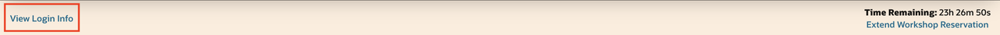
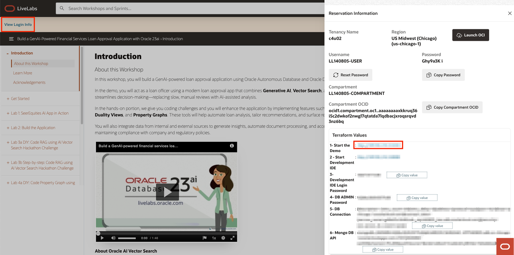
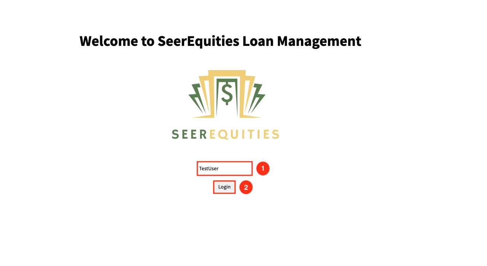
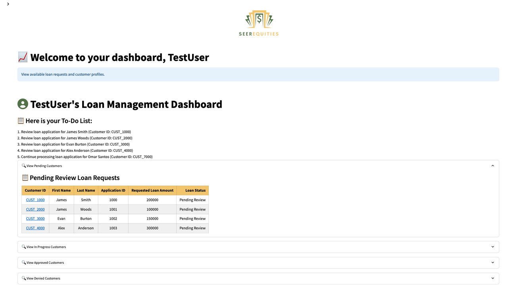
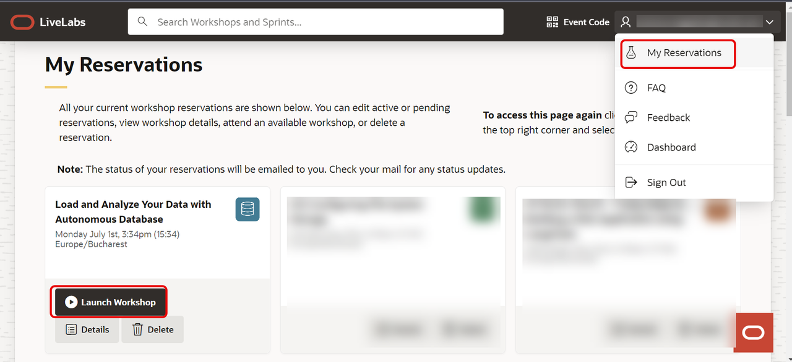

# Get started

## Introduction

In this lab, we will show you where you can find the login information and how to log in to the **SeerEquities Loan Management application**.

Estimated Time: 5 minutes

### Objectives

- Log-in to the application
- Locate your LiveLabs Sandbox reservations

## Task 1: View Login Information

1. Right above the workshop instructions, locate **View Login Info**.

    Use it to find the credentials and other information needed to access the LiveLabs Sandbox.

2. Locate **Time Remaining**.

    This shows the remaining time before your LiveLabs Sandbox access expires. You may be able to extend the reservation time.

    

## Task 2: Login to the Demo

1. To access the demo environment, click **View Login Info** in the top left corner of the page. Click the **Start the Demo** link.

    

2. Enter in a username, select the **Loan Officer** role, and click **Login**.

    

3. Welcome to the SeerEquities Loan Management application! Congratulations, you are now connected to the demo environment. You can now execute the different tasks and steps for the LiveLabs workshop.

    

## Task 3: Find your LiveLabs Sandbox reservations

1. If you close your browser and want to launch your workshop again, open [livelabs.oracle.com](https://livelabs.oracle.com) and log in using your Oracle account.

2. Click **My Reservations**.

    You will see the history of the LiveLabs workshops you signed up for.

3. Click **Launch Workshop** to start a workshop with an existing LiveLabs Sandbox environment.

    

You may now **proceed to the next lab**.

## Acknowledgements

- **Created By/Date** - Linda Foinding
- **Contributor** - Linda Foinding
- **Last Updated By/Date** - Linda Foinding, April 2025
