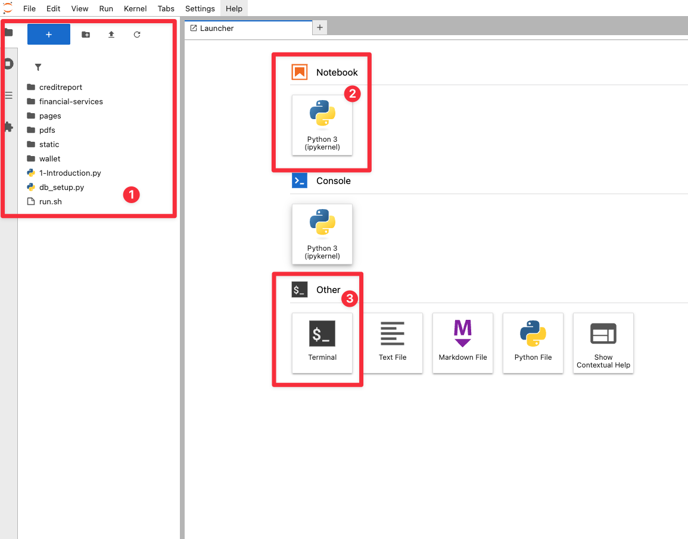
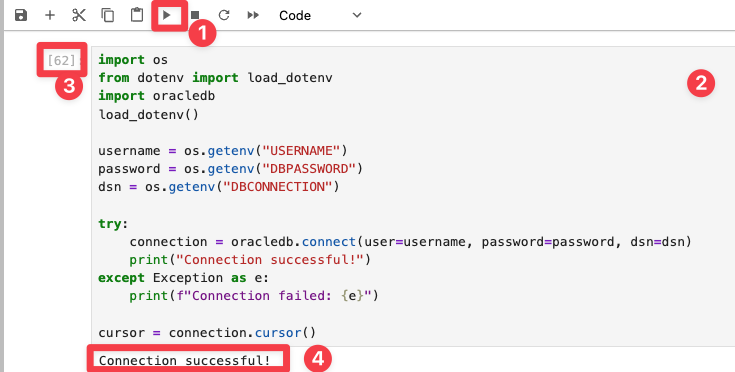

# Connect to the Development Environment

## Introduction

In this lab, you'll learn how to access the web-based Jupyter Lab development environment, where you can write and run Python code directly in your browser. You'll log in, create notebooks, and get ready to start coding in a hands-on environment.

Estimated Time: 5 minutes

### Objective

* Login to JupyterLab

## Task 1: Login to JupyterLab

1. To navigate to the development environment, click **View Login Info**. Copy the Development IDE Login Password. Click the Start Development IDE link.

    

2. Paste in the Development IDE Login Password that you copied in the previous step. Click **Login**.

    

1. Click the blue "+". This will open the Launcher. 

    

## Task 2: Get familiar with the development environment

1. Review the different elements in JupyterLab:

    **File browser (1):** The file browser organizes and manages files within the JupyterLab workspace. It supports drag-and-drop file uploads, file creation, renaming, and deletion. Users can open notebooks, terminals, and text editors directly from the browser. Navigation is fast and intuitive, with breadcrumbs and context menus that surface relevant actions. Users can right-click files to access options like duplicate, shutdown kernel, or open with a specific editor.

    **Launcher (2 and 3):** The launcher offers a streamlined entry point for starting new activities. Users can create Jupyter Notebooks for interactive coding with live code execution, visualizations, and rich markdown. The terminal provides direct shell access, enabling command-line operations within the JupyterLab environment. These two tools form the core of most workflows, supporting both interactive analysis and system-level tasks from a single interface.

    

## Task 3: Get familiar with Jupyter Notebooks

You will use a Jupyter Notebook in JupyterLab to build and test the return authorization system. If you are new to notebooks, the following tips will help you get started and work smoothly.

1. **Executing Code Blocks**: You can run code in two simple ways: press **Shift+Enter** to execute and move to the next cell, or click the **Play/Execute** button in the menu bar at the top of this tab. Both methods work interchangeably.

2. **Block Types**: Instructions and code are separated into **their own blocks**. Instructions are in markdown (like this cell), while code is in executable Python blocks. If you accidentally run an instruction block, it’ll just skip to the next cell—no harm done!

3. **Running Indicators**: When you run a code block, its label changes from `[ ]` (empty) or `[1]` (a number) to `[*]`. The asterisk (`*`) means it’s processing. Wait until it switches back to a number (e.g., `[2]`) before moving on, ensuring the operation is complete.

4. **Output & Warnings**: Below each code cell, output appears after execution. This can include results, visualizations, or messages. Warnings may show up—these are usually informational, such as notices about deprecated features. Unless an error halts execution, users can continue without making changes. If you see a error, review the code for any issues and make changes accordingly and try executing the cell again.

    

## Conclusion

In this lab you logged into the **IDE Development Environment** for Jupyter Labs. You reviewed different elements from the environment like **File Browser** and **Launcher**. Lastly, you were introduced to concepts to allow you to get started running code smoothly like **executing code blocks** and **outputs and warnings**. 

## Acknowledgements
* **Author** - Linda Foinding
* **Contributors** -  Linda Foinding, Francis Regalado
* **Last Updated By/Date** - Linda Foinding, April 2025
