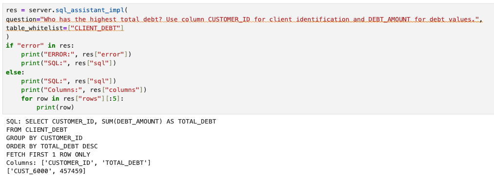

# Interact with Oracle Database 23ai through an MCP Server

## Introduction

Every day at Seer Holding, analysts wrestle with a familiar challenge: critical data lives everywhere—in ERP systems, HCM, CRM, JSON Duality Views, policy tables, vector stores, and more. When a return request needs review or a fraud case requires investigation, teams waste time stitching data together instead of acting on insights.

Model Context Protocol (MCP) changes this. It provides a universal API that exposes each system’s capabilities as reusable tools—whether that’s “List tables,” “Describe a table,” “Embed text,” or “Ask OCI GenAI.” MCP tools can be plugged into notebooks, dashboards, or agentic workflows, all through a single, open protocol.

For Seer Holding, this means:

Faster investigations – chain describe ➡️ sample ➡️ generate SQL ➡️ summarize in seconds.

Less glue code – one protocol to connect Oracle Database 23ai, OCI Generative AI, and future systems.

Safer-by-default – tools can be read-only, whitelisted, and audited.

Example scenario: An approval officer asks, “Why did we deny Alice’s request?” Instead of jumping across multiple systems, MCP tools pull structured data from JSON Duality Views, check policy rules, run a similarity search with Vector Search, and summarize findings—all without custom point-to-point integrations.

In this lab you will:

- Spin up a custom MCP server (Python, FastMCP) that exposes Oracle 23ai + OCI GenAI tools.

- Interact with it from a notebook to run multi-tool workflows.

- Extend the server by adding your own MCP tool.


**Why this is powerful**

MCP turns Oracle Database 23ai into a set of discoverable, composable tools that analysts can use with plain language. But its real power emerges when extended to other systems—ERP for purchase orders, HCM for employee data, CRM for customer touchpoints—so workflows can span finance, HR, and customer engagement.

And it’s not just about AI. MCP can act as a general-purpose API layer: a standardized way for notebooks, dashboards, or integration services to list tables, fetch metadata, or run controlled queries. Even without AI—whether generating compliance reports, syncing systems, or surfacing HR metrics—MCP reduces integration work, simplifies maintenance, and makes enterprise data more reusable across teams.

Estimated Time: 60 minutes

### Objectives

- Understand MCP and how it wires tools into agent workflows

- Run an MCP server that connects to Oracle Database 23ai and OCI Generative AI

- Call MCP tools from a Jupyter notebook

- Implement and register a new MCP tool

### Prerequisites

- Completed Lab 2 (Jupyter environment)
- Lab 3–4 (DB + RAG foundation)

## Task 1: Review MCP in a nutshell (and the tools our MCP server exposes)

**What is MCP?**
MCP is an open protocol that lets an LLM (or a client app) call tools running in a sidecar process over stdio/HTTP. You can think of it as allowing to implement “function calling,” but language- and framework-agnostic. Your MCP server can declare tools; your client (IDE, notebook, agent runtime, application) calls them.

**MCP Server layout:**
You’ll use the Python module 'fastmcp' to register tool functions with the @mcp.tool decorator and run them as an MCP server (stdio).
Here, “stdio” means the server communicates over standard input and output streams rather than opening a network port—making it simple, secure, and easy to embed in tools like Jupyter or IDE plugins.

> Note: We will not discuss in detail the actual implementation of the MCP server but rather focus on the tools exposed through the MCP server.

**Tools in server.py (selected highlights):**

- GenAI chat — oci\_chat(prompt, …) talks to OCI Generative AI.

- Embeddings in DB — embed\_db(text, model_name) calls Oracle DB 23ai to embed text via ONNX model.

- Database schema discovery — list\_tables(owner), describe\_table(table, owner, sample\_rows).

- Natural Language to SQL (read-only) assistant — sql\_assistant(question, table\_whitelist):

Generates a read-only SQL (SELECT/WITH), enforces single-statement + whitelist, runs it, and returns both rows and an NL summary produced by OCI GenAI.

Internally uses helpers like \_clean\_llm_sql, read-only guards, and a row cap for safety.

## Task 2: Run the MCP server and call tools from a notebook

1. Open a new terminal session in JupyterLab using the Launcher

    

2. Start the MCP server:

    ```bash
    $ <copy>python /home/mcp/server.py
    </copy>
    ```

    

3. Right-click on the folder `mcp` and select **New Notebook** to create a new JupyterNotebook

     _Select Python 3 (ipykernel) if asked to select a kernel_

    

4. Copy the following helper class into a cell and execute the code:

    ```Python
    <copy>
    import server
    import mcphelper
    import importlib
    </copy>
    ```

    _There is not output expected_


5. Copy the following code and execute:

    ```Python
    <copy>
    chat = mcphelper.NBChat(session_id="demo", system="You are helpful and help users at Seer Holding")
    print(chat.ask("Hi there Seer Holding helper!"))
    print(chat.ask("What did I just say?"))
    print(chat.ask("What is the best way to start working at Seer Holding"))
    </copy>
    ```

    **What does it do?**

    This snippet creates an MCP chat session for Seer Holding, with the system prompt framing the assistant as a helpful company guide. The first message greets the assistant, the second tests its ability to remember prior conversation turns (“What did I just say?”), and the third asks for practical guidance in a Seer-specific context (“What is the best way to start working at Seer Holding”).

    What makes MCP powerful here is that the context-awareness and role definition come “for free”: once the chat tool is exposed through MCP, any Seer analyst, new hire, or system agent can plug into it and get consistent, stateful guidance—without each app or workflow having to reimplement memory or role prompts.

    

6. Execute the following code:

    ```Python
    <copy>
    vec = server.embed_db_impl("Where are you from?")
    len(vec), vec[:8]
    </copy>
    ```

    **What does it do?**

    This snippet calls the MCP tool embed\_db\_impl to generate a vector embedding for the phrase “Where are you from?” directly inside Oracle Database 23ai. The code then shows the length of the resulting vector and previews the first eight values.

    What makes MCP powerful here is that embedding becomes just another tool in the protocol—no separate service calls or glue code are required. Any agent or workflow at Seer Holding can now request embeddings in the same way it requests a SQL query or a chat response, making it easy to build vector search and RAG pipelines that combine structured and unstructured data consistently.

    

7. Execute the following code:

    ```Python
    <copy>
    print(server.healthcheck_impl())
    </copy>
    ```

    **What does it do?**

    This snippet calls the MCP tool healthcheck\_impl(), which returns a simple confirmation that the MCP server is up and responsive. It’s the quickest way to verify that the server is running correctly and ready to accept tool calls.

    What makes MCP powerful here is that health checks are exposed just like any other tool. That means clients—whether a Jupyter notebook, IDE plugin, or agent workflow—can programmatically confirm connectivity and fail fast if something is wrong, instead of silently breaking. For Seer Holding, this ensures reliable pipelines and smooth developer experience when building on top of Oracle Database 23ai and MCP.

    For Seer Holding, this is like a pre-flight check before analysts start their workflows: it reassures teams that the systems behind their return authorization, fraud detection, or onboarding processes are healthy, so they can trust the tools they’re about to use.

    

8. Next, execute this code in a cell:

    ```Python
    <copy>
    print(server.list_tables_impl()[:20])
    </copy>
    ```

    **What does it do?**

    What does it do?

    This snippet calls the MCP tool list\_tables\_impl(), which retrieves the list of database tables available through the Oracle Database 23ai connection. The code then prints the first 20 entries. It’s a quick way to explore the schema and discover what data sources are available.

    What makes MCP powerful here is that schema discovery becomes a standardized tool. Instead of writing custom SQL or metadata queries in every project, any MCP-enabled client—whether a notebook, IDE, or agent—can ask for the list of tables the same way.

    For Seer Holding, this is like giving analysts a guided map of the data landscape: they don’t need to guess where customer profiles, return policies, or transaction logs live. The MCP server exposes that knowledge consistently, helping teams onboard faster and chain tools together more confidently in agentic workflows.

    


9. Now execute this code:

    ```Python
    <copy>
    desc = server.describe_table_impl("AUTHORIZATION_REQ")
    for c in desc["columns"]:   
        print(f"{c['name']:15} {c['data_type']}")
    </copy>
    ```

    **What does it do?**

    This snippet calls the MCP tool describe\_table\_impl("AUTHORIZATION_REQ") to fetch the schema details for the AUTHORIZATION_REQ table. It then loops through the column metadata and prints each column’s name alongside its data type. This gives developers a quick, structured overview of the table without needing to open SQL Developer or write a manual query.

    What makes MCP powerful here is that table introspection is exposed as a reusable tool. Any MCP-enabled client can ask the server to describe a table and get back a clean JSON structure, ready for use in code or agents.

    For Seer Holding, this is like giving analysts and developers a blueprint of critical business tables—whether it’s return authorizations, fraud checks, or policy rules. Instead of wasting time digging through documentation or writing metadata queries, teams can immediately understand what data they’re working with and plug it into automated workflows.

    

10. And now we want to execute this snippet:

    ```Python
    <copy>
    schema = server.describe_table_impl(table="CLIENT_DEBT", sample_rows =5)
    print("Table:", schema["table"])
    print("Columns:", schema["columns"])
    print("Sample rows:", schema["sample"])
    </copy>
    ```

    **What does it do?**

    This snippet uses the MCP tool describe\_table\_impl with the CLIENT_DEBT table and requests 5 sample rows. It prints out the table name, its column definitions, and a small sample of data. This combines schema exploration and data preview in a single step—perfect for quickly validating what a table contains and how the data looks.

    What makes MCP powerful here is that metadata and sample data are delivered together in a standard JSON format, so any notebook, IDE, or agent can immediately consume and reason over both structure and content without extra queries.

    For Seer Holding, this is like having a data onboarding assistant: when analysts explore a new dataset such as CLIENT_DEBT, they instantly see not just the blueprint of the table but also a slice of the actual data—helping them confirm they’re in the right place before building workflows, dashboards, or AI-powered checks.

    


11. Copy and paste the following code and execute it:

    ```Python
    <copy>
    res = server.sql_assistant_impl(
    question="Who has the highest total debt? Use column CUSTOMER_ID for client identification and DEBT_AMOUNT for debt values.",
    table_whitelist=["CLIENT_DEBT"]
    )
    if "error" in res:
        print("ERROR:", res["error"])
        print("SQL:", res["sql"])
    else:
        print("SQL:", res["sql"])
        print("Columns:", res["columns"])
        for row in res["rows"][:5]:
            print(row)
    </copy>
    ```

    **What does it do?**

    This snippet calls the MCP tool sql\_assistant\_impl with a natural language question: “Who has the highest total debt?”. The tool converts the question into a safe, read-only SQL query against the CLIENT\_DEBT table (whitelisted via table_whitelist). The result shows the generated SQL, the columns returned, and the top rows from the query. If something goes wrong, the snippet prints out an error and the attempted SQL.

    What makes MCP powerful here is that natural language is turned into governed SQL automatically. The server enforces guardrails (read-only queries, whitelisted tables, capped results), so analysts and agents can explore data safely without writing complex SQL themselves.

    For Seer Holding, this is like giving business users a data co-pilot: they can ask plain questions about client debt or returns, and MCP handles the SQL generation, execution, and summarization—reducing dependence on expert query writers while still protecting sensitive systems.

    

12. The next code is even better. Copy it and execute the cell:

    ```Python
    <copy>
    res = server.sql_assistant_impl(
    question="Which state has the highest number of customers?",
    table_whitelist=["CLIENTS"]
    )
    if "error" in res:
        print("ERROR:", res["error"])
        print("SQL:", res["sql"])
    else:
        print("SQL:", res["sql"])
        print("Columns:", res["columns"])
        for row in res["rows"][:5]:
            print(row)
        print("Response:", res["natural_language"])
    </copy>
    ```

    **What does it do?**

    This snippet uses the MCP tool sql\_assistant\_impl to answer the question: “Which state has the highest number of customers?”. The tool automatically generates a read-only SQL query restricted to the whitelisted CLIENTS table, executes it, and returns the results. The output shows the generated SQL, the columns, the first rows, and—most importantly—a natural language summary of the answer.

    What makes MCP powerful here is that it goes beyond query execution: it delivers a human-readable explanation alongside the raw data. That means analysts don’t just see rows in a notebook—they immediately understand the insight.

    For Seer Holding, this is like giving decision-makers a bilingual assistant: it speaks both SQL and plain business language. A returns manager or risk officer can ask everyday questions, get back safe SQL and verifiable results, and also read a clear summary that speeds up understanding and action.

    

13. Let's do this one more time using a different query:

    ```Python
    <copy>
    res = server.sql_assistant_impl(
    question="Who has the lowest total debt?",
    table_whitelist=["CLIENT_DEBT"]
    )
    if "error" in res:
        print("ERROR:", res["error"])
        print("SQL:", res["sql"])
    else:
        print("SQL:", res["sql"])
        print("Columns:", res["columns"])
        for row in res["rows"][:5]:
            print(row)
        print("Response:", res["natural_language"])
    </copy>
    ```

    


## Task 3: Add Your Own MCP Tool

You will add a row counter tool to quickly verify table sizes during investigations. It reuses the existing DB pool and identifier safety helpers.

1. Open the folder **mcp** and double click **server.py**:

    


2. Copy the following code and paste it append to the bottom of server.py—just above the `ENTRYPOINT` comment. Save the the file by clicking **CTRL+S (PC) / CMD+S (Mac)**.

    ```Python
    <copy>
    def row_count_impl(table: str, owner: Optional[str] = None) -> int:
        pool = _get_db_pool()
        tab = _safe_ident(table)
        with pool.acquire() as conn, conn.cursor() as cur:
            own = _safe_ident(owner) if owner else _current_schema(conn)
            fq = f"{own}.{tab}"
            cur.execute(f"SELECT COUNT(*) FROM {fq}")
            return int(cur.fetchone()[0])

    @mcp.tool
    def row_count(table: str, owner: Optional[str] = None) -> int:
        return row_count_impl(table, owner)
    </copy>
    ```

    


3. Change over to your Jupyter Notebook and execute the following code:

    ```Python
    <copy>
    importlib.reload(server)  # we will reload server.py as we just updated it

    print(server.row_count_impl("CLIENTS"))
    </copy>
    ```

    **What does it do?**

    This snippet reloads the updated server.py module using importlib.reload so that newly added tools become available without restarting the notebook. It then calls the plain Python implementation row_count_impl("CLIENTS"), which runs a SELECT COUNT(*) query on the CLIENTS table and returns the total number of rows.

    What makes MCP powerful here is that we created simple function that returns the number of rows in a given table and exposed it as an MCP tool. That means Seer Holding developers can use functions in MCP workflows including agentic workflows.

    


## Conclusion

With MCP, Seer Holding gains far more than a new way to call the Oracle Database 23ai—it gains a unified language for interacting with all operational systems. Instead of building and maintaining a patchwork of custom APIs, MCP exposes every capability (list tables, run SQL, generate embeddings, count rows, fetch HR metrics, check ERP orders) as discoverable, composable tools.

**Why is this powerful?**

- One protocol, many systems – Whether it’s financial data in Oracle 23ai, purchase orders in ERP, or employee records in HCM, MCP provides a consistent, governed way to interact.

- Safe and simple – Tools are whitelisted, read-only by default, and easy to test in notebooks, making development and compliance smoother.

- Beyond AI – While MCP shines in agentic workflows (e.g., an AI assistant combining debt data with return policies), it’s equally useful for everyday tasks—like generating compliance reports, counting rows for audit checks, or exporting CRM leads.

- Future-proof workflows – New systems can be plugged in by just adding tools, without re-architecting clients or retraining users.

Imagine an onboarding specialist asking:

> “Show me the top five regions where customers with high return risk also have overdue invoices.”

Behind the scenes, MCP could chain tools across CRM (customers), ERP (invoices), and Oracle 23ai (return risk) into a single, safe workflow—without custom glue code.

Or consider a compliance officer who needs:

> “List all employees in HCM who approved expense claims over €5,000 last quarter, and cross-check with ERP for matching invoices.”

Here MCP provides a single entry point for complex, cross-system queries that would otherwise require multiple integrations.

For Seer Holding, MCP means faster innovation, lower integration cost, and consistent access to enterprise knowledge. Whether you’re building AI-powered agents or simple reporting scripts, MCP ensures your systems can talk to each other in the same, reliable way.


## Acknowledgements
* **Authors** -  Kevin Lazarz
* **Code** - Francis Regalado (the King of MCP 👑)
* **Last Updated By/Date** - Kevin Lazarz, April 2025
