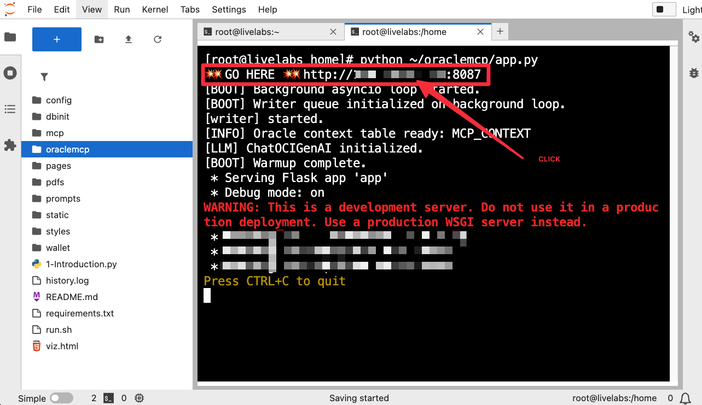
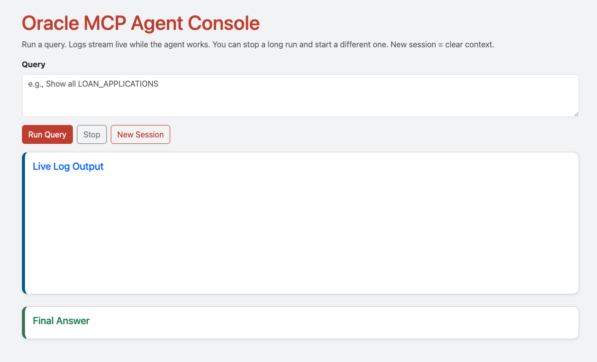
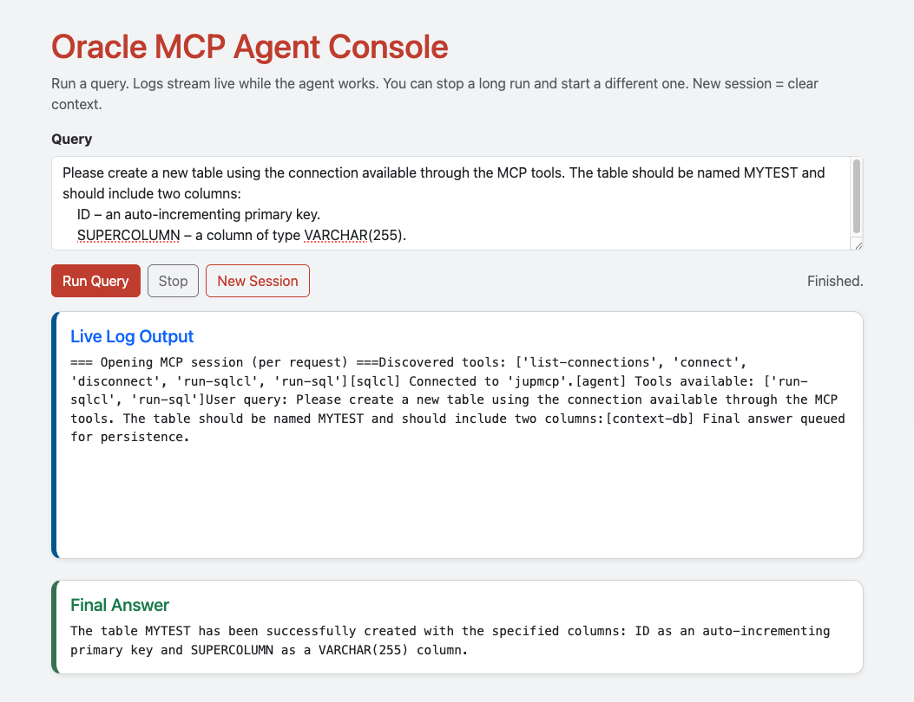
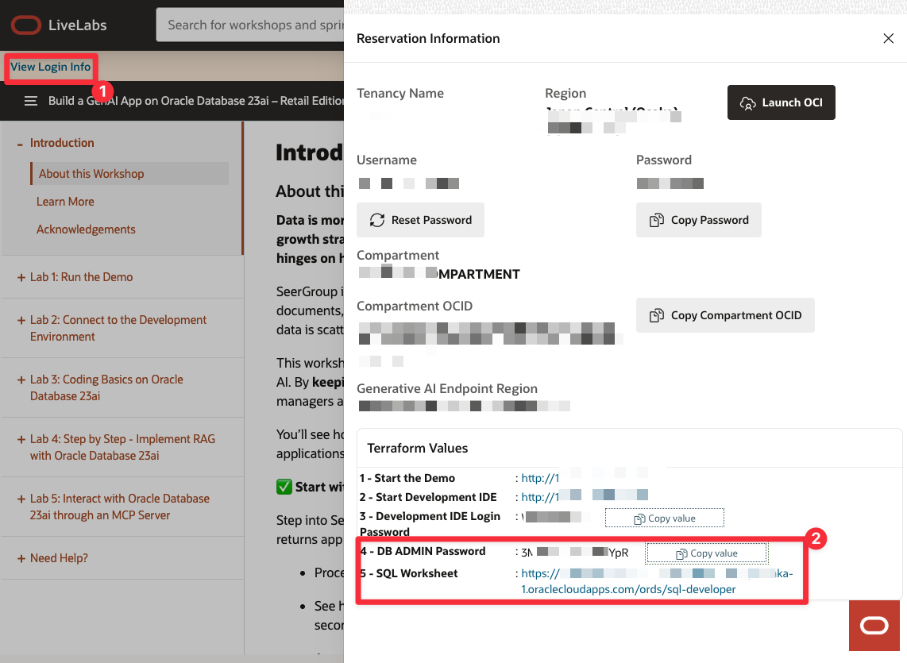
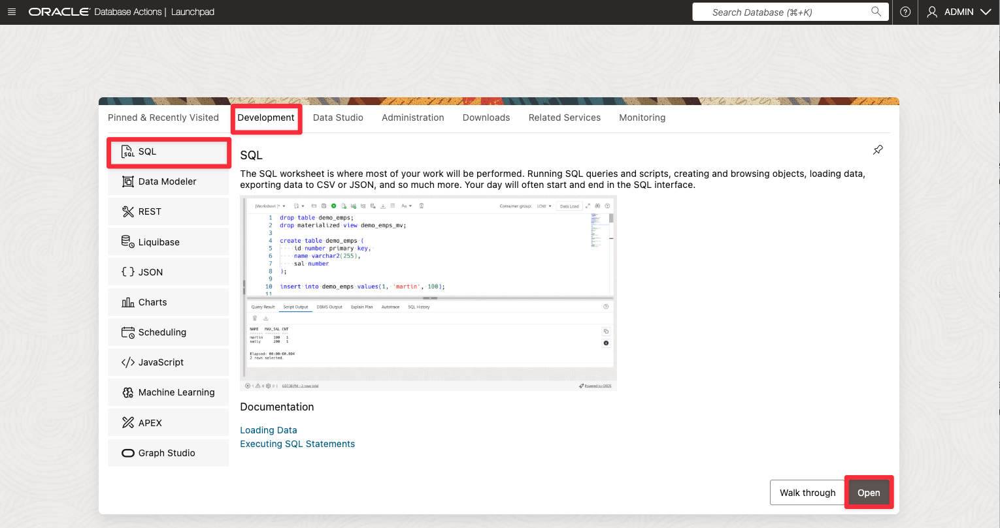
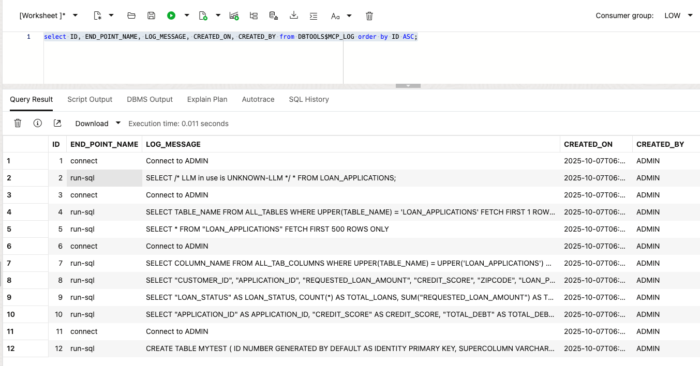

# Build Agentic AI with Oracle MCP

## Introduction

You’re a developer at SeerHolding, supporting multiple SeerGroup divisions such SeerEquities, SeerRetail, SeerEnergy, SeerHealth, and many more.
Each business unit wants smarter, AI-driven apps that interact directly with Oracle Database 23ai.

Your job: build a common agentic AI foundation that lets teams query data, trigger workflows, and build their own copilots without rewriting backend logic.

In this lab, you’ll connect to Oracle MCP, run it through LangChain, and interact with it via a Flask web console.

You’ll see how developers can expose SQL operations and analytics as AI-discoverable tools—the building blocks for enterprise agentic systems at SeerHolding.

Estimated Time: 60 minutes

### Objectives

- Create and store a reusable SQLcl connection for Oracle MCP.

- Run LangChain as an MCP client to access Oracle Database tools.

- Use a Flask web interface to interact with the database in natural language.

- Observe secure logging and traceability through MCP.

### Prerequisites

- Completed Lab 2: Jupyter Environment Setup

- (Optional) Completed Labs 3–4 on RAG and AI Vector Search

## Task 1: Create a SQLcl connection for MCP

Start by creating a saved connection that Oracle MCP will reuse for all tool calls.

1. Open a new terminal session. Click the **blue +** in the top left corner and select **Terminal**.

    

2. Run:

    ```bash
    <copy>
    ./oraclemcp/mcpsql.sh
    </copy>
    ```

    You should see:

    ```bash
    ✅ SQLcl connection 'jupmcp' was saved successfully.
    ```

    > What does the script do?
    
    The script runs *sql -nolog* and executes:

    ```sql
    conn -save jupmcp -replace -savepwd ${USERNAME}/${DBPASSWORD}@"${DBCONNECTION}"
    ```

This creates a persistent, password-protected connection named jupmcp. Your MCP agent will discover and use it automatically in later steps.

## Task 2: Use LangChain as the Oracle MCP Runner

Next, you’ll launch LangChain as the client that connects to Oracle MCP, discovers tools, and executes your first agentic query.

1. Run:

    ```bash
    <copy>
    python ~/oraclemcp/oralanmcp.py
    </copy>
    ```

    What the script does:

    - Starts an MCP client with SQLcl: {"command":"sql","args":["-mcp"],"transport":"stdio"}.

    - Initializes ChatOCIGenAI with your OCI Generative AI endpoint.

    - Discover available MCP tools

    - Send a natural language query: “Show all LOAN_APPLICATIONS.”
  
2. Expected outcome:

    

✅ **Checkpoint** You successfully invoked MCP tools from LangChain and received a model-generated answer.

## Task 3 (Optional): Use LangChain as the Oracle MCP Runner with a Reasoning Agent

In this optional task, you’ll explore how LangChain can operate with a reasoning agent — a more advanced version of the MCP client that plans, explains, and justifies each step before acting.

The reasoning agent takes longer to run, but it gives you insight into why each tool was chosen and how the decision flow unfolds inside the model.
This is especially useful for developers who want to debug, audit, or optimize multi-tool workflows in production.

Why Does It Matter?

- **Reasoning agents think before they act.**
    They plan tool usage step by step instead of responding immediately — making their logic visible and traceable.

- **LangChain turns reasoning into a workflow.**
    It coordinates multiple MCP tools automatically, showing each intermediate thought and action along the way.

- **Transparency builds trust.**
    For enterprise developers, seeing how an agent reached a result is as important as the result itself — essential for debugging, auditing, and compliance.

1. Open a new terminal session. Click the **blue +** in the top left corner and select **Terminal**.

    

2. Run (**Note**: It can take up to 1 minute to complete):
    
    ```python
    <copy>
    python ~/oraclemcp/oralanmcp_reasoning.py
    </copy>
    ```

3. The script will:

    * Launch a new MCP client session for SQLcl

    * Load all available Oracle MCP tools

    * Initialize a reasoning-capable agent using the cohere.command-a-03-2025 model

    * Execute the query: *Show all LOAN_APPLICATIONS*.

4. Expected outcome:

    

💡**Developer Insight**
For SeerHolding’s development teams, reasoning agents add more than verbosity. They provide explainability.
When you deploy AI copilots for any of SeerHolding's divisions, you can trace each database interaction step by step.
That visibility helps you debug complex chains, document behavior for audits, and build trust in production AI systems.


✅ **Checkpoint**
You’ve successfully run a reasoning-enabled MCP agent.
Compare its detailed reasoning flow with the faster agent from Task 2 to see how planning affects performance and interpretability.

## Task 4: Interact Through a Web Console

Now you’ll use a simple web console built in Flask to interact with the Oracle MCP agent through your browser.

1. Open a new terminal session. Click the **blue +** in the top left corner and select **Terminal**.

    


2. Start the Flask app:

    ```bash
    <copy>
    python ~/oraclemcp/app.py
    </copy>
    ```

3. Open the web application:

    


    

4. Click **Run Query** to run the default "Show all LOAN_APPLICATIONS"

    


5. Next, enter the following query:

    ```text
    <copy>
    Show top 5 entries from LOAN_APPLICATIONS.
    Summarize total loans by status; return a compact table.
    Rank the 5 highest-risk applications with reasons.
    Please create an executive summary in Markdown.
    </copy>
    ```

    Click Run Query.

    You’ll see:

    


💡 **Developer Insight**
When you click New Session, you reset the conversation context and prevent older responses from influencing new prompts.
Meanwhile, the app automatically stores your latest answer in Oracle — allowing future queries to include prior context without extra code.

Here’s what this app wires together:

* **Oracle MCP**: runs as the tool server through sql -mcp, exposing database operations as callable tools.

* **LangChain Agent**: dynamically discovers those tools and orchestrates them at runtime.

* **OCI GenAI**: uses the cohere.command-a-03-2025 model for reasoning and summarization.

Together, these layers turn a standard Flask app into an agentic web interface — one that remembers, reasons, and interacts with Oracle Database 23ai in natural language.


## Task 4: Create and Modify Database Objects via MCP

1. Click **New Session** and run:

    ```text
    <copy>
    Please create a new table using the connection available through the MCP tools. The table should be named MYTEST and should include two columns:
    ID – an auto-incrementing primary key.
    SUPERCOLUMN – a column of type VARCHAR(255).   
    </copy>
    ```


    


The agent translates your request into SQL, executes it through MCP, and confirms creation.
This shows how developers can delegate common schema tasks to secure, explainable AI assistants without writing SQL manually.

## Task 5: Explore Logging and Security

Oracle MCP logs every interaction automatically. You can review the logs directly in the database.

1. Open SQL Developer Web. You can find the login information in the **View login info** section of this workshop. *Your username is: admin*

    

2. In Database Actions, select the **Development** tab, then **SQL**, and click **Open**:

    

3. Execute the following query:

    ```sql
    <copy>
    select ID, END_POINT_NAME, LOG_MESSAGE, CREATED_ON, CREATED_BY from DBTOOLS$MCP_LOG order by ID ASC;
    </copy>
    ```

4. Review the results and see that everything is logged.

    

You’ll see a record of each MCP action with timestamps and user IDs — ideal for auditing and traceability.


💡 **Developer Insight**

Every MCP call leaves a trace.
Oracle MCP automatically logs the tools used, parameters passed, and responses generated, creating a transparent audit trail for every AI-driven database action.

For developers, this means:

* Debugging becomes data-driven. You can inspect exact tool sequences when troubleshooting complex agent runs.

* Security stays enforceable. Each call links to the authenticated user, timestamp, and endpoint.

* Compliance is built-in. You can prove what data was accessed, when, and by which agent — a must for regulated industries.

Logging isn’t an afterthought; it’s how agentic systems at SeerHolding stay explainable, auditable, and production-ready.

## Conclusion

You’ve built SeerHolding’s first agentic AI development framework.

You learned how to:

* Connect Oracle MCP through SQLcl

* Use LangChain to orchestrate Oracle Database tools

* Add reasoning agents for transparent decision flows

* Build a Flask-based agentic UI for natural-language queries

* Leverage OCI GenAI for reasoning and summarization


**What This Means for SeerHolding Developers**

* Build once, reuse everywhere: expose SQL scripts or APIs as shared MCP tools for all SeerGroup divisions.

* Integrate fast: create AI copilots that reason across SeerEquities, SeerRetail, or SeerEnergy using one architecture.

* Stay compliant: every MCP call is logged, versioned, and explainable.

* Deliver faster: prototype enterprise-grade AI assistants in hours, not weeks.

You’ve laid the foundation for SeerHolding’s agentic AI platform: turning Oracle Database 23ai into the intelligent core of SeerGroup’s future applications.

## Acknowledgements
* **Authors** -  Kevin Lazarz
* **Last Updated By/Date** - Kevin Lazarz, October 2025
