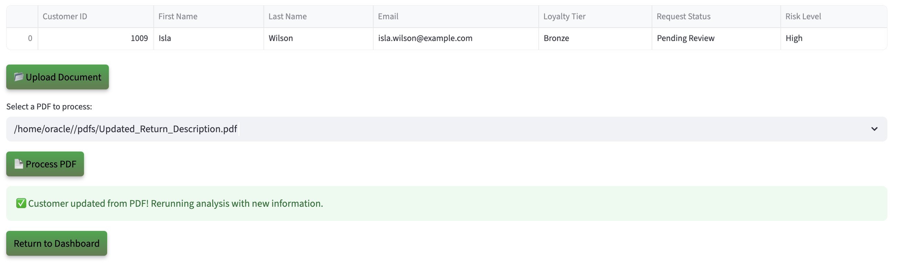
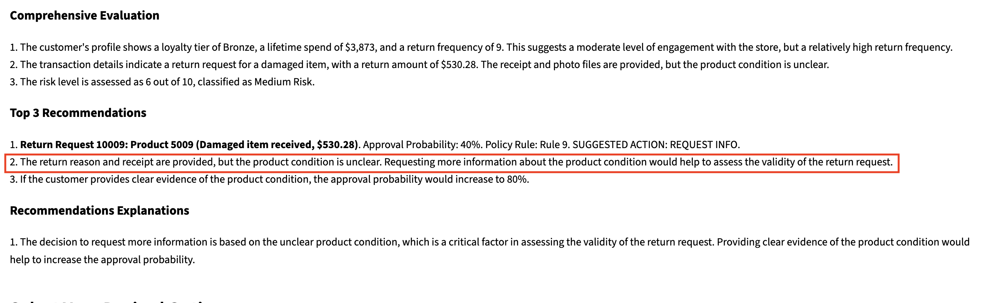

# Run the Demo

## Introduction

In this lab, you’ll step into the shoes of a **Return Authorization Specialist** using an AI powered returns app built on Oracle Database 23ai. See how Generative AI, Vector Search, and Graph Analytics reduce review times by automating photo analysis, order verification, and fraud checks - all inside one converged database, with zero data shuffling.

**Disclaimer**: Please note that your results may vary. The information provided is generated by OCI Generative AI services, and your outcomes may differ from those presented.

Estimated Lab Time: 30 minutes

### Objectives

In this lab, you will:

* Review how the Seer Retail return authorization app incorporates the use of AI Vector Search, Graph analytics, and other converged database features, all without requiring complex data movement or separate systems.

### Prerequisites

This lab assumes you have:

* An Oracle account to submit your a LiveLabs Sandbox reservation.

## Task 1: Launch the application

1. To access the demo environment, click **View Login Info** in the top left corner of the page. Click the **Start the Demo** link.

    

2. Welcome to Seer Holdings! Select **Retail** as Industry and **Approval Officer** as role. Enter in a username and click **Login**.

    

3. Welcome to the Seer Retail return authorization application! Congratulations, you are now connected to the demo environment. You can now execute the different tasks for this Lab.

    

## Task 2: Demo - Customer with medium risk score

In this first example, you will use the application to authorize a return for a customer with a medium risk score. Select the third user on your to-do list David Williams.

1. On the Dashboard page, from the pending review list, select the review button for **David Williams**.

    

2. Opening David William's profile reveals his return authorization details—name, email, request status, loyalty tier, and risk level.  

    

3. At the bottom of David William’s profile, you will find **AI Guru**—a virtual Return‑Authorization Specialist who guides attendees through every step of the AI‑driven returns portal. AI Guru shows how to upload photos and order data, highlights how AI Vector Search compares each request to millions of past returns, and translates risk scores into plain language. It's friendly tips humanize concepts like graph‑based customer‑lifetime‑value analysis and RAG‑generated policy explanations, so users of any technical level can confidently approve, pend, or deny a return.

    **Copy** the question below into the AI chatbot and press **Enter**. What does AI Guru say?

    ```text
    <copy>
    Has this customer returned similar items before?
    </copy>
    ```

    

>💡 In Oracle Database 23ai, **AI Vector Search** allows you to combine your business data with a Large Language Model (LLM) to reduce hallucinations and get accurate answers from your data.

4. Select the **Navigate To Decisions** button.

    

    After navigating to the decisions page, the AI evaluation runs in the background. Using AI Vector Search, it semantically compares the content against thousands of historical return records—identifying patterns that suggest either legitimate claims or potential abuse. At the same time, Graph Analytics examines the customer’s prior behavior, highlighting unusual return frequency or links to high-risk product categories. For each case, the system assigns a risk score ranging from Low to Very High and generates a clear recommendation—such as “Approved – consistent with customer profile” or “Request More Info – insufficient documentation.”

5. In the **Select Your Desired Option Option** section, the approval probability and decision are displayed. Once a decision is made, the analyst finalizes the return. A professionally formatted PDF letter is automatically generated, summarizing the outcome and rationale. The customer receives an email moments later, clearly stating whether their return was approved, denied, or needs more information—along with an explanation grounded in policy and precedent.

    

6. Select the AI-recommended return decision. In this example, that is **Request More Info**. 

    >Please note that your results may vary. The information provided is generated by OCI Generative AI services, and your outcomes may differ from those presented.

    

7. Set the final return status to **Request Info**, then click **Confirm Decision** to complete the process.

    The return status has been updated to 'Request Info' and saved to the customer profile.

    

8.  Click the **Download Decision as PDF** button.

    

9.  Click **Download PDF**

    

10. Display the message the customer would see by opening the downloaded PDF.

    

11. Click the **Return to Dashboard** button to navigate back to the Dashboard.

    

12. Expand **View In Progress Customers**. We can see that David Williams has been removed from the **Pending Customers** list and has been added to the **In Progress Customers**.

    

**Task Summary**

Once you select and save one of the 3 return options recommended by the AI: 

✅ The customer's return status is updated.

✅ A finalized PDF decision document is generated.  

✅ The dashboard reflects the change in real-time — marking David as In Progress.

Congratulations, you have just approved your first customer return! Proceed to the next task.

## Task 3: Demo - Denying a Customer with high risk
In this example, you will navigate the application to review a customer and deny them as part of the exercise. The first user on your to-do list is Alice Smith.

1. On the Dashboard page, from the pending review list, select the Review Button for **Alice Smith**.

    

2. Opening Alice Smith’s profile displays her return package details. Within a few seconds, the AI automatically generates recommendations. In this case, the system evaluates a less favorable profile and identifies key risk factors.

    This customer has:

    * A lifetime spend of **$3301.29**
    * A transaction detail indicating **damaged item for order 5001**
    * A return frequency of **2**

    The AI evaluates the profile and suggests next steps. In this case, it recommends requesting more info—but also provides clear, explanations as to why the customer was put into a high risk category.

    

3. Select the **Navigate to Customer Decisions** button.

    

>⁉️ **What are two reasons that the AI decided to deny this return?** ⁉️

4. Expand **Interactive Graph: Customer Return & Risk*** to view the graph.

    

    On the decision page, the return specialist can use **Interactive Graph: Customer Return & Risk** to explore relationships in return authorization scenarios. Built with **Oracle Graph**, this feature visually maps decisions and highlights important features of the request like the customer loyalty status and return reason.

    

    This graph shows Alice’s return request linked to a policy rule (in-store within 30 days) and the system’s recommendation. By connecting the customer, request, reason, and policy in one view, the Operational Property Graph makes it clear why a return is approved, denied, or flagged. Analysts can instantly explain the decision to the customer, reducing disputes and building trust.

>💡 In Oracle Database 23ai, **Property Graph** allows you to treat your data like a network of connected points, where each point (called a node) and each link (called an edge) has its own details or properties. This setup helps you run graph analytics, to find important connections or patterns, directly within the database.

5. The return status is set to **Denied**. Click the **Confirm Decision** button.

    The return status has been updated to 'Denied' and saved to the customer profile.

    

6. Press the **Download Decision as PDF** button to save the AI responses and proceed to the final return authorization.

    

7. Click the **Download PDF** button.

    

8. Display the message the customer would see by opening the downloaded PDF.

    

9. Click the **Return to Dashboard** button to navigate back to the Dashboard.

    

10. Expand **View Denied Customers**. You will see that Alice Smith has been moved from the **Pending Customer** list to the **Denied Customers** list.

    

**Conclusion**

Congratulations, you have finished reviewing a customer with high fraud risk! Proceed to the next task.

## Task 4: Demo - Update customer details

Lastly, let’s explore how the system uses JSON Duality Views to handle profile updates. In this task, you will edit a customer’s details. In this example, the customer was asked to submit updated proof of carrier tracking.

1. On the Dashboard page, from the **Pending Customers** list, select the review button for **Isla Wilson**.

    

2. We will upload a document to update the item's return condition. On the Customer Details page, click the **Upload Document** button.

    

3. The PDF file has been loaded. Click the **Process PDF** button.

    

>💡 **JSON Duality Views** in 23ai let's you update unstructured data in an easy, high-level format while automatically handling the technical details behind the scenes. This makes it faster and simpler to work with messy data and connect it to structured systems.

4. The customer profile has been updated.

    

5. Navigate to the customer decisions page and notice that the information has been updated. Thanks to JSON Transform and JSON Duality Views, only the relevant field is modified — leaving the rest of the profile UNTOUCHED.

    

**Task Summary**

Once the document is uploaded:

✅ The system automatically detects the new item condition data.

✅ Then their profile will be updated for the return description.

✅ And thanks to JSON Transform and JSON Duality Views, only the relevant field is modified — leaving the rest of the profile UNTOUCHED.

## Conclusion

In conclusion our Return Authorization App was able to leverage Oracle database 23ai technologies such as **AI Vector Search, Property Graph and JSON Duality Views** to:

✅ Automate profile evaluations

✅ Provide AI-driven return recommendations by using an RAG model powered by a Oracle Database 23ai's AI Vector Search and OCI Generative AI service

✅ Enable seamless profile updates with JSON Duality Views

✅ And empower return analysts with actionable insights through Operational Property Graphs 

By combining these advanced tools, the application enables faster, smarter decisions and delivers clear guidance on how customers can improve their eligibility.
 
**Next:** How about learning how the application was implemented in Python? Continue with the next labs and start developing!

## Learn More

* [Oracle Database 23ai Documentation](https://docs.oracle.com/en/database/oracle/oracle-database/23/)

## Acknowledgements
* **Authors** - Linda Foinding, Francis Regalado, Kamryn Vinson
* **Contributors** - Kevin Lazarz, Hanna Rakhsha, Ley Sylvester, Uma Kumar
* **Last Updated By/Date** - Uma Kumar, July 2025