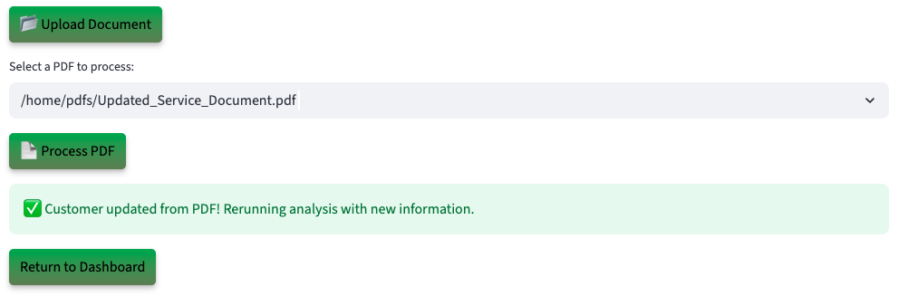

# Run the Demo

## Introduction

Act as a Public Works Officer using an AI-powered service request platform running on Oracle AI Database. Discover how Generative AI, Vector Search, Graph Analytics, and JSON Duality Views instantly analyze citizen requests, supporting documents, and policy rules, replacing weeks of manual review with automated, data-in-place insights.

**Disclaimer**: Please note that your results may vary. The information provided is generated by OCI Generative AI services, and your outcomes may differ from those presented.

Estimated Lab Time: 30 minutes

### Objectives

In this lab, you will:

* Review how the Seer State & Local Gov Service Activation app incorporates the use of JSON Duality Views, Graph analytics, and other converged database features, all without requiring complex data movement or separate systems.

### Prerequisites

This lab assumes you have:

* An Oracle account to submit your a LiveLabs Sandbox reservation.

## Task 1: Launch the application

1. To access the demo environment, click **View Login Info** in the top left corner of the page. Click the **Start the Demo** link.

    

2. Select **State & Local Gov** under Industry and **Public Works Officer** under Role. Enter in a username and click **Login**.

    

3. Welcome to the Seer State & Local Gov application! Congratulations, you are now connected to the demo environment. You can now execute the different tasks for this Lab.

    

## Task 2: Demo – Request more information for a customer request

In this first example, you will use the application to review a Traffic Signal Malfunction request. The system evaluates citizen reports, attached photos, and policy rules, then provides an AI-generated recommendation for urgent repair. The first customer on your to-do list is Lee Roy.

1. On the Dashboard page, from the pending review list, select the review button for **Lee Roy**.

    

2. Opening Lee Roy’s profile reveals his service request details—name, email, request ID, service address, reported issue type, and current request status. You will also be able to see the AI-powered analysis on the request, including a comprehensive evaluation and the top 3 recommendations with approval probability.

    

3. At the bottom of Lee Roy’s profile, you will find the **AI Guru**—a chatbot built on Oracle AI Database and Vector search. When prompted, the system uses **RAG** to generate a response. It converts the question and energy data into embeddings, performs a similarity search, and then uses the **GenAI service** to turn the enriched context into a clear, natural language answer. If the customer calls with a question, you can quickly enter it into the AI Guru to generate a relevant response. 
 

    **Copy** the question below into the AI chatbot and press **Enter**. What does the AI Guru respond?

    ```text
    <copy>
    Why did it request more information?
    </copy>
    ```

    

>💡 In Oracle AI Database, **AI Vector Search** allows you to combine your business data with a Large Language Model (LLM) to reduce hallucinations and get accurate answers from your data.

4. Select the **Navigate To Customer Decisions** button.

    

    After navigating to the decisions page, the AI evaluation runs in the background. State and local service request documents containing details such as location, photos, descriptions, and applicable policy rules are stored in Oracle AI Database and modeled with JSON Duality Views. These documents are vectorized and searched using AI Vector Search to identify semantically relevant prior requests and compliance criteria. The results are passed to OCI Generative AI, which uses retrieval-augmented generation (RAG) to generate a natural-language explanation, formatted for both internal review and external communication.

5. In the **Select Your Desired Option** section, the available options are displayed. If more data is needed, the reviewer can upload documents, add missing information, and trigger a re-evaluation. The system dynamically adjusts the recommendation, and generates a decision letter sent directly to the customer.

    

6. Select the AI-recommended authorization decision. In this example, that is **Request Info**. 

    >Please note that your results may vary. The information provided is generated by OCI Generative AI services, and your outcomes may differ from those presented.

    

7. Set the final authorization status to **Request Info**, then click **Confirm Decision** to complete the process.

    The authorization status has been updated to 'In Progress' and saved to the customer's profile.

    

8.  Click the **Download Decision as PDF** button.

    

9.  Click **Download PDF**

    

10. Display the message the customer would see by opening the downloaded PDF.

    

11. Click the **Return to Dashboard** button to navigate back to the Dashboard.

    

12. Expand **View In Progress Customers**. We can see that Lee Roy has been removed from the Pending Customers list and has been added to the In Progress Customers list.

    

**Task Summary**

Once you select and save one of the 3 desired options recommended by the AI: 

✅ The customer's service request is updated.

✅ A finalized PDF decision document is generated.  

✅ The dashboard reflects the change in real-time — marking Lee as In Progress.

Congratulations, you have just made a decision on your first customer service request! Proceed to the next task.

## Task 3: Demo - Approve a customer's request
In this example, you will navigate the application to review a customer and approve them as part of the exercise. The next user on your to-do list is James Williams.

1. On the Dashboard page, from the pending review list, select the review button for **James Williams**.

    

2. Opening James’s profile displays his service request details. Within a few seconds, the AI automatically generates a suggested action. In this case, the system evaluates the request and assigns it a high risk rating, with explanations outlining key factors.

    This customer has:

    * A streetlight repair request marked **high priority**
    * Supporting photo evidence uploaded by the resident
    * A compliance report that matches policy rules, making the request **eligible for approval**

    The AI evaluates the profile and suggests next steps. In this case, it recommends denying the request and also provides clear explanations on why the recommendation is to request more information.

    

3. Select the **Navigate to Customer Decisions** button.

    

>⁉️ **Why did AI approve this request?** ⁉️

4. Expand **Interactive Graph: Service Requests & Policy** to view the graph.

    On the decision page, the public works officer can use **Interactive Graph: Service Requests & Policy** to explore relationships in service request scenarios. Built with **Oracle Graph**, this feature visually maps decisions and highlights important aspects of the request such as assigned crews, compliance rules, and supporting documents.

    

    This graph shows how James Williams’s Sidewalk Repair request connects across the workflow and is flagged with a High Priority rating and a pending policy check. Instead of hidden backend validations, the Operational Property Graph makes the reasoning visual by linking the customer, service request, AI recommendation, risk level, and policy compliance in one view. Public works officers can instantly see why the system requires more information before approval, helping build confidence and transparency in the decision process.

>💡 In Oracle AI Database, **Property Graph** allows you to treat your data like a network of connected points, where each point (called a node) and each link (called an edge) has its own details or properties. This setup helps you run graph analytics, to find important connections or patterns, directly within the database.


5. On the decisions page you can view the AI recommendation for James Williams. It shows the suggested action, comprehensive evaluation, and recommendations explanations. 

    

6. The authorization status is set to **Approved**. Click the **Confirm Decision** button.

    The authorization status has been updated to 'Approved' and saved to the customer profile.

    

7. Press the **Download Decision PDF** button to save the AI responses and proceed to the final authorization disposition.

    

8. Click the **Download PDF** button.

    

9. Display the message the customer would see by opening the downloaded PDF.

    

10. Click **Return to Dashboard** button. Expand **View Approved Customers**. You will see that James Williams has been moved from the **Pending Customers** list to the **Approved** list.

    

**Task Summary**

Congratulations, you have finished approving a customer! Proceed to the next task.

## Task 4: Demo - Update customer details

Lastly, let’s explore how the system uses JSON Duality Views to handle profile updates. In this task, you will edit a citizen’s service profile. In this example, John Smith was asked to submit updated service request documents, such as photos or inspection reports.

1. On the Dashboard page, from the **In Progress Customers** list, select the review button for **John Smith**.

    

2. We will upload a document to update customer's service note. On the Customer Details page, click the **Upload Document** button. The PDF file has been loaded. Then click the **Process PDF** button

    

>💡 **JSON Duality Views** let's you update unstructured data in an easy, high-level format while automatically handling the technical details behind the scenes. This makes it faster and simpler to work with messy data and connect it to structured systems.

4. The customer profile has been updated.

    

**Task Summary**

Once the document is uploaded:

✅ The system automatically detects the new data.

✅ The profile will be updated with service documentation.

✅ Thanks to JSON Transform and JSON Duality Views, only the relevant field is modified — leaving the rest of the profile UNTOUCHED.

## Conclusion

In conclusion our Service Request Approval App was able to leverage Oracle AI Database technologies such as **AI Vector Search, Property Graph and JSON Duality Views** to:

✅ Automate profile evaluations

✅ Provide AI-driven recommendations by using a RAG model powered by a Oracle AI Database's AI Vector Search and OCI Generative AI service

✅ Enable seamless profile updates with JSON Duality Views

✅ Leverage Operational Property Graphs to equip public works officers with actionable insights

By combining these advanced tools, the application enables faster, smarter decisions and delivers clear guidance on how customers can improve their eligibility.

**Next:** How about learning how the application was implemented in Python? Continue with the next labs and start developing!

## Learn More

* [Oracle AI Database Documentation](https://docs.oracle.com/en/database/oracle/oracle-database/23/)

## Acknowledgements
* **Authors** - Ley Sylvester
* **Contributors** - Francis Regalado, Hanna Rakhsha, Uma Kumar, Patrick Mccormick, Zileyah Onafowora, Faaris Chaudhry
* **Last Updated By/Date** - Uma Kumar, October 2025