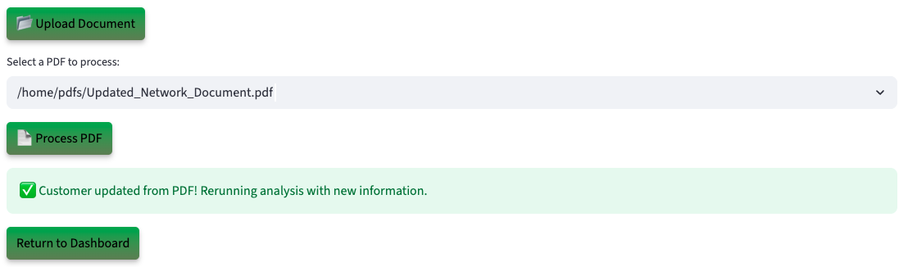

# Run the Demo

## Introduction

Act as a Network Operations Engineer using an AI powered service approval platform running on Oracle Database 23ai. Discover how Generative AI, Vector Search, Graph Analytics, and JSON Duality Views instantly analyze inverter specs, feeder capacity, and compliance rules, replacing monthlong manual studies with automated, data in place insights.

**Disclaimer**: Please note that your results may vary. The information provided is generated by OCI Generative AI services, and your outcomes may differ from those presented.

Estimated Lab Time: 30 minutes

### Objectives

In this lab, you will:

* Review how the Seer Telecommunication Service Activation app incorporates the use of JSON Duality Views, Graph analytics, and other converged database features, all without requiring complex data movement or separate systems.

### Prerequisites

This lab assumes you have:

* An Oracle account to submit your a LiveLabs Sandbox reservation.

## Task 1: Launch the application

1. To access the demo environment, click **View Login Info** in the top left corner of the page. Click the **Start the Demo** link.

    

2. Select **Telecommunications** under Industry and **Approval Officer** under Role. Enter in a username and click **Login**.

    

3. Welcome to the Seer Telecommunications application! Congratulations, you are now connected to the demo environment. You can now execute the different tasks for this Lab.

    

## Task 2: Demo – Approving a service request with a low-risk

In this first example, you will use the application to approve a Bandwidth Upgrade request. The system evaluates network capacity, latency, and policy rules, then provides an AI-generated low-risk assessment. The first customer on your to-do list is Bob Smith from DataLink.

1. On the Dashboard page, from the pending review list, select the review button for **Bob Smith**.

    

2. Opening Bob Smith’s profile reveals his service request details—name, email, request ID, service address, requested bandwidth, and current order status. You will also be able to see the AI-powered analysis on the request, including a comprehensive evaluation and the top 3 recommendations with approval probability.

    

3. At the bottom of Bob Smith’s profile, you will find the **AI Guru**—a chatbot built on Oracle Database 23ai and Vector search. When prompted, the system uses **RAG** to generate a response. It converts the question and energy data into embeddings, performs a similarity search, and then uses the **GenAI service** to turn the enriched context into a clear, natural language answer. If the customer calls with a question, you can quickly enter it into the AI Guru to generate a relevant response. 
 

    **Copy** the question below into the AI chatbot and press **Enter**. What does the AI Guru respond?

    ```text
    <copy>
    Why was this request approved?
    </copy>
    ```

    

>💡 In Oracle Database 23ai, **AI Vector Search** allows you to combine your business data with a Large Language Model (LLM) to reduce hallucinations and get accurate answers from your data.

4. Select the **Navigate To Customer Decisions** button.

    

    After navigating to the decisions page, the AI evaluation runs in the background. Telecom documents containing network details such as topology, bandwidth capacity, latency, and SLA policies are stored in Oracle Database 23ai and modeled with JSON Duality Views. These documents are vectorized and searched using AI Vector Search to identify semantically relevant prior requests and compliance criteria. The results are passed to OCI Generative AI, which uses retrieval-augmented generation (RAG) to generate a natural-language explanation, formatted for both internal review and external communication.

5. In the **Select Your Desired Option** section, the available options are displayed. If more data is needed, the reviewer can upload documents, add missing information, and trigger a re-evaluation. The system dynamically adjusts the recommendation, and generates a decision letter sent directly to the customer.

    

6. Select the AI-recommended authorization decision. In this example, that is **Approved**. 

    >Please note that your results may vary. The information provided is generated by OCI Generative AI services, and your outcomes may differ from those presented.

    

7. Set the final authorization status to **Approved**, then click **Confirm Decision** to complete the process.

    The authorization status has been updated to 'Approved' and saved to the customer's profile.

    

8.  Click the **Download Decision as PDF** button.

    

9.  Click **Download PDF**

    

10. Display the message the customer would see by opening the downloaded PDF.

    

11. Click the **Return to Dashboard** button to navigate back to the Dashboard.

    

12. Expand **View Approved Customers**. We can see that Bob Smith has been removed from the Pending Customers list and has been added to the Approved Customers list.

    

**Task Summary**

Once you select and save one of the 3 desired options recommended by the AI: 

✅ The customer's service request is updated.

✅ A finalized PDF decision document is generated.  

✅ The dashboard reflects the change in real-time — marking Bob as Approved.

Congratulations, you have just approved your first customer service request! Proceed to the next task.

## Task 3: Demo - Request more information for a customer's request
In this example, you will navigate the application to review a customer and request more information from them as part of the exercise. The next user on your to-do list is Henry Davis.

1. On the Dashboard page, from the pending review list, select the review button for **Henry Davis**.

    

2. Opening Henry Davis’s profile displays his service activation request details. Within a few seconds, the AI automatically generates a suggested action. In this case, the system evaluates the request and assigns it to “high risk”, with explanations outlining key network risk factors.

    This customer has:

    * A network node **with a capacity of 150 Gbps, current utilization of 90 Gbps**
    * A requested distributed energy resource with a **bandwidth capacity of 1 Gbps**
    * And a **missing permit document**, making the request **non-compliant**

    The AI evaluates the profile and suggests next steps. In this case, it recommends denying the request and also provides clear explanations on why the recommendation is to request more information.

    

3. Select the **Navigate to Customer Decisions** button.

    

>⁉️ **What are two reasons that the AI requested more information for this request?** ⁉️

4. Expand **Interactive Graph: Service Requests, Risk & Policy** to view the graph.

    On the decision page, the network engineer can use **Interactive Graph: Service Requests, Risk & Policy** to explore relationships in service activation scenarios. Built with **Oracle Graph**, this feature visually maps decisions and highlights key aspects of the request such as network node capacity, risk analysis, and policy compliance.

    

    This graph shows how Henry Davis’s Residential Fiber request connects to the network and is flagged with a High Risk rating and a pending policy check. Instead of hidden backend validations, the Operational Property Graph makes the reasoning visual by linking the customer, request, AI recommendation, risk level, and policy compliance in one view. Network engineers can instantly see why the system requires more information before approval, helping build confidence and transparency in the decision process.

>💡 In Oracle Database 23ai, **Property Graph** allows you to treat your data like a network of connected points, where each point (called a node) and each link (called an edge) has its own details or properties. This setup helps you run graph analytics, to find important connections or patterns, directly within the database.


5. On the decisions page you can view the AI recommendation for Henry Davis. It shows the suggested action, comprehensive evaluation, and recommendations explanations. 

    

6. The authorization status is set to **Request Info**. Click the **Confirm Decision** button.

    The authorization status has been updated to 'Deny' and saved to the customer profile.

    

7. Press the **Download Decision PDF** button to save the AI responses and proceed to the final authorization disposition.

    

8. Click the **Download PDF** button.

    

9. Display the message the customer would see by opening the downloaded PDF.

    

10. Click **Return to Dashboard** button. Expand **View In Progress Customers**. You will see that Henry Davis has been moved from the **Pending Customers** list to the **In Progress** list.

    

**Task Summary**

Congratulations, you have finished reviewing a customer that requires study! Proceed to the next task.

## Task 4: Demo - Update customer details

Lastly, let’s explore how the system uses JSON Duality Views to handle profile updates. In this task, you will edit a customer’s service profile. In this example, the customer was asked to submit updated network configuration documents.

1. On the Dashboard page, from the **In Progress Customers** list, select the review button for **David White**.

    

2. We will upload a document to update 's customers's document. On the Customer Details page, click the **Upload Document** button. The PDF file has been loaded. Then click the **Process PDF** button

    

>💡 **JSON Duality Views** in 23ai let's you update unstructured data in an easy, high-level format while automatically handling the technical details behind the scenes. This makes it faster and simpler to work with messy data and connect it to structured systems.

4. The customer profile has been updated.

    

**Task Summary**

Once the document is uploaded:

✅ The system automatically detects the new compliance data.

✅ The profile will be updated with service documentation.

✅ Thanks to JSON Transform and JSON Duality Views, only the relevant field is modified — leaving the rest of the profile UNTOUCHED.

## Conclusion

In conclusion our Request Approval App was able to leverage Oracle database 23ai technologies such as **AI Vector Search, Property Graph and JSON Duality Views** to:

✅ Automate profile evaluations

✅ Provide AI-driven recommendations by using a RAG model powered by a Oracle Database 23ai's AI Vector Search and OCI Generative AI service

✅ Enable seamless profile updates with JSON Duality Views

✅ Harness Operational Property Graphs to empower engineers with insights that accelerate service approvals.

By combining these advanced tools, the application enables faster, smarter decisions and delivers clear guidance on how customers can improve their eligibility.

**Next:** How about learning how the application was implemented in Python? Continue with the next labs and start developing!

## Learn More

* [Oracle Database 23ai Documentation](https://docs.oracle.com/en/database/oracle/oracle-database/23/)

## Acknowledgements
* **Authors** - Ley Sylvester
* **Contributors** - Kevin Lazarz, Francis Regalado, Hanna Rakhsha, Uma Kumar