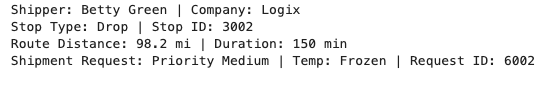

# Step by step: Implement RAG with Oracle AI Database 

## Introduction

You’ll build an Esports Tournament Approval Tool powered by Oracle AI Database and OCI Generative AI. The app connects to player profiles and team rosters, evaluates tournament eligibility and rule compliance, and uses a large language model to draft approval recommendations with clear explanations. Leveraging Python skills from earlier labs, you’ll deploy a fully integrated AI solution that accelerates and strengthens tournament approval decisions.

This lab uses some of the basic coding samples you created in lab 3, such as `cursor.execute` and more.

Estimated Time: 30 minutes

### Objectives

* Build the complete tournament approval application as seen in lab 1
* Use OCI Generative AI to generate personalized product recommendations
* Use Python to connect to an Oracle AI Database instance and run queries
* Explore supplier data and extract relevant information

### Prerequisites

This lab assumes you have:

* An Oracle Cloud account
* Completed lab 1: Run the demo
* Completed lab 2: Connect to the Development Environment

## Task 1: Build the application in Jupyter Notebook
>💡**Note**: Review Lab 2: Connect to the Development Environment for instructions on accessing JupyterLab.

1. You should see a terminal pop up once you are logged in. (You can always create a new one by clicking on the blue + and select terminal)

    


2. Navigate to the `~/dbinit` directory by running the following command.

    ```bash
    <copy>
    cd ~/dbinit
    </copy>
    ```

    

3. Copy and run the following command to create tables in the database. There will be a lot of output. You should see the following output once complete.

    ```bash
    <copy>
    ./shell_script.sh
    </copy>
    ```

    

    

## Task 2: Connect to Database

2. Click the **+** sign on the top left to open the Launcher.

    

3. Open a new notebook.

    

1. Copy the following code block into an empty cell in your notebook. This code block imports the `oracledb` Python driver and other libraries.

    ```python
    <copy>
    import os
    import json
    import oracledb
    import pandas as pd
    import oci
    import numpy as np
    import re
    from dotenv import load_dotenv
    from PyPDF2 import PdfReader

    load_dotenv()

    username = os.getenv("USERNAME")
    password = os.getenv("DBPASSWORD")
    dsn = os.getenv("DBCONNECTION")

    try:
        connection = oracledb.connect(user=username, password=password, dsn=dsn)
        print("Connection successful!")
    except Exception as e:
        print(f"Connection failed: {e}")

    cursor = connection.cursor()
    </copy>
    ```

2. Run the code block to connect to the database. 

    

## Task 3: Pull shipper data from the database

You will query shipper data from the `transportation_dv` JSON duality view, which combines data from shipper and related tables. This task will:

- **Define a Function**: Create a reusable function a to query the database by shipper ID, extracting the JSON data for a specific shipper.

- **Use an Example**: Fetch data for shipper `2002` (Betty Green) to demonstrate the process.

- **Display the Results**: Format the retrieved data into a pandas DataFrame for a clear tabular view, highlighting key details such as shipper name, company, request ID, priority, temperature requirement, stop type, and risk level.

1. Copy and paste the code below into the new notebook:

    ```python
    <copy>
    # Task 3: Fetch shipper's JSON from transportation_dv + shared helpers

    # Pull single shipper JSON documents from DV
    def fetch_shipper(shipper_id: int):
        cursor.execute(
            "SELECT data FROM transportation_dv WHERE JSON_VALUE(data,'$._id') = :sid",
            {'sid': str(shipper_id)}
        )
        row = cursor.fetchone()
        if not row:
            return None
        return json.loads(row[0]) if isinstance(row[0], str) else row[0]

    # Load route candidates into a DataFrame
    def load_route_candidates():
        cursor.execute("SELECT route_id, stop_id, distance_mi, duration_min, feasibility_score, risk_level FROM TRN_ROUTE_CANDIDATES")
        rows = cursor.fetchall()
        cols = ["ROUTE_ID","STOP_ID","DISTANCE_MI","DURATION_MIN","FEASIBILITY_SCORE","RISK_LEVEL"]
        return pd.DataFrame(rows, columns=cols) if rows else pd.DataFrame(columns=cols)

    # Pull first stop/route/request bundle
    def extract_first_shipment_bundle(s_json):
        s = s_json or {}
        stops = s.get("stops") or []
        stop0 = stops[0] if stops else {}
        routes = stop0.get("routes") or []
        route0 = routes[0] if routes else {}
        requests = route0.get("shipmentRequests") or []
        req0 = requests[0] if requests else {}
        rec0 = req0.get("recommendation", {}) or {}
        return stop0, route0, req0, rec0

    # --- Let's select a shipper ---
    selected_shipper_id = 2002
    shipper_json = fetch_shipper(selected_shipper_id)
    df_routes    = load_route_candidates()

    # Print summary of current case
    if shipper_json:
        stop0, route0, req0, _ = extract_first_shipment_bundle(shipper_json)
        print(f"Shipper: {shipper_json.get('firstName')} {shipper_json.get('lastName')} | Company: {shipper_json.get('company')}")
        print(f"Stop Type: {stop0.get('stopType')} | Stop ID: {stop0.get('stopId')}")
        print(f"Route Distance: {route0.get('distanceMi')} mi | Duration: {route0.get('durationMin')} min")
        print(f"Shipment Request: Priority {req0.get('priority')} | Temp: {req0.get('tempRequirement')} | Request ID: {req0.get('requestId')}")
    else:
        print("No shipper found.")

    </copy>
    ```

2. Click the "Run" button to execute the code.

    

3. The output will display a DataFrame containing the shipper's details for the selected shipper ID.

    

## Task 4: Generate Recommendations for the Player

In a new cell, build a prompt using the shipper’s shipment request, route details, and compliance context. Retrieve feasibility and risk data, then generate a decision from the recommendation: **Approve, Deny, Request Info**. Update the transportation tables accordingly and display the results.

With shipper profiles in place, you will generate personalized shipment routing recommendations.

Here’s what we’ll do:

1. Copy and paste the code in a new cell:

    ```python
    <copy>

    # Task 4: Simple shipment recommendation using helpers from Task 3

    # Map Numeric Score
    def _risk_bucket(n):
        try:
            n = int(n)
        except:
            return "Medium"
        if n <= 3: return "High"
        if n <= 6: return "Medium"
        if n <= 8: return "Low"
        return "Very Low"

    # Reuse outputs from Task 3
    stop0, route0, ship_req, rec_block = extract_first_shipment_bundle(shipper_json or {})

    # IDs we will persist back into db
    request_id   = (ship_req or {}).get("requestId")
    recommend_id = (rec_block or {}).get("recId")

    # Build content blocks for our LLM
    # Route candidates list to help the model
    routes_block = "\n".join([
        f"- Route {r.ROUTE_ID}: {r.DISTANCE_MI} mi, {r.DURATION_MIN} min, Risk={r.RISK_LEVEL}, Feas={r.FEASIBILITY_SCORE}"
        for _, r in df_routes.iterrows()
    ]) or "None"

    # Shipper demographics
    shipper_block = "\n".join([
        f"- {k}: {v}"
        for k, v in (shipper_json or {}).items() if k not in ["stops","_metadata"]
    ]) or "None"

    # Stop details
    stop_block = "\n".join([f"- {k}: {v}" for k, v in (stop0 or {}).items() if k != "routes"]) or "None"

    # Route details
    route_block = "\n".join([f"- {k}: {v}" for k, v in (route0 or {}).items() if k != "shipmentRequests"]) or "None"

    # Shipment request basics
    req_block = "\n".join([f"- {k}: {v}" for k, v in (ship_req or {}).items() if k != "recommendation"]) or "None"

    prompt = f"""
    You are a Transportation Logistics assistant. Use ONLY this context.
    Decide APPROVE / DENY / REQUEST INFO. Prefer APPROVE or DENY; use REQUEST INFO only if neither can be justified.

    Routes:
    {routes_block}

    Shipper:
    {shipper_block}

    Stop:
    {stop_block}

    Route:
    {route_block}

    Shipment Request:
    {req_block}

    Decision rules:
    - APPROVE if: feasible route exists AND shipper docs align AND risk ≥ 7.
    - DENY if: infeasible route OR risk ≤ 3 OR clear violation (e.g., HOS exceeded).
    - REQUEST INFO only if key evidence is missing/ambiguous.
    - If no feasible route plausibly matches, prefer DENY over REQUEST INFO.

    Return EXACTLY this layout (no extra text):
    SuggestedAction: APPROVE|DENY|REQUEST INFO
    Risk: N (Very Low|Low|Medium|High)
    Rationale:
    - one reason
    - second reason
    - third reason
    NextSteps:
    - step 1 (empty if Approved)
    - step 2
    - step 3
    """

    print("Generating AI recommendations …")
    try:
        # OCI GenAi clients config
        genai_client = oci.generative_ai_inference.GenerativeAiInferenceClient(
            config=oci.config.from_file(os.path.expanduser(os.getenv("OCI_CONFIG_PATH","~/.oci/config")), "DEFAULT"),
            service_endpoint=os.getenv("ENDPOINT")
        )
        chat_detail = oci.generative_ai_inference.models.ChatDetails(
            compartment_id=os.getenv("COMPARTMENT_OCID"),
            chat_request=oci.generative_ai_inference.models.GenericChatRequest(
                messages=[oci.generative_ai_inference.models.UserMessage(
                    content=[oci.generative_ai_inference.models.TextContent(text=prompt)]
                )],
                temperature=0.0, top_p=1.0
            ),
            serving_mode=oci.generative_ai_inference.models.OnDemandServingMode(
                model_id="meta.llama-3.2-90b-vision-instruct" # Same model
            )
        )
        chat_resp = genai_client.chat(chat_detail)
        recommendation_text = chat_resp.data.chat_response.choices[0].message.content[0].text
    except Exception as e:
        print(f"OCI GenAI error: {e}")

    print("\n--- AI Recommendation ---\n", recommendation_text[:1000])

    # Parse the simple block
    act = re.search(r"SuggestedAction:\s*(APPROVE|DENY|REQUEST INFO)\b", recommendation_text, re.I)
    risk_num = re.search(r"Risk:\s*([0-9]+)", recommendation_text, re.I)
    risk_lbl = re.search(r"Risk:\s*[0-9N]+\s*\((Very Low|Low|Medium|High)\)", recommendation_text, re.I)

    action_norm = (act.group(1).upper() if act else "REQUEST INFO")
    risk_n = risk_num.group(1) if risk_num else ("7" if action_norm == "APPROVE" else "5")
    risk_l = (risk_lbl.group(1).title() if risk_lbl else _risk_bucket(risk_n))

    # Map to dashboard vocab
    table_status = "Approved" if action_norm == "APPROVE" else ("Denied" if action_norm == "DENY" else "In Progress")

    # update new values into the DB
    try:
        # Insert / Update TRN_RECOMMENDATION
        cursor.execute("""
            MERGE INTO TRN_RECOMMENDATION t
            USING (SELECT :rid AS RECOMMEND_ID FROM dual) s
            ON (t.RECOMMEND_ID = s.RECOMMEND_ID)
            WHEN MATCHED THEN UPDATE SET
                t.ROUTE_ID       = :route_id,
                t.RECOMMENDATION = :rec,
                t.EXPLANATION    = :exp,
                t.RISK_LEVEL     = :risk,
                t.GENERATED_DATE = SYSDATE
            WHEN NOT MATCHED THEN INSERT
                (RECOMMEND_ID, ROUTE_ID, RECOMMENDATION, EXPLANATION, RISK_LEVEL, GENERATED_DATE)
                VALUES (:rid, :route_id, :rec, :exp, :risk, SYSDATE)
        """, {
            'rid': recommend_id or 90001, # stable ID
            'route_id': (route0 or {}).get("routeId"),
            'rec': table_status,
            'exp': recommendation_text,
            'risk': risk_l
        })

        # Link the request to this recommendation and set REQUEST_STATUS for dashboards
        cursor.execute("""
            UPDATE TRN_REQUESTS
            SET RECOMMEND_ID = :rid,
                REQUEST_STATUS = :final_dec
            WHERE REQUEST_ID = :req_id
        """, {'rid': recommend_id or 90001, 'final_dec': table_status, 'req_id': request_id})

        connection.commit()

        print(f"Stored recommendation -> {table_status} (risk={risk_l}); linked to TRN_REQUESTS {request_id}.")
    except Exception as e:
        connection.rollback()
        print("Failed to store recommendation:", e)
     </copy>
    ```

2. Click the "Run" button to execute the code. Note that this will take time to run.

    

3. Review the output. In the demo, this is where you selected the “Navigate to Decisions” button as the Logistics Dispatcher. You just used AI to generate shipment recommendations that would have taken hours to complete manually—congratulations!

    

>Note: Your result may be different. This is because of generative AI and the model's ability to generate new content based on your input. The output may contain different recommendations or suggestions.

## Task 5: Chunk & Store Recommendations

To handle follow-up questions, you will enhance the system with an AI Guru powered by Oracle’s Vector Search and Retrieval-Augmented Generation (RAG). The AI Guru will be able to answer questions about the grid interconnection application and provide recommendations based on the data.

Before answering questions, we need to prepare the data by vectoring the claims recommendations. This step:

   - Stores Recommendations: Inserts the full recommendation text (from previous cell) as a single chunk if not already present.
   - We delete prior chunks for this authorization.
   - We use `VECTOR_CHUNKS` to split the recommendation text.
   - The chunks will be inserted into `TRN_CHUNK`
   - We display a data frame summary to show the chunks.


1. Copy the following code and run:

    ```python
        <copy>
        # Task 5: Chunk & store AI recommendation, then SHOW the chunks

        req_id = request_id   # from Task 4
        text_to_chunk = (recommendation_text or "").strip()
        if not text_to_chunk:
            text_to_chunk = f"SuggestedAction: {table_status}\nRationale: (empty model output)."

        # 0) Find a DOC_ID for this request (attach chunks to it)
        cursor.execute("""
            SELECT DOC_ID 
            FROM TRN_DOCUMENTS 
            WHERE REQUEST_ID = :rid
        ORDER BY UPLOADED_AT DESC FETCH FIRST 1 ROWS ONLY
        """, {'rid': req_id})
        doc_row = cursor.fetchone()
        doc_id = doc_row[0] if doc_row else None

        # 1) Clear old chunks
        if doc_id:
            cursor.execute("DELETE FROM TRN_CHUNKS WHERE DOC_ID = :docid", {'docid': doc_id})
            connection.commit()

        # 2) Chunk via VECTOR_CHUNKS
        chunk_size = 25
        overlap    = 0

        insert_chunks_sql = f"""
            INSERT INTO TRN_CHUNKS (DOC_ID, SOURCE_TYPE, CHUNK_ID, CHUNK_TEXT)
            SELECT :docid, 'AI_REC', c.chunk_offset, c.chunk_text
            FROM (SELECT :txt AS c FROM dual) s,
                VECTOR_CHUNKS(
                    dbms_vector_chain.utl_to_text(s.c)
                    BY words
                    MAX {int(chunk_size)}
                    OVERLAP {int(overlap)}
                    SPLIT BY sentence
                    LANGUAGE american
                    NORMALIZE all
                ) c
        """

        inserted = 0
        try:
            if doc_id:
                cursor.execute(insert_chunks_sql, {'docid': doc_id, 'txt': text_to_chunk})
                inserted = cursor.rowcount or 0
                connection.commit()
            else:
                print(f"No document found for REQUEST_ID={req_id}, skipping chunk insert.")
        except oracledb.DatabaseError as e:
            print(f"VECTOR_CHUNKS error, {e}")
            inserted = 0

        print(f"Stored {inserted} chunk(s) for REQUEST_ID={req_id}.")

        # 3) Fetch & SHOW the chunks
        cursor.execute("""
            SELECT c.CHUNK_ID, c.CHUNK_TEXT
            FROM TRN_CHUNKS c
            JOIN TRN_DOCUMENTS d ON c.DOC_ID = d.DOC_ID
            WHERE d.REQUEST_ID = :rid
        ORDER BY c.CHUNK_ID
        """, {'rid': req_id})
        rows = cursor.fetchall()

        # Build summary DataFrame
        def _lob_to_str(v):
            return v.read() if isinstance(v, oracledb.LOB) else v

        items = []
        for cid, ctext in rows:
            txt = _lob_to_str(ctext) or ""
            items.append({
                "CHUNK_ID": cid,
                "Chars": len(txt),
                "Words": len(txt.split()),
                "Preview": (txt[:160] + "…") if len(txt) > 160 else txt
            })

        df_chunks = pd.DataFrame(items).sort_values("CHUNK_ID")

        # Display in notebook
        display(df_chunks)

        print(f"\nStored {inserted} chunk(s) for REQUEST_ID={req_id}.")

        </copy>
    ```

2. Click the "Run" button to execute the code.

    

3. Review the output.

    

## Task 6: Create Embeddings

Now we must generate and store vector embeddings. This allows us to use Vector Search and RAG to enhance AI Guru's answers. 

In this step:

   - **Generates Embeddings**: This is a new feature in Oracle AI Database that allows you to create embeddings directly within the database, eliminating the need for external tools or APIs. The `dbms_vector_chain.utl_to_embedding` function takes the recommendation text as input and returns an embedding vector.

   - **Stores Embeddings**: We update `TRN_CHUNK.CHUNK_VECTOR` by embedding each `CHUNK_TEXT` using `dbms_vector_chain.utl_to_embedding` with `DEMO_MODEL`. A short verification output is printed.

1. Copy the following code into a new cell block:

    ```python
        <copy>

        # Task 6: Create embeddings for TRN_CHUNKS rows
        req_id = request_id  # from Task 4/5
        vp = json.dumps({"provider": "database", "model": "DEMO_MODEL", "dimensions": 384})

        # 1) Embed all chunks for this shipment request (via DOC_IDs)
        try:
            cursor.execute(
                """
                UPDATE TRN_CHUNKS c
                SET c.CHUNK_VECTOR = dbms_vector_chain.utl_to_embedding(c.CHUNK_TEXT, JSON(:vp))
                WHERE c.DOC_ID IN (
                    SELECT d.DOC_ID
                        FROM TRN_DOCUMENTS d
                        WHERE d.REQUEST_ID = :rid
                )
                """,
                {"vp": vp, "rid": req_id}
            )
            updated = cursor.rowcount or 0
            connection.commit()
            print(f"Embedded vectors for {updated} chunk(s) (REQUEST_ID={req_id}).")
        except oracledb.DatabaseError as e:
            connection.rollback()
            print("Embedding failed. Make sure DEMO_MODEL is loaded in Task 2.")
            raise

        # 2) Sanity check: how many rows have vectors now?
        cursor.execute("""
            SELECT COUNT(*) 
            FROM TRN_CHUNKS c
            JOIN TRN_DOCUMENTS d ON c.DOC_ID = d.DOC_ID
            WHERE d.REQUEST_ID = :rid
            AND c.CHUNK_VECTOR IS NOT NULL
        """, {"rid": req_id})
        have_vec = cursor.fetchone()[0]

        cursor.execute("""
            SELECT COUNT(*) 
            FROM TRN_CHUNKS c
            JOIN TRN_DOCUMENTS d ON c.DOC_ID = d.DOC_ID
            WHERE d.REQUEST_ID = :rid
        """, {"rid": req_id})
        total_rows = cursor.fetchone()[0]

        print(f"Vectors present: {have_vec}/{total_rows}")

        </copy>
    ```

2. Click the "Run" button to execute the code.

    

3. Review the output.

    

## Task 7: Implement RAG with Oracle AI Database's Vector Search

Now that the recommendations are vectorized, we can process a user’s question:

 ```Why was this shipment approved?``` 

   - **Vectorizes the question**: Embeds the question using `DEMO_MODEL` via `dbms_vector_chain.utl_to_embedding`.
   - **Performs AI Vector Search**: Finds the most relevant using similarity search over the stored chunks.
   - **Use RAG**: Combines the shipper's profile and relevant chunk information into a prompt for OCI Generative AI, producing a concise answer. Here you implement the RAG process.
   - **Prints**: An answer is returned with citations from the LLM

1. Copy the code and run:

    ```python
        <copy>
        # 🔹 Task 7: RAG — retrieve most relevant chunk(s) and answer a question (Gaming)
        # 🔹 Helper: extract first shipment bundle (stops → routes → requests → rec/dec)
        def extract_first_shipment_bundle(shipper_json):
            p = shipper_json or {}
            stops = p.get("stops") or []
            stop0 = stops[0] if stops else {}

            routes = stop0.get("routes") or []
            route0 = routes[0] if routes else {}

            requests = route0.get("shipmentRequests") or []
            req0 = requests[0] if requests else {}

            rec0 = req0.get("recommendation", {}) or {}
            dec0 = req0.get("decision", {}) or {}

            return stop0, route0, req0, rec0, dec0


        # Task 7: RAG — retrieve most relevant chunk(s) and answer a question

        # 🔹 Prep: Extract a consistent bundle from shipper_json (from Task 4)
        stop0, route0, shipment_req, rec_block, dec_block = extract_first_shipment_bundle(shipper_json)

        # 0) Question (edit as needed)
        question = "Why was this shipment approved?"
        print("Running vector search…")

        # 1) Embed the question with the same model used in Task 6
        vp = json.dumps({"provider": "database", "model": "DEMO_MODEL", "dimensions": 384})
        cursor.execute(
            "SELECT dbms_vector_chain.utl_to_embedding(:q, JSON(:vp)) FROM dual",
            {"q": question, "vp": vp}
        )
        qvec = cursor.fetchone()[0]

        # 2) Retrieve chunks from TRN_CHUNKS for this shipment request
        cursor.execute(f"""
            SELECT c.CHUNK_ID,
                c.CHUNK_TEXT,
                VECTOR_DISTANCE(c.CHUNK_VECTOR, :qv, COSINE) AS dist
            FROM TRN_CHUNKS c
            JOIN TRN_DOCUMENTS d ON c.DOC_ID = d.DOC_ID
            WHERE d.REQUEST_ID = :rid
            AND c.CHUNK_VECTOR IS NOT NULL
        ORDER BY dist
            FETCH FIRST 1 ROWS ONLY
        """, {"rid": shipment_req.get("requestId"), "qv": qvec})
        rows = cursor.fetchall()

        def _lob_to_str(v): 
            return v.read() if isinstance(v, oracledb.LOB) else v

        retrieved = []
        for cid, ctext, dist in rows:
            txt = _lob_to_str(ctext) or ""
            retrieved.append((cid, txt, float(dist)))


        # 3) Build a compact RAG prompt
        def _normalize_ws(s: str) -> str:
            return re.sub(r"\s+", " ", s or "").strip()

        context_lines = [f"[Chunk {cid}] {_normalize_ws(txt)}" for cid, txt, _ in retrieved]
        context_block = "\n\n".join(context_lines)

        shipper_name  = f"{shipper_json.get('firstName','')} {shipper_json.get('lastName','')}".strip()
        company_name  = shipper_json.get("company", "")
        priority      = shipment_req.get("priority", "")
        temp_req      = shipment_req.get("tempRequirement", "")
        stop_type     = stop0.get("stopType", "")

        prompt = f"""<s>[INST] <<SYS>>You are a Transportation Logistics AI. Be precise, cite the chunk ids inline like [Chunk 2] when referring to specific facts.
        Do not mention sources outside of the provided context. Respond in under 400 words.
        ALWAYS respond as if you have the knowledge yourself.
        Do NOT provide warnings, disclaimers, or exceed the specified response length.
        <</SYS>> [/INST]

        Shipper: {shipper_name} ({company_name})
        Shipment: Priority={priority}, TempRequirement={temp_req}, StopType={stop_type}

        Question: {question}

        Context:
        {context_block}

        Return this format (plain text, no extra lines):
        Decision: APPROVED|DENIED|REQUEST INFO
        Why:
        - reason 1 (cite [Chunk N])
        - reason 2 (cite [Chunk N])
        - reason 3 (cite [Chunk N])
        Next:
        - actionable step 1
        - actionable step 2
        - actionable step 3
        """.strip()

        # 4) Generate the final answer with OCI GenAI 
        print("\nGenerating final RAG answer…")
        try:
            genai_client = oci.generative_ai_inference.GenerativeAiInferenceClient(
                config=oci.config.from_file(os.path.expanduser(os.getenv("OCI_CONFIG_PATH","~/.oci/config")), "DEFAULT"),
                service_endpoint=os.getenv("ENDPOINT")
            )
            chat_detail = oci.generative_ai_inference.models.ChatDetails(
                compartment_id=os.getenv("COMPARTMENT_OCID"),
                chat_request=oci.generative_ai_inference.models.GenericChatRequest(
                    messages=[oci.generative_ai_inference.models.UserMessage(
                        content=[oci.generative_ai_inference.models.TextContent(text=prompt)]
                    )],
                    temperature=0.0, 
                    top_p=1.0
                ),
                serving_mode=oci.generative_ai_inference.models.OnDemandServingMode(
                    model_id="meta.llama-3.2-90b-vision-instruct"
                )
            )
            chat_resp = genai_client.chat(chat_detail)
            rag_answer = chat_resp.data.chat_response.choices[0].message.content[0].text
        except Exception as e:
            print("Something is off...", e)   
            rag_answer = "[No AI answer generated]"

        print("\n🤖 RAG Answer:\n", rag_answer)

        </copy>
    ```

2. Click the "Run" button to execute the code.

    

3. Review the result.

    >*Note:* Your result may be different due to non-deterministic character of generative AI.

    

## Conclusion
Congratulations! You implemented a RAG process in Oracle AI Database using Python.

to summarize:

* Connected with oracledb
* Retrieved a shipper's profile via a JSON duality view
* Generated a grid interconnection recommendation using OCI GenAI
* Chunked and embedded both recommendations and document text
* Performed vector search and produced a RAG answer grounded in retrieved chunks (with chunk IDs printed for traceability)

Congratulations, you completed the lab!

You may now proceed to the next lab.

## Learn More

* [Code with Python](https://www.oracle.com/developer/python-developers/)
* [Oracle AI Database Documentation](https://docs.oracle.com/en/database/oracle/oracle-database/23/)

## Acknowledgements
* **Authors** - Ley Sylvester
* **Contributors** - Kevin Lazarz, Hanna Rakhsha, Francis Regalado, Uma Kumar