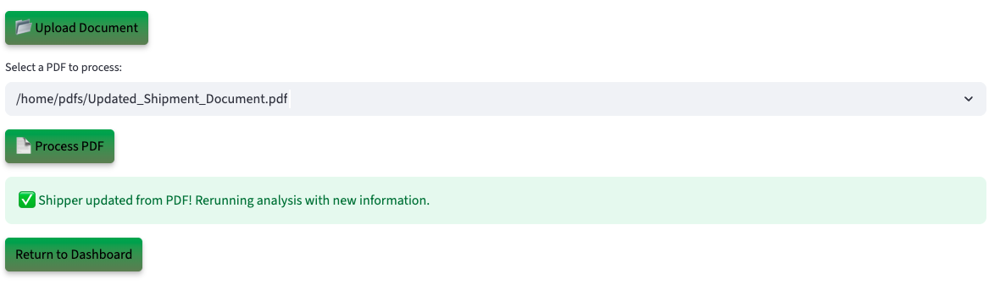

# Run the Demo

## Introduction

Step into the role of a Logistics Dispatcher using an AI-driven dashboard built on Oracle AI Database. See how Generative AI, Vector Search, Graph Analytics, and JSON Duality Views automate weight checks, route feasibility, and driver-hour compliance, all in one data store without ETL.

**Disclaimer**: Please note that your results may vary. The information provided is generated by OCI Generative AI services, and your outcomes may differ from those presented.

Estimated Lab Time: 30 minutes

### Objectives

In this lab, you will:

* Review how the Seer Transportation Load Approval app incorporates the use of JSON Duality Views, Graph analytics, and other converged database features, all without requiring complex data movement or separate systems.

### Prerequisites

This lab assumes you have:

* An Oracle account to submit your a LiveLabs Sandbox reservation.

## Task 1: Launch the application

1. To access the demo environment, click **View Login Info** in the top left corner of the page. Click the **Start the Demo** link.

    

2. Select **Transportation** under Industry and **Logistics Dispatcher** under Role. Enter in a username and click **Login**.

    

3. Welcome to the Seer Transportation Load Approval application! Congratulations, you are now connected to the demo environment. You can now execute the different tasks for this Lab.

    

## Task 2: Demo - Approving a Shipper with a low risk Route Feasibility Rating score

In this first example, you will use the application to approve a shipper with a low risk route feasibility score. The first user on your to-do list is Diana Young from FreightMax.

1. On the Dashboard page, from the pending review list, select the review button for **Diana Young**.

    

2. Opening Diana Young’s profile reveals her transportation load approval request details—name, email, shipper ID, request ID, and transportation status. You will also be able to see detailed AI analysis on the shipper consisting of a comprehensive evaluation, and top 3 requests with approval probability. 

    

3. At the bottom of Diana Young’s profile, you will find the **AI Guru**—a chatbot built on Oracle AI Database and Vector search. When prompted, the system uses **RAG** to generate a response. It converts the question and energy data into embeddings, performs a similarity search, and then uses the **GenAI service** to turn the enriched context into a clear, natural language answer. If the shipper calls with a question, you can quickly enter it into the AI Guru to generate a relevant response. 
 

    **Copy** the question below into the AI chatbot and press **Enter**. What does the AI Guru respond?

    ```text
    <copy>
    Why was this request approved?
    </copy>
    ```

    

>💡 In Oracle AI Database, **AI Vector Search** allows you to combine your business data with a Large Language Model (LLM) to reduce hallucinations and get accurate answers from your data.

4. Select the **Navigate To Shipper Decisions** button.

    

    After navigating to the decisions page, the AI evaluation runs in the background. Transportation documents containing feeder information such as trailer capacity, driving hours, and route restrictions are stored in Oracle AI Database and modeled with JSON Duality Views. These documents are vectorized and searched using AI Vector Search to identify semantically relevant prior requests and compliance criteria. The results are passed to OCI Generative AI, which uses retrieval-augmented generation (RAG) to generate a natural-language explanation, formatted for both internal review and external communication. 

5. In the **Select Your Desired Option** section, the available options are displayed. If more data is needed, the reviewer can upload documents, add missing information, and trigger a re-evaluation. The system dynamically adjusts the recommendation, and generates a decision letter sent directly to the shipper.

    

6. Select the AI-recommended authorization decision. In this example, that is **Approved**. 

    >Please note that your results may vary. The information provided is generated by OCI Generative AI services, and your outcomes may differ from those presented.

    

7. Set the final authorization status to **Approved**, then click **Confirm Decision** to complete the process.

    The authorization status has been updated to 'Approved' and saved to the shipper profile.

    

8.  Click the **Download Decision as PDF** button.

    

9.  Click **Download PDF**

    

10. Display the message the shipper would see by opening the downloaded PDF.

    

11. Click the **Return to Dashboard** button to navigate back to the Dashboard. Expand **View Approved Shippers**. We can see that Diana Young has been removed from the Pending Shippers list and has been added to the Approved Shippers list.

    

**Task Summary**

Once you select and save one of the 3 desired options recommended by the AI: 

✅ The shipper's load approval request is updated.

✅ A finalized PDF decision document is generated.  

✅ The dashboard reflects the change in real-time — marking Diana as Approved.

Congratulations, you have just approved your first shipper load! Proceed to the next task.

## Task 3: Demo - Deny a shipper request
In this example, you will navigate the application to review a customer and deny them as part of the exercise. The next user on your to-do list is George Baker.

1. On the Dashboard page, from the pending review list, select the review button for **George Baker**.

    

2. Opening George Baker’s profile displays his shipper history details. Within a few seconds, the AI automatically generates a suggested action. In this case, the system evaluates the profile and assigns it to “high risk” with explanations outlining key risk factors.

    This shipper has: 

    * A route with a **road closure**
    * A route with **a trip duration that exceeds their hours of service**
    * A route with  **significant traffic delays**

    The AI evaluates the profile and suggests next steps. In this case, it recommends denying the request and also provides clear explanations on why the recommendation is to deny the request.

    

3. Select the **Navigate to Shipper Decisions** button.

    

>⁉️ **What are two reasons that the AI denied this request?** 

4. Expand **Interactive Graph: Shipment Requests & Routing** to view the graph.

    

    On the decision page, the load approval coordinator can use **Interactive Graph: Shipment Request & Routing** to explore route paths in load approval scenarios. Built with **Oracle Graph**, this feature visually maps decisions and highlights important features of the request like the route analysis and compliance rules.

    

>💡 In Oracle AI Database, **Property Graph** allows you to treat your data like a network of connected points, where each point (called a node) and each link (called an edge) has its own details or properties. This setup helps you run graph analytics, to find important connections or patterns, directly within the database.


5. On the decisions page you can view the AI recommendation for George Baker. It shows the suggested action, comprehensive evaluation, and recommendations explanations. 

    

6. The authorization status is set to **Request Info**. Click the dropdown and select **Denied**, then select **Confirm Decision** button.

    The authorization status has been updated to 'Denied' and saved to the shipper profile.

    

7. Press the **Download Decision PDF** button to save the AI responses and proceed to the final authorization disposition.

    

8. Click the **Download PDF** button.

    

9. Display the message the shipper would see by opening the downloaded PDF.

    

10. Click the **Return to Dashboard** button to navigate back to the Dashboard. Expand **View Denied Shipper**. You will see that George Baker has been moved from the **Pending Shpippers** list to the **Denied Shippers** list.

    

**Task Summary**

Congratulations, you have finished reviewing a shipper that requires study! Proceed to the next task.

## Task 4: Demo - Update shipper details

Lastly, let’s explore how the system uses JSON Duality Views to handle profile updates. In this task, you will edit a shipper's details. In this example, the shipper was asked to submit documentation on the shipment.

1. On the Dashboard page, from the **Pending Shippers** list, select the review button for **Evan Scott**.

    

2. We will upload a document to update the shipment information. On the Shipper Details page, click the **Upload Document** button. The PDF file has been loaded. Then click the **Process PDF** button

    

>💡 **JSON Duality Views** let's you update unstructured data in an easy, high-level format while automatically handling the technical details behind the scenes. This makes it faster and simpler to work with messy data and connect it to structured systems.

4. The shipper profile has been updated.

    

**Task Summary**

Once the document is uploaded:

✅ The system automatically detects the new compliance data.

✅ The profile will be updated with compliance documentation.

✅ Thanks to JSON Transform and JSON Duality Views, only the relevant field is modified — leaving the rest of the profile UNTOUCHED.

## Conclusion

In conclusion our Transportation Load Approval App was able to leverage Oracle AI Database technologies such as **AI Vector Search, Property Graph and JSON Duality Views** to:

✅ Automate profile evaluations

✅ Provide AI-driven transportation recommendations by using a RAG model powered by a Oracle AI Database's AI Vector Search and OCI Generative AI service

✅ Enable seamless profile updates with JSON Duality Views

✅ And empower transportation load approval coordinators with actionable insights through Operational Property Graphs 

By combining these advanced tools, the application enables faster, smarter decisions and delivers clear guidance on how shippers can improve their eligibility.

**Next:** How about learning how the application was implemented in Python? Continue with the next labs and start developing!

## Learn More

* [Oracle AI Database Documentation](https://docs.oracle.com/en/database/oracle/oracle-database/23/)

## Acknowledgements
* **Authors** - Ley Sylvester
* **Contributors** - Kevin Lazarz, Francis Regalado, Hanna Rakhsha, Noah Paul, Zileyah Onafowora
* **Last Updated By/Date** - Uma Kumar, October 2025