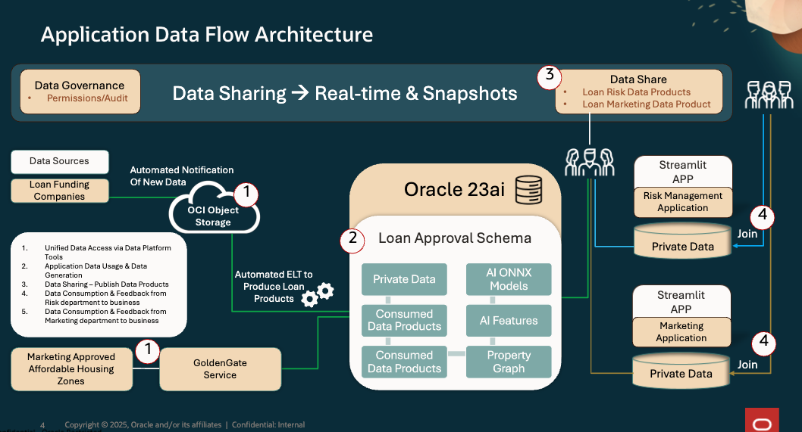

# 🏛️ Understanding the Architecture of the Workshop

#### Estimated Lab Time: 15 minutes

## Introduction

In this lab, you’ll dive deep into the **architecture** that underpins the entire workshop. You'll explore both the **physical** and **logical architectures** that enable seamless data management and collaboration across various teams.

- **Physical architecture**: Understand the infrastructure that supports data flow, storage, and access across the platform.
- **Logical architecture**: Learn how data is structured, processed, and transformed within the system to enable smart, data-driven decisions.

By the end of this lab, you'll have a clear understanding of how all components of the system come together to support the tasks you’ll perform throughout the workshop.

## **Physical Architecture**

The **SeerEquities loan application** is deployed in an **Oracle Cloud Infrastructure (OCI) Region**, with its **application layer** residing in a **Public Subnet** within a **Virtual Cloud Network (VCN)**.

### Architecture Breakdown

- The **Application Tier VCN** includes:
    - An **Internet Gateway** for outbound access.
    - A **Service Gateway** for connectivity to various **Oracle Cloud Services**.

- A **Virtual Machine (VM)** in the **Public Subnet** runs two containers:
    - **Streamlit** for the **Loan Approval Demo**.

- The **Application Subnet** connects to the **Oracle Services Network** via the **Service Gateway**, providing seamless access to:
    - **Autonomous Database Serverless**
    - **OCI Generative AI Services**
    - **OCI Object Storage**
    - **Database Actions Tools**
    - Other **Oracle Cloud Services**

This architecture ensures the application has robust connectivity, scalability, and integration with Oracle’s cloud-native services, enabling efficient loan processing and approval.

## **Logical Architecture**

The **logical architecture** of the SeerEquities loan application focuses on how data and services interact within the Oracle Cloud environment.

### **Application Layer**

The **loan application** is built and deployed in a **public subnet** within a **VCN**, handling user interactions through its front-end and loan processing back-end.

- **Data Flow and Integration**:
    - The application layer interacts with Oracle’s **Autonomous Database Serverless** to retrieve and store loan data, ensuring seamless and fast processing.
    - **OCI Object Storage** is used for storing larger datasets, such as historical loan data and documents.
    - **OCI Generative AI Services** power AI-driven decision-making processes, helping loan officers and risk managers quickly analyze and approve loan applications.

- **Service Interaction**: The **Service Gateway** provides secure connectivity to other Oracle Cloud Services, ensuring smooth data exchanges between the loan application and Oracle services like:
    - **Autonomous Database Serverless**
    - **OCI Generative AI Services**
    - **Database Actions Tools**

- **Containers and Application**:
    - A VM in the public subnet runs Streamlit for the Loan Approval Demo, allowing real-time interaction and insights into loan data through a user-friendly interface.

## Learn More

- [The Catalog Tool](https://docs.oracle.com/en/cloud/paas/autonomous-database/serverless/adbsb/catalog-entities.html)
- [Autonomous Database](https://docs.oracle.com/en/cloud/paas/autonomous-database/index.html)

## Acknowledgements

- **Authors** - Matt Kowalik, Otis Barr
- **Contributors** - Eddie Ambler, Ramona Magadan
- **Last Updated By/Date** - TBC

Copyright (C) Oracle Corporation.
