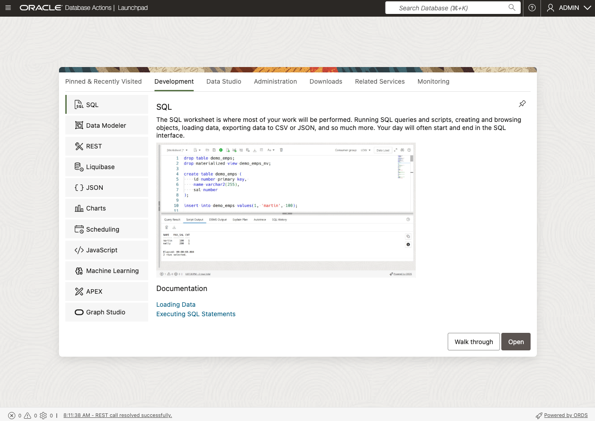

# Get started - Login to the LiveLabs Sandbox Environment

## **Introduction**

Welcome to LiveLabs.
You have successfully created a LiveLabs Sandbox environment.

In this lab, we will show you where you can find the login information and how to log in to the LiveLabs Sandbox.

Estimated Time: 5 minutes

### Objectives

- Login to LiveLabs Sandbox
- Find your LiveLabs Sandbox reservations

## Task 1: View Login Information and login to your LiveLabs Sandbox

1. Right above the workshop instructions you can find two information:

    a. **View Login Info:** You can find credentials and other information to access the LiveLabs Sandbox

    b. **Time Remaining:** This shows you the remaining time before your access to the LiveLabs Sandbox expires. Please note: You may be able to extend the reservation time.

      

2. Click **View Login Info** to view reservation details. In this workshop, you'll use the **Oracle Database Actions** web app in Autonomous Database. Click on **copy value** to copy the password and then click on the link next to **SQL Worksheet**. Your username is **ADMIN**

    

3. Congratulations! You are now connected to the **Oracle Database Actions** as the **ADMIN** user. In this workshop, you will login to Oracle Database Actions using different usernames. Each lab will provide you with the login names. **Note**: The password is always the password listed in the View Login Info section!

    

## Task 2: Find your LiveLabs Sandbox reservations

1. If you close your browser, and you want to launch your workshop again, open [livelabs.oracle.com](https://livelabs.oracle.com), login using your Oracle account, and click on **My Reservations**. You can find here a complete history of all LiveLabs workshops you signed up for. Click on **Launch Workshop** to start a workshop with an existing LiveLabs Sandbox environment.

    

You may now **proceed to the next lab**.

## Acknowledgements

- **Created By/Date** - Linda Foinding
- **Last Updated By/Date** -Linda Foinding, June 2025
