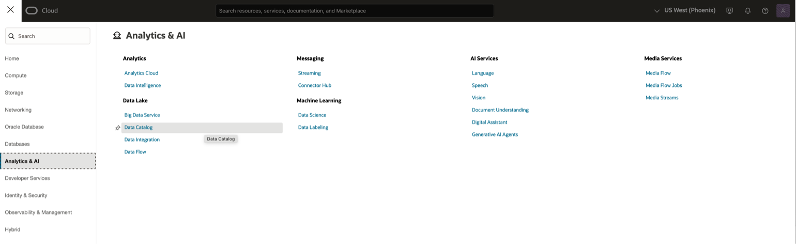

# Code RAG using AI Vector Search Hackathon Challenge

## Introduction
In this lab, you will complete a series of developer coding challenges using various Oracle Database 23ai features. You will be challenged to enhance the current application features to implement various updates. Are you up for the challenge? 

If you are up for the challenge, continue with this lab. If you would like a step-by-step guide on how to complete the challenge, continue to the Code RAG using AI Vector Search lab.

Estimated Time: 30 minutes

### Objectives
* Perform the coding required to achieve the enhancement request outlined in the instructions.

### Prerequisites

This lab assumes you have:
* An Oracle Cloud account
   

## Task 1: Connect to Data Catalog 

First, you’ll log into an existing Data Catalog so you can discover and manage your data all in one place

1. Open the Navigation menu and  

2. Click Analytics & AI.  

3. Under Data Lake, click Data Catalog. 

 

## Task 2: Create Business Glossary for Catalog 

Before we get too far along, you will setup a business glossary for our catalog.  A business glossary enables teams within an organization to collaborate better and use the same vocabulary. 

## Task 3: Register OCI Object Storage as a Data Asset in Catalog 

You’ll let the Catalog know about your Object Storage (think of it like telling your library about a new shelf).

## Task 4: Add Data Asset to Catalog for Oracle Object Storage Data Buckets

Then, you’ll set up links between the Data Catalog and your specific buckets of data. 

## Task 5: Harvest Data Assets to Extract Data Structure into Catalog

You’ll scan your Object Storage to discover file structures (like scanning a bookshelf to note all the titles). 

## Task 6: View Harvested Data Entities 

Check out the list of discovered data inside the Catalog. 

## Task 7: Sync ADB and Data Catalog 

The last step in the chain is for you to sync your ADB instance to your catalog so you can create External Tables that let you query Object Storage data right from the database.

## Task 8: Query Data in ADB and Data Lake (Object Storage) from within ADB 

Finally, you’ll run queries in ADB that reach into data that resides in standard database tables and Object Storage—all in one place, like checking out multiple library shelves at once. 

## Learn More

*(optional - include links to docs, white papers, blogs, etc)*

* [URL text 1](http://docs.oracle.com)
* [URL text 2](http://docs.oracle.com)

## Acknowledgements
* **Author** - <Name, Title, Group>
* **Contributors** -  <Name, Group> -- optional
* **Last Updated By/Date** - <Name, Month Year>
