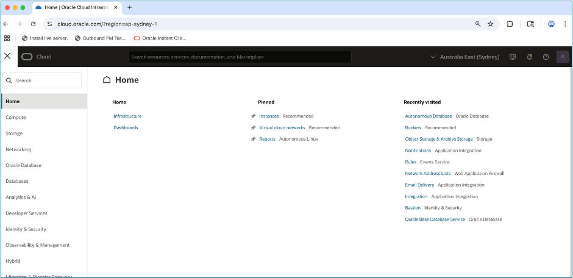
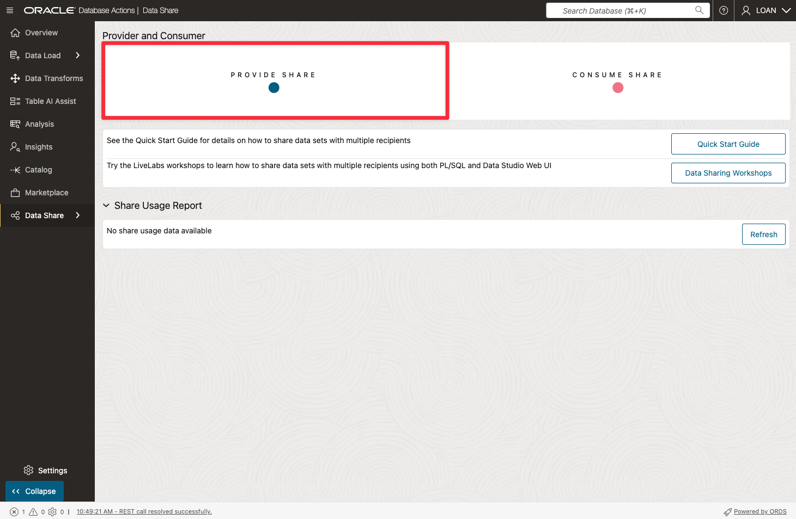
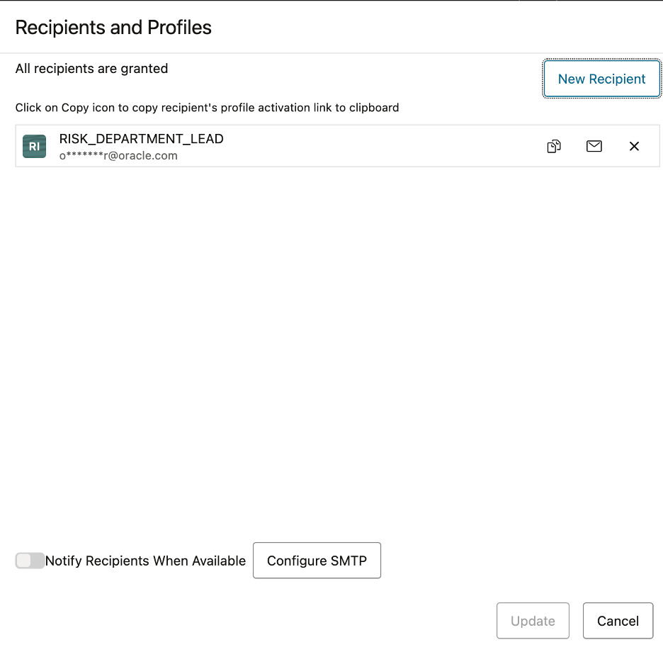
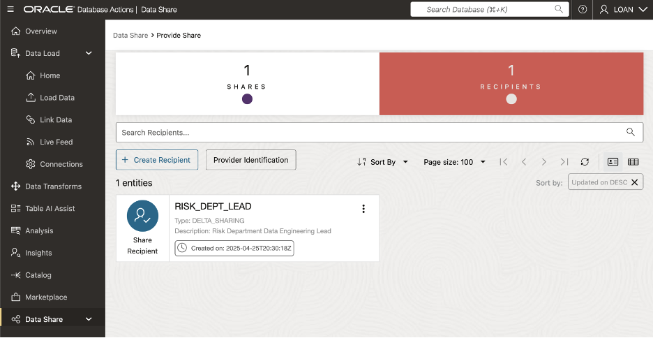

# 🛠️ Create and Share Data Products

## Introduction

In this lab, we will create and share data products that includes information on recently closed loans.  You will also create a new data share recipient that will have access to this data share.

Finally, you will publish the data share and send the recipient the activation link needed to access the data share.

In this Lab, you will:

* Utilize a data share provider account (**LOAN user**) that logs in and manages the data shares for the recipients of the data share (**RISK users**)
* Leverage an Object Storage bucket to store the shared data - **MyDemoBucket**
* Create and publish data shares - **LoanApp\_ShareToRisk**
* Create and authorize a data share recipient

## Estimated Lab Time: 45 minutes

### Objectives
   * Login to LiveLabs Sandbox
   * Find your LiveLabs Sandbox reservations

### Prerequisites

   * **Prerequisites for Share Providers to use the share tool:**
      * For a versioned share, you must have **read and write access to a bucket** to store or cache your shares.
      * The schema you wish to use to create and publish shares must be **enabled for Data Sharing by an ADMIN user.**
      * You should have completed the creation a Cloud Location to Publish Share (Lab 3 task 2)

   * **Prerequisites for Share Recipients**
      * The share recipient must have a **valid email address** a provider can use to register the recipient to use the share tool. Oracle Data Share allows you to share the recipient's activation link by email.

## Task 1: Navigate to Autonomous Database

To begin, we will log onto the assigned Autonomous Database and launch Database Actions (as the LOAN user), so you can discover and manage all the data you have access to all from one location.

1. Log onto Oracle Cloud account at cloud.oracle.com

      

    Click the menu icon (three horizontal lines) in top left corner to open the Navigation Menu  

1. Select Oracle Database from the Navigation Menu.  

    

1. Choose the database type  

    
    Click on Autonomous Database.

1. Select the desired database  

    
    Click the name of the Autonomous Database you want to use  

1. Launch Database Actions  

      

    Click Database Actions, then select Data Load from the dropdown list   

## Task 2: Create Data Product Share

1. Select Data Studio from the menu bar. Then, choose Data Share from the left rail.

   

1. Click Provide Share on the Provider and Consumer page. 

   

1. Click **Provider Identification** on the **Provide Share** page.

   

1. Enter the details below for the provider, in the **Provider Identification** popup window.

   ! [Define a Data Product Recipient](./images/define-data-product-share-recipient-5.png "Define a Data Product Recipient")

      * **Enter the following:**
         * **Name:** LoanApp\_Share\_Provider
         * **Email:** MyEmail@MyCompany.com
         * **Description:** a meaningful description is required

      * Click **Save**.

1. Click **Shares** on the **Provide Share** page, to begin entering details for the new share.  Then, click the Create Share button to launch the Create Share wizard screen.

   

1. On the first page of the **Create Share** wizard, enter the following:

      * Enter the following:
         *  **Name:** LoanApp\_ShareToRisk
         *  **Description:** a meaningful description

   

   Click **Next**.

1. In the **Publish Details section of the wizard,** specify the cloud location where the share will be published.

   Select **MyDemoBucket** from the drop-down list.

   

   Click **Next**.

1. Select the **Share\_Loan\_Data\_Risk\_VW** table in the Available Tables column, then cick the **move (>)** button to list it to the Shared Tables column

   

   

   Click **Next**.

1. In Recipients section of wizard, Click on **New Recipients** button.

   

1. In the **Create Share Recipient** window that is displayed, enter the recipient details.

      <u>** * Enter the following:** </u>  
         *  **Name:** Risk\_Dept\_Lead  
         *  **Description:** Risk Department Data Engineering Lead (optional)  
         *  **Email:** a description (optional)  

   

   Click **Create**.

1. On the **Create Share** page, Click on the **copy** icon to capture the recipient’s profile activation link to the clipboard. 

   

   Click **Create**.

1. Paste activation link URL in browser window.

   

1. Click on **Get Profile Information** to invoke download.

1. Rename file to **Risk\_Delta\_Share\_Profile.json**.

## Task 2: Manage the Data Product Share

   1. On the **Provide Share** page, click **action** icon to manage the data product share.

      

   2. Select **Recipients and Profiles** from the dropdown menu.

      

   3. From here, you can add or remove recipients from the **Recipients and Profiles** page.

      

      Click **Cancel** to proceed to next lab steps.

   4. From the **Provide Share** page, click **Recipients** to display the recipients for the data share.

      

      ***Congratulations you have shared your data from ADB to the Risk Dept Lead.***  

## Acknowledgements

   * **Authors** - Eddie Ambler, Otis Barr
   * **Contributors** - Mike Matthews, Marty Gubar, Francis Regalado
   * **Last Updated By/Date** - 04-28-2025

Copyright (C) Oracle Corporation.
