# 🛠️ Create and Share Data Products

## Introduction

In this lab, as a share provider, you will create a data share and add a table to it. Next, you will create a new recipient that will have access to this data share.

Finally, you will publish the data share and send the recipient the activation link needed to access the data share.

In this Lab, you will:

* Utilize a data share provider account (**LOAN user**) that logs in and manages the data shares for the recipients of the data share (**RISK and MARKETING users**)
* Leverage an Object Storage bucket to store the shared data - **MySharedBucket**
* Create and publish data shares - **LoanAppShare2Marketing** & **LoanAppShare2Risk**
* Create and authorize a data share recipient

### Prerequisites

* An Oracle account

* **Prerequisites for Share Providers to use the share tool:**
      * For a versioned share, you must have **read and write access to a bucket** to store or cache your shares.
      * The schema you wish to use to create and publish shares must be **enabled by an ADMIN user**.

* **Prerequisites for Share Recipients**
      * The share recipient must have a **valid email address** a provider can use to register the recipient to use the share tool. Oracle Data Share allows you to share the recipient's activation link by email.

## Task 1: Create Data Product Share

1. Begin on the **Database Actions Launchpad** while logged on as the **ADMIN** user.

   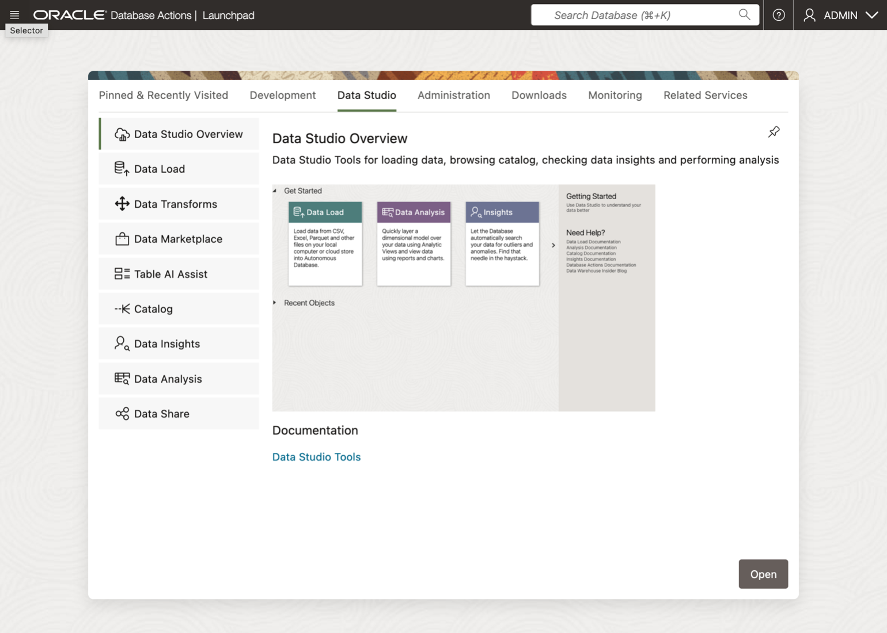

   * Select **Data Studio** from the menu bar
   * Choose **Data Share** from the navigation tree.

1. From the **Provider and Consumer** page, click the **Enable Sharing** icon.

   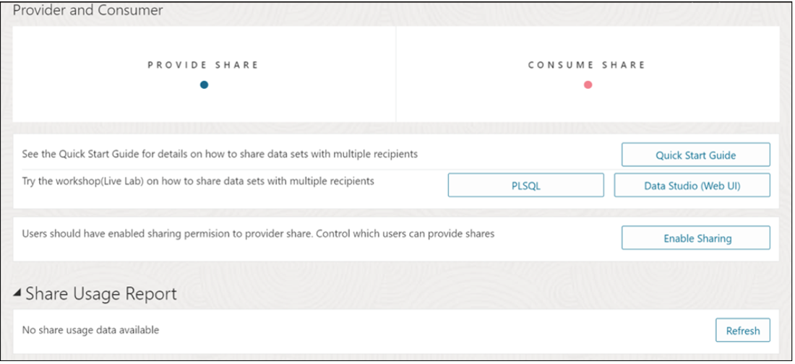

1. Select the user schemas that will be included in the data product share, in the **Enable Sharing** popup window.

   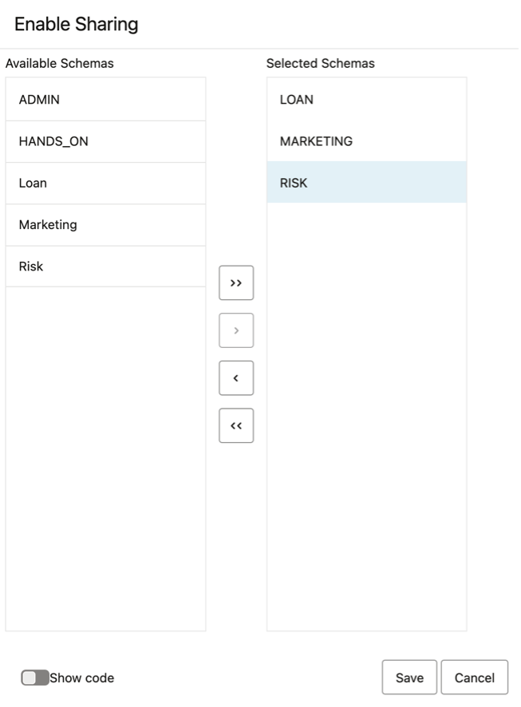

   * Select user schema listed in the Available Schemas column.
   * Click ">" button to place it in the Selected Schemas column.
   * Click **Save**.

1. On the **Database Actions Launchpad**, click the user icon in the top right corner.

   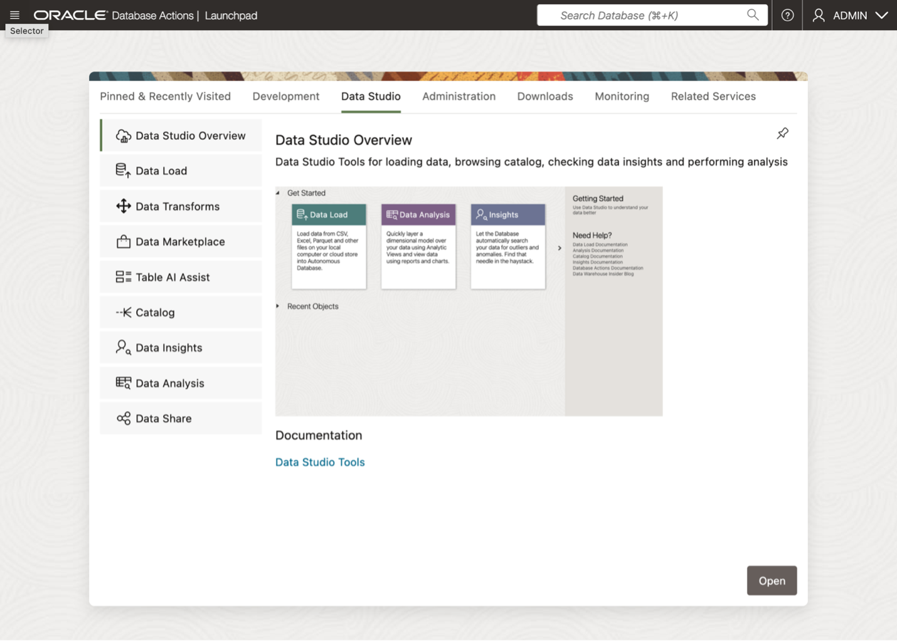

   Log out as the **ADMIN** user.

## Task 2: Define a New Recipient for the Data Product Share

1. From the **Database Actions Launchpad**, click the user icon in the top right corner to sign-on as the LOAN user.

   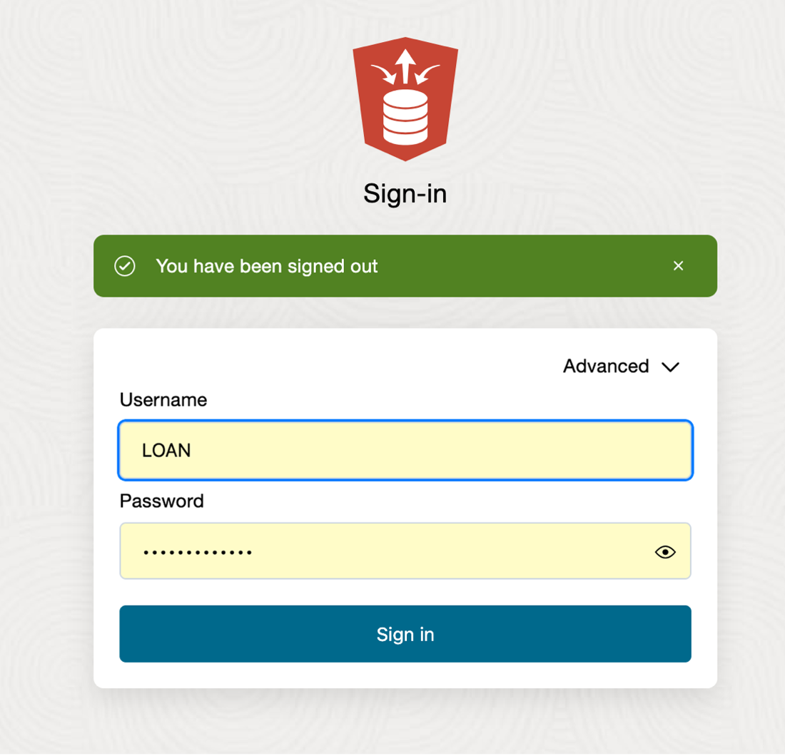

   * Enter LOAN user credentials into **Sign-In** page.
   * Press **Sign-In** button.

1. Select **Data Studio** from the menu bar.  Then, choose **Data Share** from the navigation tree.

   

1. Click **Provider Share** on the **Provider and Consumer** page.

   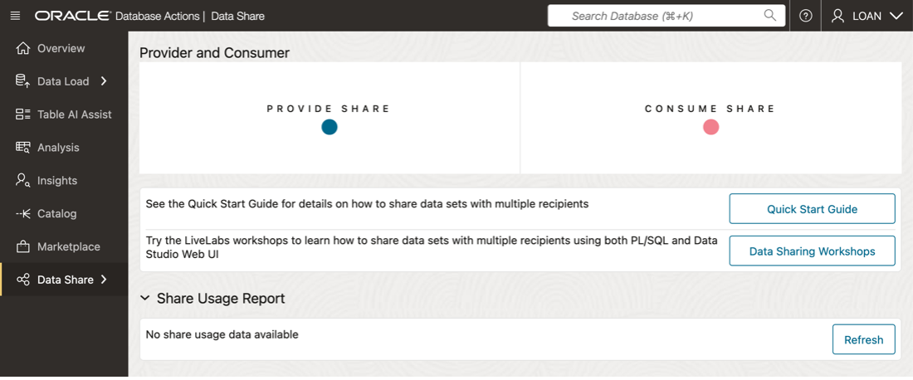

1. Click **Provider Identification** on the **Provide Share** page.

   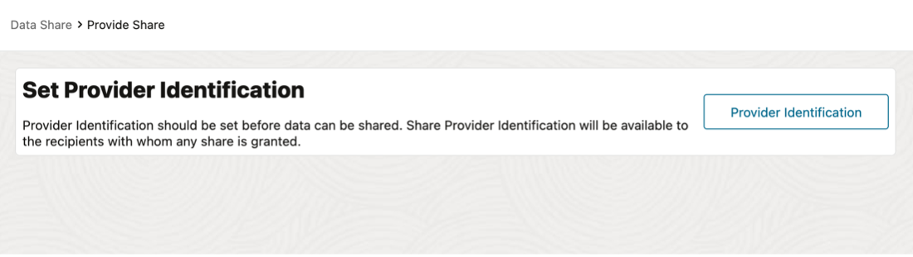
1. Provide details for the provider in the **Provider Identification** popup window.

   

   * Enter the following:
      * **Name:** LoanApp_Share_Provider
      * **Email:** MyEmail@MyCompany.com
      * **Description:** a meaningful description is required
   * Click **Save**.
1. Click **Share** on the **Provide Share** page, to begin entering details for the new share.

   

1. The **General** page of the **Create Share** wizard will appear.

   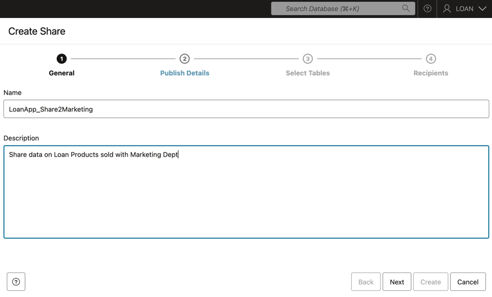

   * Enter the following:
      *  **Name:** LoanApp_Share2Marketing
      *  **Description:** a description (optional)
   * Click **Next**.

1. Specify where the share will be published on the **Publish Details** page.

   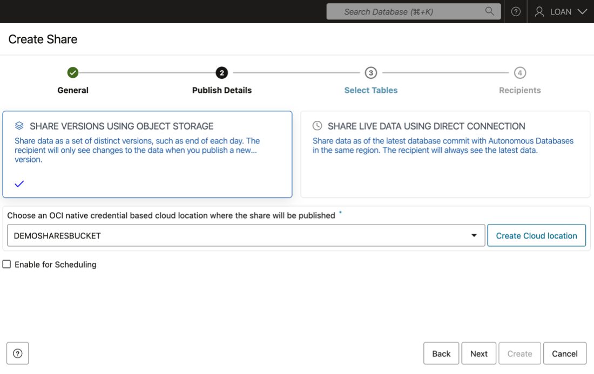

   * Select **DemoSharesBucket** from the drop-down list.
   * Click **Next**.

1. Choose table that will be made available for the Risk Department (via the Share) on the **Select Tables** page.

   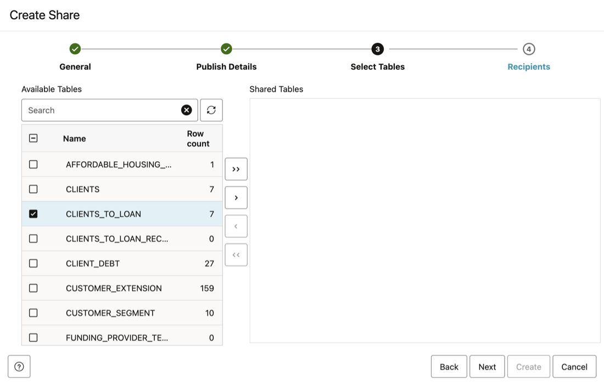

   * Select the **Clients_To_Loan** table in the Available Tables column.
   * Click the ">" button to list it to the Shared Tables column
   * Click **Next**.
1. There are no recipients are available, click **New Recipent** to create a new one on the **Recipients** page.

   

1. Define the recipient in the **Create Share Recipient** popup window.

   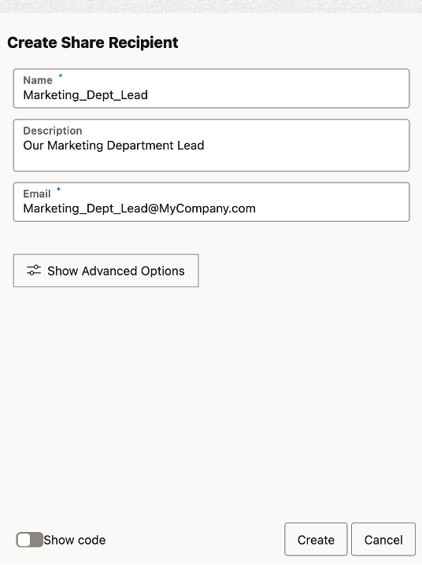

   * Enter the following:
      *  **Name:** Marketing_Dept_Lead
      *  **Description:** a description (optional)
      *  **Email:** a description (optional)
   * Click **Create**.

1. Click the **copy** icon to capture the profile activation link, sending it to the clipboard for the recipient.

   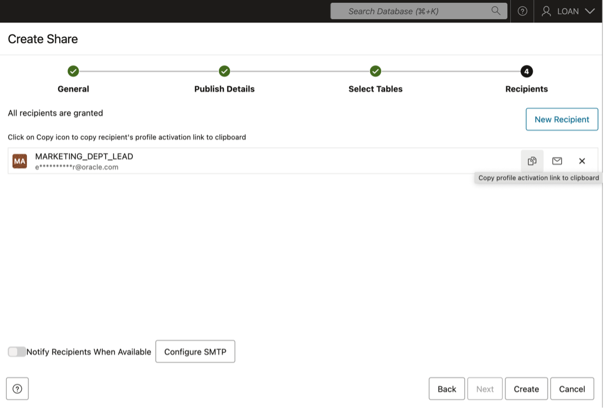

   Click **Cancel**.

## Task 3: Manage the Data Product Share

1. On the **Provide Share** page, click **action** icon to manage the data product share.

   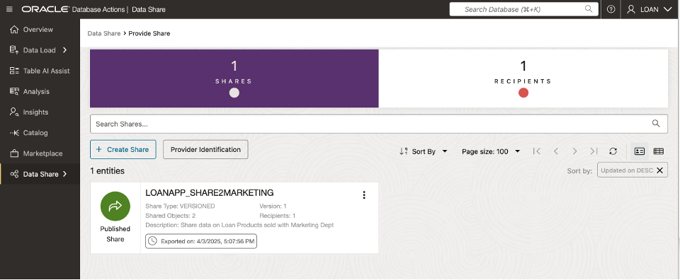

1. Select **Recipients and Profiles** from the dropdown menu.

   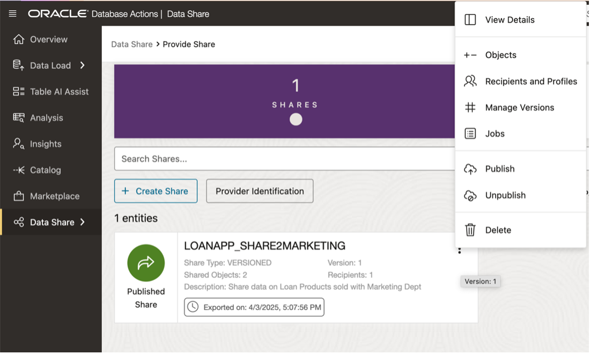

1. Add or remove recipients from the **Recipients and Profiles** page.

   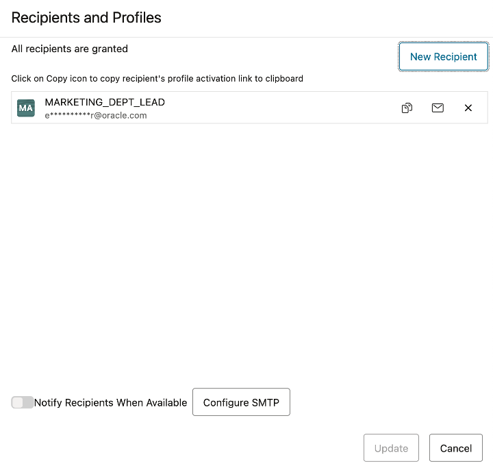

   Click **Cancel**.

1. From the **Provide Share** page, click **Recipients** to display the recipients for the data share.

   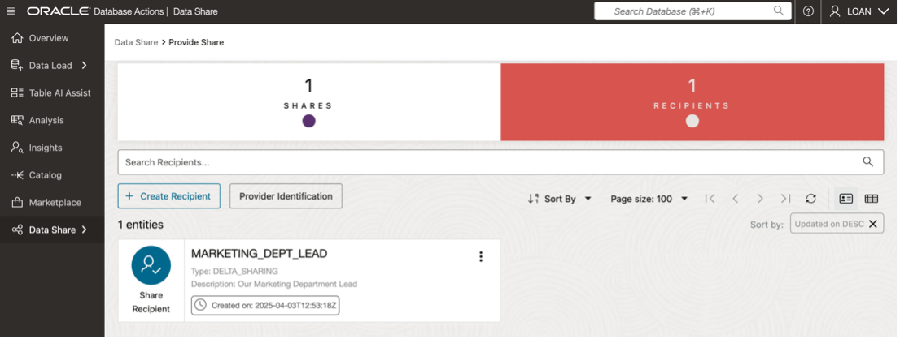

**Congratulations you have shared your data from ADB to the Marketing Dept Lead.**

---

## Key Terms

---

### **About Data Share**

***Share:***

A  Data Share is a named entity in the provider’s instance.
It can be a group of datasets shared as a single entity.

**Example:** A SALES table that needs to be shared within an organization.

***Provider:***

The Provider is the entity (person, institution, or system) that shares data objects using Oracle Autonomous Database Serverless. The provider can share individual tables, related tables, or logically grouped tables.

   **Example**: An institution like NASA sharing datasets via data.gov.

***Recipient:***

A Recipient is the entity (individual, institution, or system) that receives access to a share from the provider. Recipients can have access to multiple shares. If a recipient is removed, they lose access to all associated shares.

   **Example**: An external system like Microsoft Power BI that supports the Delta Sharing REST API.

***Overview of Providers and Recipients:***

A Data Share is a logical container holding objects (e.g., tables) that recipients can access. It simplifies authorization by implementing security mechanisms at a high object level for grouped objects.

* The Provider creates and publishes a share of a versioned type.

* The Recipient is granted access to the share and its contents.

* Providers can modify both data and metadata in shares even after they are published.

***Use Case for Data Sharing***

A marketing agency can share sales information with multiple interested parties using the Data Share tool.

***How the Data Share Tool Works***

Data sharing is facilitated by Oracle Autonomous Database, allowing providers to make data accessible to recipients in two formats:

* Versioned Shares: Data is shared in parquet format at query time using the open Delta Sharing standard protocol with a REST-based API.

* Live Shares: Data is shared in near real-time using cloud links and can only be consumed within Oracle databases.

***Key Points for Providers***

Providers can only share data they have access to within their Autonomous Database instance.

The provider creates a share and selects entities (recipients) to share it with.

For general recipients, data sharing follows the Delta Sharing standard protocol.

For near real-time sharing, Live Shares are accessed via the recipient’s Autonomous Database Serverless (ADB-S) instance.

***Protocols for Data Sharing***

**Autonomous Database Serverless Versioned Sharing Protocol**

1. The provider creates and publishes a share that can be accessed by one or more recipients.
2. Each recipient receives a personal activation link to download their JSON profile containing necessary access information.
3. The recipient registers with the share server using:
   * URL of the endpoint
   * Client ID
   * Secret key
   * Bearer token
4. The recipient retrieves data by:
   * Calling the /shares/../tables/../query endpoint to obtain URLs.
   * Sending GET requests to these URLs to download parquet files.

**Autonomous Database Serverless Live Sharing Protocol**

1. For Live Shares, recipients copy the sharing ID from the consumer page.
2. The provider publishes the share for specific recipients or broader scopes such as:
   * ALL_REGIONS
   * ALL_TENANCY
   * ALL_COMPARTMENTS

### **Architecture**

   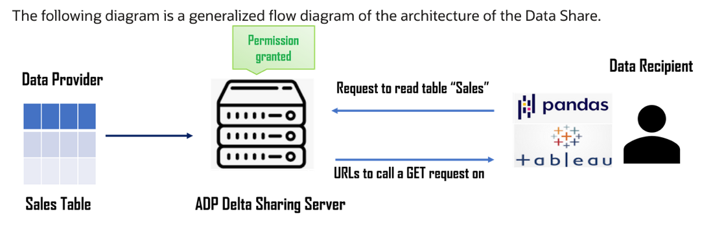

   The Autonomous Database Serverless includes the ability to share database objects across the databases, tools and APIs that are accessible to an organization.  The ability to share incorporates features to make it scalable and secure.

## Acknowledgements
* **Authors** - Matt Kowalik, Otis Barr
* **Contributors** - Eddie Ambler, Ramona Magadan
* **Last Updated By/Date** - TBC

Copyright (C) Oracle Corporation.
