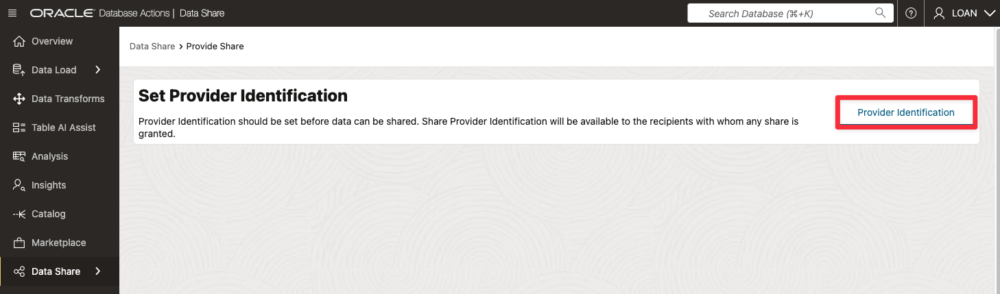
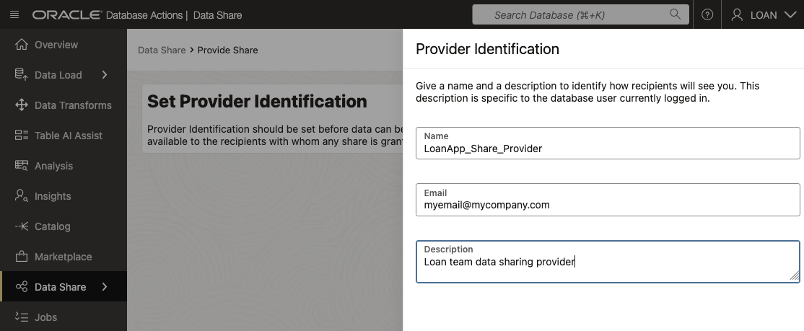
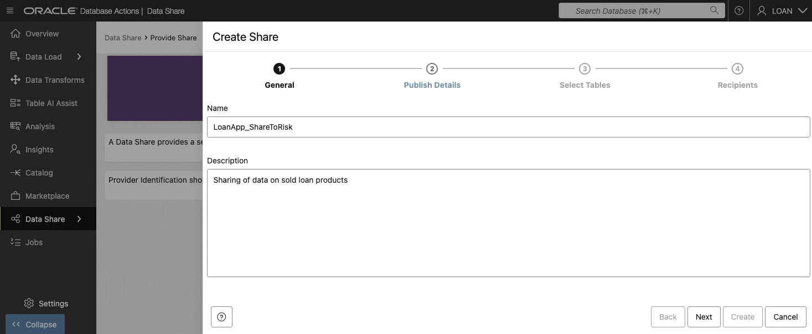
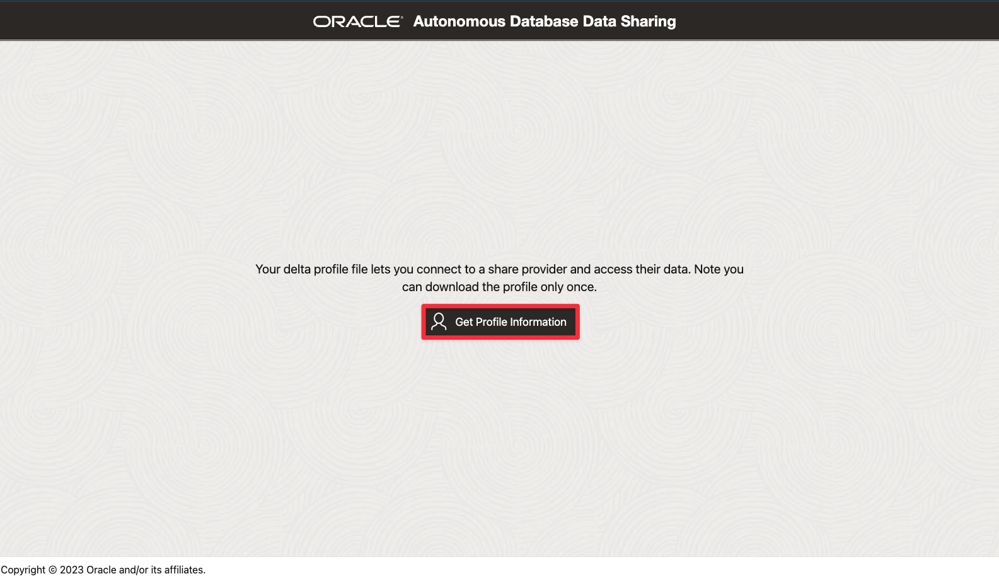

# 🛠️ Create and Share Data Products

## Introduction

At SeersEquities, making smart credit decisions doesn't stop at creating great data—it depends on getting that data into the right hands, fast.  
The loan team may close deals, but it’s the risk team that needs to evaluate those deals in near real time.

In this lab, you’ll act as a data provider, creating and sharing a data product that includes recently closed loans. You’ll publish this share and authorize a recipient account (used by the risk team) to access it securely.

By the end of this lab, you’ll know how to build, share, and govern data products using Autonomous Database and Object Storage—so SeersEquities can collaborate across teams without duplicating data or compromising security.

Estimated Time: 30 minutes

### Objectives

In this Lab, you will:

* **Create a data share provider** user that creates and manages the data share and the recipients of the data share

* **Create and authorize a data share recipients**

* **Define an object storage bucket location** to store the shared data

* **Create and publish** a data share

 
### Prerequisites 

* **For Share Providers**

    * You have read and write access to an Object Storage bucket for storing or caching shared data (required for versioned shares).

    * The schema you'll use to publish the share has been enabled for Data Sharing by an ADMIN user.

    * You’ve already created a **Cloud Location** to **Publish the Share** (covered in **Discover and View your Database and Data Lake Assets from your Data Catalog**, Task 2).

* **For Share Recipients**

    * The recipient must have a valid email address that the provider can use to register them. Oracle Data Share sends the activation link to this address.

## Task 1: Create Data Product Share

> ***Note:*** Skip to Step 3, if continuing from lab 2 and did not logout

1. Click **View Login Info**. Copy your **DB ADMIN Password**, and click the **SQL Worksheet** link.

     

2. For your Username enter **LOAN**. Paste in the password you copied in the previous step.

     

3. In the banner click on **Database Actions**, then in the top menu, select **Data Studio**, then click **Data Share** from the left rail.

   

4. On the **Provider and Consumer** page, click **Provide Share**.

   

5. Click **Provider Identification**.

   

6.	In the **Provider Identification** popup, enter the following:

      * **Name:** LoanApp\_Share\_Provider
      * **Email:** myemail@mycompany.com
      * **Description:** Loan team data sharing provider

      

      * Click **Save**.

7. Back on the **Provide Share** page, click **Shares**, then click **Create Share** to launch the **Create Share wizard**.

   

8. On the first page of the wizard, enter:

      *  **Name:** LoanApp\_ShareToRisk
      *  **Description:** Sharing of data on sold loan products

   

      * Click **Next**.

9. In the **Publish Details** section, select the cloud location for publishing:

      * Select **MyDemoBucket** from the drop-down list.

   

      * Click **Next**.

10. On the **Select Tables** page, choose the table to share with the **Risk Department**:

      *  Select the **Share\_Loan\_Data\_Risk\_VW** table in the **Available Tables** column.
      *  Click the **move (>)** button to add it to the **Shared Tables** column

      

      *  Click **Next**.

11. In the **Recipients** section, lets define who we want to create this data share for by clicking **New Recipients**.

   

12. In the **Create Share Recipient** window, enter the following:

      *  **Name:** Risk\_Dept\_Lead  
      *  **Description:** Risk Department Data Engineering Lead
      *  **Email:** risk@mycompany.com

    

      * Click **Create**.

13. Back on the **Create Share** page, select the newly created recipient from the list of recipients.

   

14. Click the **Copy** icon to copy the recipient's activation link to your clipboard.

    

      * Click **Create**.
  
15. Now, publish your share by clicking the **Publish** button from the actions menu.

   

16. This will turn the Share Icon green with a state of Published Share.  

   

   >***Congratulations!!!*** You’ve just **created and published a data product share**.   
   By defining the share, selecting the right data, and authorizing a recipient, you’ve set up a **governed, reusable pipeline for cross-team collaboration**.

## Task 2: Manage the Data Product Share

1. **Download the Activation Link Profile for the Data Share** that we will use in the upcoming lab  
Paste the activation link you copied earlier into a separate browser tab and click **Get Profile Information** to download the recipient profile file (The default name is `delta_share_profile.json`).

>If you experience an error with your activation link don't worry, the steps below will show you how to get a new copy and try again.

   

2. A list of **share recipients** and their **Profile Activation link** can also be retrieved from the **Provide Share** page, by clicking the **Actions** icon next to your data product share.   Then selecting **Recipients and Profiles**.

   

3. From the **Recipients and Profiles** page, you can select and remove an existing recipients or add a new recipient to the data share.

      

      Click **Cancel** to proceed to next lab steps.

4. From the **Provide Share** page, you can also get a list of share recipients and their profile activation links by clicking on  **Recipients** to display the recipients for the data share.   For each recipient you can select the actions icon to retrieve their activation profile link.

      

***Congratulations!*** You’ve now successfully shared a governed, ready-to-query dataset from Autonomous Database with the Risk Department Lead—empowering them with the data they need to make informed decisions.

## Conclusion

In this lab, you **created and shared a live, query-ready data product**—giving the Risk team secure, timely access to critical loan insights. You defined the data provider, configured the share, added a recipient, and managed access—all without moving or duplicating data.

At SeersEquities, this means **smoother handoffs, faster risk evaluation, and better cross-team alignment**. For you, it means **mastering a modern data-sharing workflow that’s secure, scalable, and built for collaboration**.

## Acknowledgements
* **Authors** - Eddie Ambler
* **Last Updated By/Date** - September 2025, Eddie Ambler

