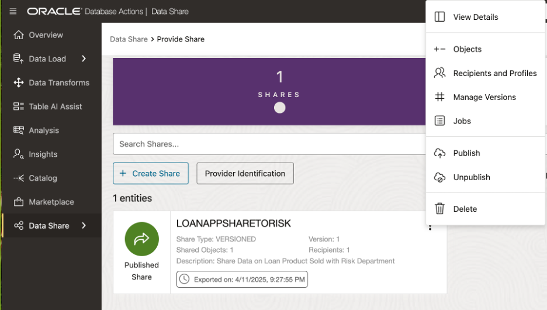

# 🛠️ Create and Share Data Products

## Introduction

In this lab, as a share provider, you will create a data share and add a table to it. Next, you will create a new recipient that will have access to this data share.

Finally, you will publish the data share and send the recipient the activation link needed to access the data share.

In this Lab, you will:

* Utilize a data share provider account (**LOAN user**) that logs in and manages the data shares for the recipients of the data share (**RISK and MARKETING users**)
* Leverage an Object Storage bucket to store the shared data - **MySharedBucket**
* Create and publish data shares - **LoanAppShare2Marketing** & **LoanAppShare2Risk**
* Create and authorize a data share recipient

### Prerequisites

* An Oracle account

* **Prerequisites for Share Providers to use the share tool:**
      * For a versioned share, you must have **read and write access to a bucket** to store or cache your shares.
      * The schema you wish to use to create and publish shares must be **enabled by an ADMIN user**.

* **Prerequisites for Share Recipients**
      * The share recipient must have a **valid email address** a provider can use to register the recipient to use the share tool. Oracle Data Share allows you to share the recipient's activation link by email.

## Task 1: Create Data Product Share

1. Begin on the **Database Actions Launchpad** while logged on as the **ADMIN** user.

   

   * Select **Data Studio** from the menu bar
   * Choose **Data Share** from the navigation tree.

2. On the **Database Actions Launchpad**, click the user icon in the top right corner.

   

   Log out as the **ADMIN** user.

3. From the **Database Actions Launchpad**, click the user icon in the top right corner to sign-on as the LOAN user.

   

      * Enter LOAN user credentials into **Sign-In** page.
      * Press **Sign-In** button.

4. Select **Data Studio** from the menu bar.  Then, choose **Data Share** from the navigation tree.

   

   Click **Provide Share** on the **Provider and Consumer** page.

5. Click **Provide Share** on the **Provider and Consumer** page.

    

6. Click **Provider Identification** on the **Provide Share** page.

   

7. Provide details for the provider in the **Provider Identification** popup window.

   

      * Enter the following:
         * **Name:** LoanApp\_Share\_Provider
         * **Email:** MyEmail@MyCompany.com
         * **Description:** a meaningful description is required
      * Click **Save**.

8. Click **Shares** on the **Provide Share** page, to begin entering details for the new share.

    

9. The **General** page of the **Create Share** wizard will appear.

    

      * Enter the following:
         *  **Name:** LoanApp\_ShareToRisk
         *  **Description:** a description (optional)
      * Click **Next**.

10. Specify where the share will be published on the **Publish Details** page.

   

      * Select **DemoSharesBucket** from the drop-down list.
      * Click **Next**.

11. Choose the table (or view) that will be made available for the Risk Department (via the Share) on the **Select Tables** page.

    

      * Select the **Share\_Loan\_Data\_Risk\_VW** table in the Available Tables column.
      *  Click the ">" button to list it to the Shared Tables column
      * Click **Next**.

12. There are no recipients are available, click **New Recipent** to create a new one on the **Recipients** page.

   

13. Define the recipient in the **Create Share Recipient** popup window.

   

      * Enter the following:
         *  **Name:** Marketing\_Dept\_Lead
         *  **Description:** a description (optional)
         *  **Email:** a description (optional)
      * Click **Create**.

14. Click the **copy** icon to capture the profile activation link, sending it to the clipboard for the recipient.

   

   Click **Cancel**.

15. Paste activation link URL in browser window.

   

   * Click on Get Profile Information to envoke download.
   * Rename file to Risk\_Delta\_Share\_Profile.json.

## Task 2: Manage the Data Product Share

1. On the **Provide Share** page, click **action** icon to manage the data product share.

   

2. Select **Recipients and Profiles** from the dropdown menu.

   

3. From here, you can add or remove recipients from the **Recipients and Profiles** page.

   

   Click **Cancel**.

4. From the **Provide Share** page, click **Recipients** to display the recipients for the data share.

   

**Congratulations you have shared your data from ADB to the Marketing Dept Lead.**
#
## Acknowledgements
* **Authors** - Eddie Ambler, Otis Barr, Matt Kowalik
* **Contributors** - Francis Regalado, Ramona Magadan
* **Last Updated By/Date** - TBC
Copyright (C) Oracle Corporation.
