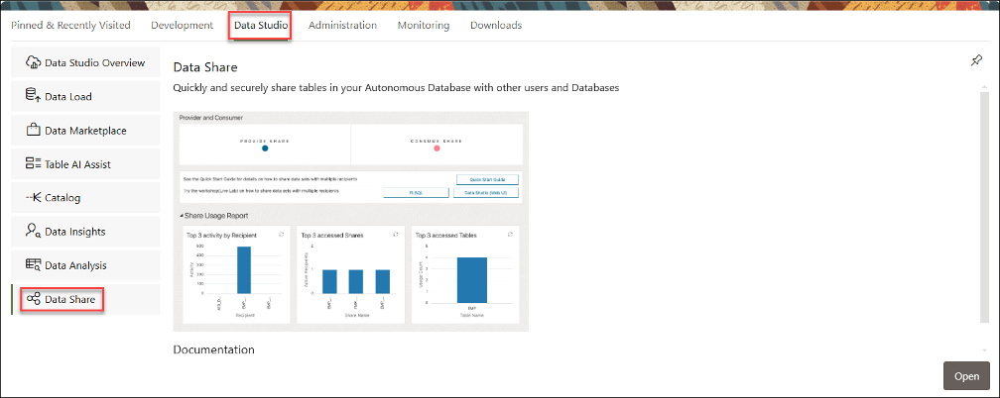

# Create Data Product Share & Publish to Data Share

## Lab Summary 

In this Lab, you will:
 *  Utilize a data share provider account (LOAN user) that logs in and manages the data shares for the recipients of the data share (RISK and MARKETING users)
 *  Leverage an Object Storage bucket to store the shared data - MySharedBucket
 *  Create and publish data shares - LoanApp_Share2Marketing & LoanApp_Share2Risk
 *  Create and authorize a data share recipient
 
## Prerequisites 

*	An Oracle account

    ### Prerequisites for Share Providers to use the share tool:
    *   For a versioned share, you must have read and write access to a bucket to store or cache your shares.
    *   The schema you wish to use to create and publish shares must be enabled by an ADMIN user. 

    ### Prerequisites for Share Recipients
    *   The share recipient must have a valid email address a provider can use to register the recipient to use the share tool. Oracle Data Share allows you to share the recipient's activation link by email.

## Terminology

### Autonomous Database Share: 
    Includes the ability to:
*       Share objects easily across Autonomous Databases and all tools or APIs that support the open delta sharing protocol.
*       Share versioned data with many recipients without data replication for all recipients.
*       Establish secure and centrally managed data sharing and collaboration within and across organizations.
 
### Provider: 
    The Autonomous Database Serverless enables the provider to share existing objects. 
    The share can contain a single table, a set of related tables, or a set of tables with some logical grouping. 
    It could be a person, an institution, or a software system that shares the objects. 
 
    Example: An institution, such as NASA, that makes a data set available via data.gov.

### Recipient: 
    A Share recipient is an entity that associates an individual, an institution or a software system that receives a share from a provider. A recipient can have access to multiple shares. If you remove a recipient, that recipient loses access to all shares it could previously access. 
 
    Example: An external system, such as Microsoft Power BI, that supports the Delta Sharing REST API.
 
### Share: 
    A Share is a named entity in the provider’s instance. 
    It can be a group of datasets shared as a single entity. 
 
    Example: A SALES table that needs to be shared within an organization.
 
## Overview

## Task 1: Create Data Product Share

As a share provider, create a data product share and add a table to it. 

### Begin at the Database Actions Launchpad

   

1.  Make sure you are signed on as the ADMIN user.
1.  Select Data Studio from the menu bar
1.  Choose Data Share from the Navigation Tree. 

### On the Provider and Consumer screen.

   

1.  Click Enable Sharing and the following popup screen will appear.

   

    Move the desired user schemas from the Available column to the Selected column, on this popup screen.  
    
    Click Save, to exit.

### At the Database Actions Launchpad

   

1.  Log out as the ADMIN user.

## Task 2: Define a New Recipient of the Data Product Share

Define a new recipient that will have access to this data share. 

### Begin at the Database Actions Launchpad

   

1.  Sign on as the LOAN user.

    

1.  Select Data Studio from the menu bar
1.  Choose Data Share from the Navigation Tree.

### On the Provider and Consumer screen.

   

1.  Click Provider Share.

### On the Set Provider Identification screen.

   

1.  Click Provider Identification and the following panel will appear.

   

1.  Enter details to identify the provider.
* Name: Enter the name of the provider: LoanApp_Share_Provider
* Email: Enter the email address for the provider: MyEmail@MyCompany.com.
* Description: Enter a meaningful description of the provider (required).
1. Click Save. 

## Task 3: Publish the Data Product Share

Finally, you will publish the data share 

## Task 4: Notify the Data Product Share Recipient

send the recipient the activation link needed to access the data share.

* You will create a data share ’ll build a custom view (like a special lens) for the Risk Department. 

* It will include only the loan details and fields the Risk team needs to analyze, helping them make smarter decisions about potential risks. 

## Task 2: Share Data Product to Marketplace for Risk Officer Consumption

* You’ll take the output of the Client_Loans_Risk_Dept_View you created and publish it to the Data Marketplace. 

* This makes it easier for the Risk Officer to find, select, and use the data without having to ask for manual reports. 

## Acknowledgements
* **Author** - <Name, Title, Group>
* **Contributors** -  <Name, Group> -- optional
* **Last Updated By/Date** - <Name, Month Year>
