# Harvest Technical Metadata from Oracle Object Storage

## Introduction

In this lab we will discuss discovering your data lake data into your data catalog.  
We will start our data discovery jouney by first introducing you to the concept of  **Harvesting**, which is a process of extracting technical metadata from your **data assets** into your Data Catalog repository. A **data asset** represents a data source such as a database, an object store, a file or document store, a message queue, or an application. 
This lab walks you through the steps to create an Oracle Object Storage data asset, add a default connection to the new data asset, and finally harvest the data asset and view the harvested data entities.

Estimated Time: 30 minutes

<!-- Comments -->
<!-- liveLabs section starts on line 466 (big monitor) -->
<!-- Comments -->
<!-- Comments -->
<!-- Comments -->

### Objectives

In this lab, you will:
* Create a business glossary.
* Create an Oracle Object Storage data asset.
* Add three Object Storage connections for the newly created data asset.
* Harvest the data asset.
* View the harvested data entities.
* Customize the business names for the three Oracle Object Storage buckets.

### Prerequisites
* This lab assumes that you have successfully completed all of the preceding labs in the **Contents** menu.


## Task 1: Log in to the Oracle Cloud Console
 
1. Log in to the **Oracle Cloud Console** as the Cloud Administrator, if you are not already logged in. You will complete all the labs in this workshop using this Cloud Administrator.
See [Signing In to the Console](https://docs.cloud.oracle.com/en-us/iaas/Content/GSG/Tasks/signingin.htm) in the _Oracle Cloud Infrastructure_ documentation.

2. On the **Sign In** page, select your tenancy, enter your username and password, and then click **Sign In**. The **Oracle Cloud Console** Home page is displayed.

## Task 2: Create an Oracle Object Storage Data Asset

Register your Oracle Object Storage data sources with Data Catalog as a data asset.

1. Open the **Navigation** menu and click **Analytics & AI**. Under **Data Lake**, click **Data Catalog**.

2. On the **Data Catalog Overview** page, click **Go to Data Catalogs**.

    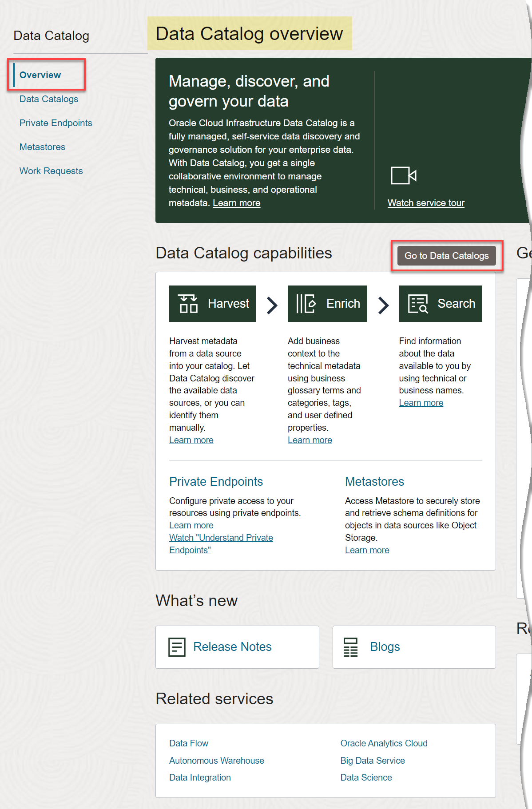

3. On the **Data Catalogs** page, click the **`training-dcat-instance`** Data Catalog instance where you want to create your data asset.

    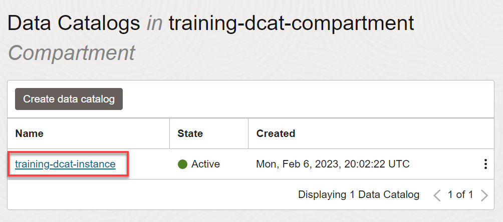

4. On the **`training-dcat-instance`** **Home** page, in the **Quick Actions** tile, click **Create data asset**.

    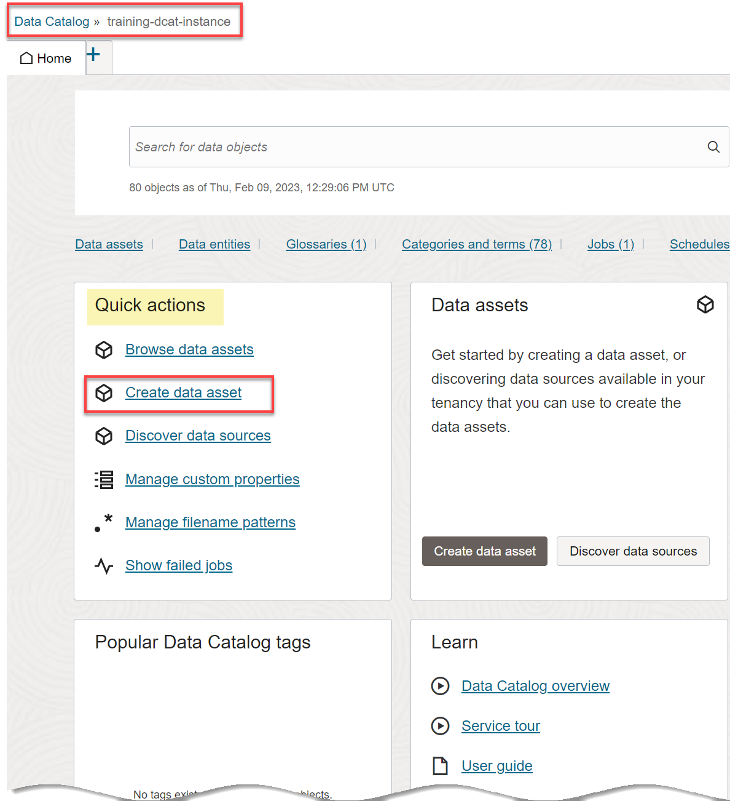

5. In the **Create data asset** panel, specify the data asset details as follows:

    * **Name:** **`OCI Data Lake`**.
    * **Description:** **`Data Asset to access Oracle Object Storage buckets in a different tenancy than yours using public PARs`**.
    * **Type:** Select **Oracle Object Storage** from the drop-down list.
    * **URL:** This is the swift URL for the OCI Object Storage resource that you will use in this lab. The URL field is automatically populated using your own **Home Region**, `us-ashburn-1` in this example. If the Oracle Object Storage buckets that you are harvesting from a different tenancy has a different **Home Region**, then make sure to edit this URL to reflect that home region.

        ```
        https://swiftobjectstorage.us-ashburn-1.oraclecloud.com
        ```
        >**Note:** In this lab, you will be accessing three Oracle Object Storage buckets that contain the data using three **public** pre-authenticated requests (PARs) that are provided for you. The three buckets are located in the **c4u04** tenancy in the **us-ashburn-1** region in our example. In the next step, you'll add three data connections to this data asset using the three pre-authenticated requests (PARs). Note that if you were using an Oracle Object Storage data asset type instead of PAR, you would only need one data connection instead of three. In addition, we created the required policies manually in **Lab 1: Set Up the Workshop Environment**. For information on PARs, see [Using Pre-Authenticated Requests](https://docs.oracle.com/en-us/iaas/Content/Object/Tasks/usingpreauthenticatedrequests.htm) in the _Oracle Cloud Infrastructure_ documentation.

    * **Namespace:** Enter **c4u04**. This is tenancy where the three Oracle Object Storage buckets that you will harvest are located.

6. Click **Create**.

    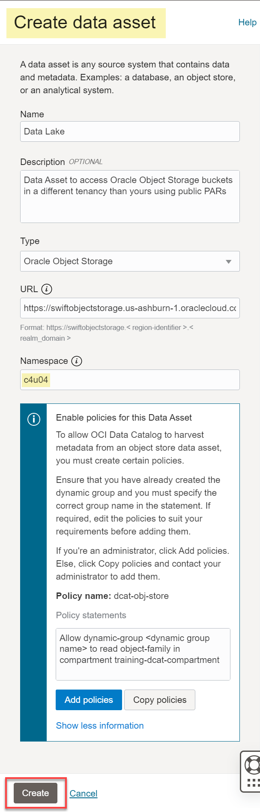

    A `Data Asset created successfully` message box is displayed. The **Data Lake** tab is displayed. The details for the new data asset are displayed in the **Summary** tab.

    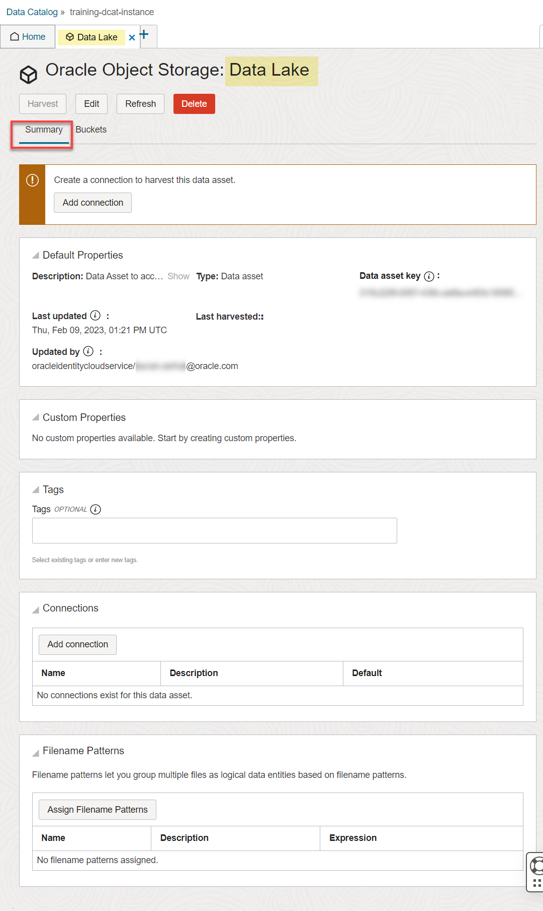


## Task 3: Add Three Data Asset Connections to the Oracle Object Storage Buckets

After you register a data source as a data asset in your data catalog, you create data connections to your data asset to be able to harvest it. You can create multiple connections to your data source. At least one connection is needed to be able to harvest a data asset. In this lab, you will create three data connections to access the **loanapp\_funding**, **loanapp\_affordable\_housing\_zones**, and **loanapp\_client\_upload** Oracle Object Storage buckets that contain the data. The three buckets are located in a different tenancy than yours, **c4u04**; therefore, you will use three provided public pre-authenticated requests (PARs), one for each bucket. For information on PAR, see [Using Pre-Authenticated Requests](https://docs.oracle.com/en-us/iaas/Content/Object/Tasks/usingpreauthenticatedrequests.htm) in the _Oracle Cloud Infrastructure_ documentation.

### Add a Connection to the **loanapp_funding** Bucket to the **`OCI Data Lake`** Data Asset

1. On the **OCI Data Lake** tab, in the **Summary** tab, click **Add connection**.

    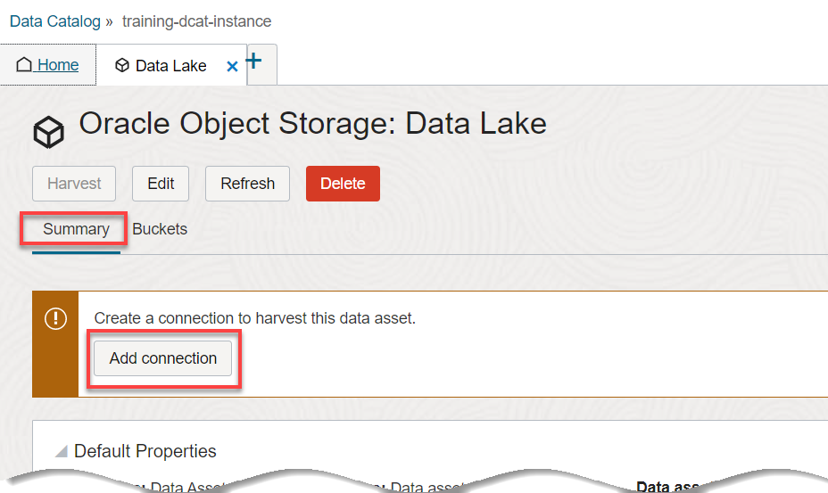

2. In the **Add connection** panel, specify the connection details for the **loanapp_funding** Object Storage bucket data source as follows:
    * **Name:** **`Funding`**.
    * **Description:** Enter an optional description.
    * **Type:** Select **Pre-Authenticated Request** from the **Type** drop-down list.
    * **Pre-Authenticated Request URL:** Click **Copy** to copy the following URL, and then paste it in this field.

        ```
        <copy>https://objectstorage.us-ashburn-1.oraclecloud.com/p/jTFkU1Mey2PizeVQDp2nkfpAV40OmI9rLejneNhQ9tNiDqkP4543H4Boy8gDaxos/n/c4u04/b/moviestream_sandbox/o/</copy>
        ```

    * **Make this the default connection for the data asset:** Leave this checkbox unchecked.

        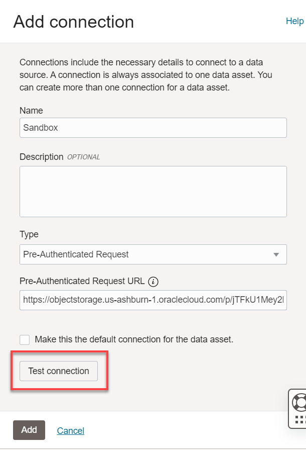

3. Click **Test connection**. A message box is displayed indicating whether or not the test was successful.

    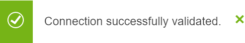

4. If the test was successful, click **Add**. A message box is displayed indicating whether or not the connection was added successfully. The **`Funding`** data source connection is added to the data asset and is displayed in the **Connections** section.

    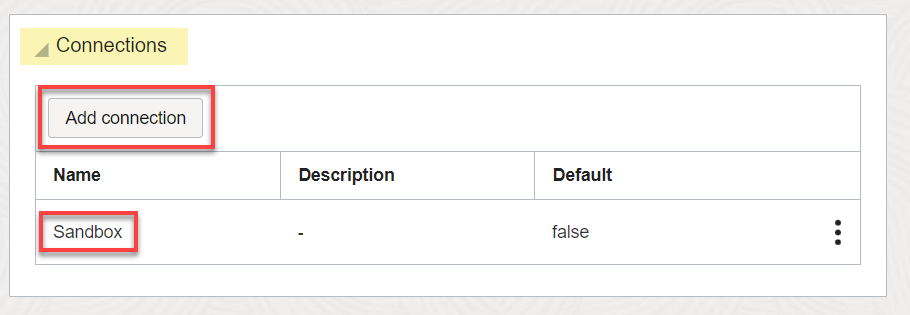

### Add a Connection to the **loanapp_affordable_housing_zones** Bucket to the **`OCI Data Lake`** Data Asset

5.  On the **OCI Data Lake** tab, in the **Summary** tab, in the **Connections** section, click **Add connection**.

6. In the **Add connection** panel, specify the connection details for the **loanapp_affordable_housing_zones** Object Storage bucket data source as follows:

    * **Name:** **`Affordable-Housing`**.
    * **Description:** Enter an optional description.
    * **Type:** Select **Pre-Authenticated Request** from the **Type** drop-down list.
    * **Pre-Authenticated Request URL:** Click **Copy** to copy the following URL, and then paste it in this field.

        ```
        <copy>https://objectstorage.us-ashburn-1.oraclecloud.com/p/YtpqXpUpPx1pPXFQa4Githwxx4bxp12q2yZJsCyzN0Y9-kpYr5nAOvLvwZfLHxXF/n/c4u04/b/moviestream_landing/o/</copy>
        ```

    * **Make this the default connection for the data asset:** Leave this checkbox unchecked.

        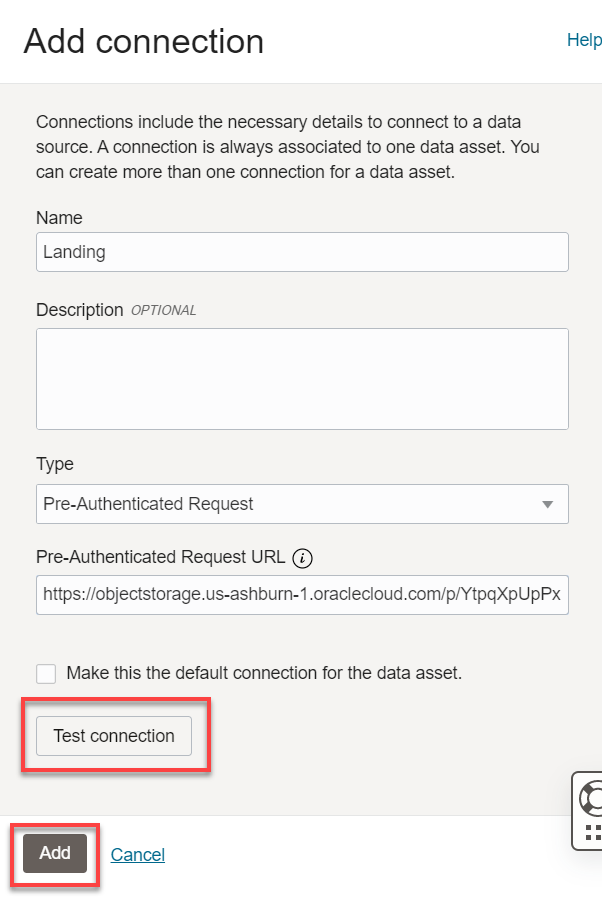

7. Click **Test connection**. A message box is displayed indicating whether or not the test was successful.

    

8. If the test was successful, click **Add**. A message box is displayed indicating whether or not the connection was added successfully. The **`Affordable-Housing`** data source connection is added to the data asset and is displayed in the **Connections** section.

    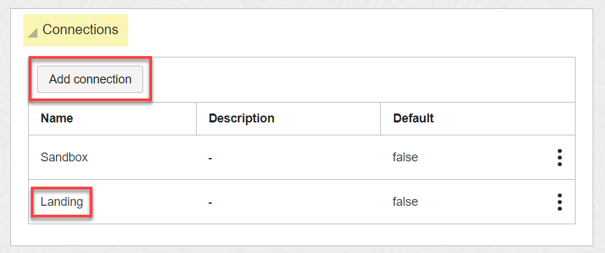

### Add a Connection to the **loanapp_client_upload** Bucket to the **`OCI Data Lake`** Data Asset

9. On the **`OCI Data Lake`** tab, in the **Summary** tab, in the **Connections** section, click **Add connection**.

10. In the **Add connection** panel, specify the connection details for the **loanapp_client_upload** Object Storage bucket data source as follows:

    * **Name:** **`Client_Upload`**.
    * **Description:** Enter an optional description.
    * **Type:** Select **Pre-Authenticated Request** from the **Type** drop-down list.
    * **Pre-Authenticated Request URL:** Click **Copy** to copy the following URL, and then paste it in this field.

        ```
        <copy>https://objectstorage.us-ashburn-1.oraclecloud.com/p/B4TMFWDOLh-EPrzE2ivDAfOlizm7IjpI_SY94QgUTGJNMX3jgh0jnQFAtPPZVcWq/n/c4u04/b/moviestream_gold/o/</copy>
        ```

    * **Make this the default connection for the data asset:** Leave this checkbox unchecked.

        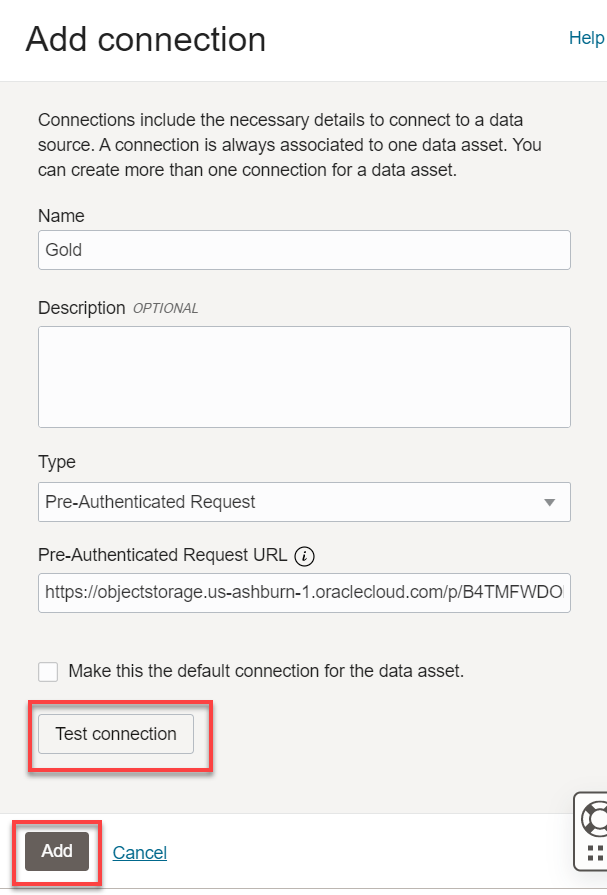

11. Click **Test connection**. A message box is displayed indicating whether or not the test was successful.

    

12. If the test was successful, click **Add**. The **`Client_Upload`** data source connection is added to the data asset and is displayed in the **Connections** section.

    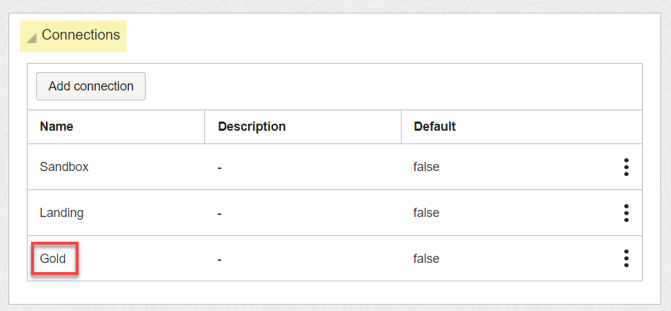


>**Note:** If you harvest your Object Storage data source files without creating filename patterns, Data Catalog creates an individual logical entity for each file under each root bucket. Imagine this situation with hundreds of files in your data source resulting in hundreds of data entities in your Data Catalog.

## Task 4: Harvest the Data Asset

After you create a data asset in the Data Catalog repository, you harvest it to extract the data structure information into the Data Catalog and view its data entities and attributes. In this task, you will harvest the **loanapp\_funding**, **loanapp\_affordable\_housing\_zones**, and **loanapp\_client\_upload** Oracle Object Storage buckets that contain the data.

### Harvest the Data Entities from the **loanapp\_funding** Object Storage Bucket

1. If you are still on the **Oracle Object Storage: OCI Data Lake** page from the previous task, skip to step 5 below; otherwise, open the **Navigation** menu and click **Analytics & AI**. Under **Data Lake**, click **Data Catalog**.

2. On the **Data Catalogs** page, click the **`training-dcat-instance`** Data Catalog instance that contains the data asset that you want to harvest.

3. On the Data Catalog instance **Home** tab, click **Data assets** link. The **Data assets** tab is displayed.

    

4. In the **Data assets** list, click the **OCI Data Lake** data asset. The **Oracle Object Storage: OCI Data Lake** page is displayed.

    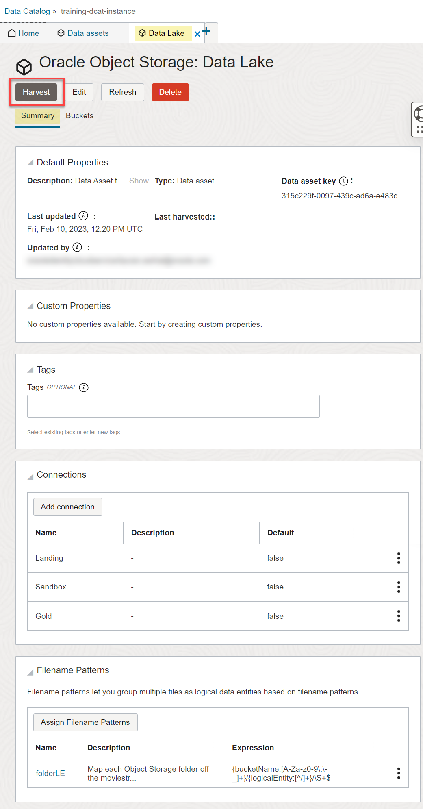

5. Click **Harvest**. The **Select a Connection** page of the **Harvest** wizard (Step 1 of 3) is displayed in the **Harvest Data Entities** tab. Select the **`Funding`** from the **Select a connection for the data asset you want to harvest** drop-down list. Click **Next**.

    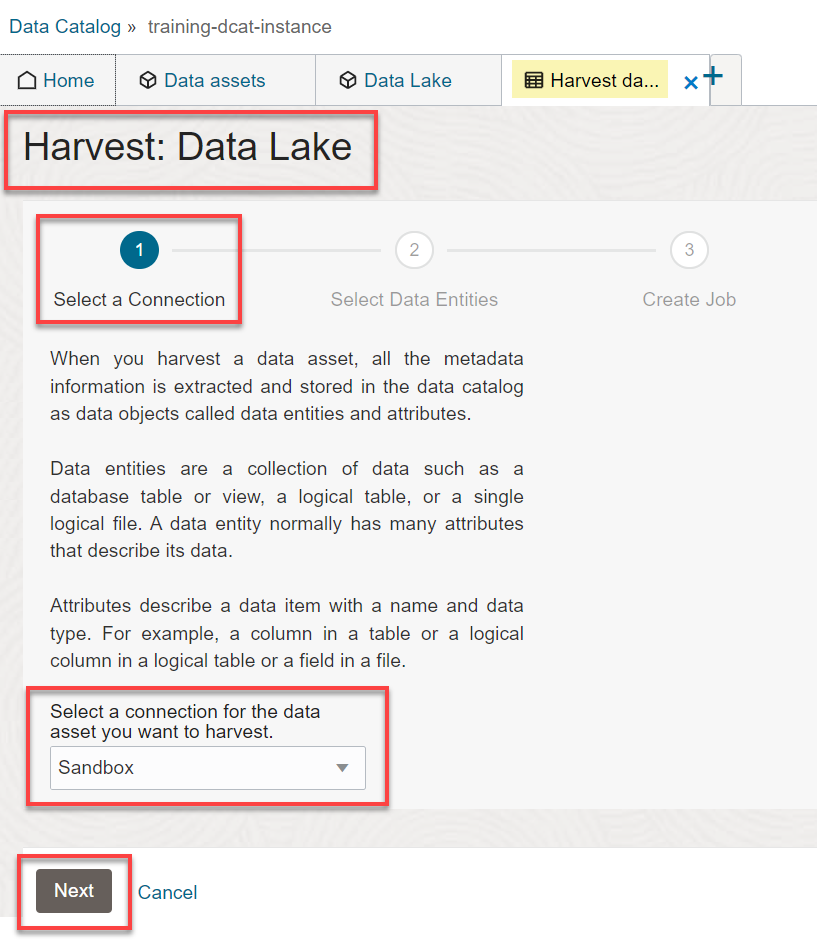

6. The **Select Data Entities** page of the **Harvest** wizard (Step 2 of 3) is displayed. The **`loanapp_funding`** bucket is already displayed in the **Available Bucket** section. Click the **Plus** icon next it to add it to the **Selected Bucket / Data Entities** section to include it in the harvest job.

    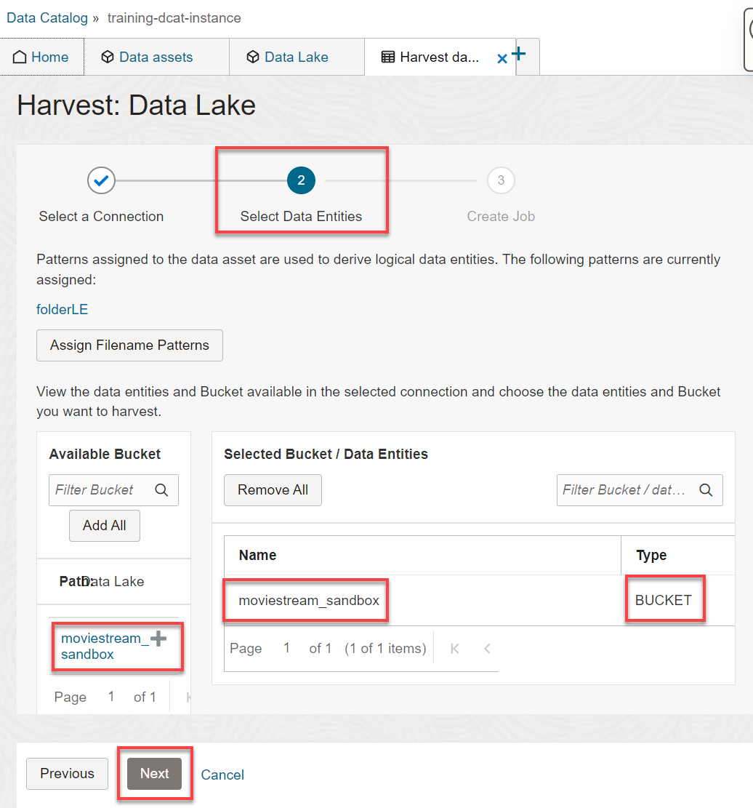

    >**Note:** You can use this page to view and add the bucket(s) and/or data entities you want to harvest from the **Available Buckets** section. Click the **Plus** icon for each data entity you want to include in the harvest job. Click a bucket link to display its nested data entities. Click the **Plus** icon next to each data entity that you want to include in the harvest job. You can also search for a bucket or entity using the **Filter Bucket** and **Filter Bucket / data entities** search boxes.

7. Click **Next**. The **Create Job** page of the **Harvest** wizard (Step 3 of 3) is displayed. Specify the following for the job details:

    * **Job Name:** Enter `Harvest_Data_Lake_Funding_Bucket`.
    * **Job Description:** Enter an optional description.
    * **Incremental Harvest:** Select this check box. This indicates that subsequent runs of this harvesting job will only harvest data entities that have changed since the first run of the harvesting job.
    * **Include Unrecognized Files:** Leave this check box unchecked. Select this check box if you want Data Catalog to also harvest file formats that are not currently supported such as `.log`, `.txt`, `.sh`, `.jar`, and `.pdf`.
    * **Include matched files only:** Select this check box. If you are harvesting an Oracle Object Storage data asset, select this check box if you want Data Catalog to harvest only the files that match the assigned filename patterns that you specified. When you select this check box, the files that do not match the assigned filename patterns are ignored during the harvest and are added to the skipped count.
    * **Time of Execution:** Select one of the three options to specify the time of execution for the harvest job:
    * **Run job now**: Select this option (default). This creates a harvest job and runs it immediately.
    * **Schedule job run**: Displays more fields to schedule the harvest job. Enter a name and an optional description for the schedule. Specify how frequently you want the job to run from the **Frequency** drop-down list. Your choices are **Hourly**, **Daily**, **Weekly**, and **Monthly**. Finally, select the start and end time for the job. You will not use this option, it is only selected for informational purposes.

        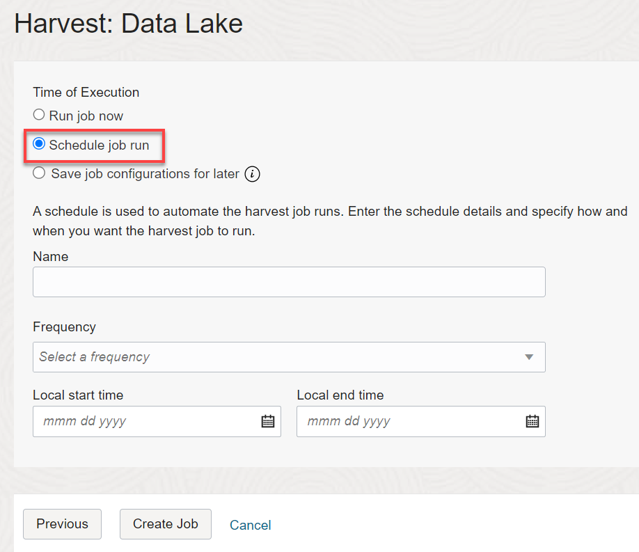

    * **Save job configurations for later**: Creates a job to harvest the data asset, but the job is not run.

        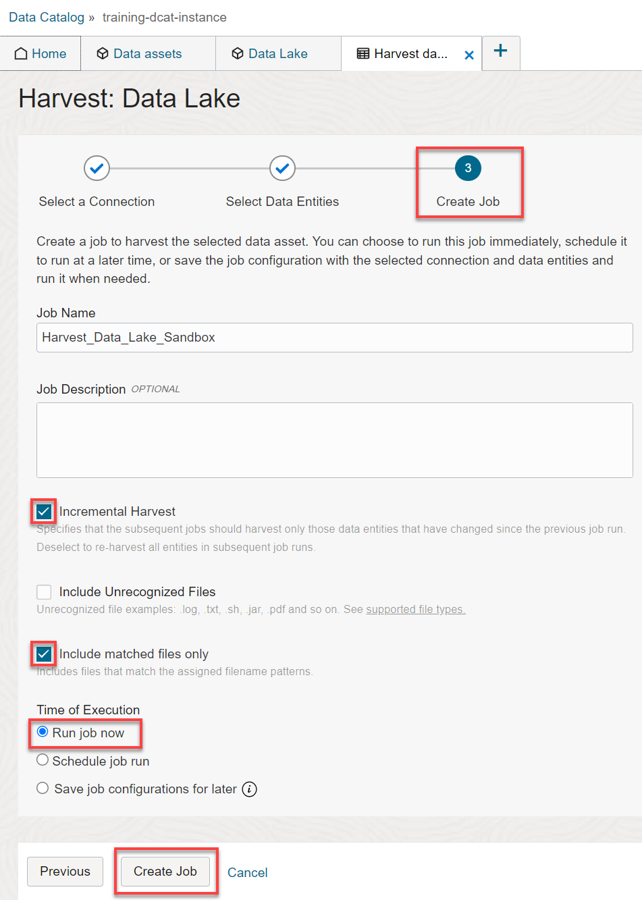

8. Click **Create Job**. A message is briefly displayed about the job execution starting. The **Jobs** tab is displayed and the job is displayed in the list of jobs. If the harvest is successful, the harvest job **Last run status** column displays **Succeeded**. To display the job details, click the job name link in the **Name** column.

    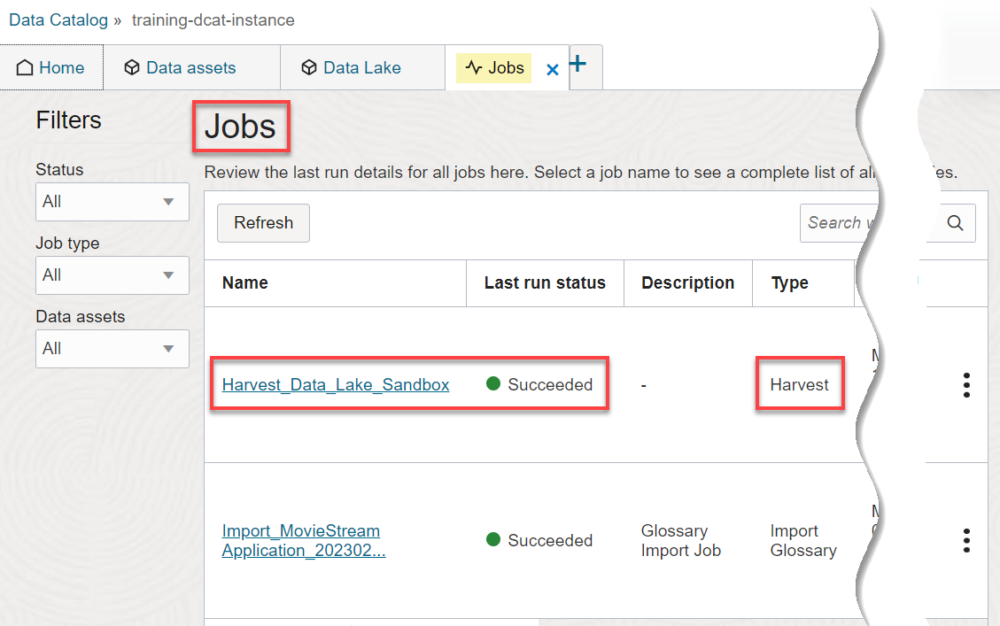

9. The harvest job name tab is displayed. On the **Jobs** tab, click the job name link to track the status of your job and view the job details. The **Logical data entities harvested** field shows **3** as the number of logical entities that were harvested using the filename pattern that you assigned to this Object Storage asset. This number represents the number of sub-folders under the **`loanapp_funding`** root bucket. There are **3** corresponding files under the sub-folder under the root bucket. You can drill-down on the **Log Messages** icon to display the job log. When done, you can close the **Harvest** and the **Jobs** tabs.

    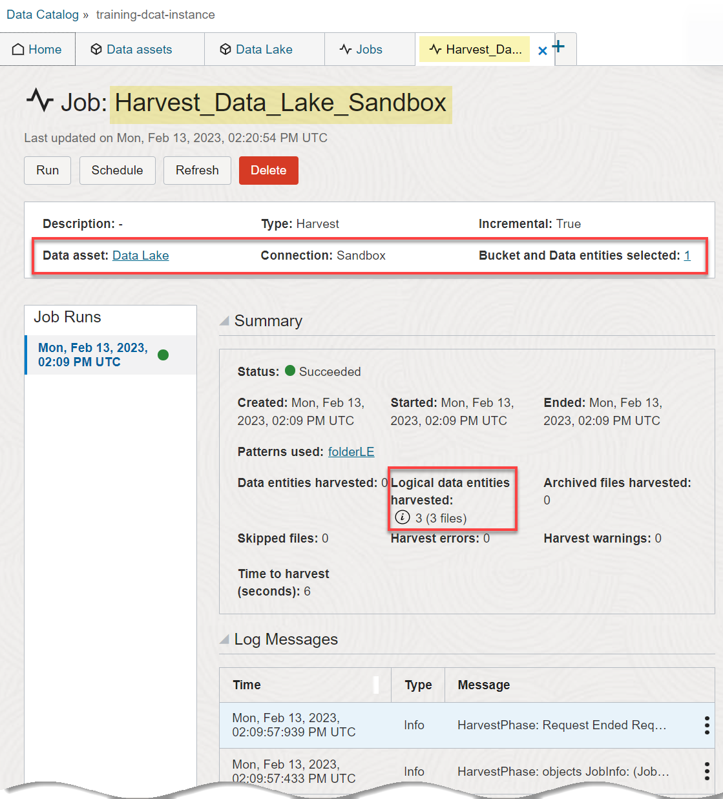

    > **Note:** The **logical data entities harvested** and the corresponding number of files shown in the above image might not match your results in all three harvesting jobs. The three buckets that we are using in this workshop are shared by several other workshops that will add more folders and files; therefore, your results will always have more logical entities and files than what we show here.

### Harvest the Data Entities from the _**moviestream\_landing**_ Object Storage Bucket

11. Return to the **Data Lake** tab from the previous step.

    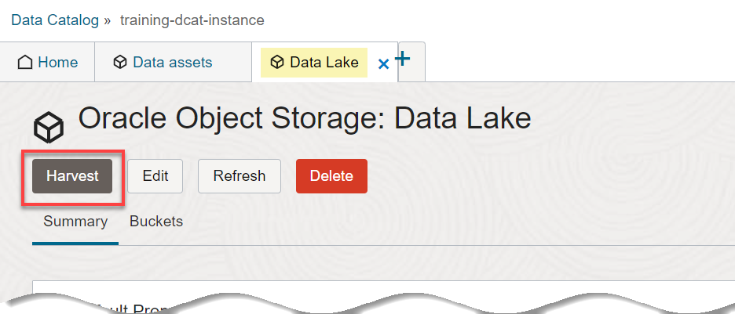

12. Click **Harvest**. The **Select a Connection** page of the **Harvest** wizard (Step 1 of 3) is displayed in the **Harvest Data Entities** tab. Select the **`Landing`** connection from the **Select a connection for the data asset you want to harvest** drop-down list. Click **Next**.

13. The **Select Data Entities** page of the **Harvest** wizard (Step 2 of 3) is displayed. The **`moviestream_landing`** bucket is already displayed in the **Available Bucket** section. Click the **Plus** icon next it to add it to the **Selected Bucket / Data Entities** section to include it in the harvest job.

    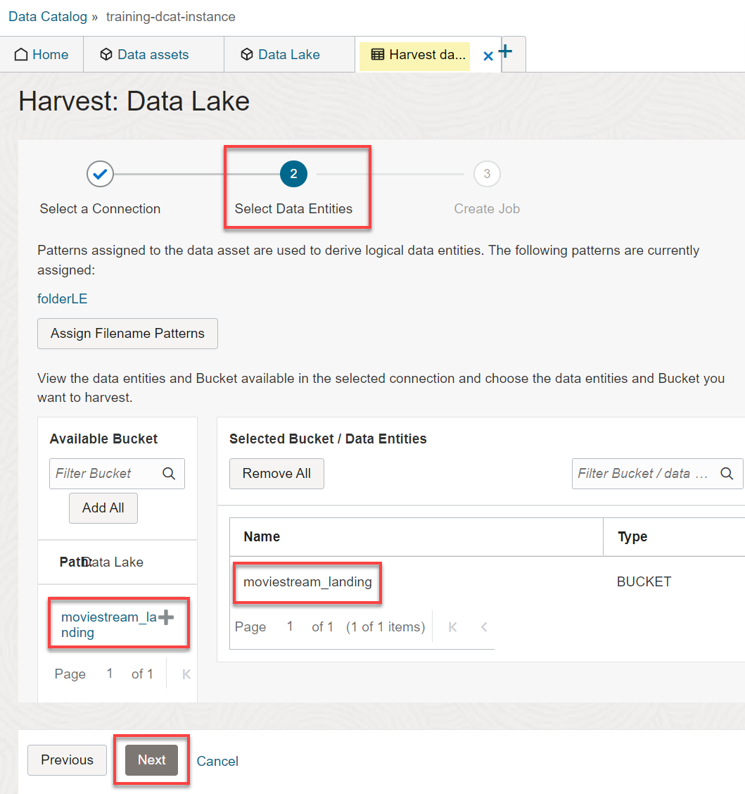

14. Click **Next**. The **Create Job** page of the **Harvest** wizard (Step 3 of 3) is displayed. Specify the following for the job details:

    * **Job Name:** Enter `Harvest_Data_Lake_Landing`.
    * **Job Description:** Enter an optional description.
    * **Incremental Harvest:** Select this check box.
    * **Include Unrecognized Files:** Leave this check box unchecked.
    * **Include matched files only:** Select this check box.
    * **Time of Execution:** Select the **Run job now** option (default). This creates a harvest job and runs it immediately.

        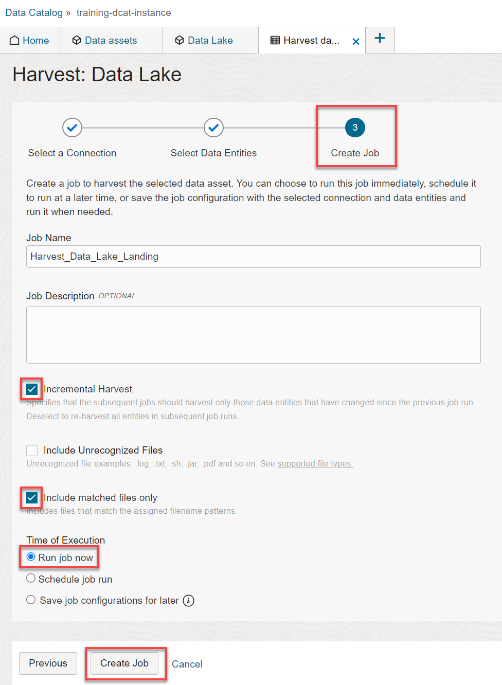

15. Click **Create Job**. A message is briefly displayed about the job execution starting. The **Jobs** tab is displayed and the job is displayed in the list of jobs. If you have left the **Jobs** tab open from the previous step, click **Refresh** to display the new **`Harvest_Data_Lake_Landing`** submitted job. If the harvest is successful, the harvest job **Last run status** column displays **Succeeded**. To display the job details, click the job name link in the **Name** column.

    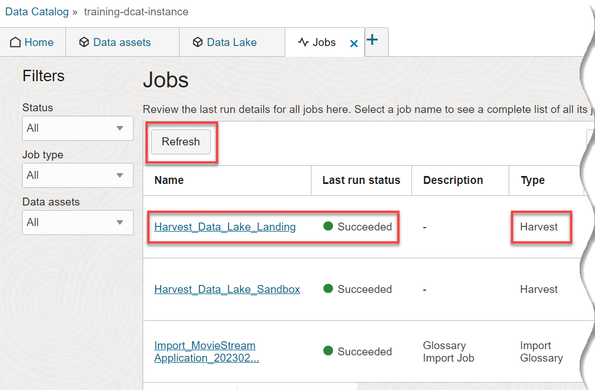

    >**Note:** If the **Jobs** tab was already displayed from the previous harvesting job, click **Refresh** to display the **`Harvest_Data_Lake_Landing`** job.

16. The harvest job name tab is displayed. On the **Jobs** tab, you can track the status of your job and view the job details. The **Logical data entities harvested** field shows **11** as the number of logical entities that were harvested using the filename pattern that you assigned to this Object Storage asset. This number represents the number of sub-folders under the **`moviestream_landing`** root bucket. There are **57** corresponding files under the sub-folders under the root bucket. You can drill-down on the **Log Messages** icon to display the job log. When done, you can close the **Harvest** and the **Jobs** tabs.

    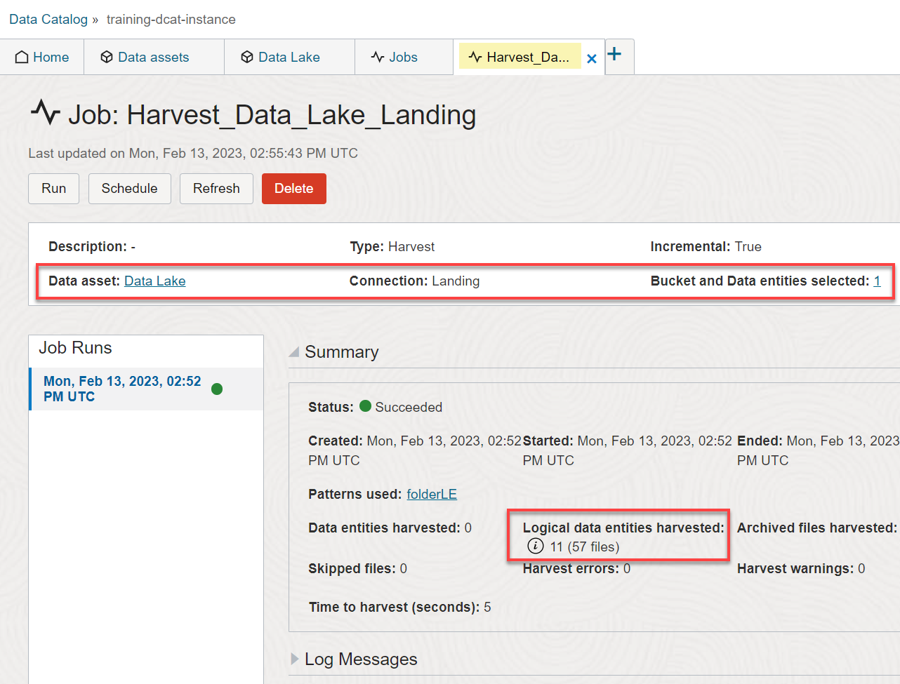

    > **Note:** The **logical data entities harvested** and the corresponding number of files shown in the above image might not match your results.

### Harvest the Data Entities from the _**moviestream\_gold**_ Object Storage Bucket

18. Return to the **Data Lake** tab from the previous step. If you have closed that tab, on the Data Catalog instance **Home** tab, in the **Quick Actions** tile, click **Browse Data Assets**. The **Browse Data Asset** tab is displayed that shows the **Oracle Object Storage: Data Lake** details.

19. Click **Harvest**. The **Select a Connection** page of the **Harvest** wizard (Step 1 of 3) is displayed in the **Harvest Data Entities** tab. Select the **`Gold`** connection from the **Select a connection for the data asset you want to harvest** drop-down list. Click **Next**.

20. The **Select Data Entities** page of the **Harvest** wizard (Step 2 of 3) is displayed. The **`moviestream-gold`** bucket is already displayed in the **Available Bucket** section. Click the **Plus** icon to add it to the **Selected Bucket / Data Entities** section to include it in the harvest job.

21. Click **Next**. The **Create Job** page of the **Harvest** wizard (Step 3 of 3) is displayed. Specify the following for the job details:

    * **Job Name:** Enter `Harvest_Data_Lake_Gold`.
    * **Job Description:** Enter an optional description.
    * **Incremental Harvest:** Select this check box selected.
    * **Include Unrecognized Files:** Leave this check box unchecked.
    * **Include matched files only:** Select this check box.
    * **Time of Execution:** Select the **Run job now** option.

        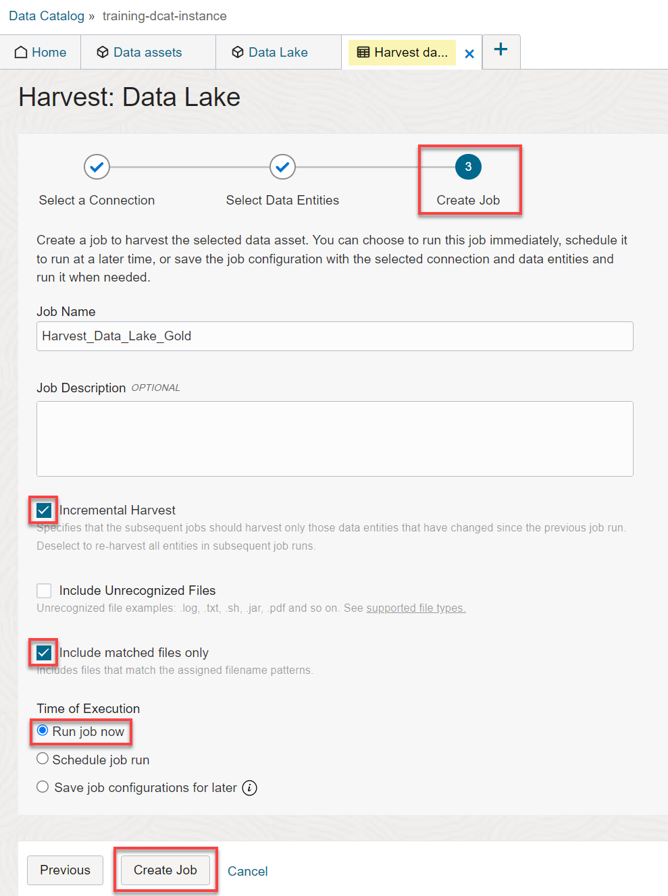

22. Click **Create Job**. The harvest job is created successfully and the **Jobs** tab is displayed. Click the job name link in the **Name** column.

    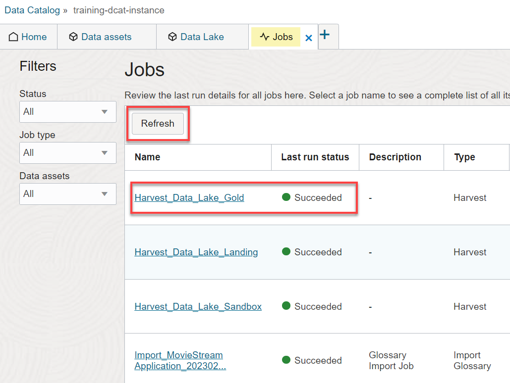

    >**Note:** If the **Jobs** tab was already displayed from the previous harvesting job, click **Refresh** to display the **`Harvest_Data_Lake_Gold`** job.

23. The harvest job name tab is displayed. On the **Jobs** tab, you can track the status of your job and view the job details.  The **Logical data entities harvested** field shows **4** as the number of logical entities that were harvested using the filename pattern that you assigned to this Object Storage asset. This number represents the number of sub-folders under the **`moviestream_gold`** root bucket. There are **27** corresponding files under the sub-folders under this root bucket.

    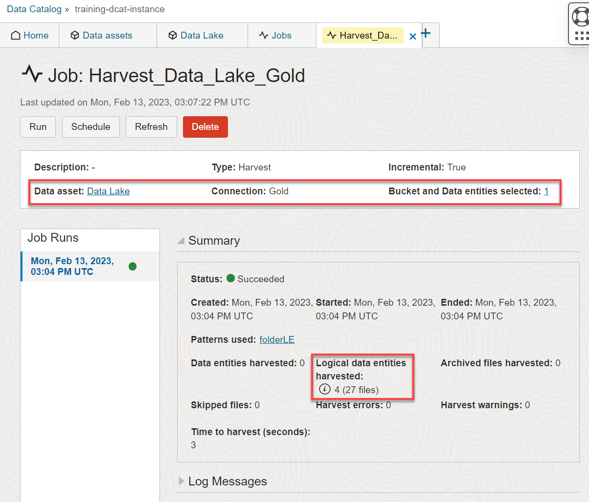

    > **Note:** The **logical data entities harvested** and the corresponding number of files shown in the above image might not match your results.

24. You can drill-down on the **Log Messages** icon to display the job log especially if there are errors or warnings. Close the **`Harvest_Data_Lake_Gold`** and **Jobs** tabs. When done, close all the tabs except the **Home** tab.

    After you harvest your data asset, you can browse or explore your data asset to view the data entities and attributes.

## Task 5: View Harvested Data Entities

1. On the Data Catalog instance **Home** tab, click **Data entities**.

    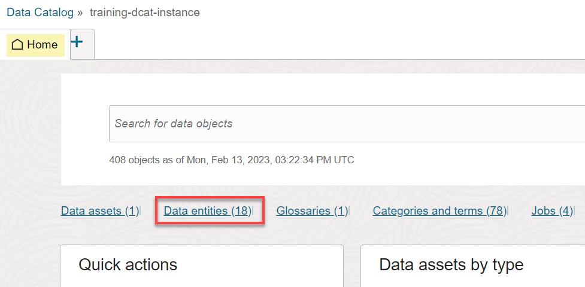

    > **Note:** The number of **Data Entities** shown in the above image might not match your results.

    The **Data Entities** tab is displayed along with the logical entities that were derived from the three Object Storage buckets during the harvesting process. You can use the different **Filters** on the page to refine the **Data Entities** list.

    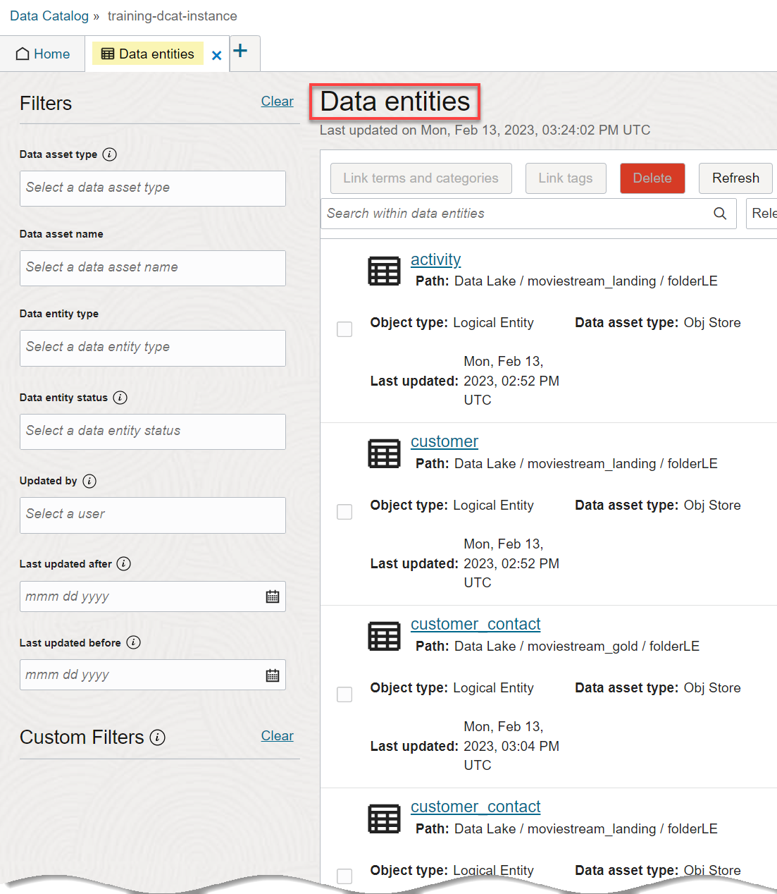

2. In the **Data Entities** list, click the name link for the data entity you want to view. Click the **`custsales`** logical data entity that was derived from the **`moviestream_gold`** bucket.

    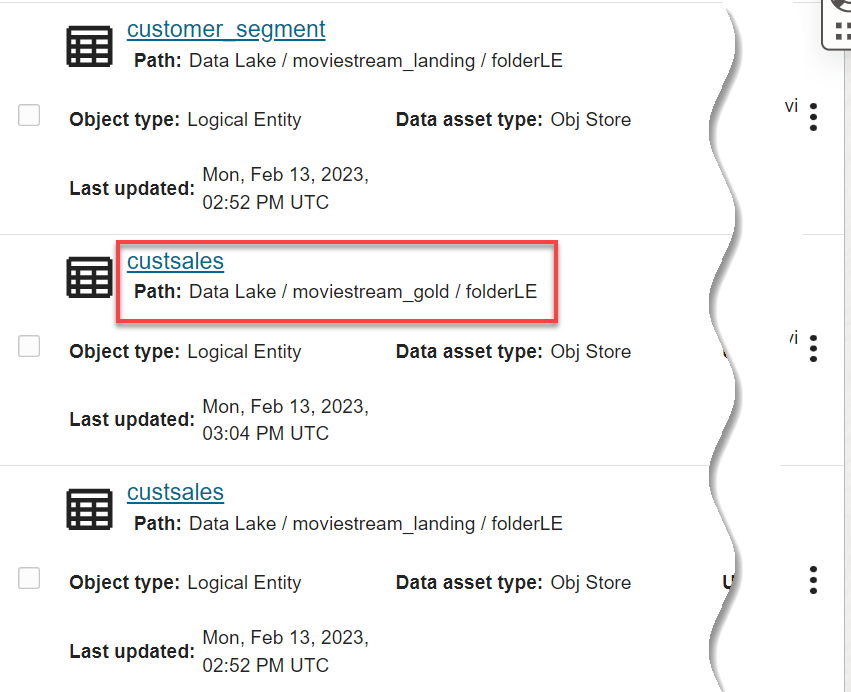

3. View the default properties, custom properties, tags, business glossary terms and categories, and recommendations, if any, for the data entity from the **Summary** tab.

    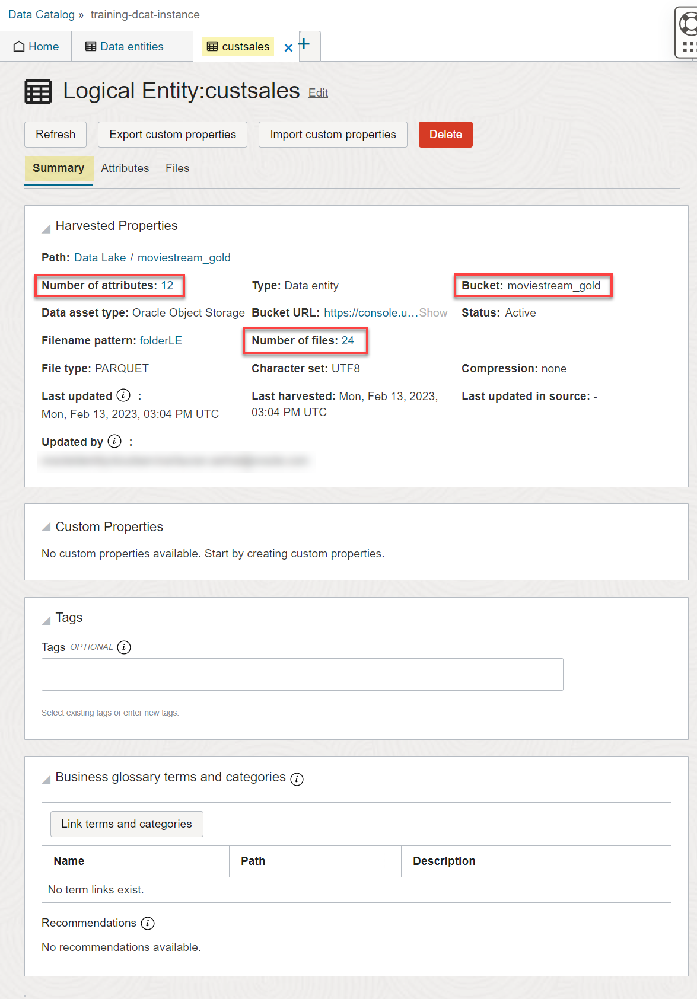

4. From the **Attributes** tab, view the data entity attribute details. When done, close all the tabs except the **Home** tab.

    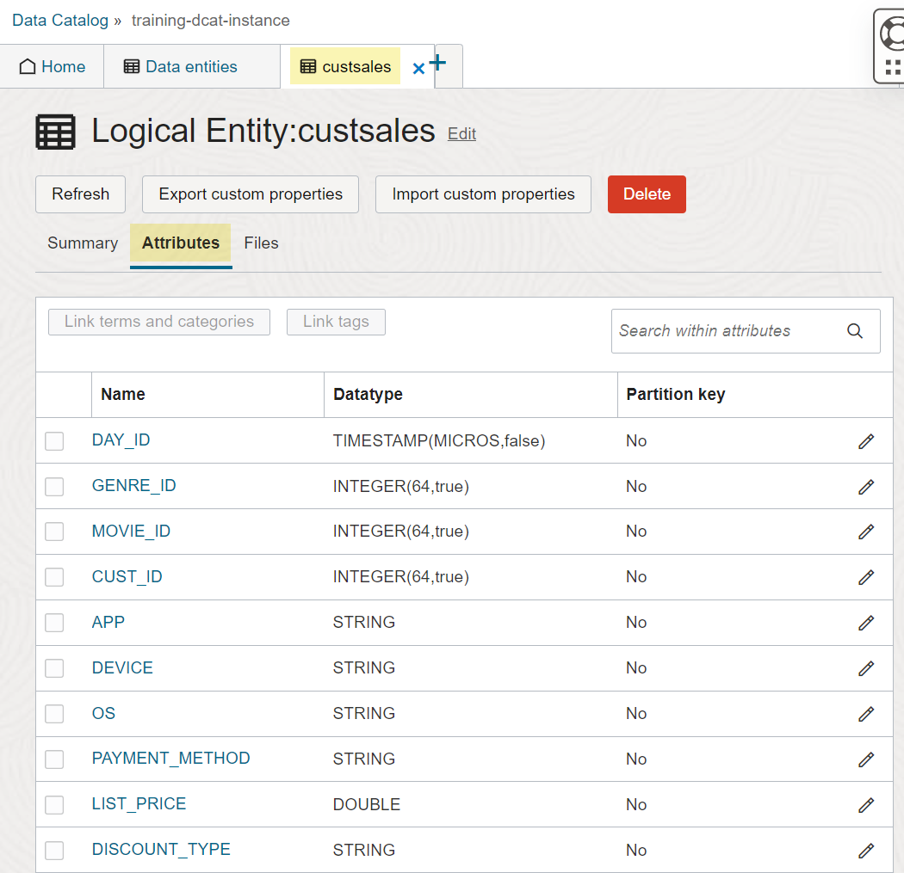

## Task 6: Customize the Business Name for the Object Storage Buckets

Customize the business names for each of the three Oracle Object Storage buckets that you use in this workshop.
When you later perform the synchronization process between your ADB and Data Catalog instances, the schemas and tables are created automatically for you. By default, the names of the schemas will start with **DCAT$** concatenated with the data asset's name, **`Data Lake`**, and the folder's (bucket's) name such as **`moviestream_sandbox`**. All three bucket names start with **`moviestream_`** followed by **`sandbox`**, **`landing`**, or **`gold`**. To make the generated schema names a bit shorter, you will customize the business name for each bucket and remove the **`moviestream_`** prefix from their names. For example, the generated schema name for the **`moviestream_sandbox`** will be **`DCAT$DATA_LAKE_SANDBOX`** instead of **`DCAT$DATA_LAKE_MOVIESTREAM_SANDBOX`**.
>**Note:** Later in this workshop, you will also provide a shorter custom property override that will be used in the schemas names instead of the data asset name.

1. On the **`training-dcat-instance`** **Home** page, click **Browse data assets** in the **Quick actions** tile.

    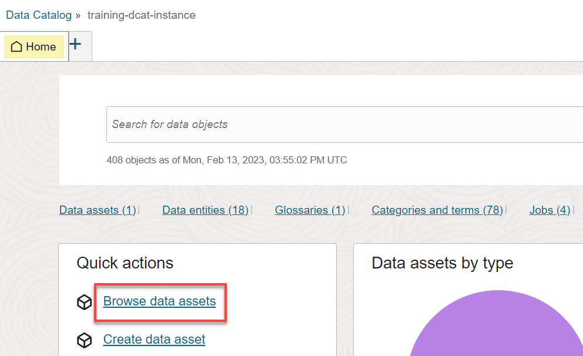

2. If you only have the one Data Asset created in this workshop, the **Oracle Object Storage: Data Lake** page is displayed.

3. Click the **Buckets** tab. The three Oracle Object Storage buckets are displayed. If the buckets are not displayed, click the **Refresh** button.

    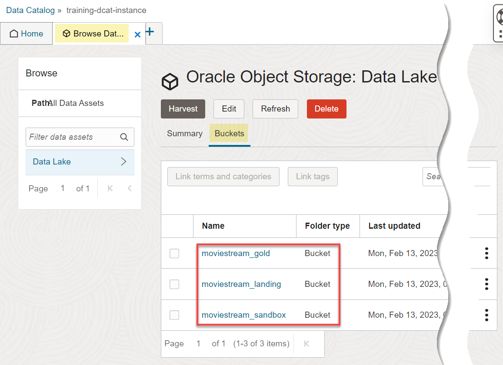

4. Click the **`moviestream_gold`** link in the **Name** column. The **Bucket: moviestream_gold** details tab is displayed. Click **Edit** next to the bucket's name.

    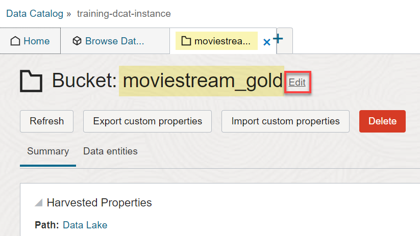

5. In the **Edit Name** panel, change the **Business Name** name to **Gold**, and then click **Save changes**. A **Successfully updated business name** message is displayed and the **Bucket: moviestream_gold** details tab is re-displayed. The bucket's new business name, **Gold**, is displayed. The **Original Name** field displays the bucket's original name.

    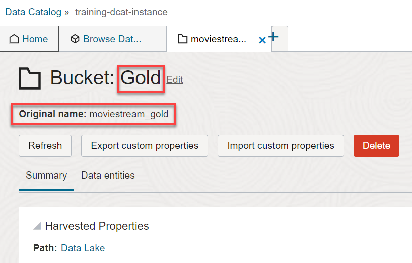

6. Close the **Bucket: moviestream_gold** details tab. The **Oracle Object Storage: Data Lake** page is displayed.

    >**Note:** If the new name, Gold, is not displayed, click **Refresh**.

    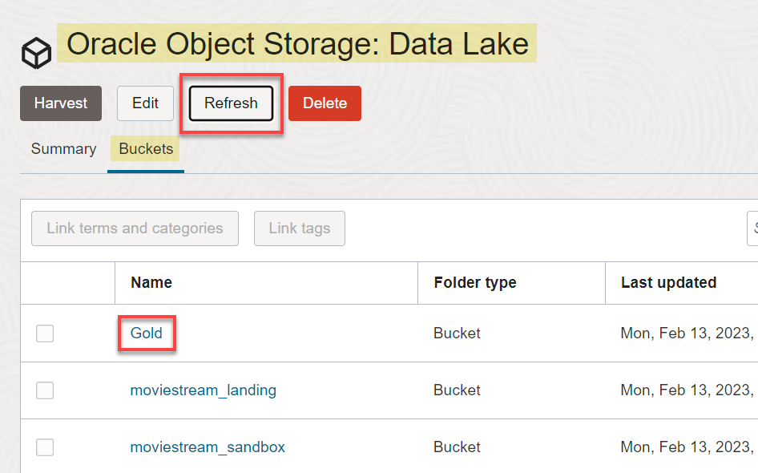

### Repeat the same above steps to rename the **`moviestream_landing`** bucket to **`Landing`**

8. On the **Oracle Object Storage: Data Lake** page, click the **Buckets** tab. The three Oracle Object Storage buckets are displayed.

9. Click the **`moviestream_landing`** link in the **Name** column. The **Bucket: moviestream_landing** details tab is displayed. In the **Summary** tab, click **Edit**.

10. In the **Edit Name** panel, change the **Business Name** to **Landing**, and then click **Save Changes**. A **Successfully updated business name** message is displayed and the **Bucket: moviestream_landing** details tab is re-displayed. The bucket's new business name is displayed. The **Original Name** field displays the bucket's original name.

11. Close the **Bucket: moviestream_landing** details tab. The **Oracle Object Storage: Data Lake** page is displayed.

    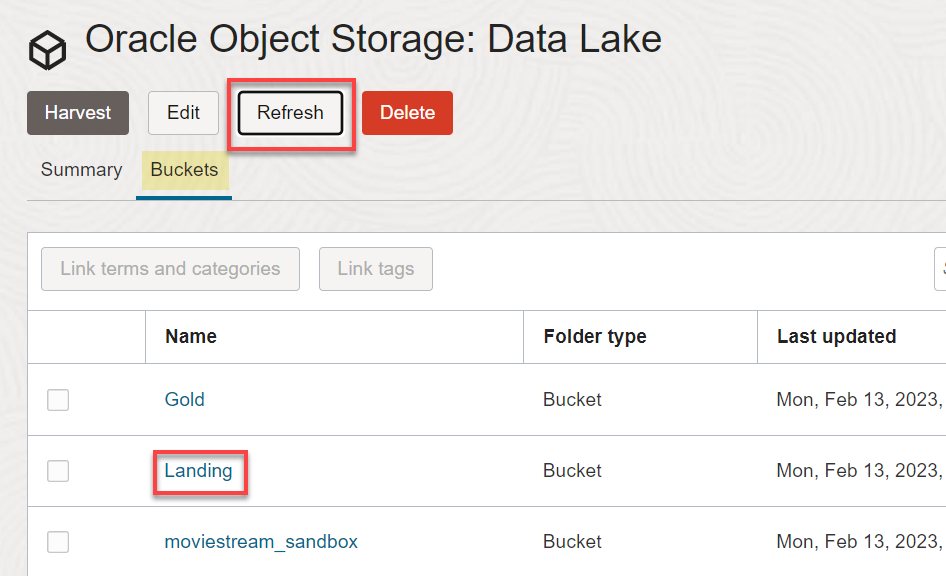

    >**Note:** If the new name, Landing, is not displayed, click **Refresh**.

### Repeat the same above steps to rename the **`moviestream_sandbox`** bucket to **`Sandbox`**

12. On the **Oracle Object Storage: Data Lake** page, click the **Buckets** tab.

13. Click the **`moviestream_sandbox`** link in the **Name** column. The **Bucket: moviestream_sandbox** details tab is displayed. In the **Summary** tab, click **Edit**.

14. In the **Edit Name** panel, change the **Business Name** to **Landing**, and then click **Save Changes**. A **Successfully updated business name** message is displayed and the **Bucket: moviestream_sandbox** details tab is re-displayed. The bucket's new business name is displayed. The **Original Name** field displays the bucket's original name.

15. Close the **Bucket: moviestream_sandbox** details tab. The **Oracle Object Storage: Data Lake** page is displayed.

    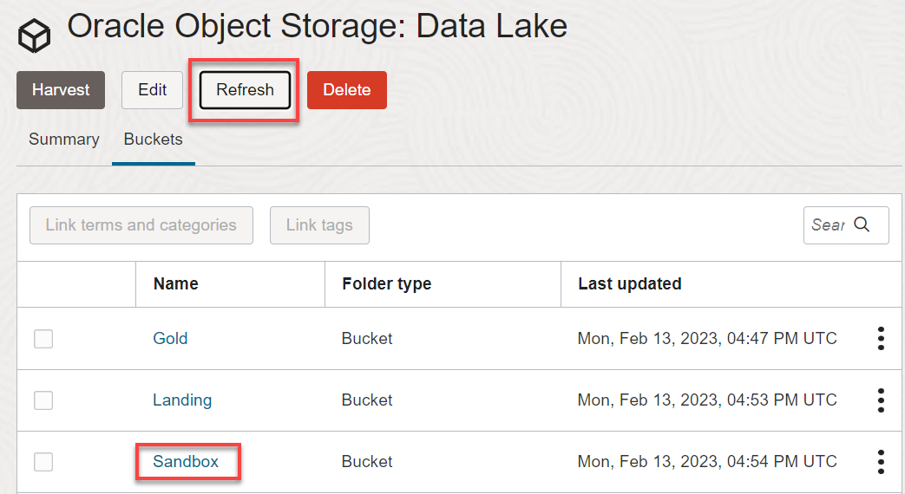

    >**Note:** If the new name, Sandbox, is not displayed, click **Refresh**.

    </if>

<!-- End freetier section of the lab -->


<!-- Begin liveLabs section of the lab -->

<if type="livelabs">
## Task 1: Launch the Workshop and Log in to the Oracle Cloud Console

If you already launched the workshop and logged in to the Console using the instructions in the **Get Started with LiveLabs** lab, you can skip this task and proceed to **Task 2**.

1. On the LiveLabs Home page, click the **My Reservations** tab to display your reserved workshop on the **My Reservations** page. To start the workshop, click the **Launch Workshop** link.

    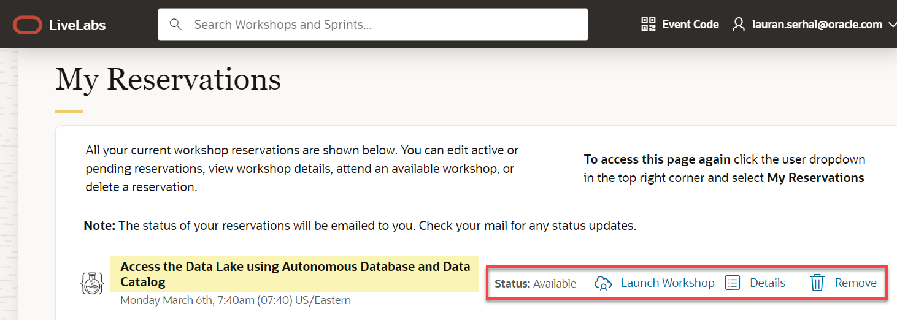

    The workshop is displayed in a new tab named **Run Workshop - Access the Data Lake using Autonomous Database and Data Catalog**. Click the **View Login Info** link in the banner.

    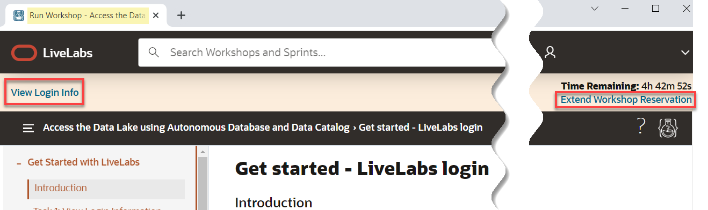

     The **Reservation Information** panel is displayed. This displays important information that you will need throughout this workshop.

    

2. Click **Copy Password** to copy your initial password, and then click **Launch OCI**.

3. On the Sign In page, in the **Oracle Cloud Infastructure Direct Sign-In** section, your assigned username is already displayed in the **User Name** field. Paste your password in the **Password** field, and then click **Sign In**.

    

4. The **Change Password** dialog box is displayed. Paste your assigned password that you copied in the **Current Password**. Enter a new password in the **New Password** and **Confirm New Password** fields, and then click **Save New Password**. Make a note of your new password as you will need it in this workshop.

    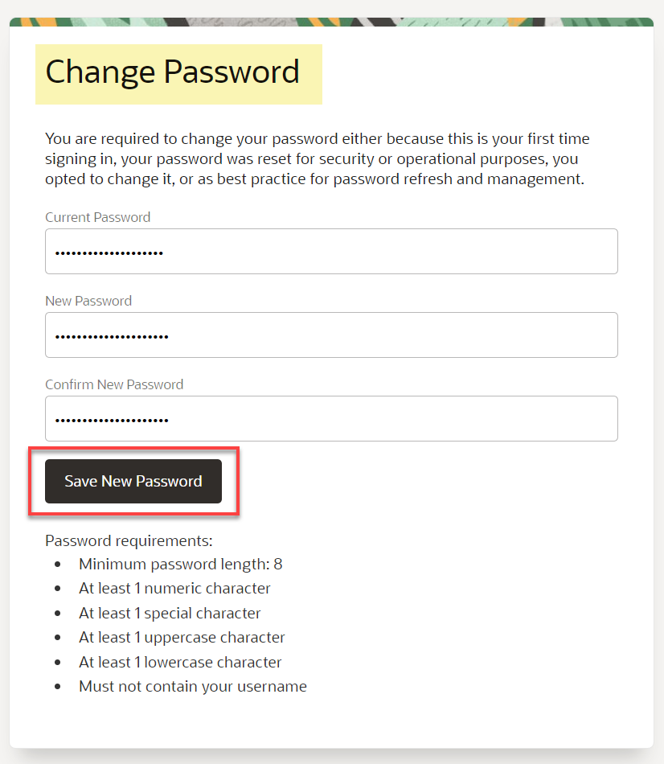

    The **Oracle Cloud Console** Home page is displayed. Make sure that the displayed region is the same that was assigned to you in the **Reservation Information** panel of the **Run Workshop *workshop-name*** page, **Canada Southeast (Toronto)** in this example.

    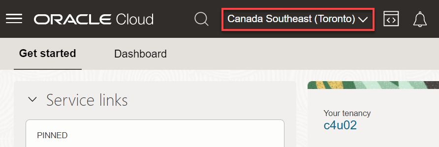

    >**Note:** Bookmark the workshop page for quicker access.

## Task 2: Create and Import a Glossary

In this task, you create a new and empty business glossary in your Data Catalog instance. Next, you import an existing glossary that you will download to your local file system into the new glossary. A business glossary is a managed vocabulary of business terms and concepts that can be used across your department or organization. A business glossary is organized in the hierarchy of categories, sub categories, and terms. Business concepts are common across teams or departments in an organization. When such common concepts are managed and organized formally through a business glossary, the teams within an organization are enabled to collaborate better and use the same vocabulary. For detailed information on using business glossaries, see [Using Business Glossaries](https://docs.oracle.com/en-us/iaas/data-catalog/using/enrich-business-glossary.htm) in the _Oracle Cloud Infrastructure_ documentation.

1. Open the **Navigation** menu and click **Analytics & AI**. Under **Data Lake**, click **Data Catalog**.

2. On the **Data Catalog Overview** page, click **Go to Data Catalogs**.

    

    The **Data Catalogs** page is displayed; however, your assigned resources for this workshop are all in your assigned LiveLabs compartment (that is displayed in the  **Reservation Information** panel) and not in the root tenancy. The following expected warning message is displayed.

    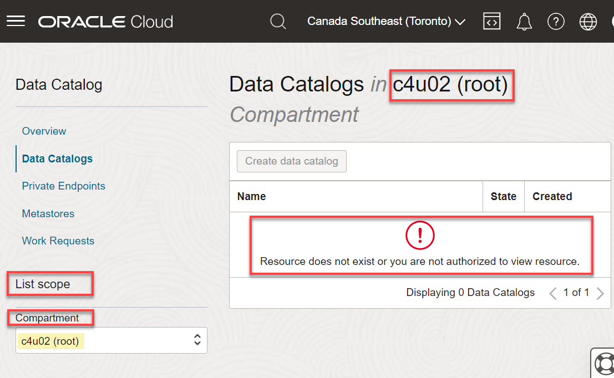

3. To select your assigned LiveLabs compartment, click the **Compartment** drop-down list in the **List Scope** section on the left. Enter your LiveLabs assigned compartment name in the **Compartment** text field to search for it which should look something like **LL#####-COMPARTMENT** where the **#####** is a unique five-digit number. Alternatively, you can drill-down on the **Livelabs** node and select your assigned compartment. When your assigned compartment is displayed in the list of compartments, select it. In addition, make sure that your LiveLabs assigned region from the **Run Workshop *workshop-name*** page is selected in Console's banner, **US West (Phoenix)** in our example.

    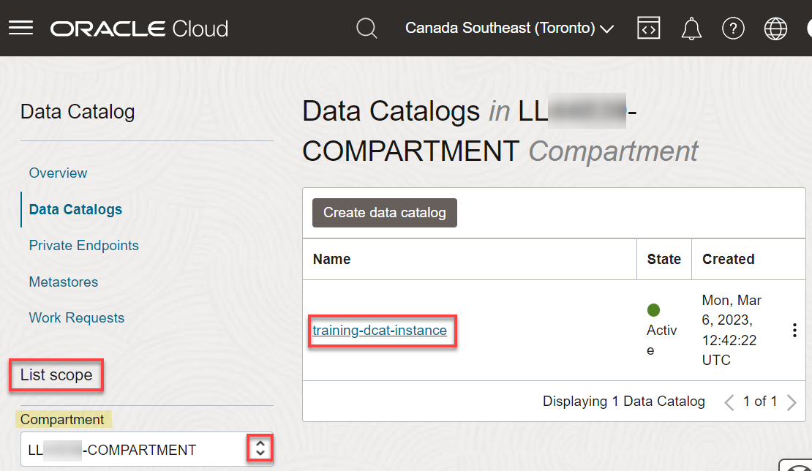

    >**Note:** Refer to the **Reservation Information** panel that you can access from the **Run Workshop *workshop-name*** tab for information about your assigned resources.

    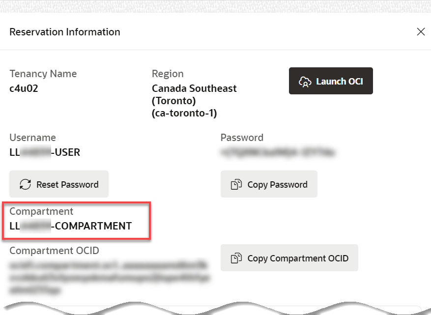

4. On the **Data Catalogs** page, click the **`training-dcat-instance`** Data Catalog in the **Name** column.

   

5. The Data Catalog **Home** page is displayed. Click the **Glossaries** link.

   

   The **Glossaries** tab is displayed.

   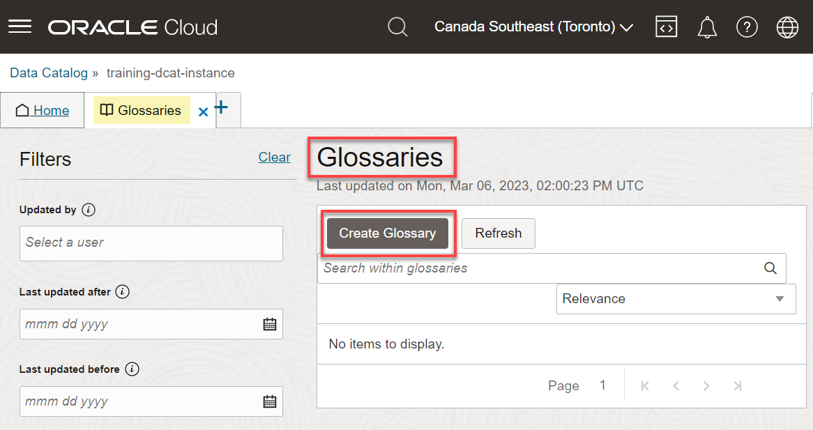

6. Click **Create Glossary**. The **Create Glossary** panel is displayed. Enter **`MovieStream Application`** in the **Name** field, a description, and then click **Create**.

   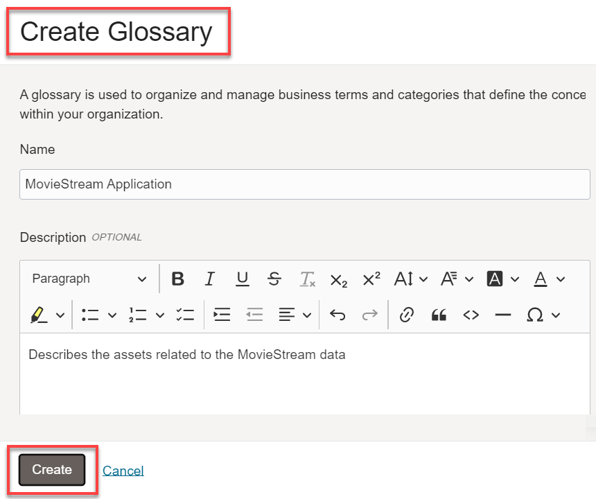

   The **MovieStream Application** glossary tab is displayed.

   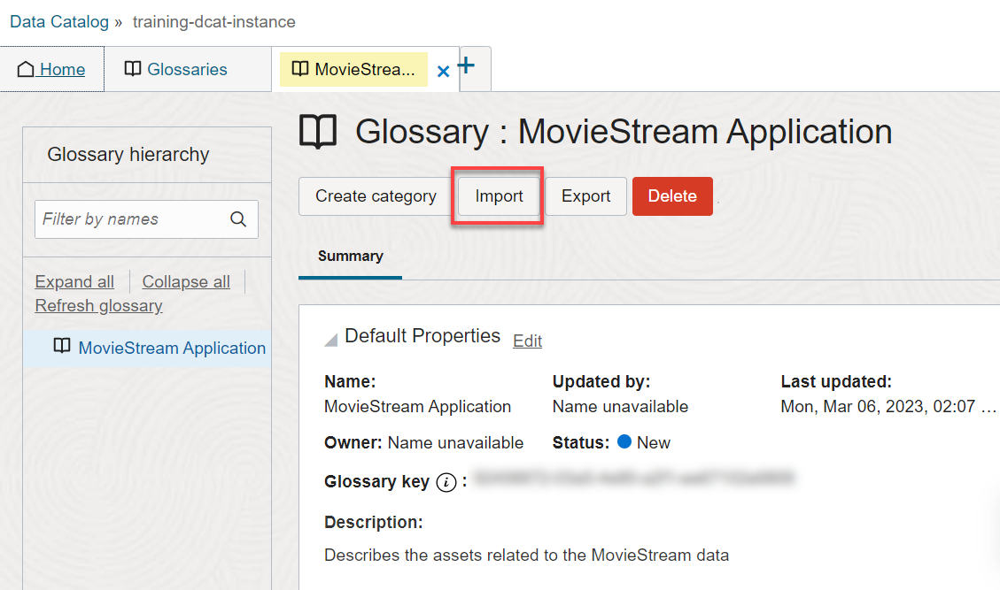

7. Copy the following URL that represents a glossary that was exported from a different Data Catalog instance. You will import this glossary into your new glossary that you created.

    ```
    <copy>https://objectstorage.us-ashburn-1.oraclecloud.com/n/c4u04/b/moviestream_scripts/o/dcat/MovieStream%20ApplicationExport.xlsx</copy>
    ```

8. Click **Import**. A **Note** message box is displayed indicating that some rich text formatting might be modified or lost on import. Click **Proceed**.

9. In the **Open** dialog box for your local system, paste the URL that you copied in the **File name** text box. Make sure that the **Custom Files (.csv; .xlsx)** type is selcted in the second drop-down field, and then click **Open**.

    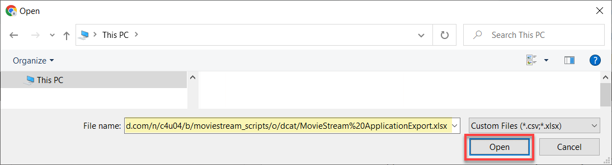

10. An import job is triggered and an **Initiated MovieStream Application import job** message is displayed. You can click the **View Job** link in the message to view the details of this job. When the job is completed successfully, the contents of the Excel file are imported into your glossary.

    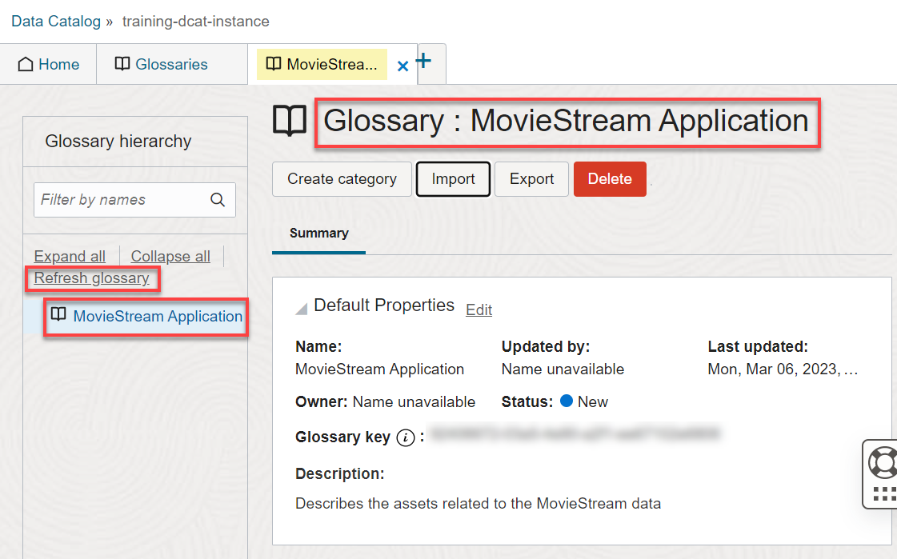

11. The imported glossary is displayed in the **Glossary Hierarchy** pane on the left. You can also click **Expand all** to view all of the details. The children of the **MovieStream Application** glossary are displayed. If the glossary details are not displayed, click **Refresh glossary**.

   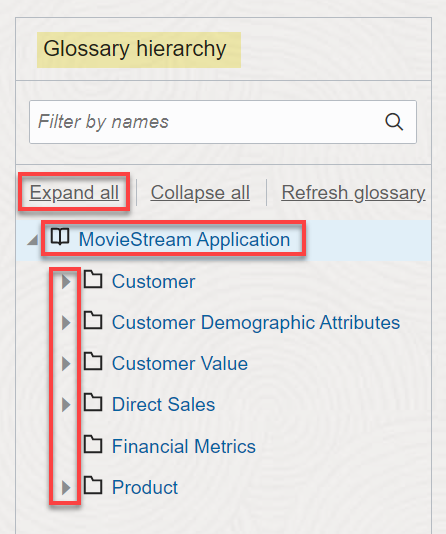

    >**Note:** The categories and terms created within a glossary are displayed in the **Glossary Hierarchy** tree navigation list. Expand each category to view terms created within that category. The summary information changes as you click different nodes in the glossary tree. You can use Expand All or Collapse All to expand or collapse all the nodes available in the glossary respectively. You can also use the search bar to search for categories and terms. If the glossary children are not displayed, click **Refresh glossary**.

12. Close the **Glossaries** and **MovieStream Application** tabs. The Data Catalog instance **Home** tab is re-displayed. The added glossary along with the categories and terms are reflected in the highlighted Glossary link.

    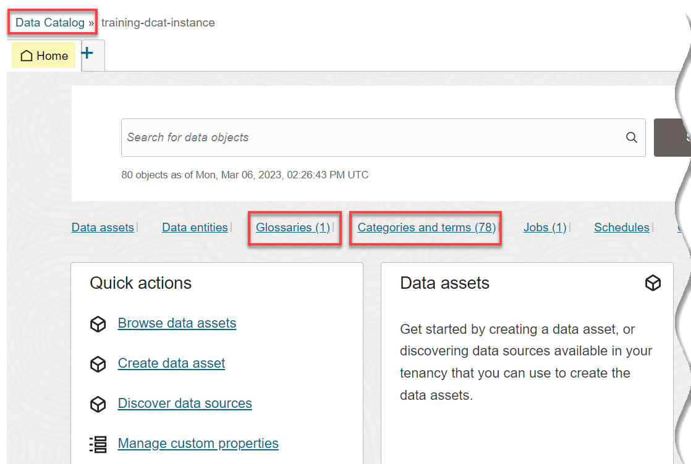

13. Click the **Data Catalog** link in the breadcrumbs to return to the **`training-dcat-instance`** **Home** page.

## Task 3: Create an Oracle Object Storage Data Asset

Register your Oracle Object Storage data sources with Data Catalog as a data asset.

1. In the **Data assets** tile, click **Create data asset**.

    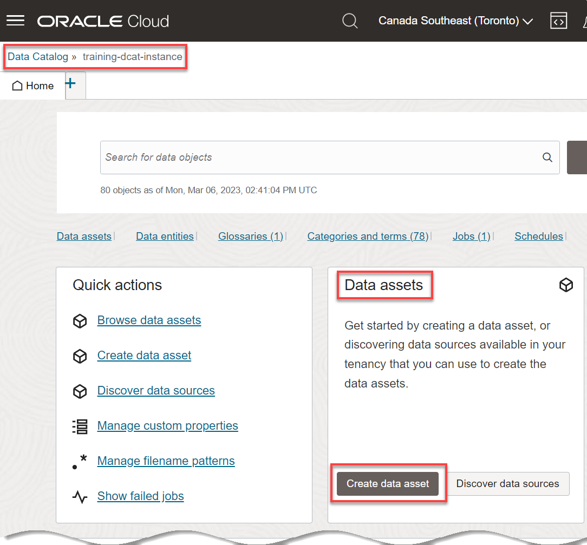

2. In the **Create Data Asset** panel, specify the data asset details as follows:

    * **Name:** **`Data Lake`**.
    * **Description:** **`Data Asset to access Oracle Object Storage buckets in a different tenancy than yours using public PARs`**.
    * **Type:** Select **Oracle Object Storage** from the drop-down list.
    * **URL:** This is the swift URL for the OCI Object Storage resource that you will use in this lab. The URL field is automatically populated using your own **Home Region**. In this workshop, the buckets that we will use are in the `us-ashburn-1`. If the **URL** that is automatically populated doesn't show this region, edit it to show the following URL.

        ```
        https://swiftobjectstorage.us-ashburn-1.oraclecloud.com
        ```
        >**Note:** In this lab, you will be accessing three Oracle Object Storage buckets that contain the data using three public pre-authenticated requests (PARs) that are provided for you. The three buckets are located in the **c4u04** tenancy in the **us-ashburn-1** region. In the next step, you'll add three data connections to this data asset using the three pre-authenticated requests (PARs). Note that if you were using an Oracle Object Storage data asset type instead of PAR, you would only need one data connection instead of three. For information on PARs, see [Using Pre-Authenticated Requests](https://docs.oracle.com/en-us/iaas/Content/Object/Tasks/usingpreauthenticatedrequests.htm) in the _Oracle Cloud Infrastructure_ documentation.

    * **Namespace:** Enter **c4u04**. This is tenancy where the three Oracle Object Storage buckets that you will harvest are located.

        

3. Click **Create**. A `Data Asset created successfully` message box is displayed. The **Data Lake** tab is displayed. The details for the new data asset are displayed in the **Summary** tab.

    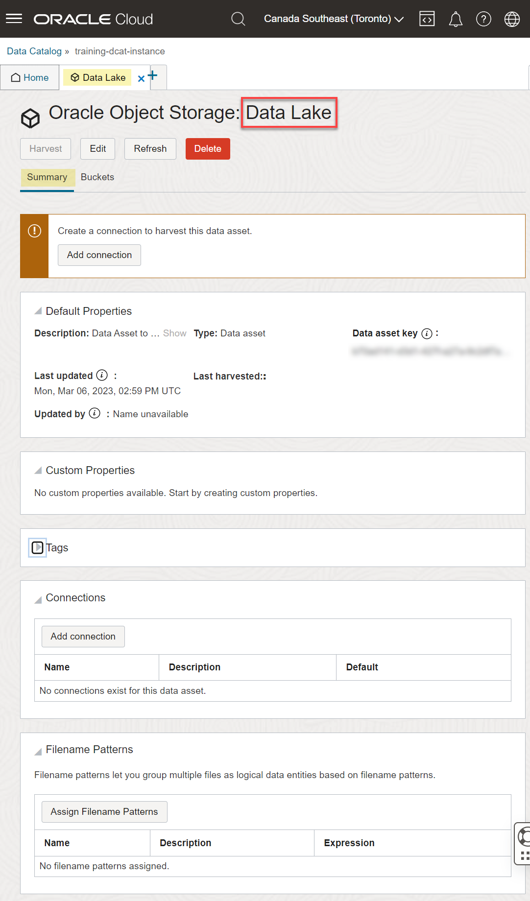

## Task 4: Add Three Data Asset Connections to the Oracle Object Storage Buckets

After you register a data source as a data asset in your data catalog, you create data connections to your data asset to be able to harvest it. You can create multiple connections to your data source. At least one connection is needed to be able to harvest a data asset. In this lab, you will create three data connections to access the **moviestream\_sandbox**, **moviestream\_landing**, and **moviestream\_gold** Oracle Object Storage buckets that contain the data. The three buckets are located in the **c4u04** tenancy; therefore, you will use three provided public pre-authenticated requests (PARs), one for each bucket. For information on PAR, see [Using Pre-Authenticated Requests](https://docs.oracle.com/en-us/iaas/Content/Object/Tasks/usingpreauthenticatedrequests.htm) in the _Oracle Cloud Infrastructure_ documentation.

### Add a connection to the **moviestream_sandbox** bucket to your new **`Data Lake`** data asset as follows:

1. On the **Data Lake** tab, in the **Summary** tab, click **Add Connection**.

    

2. In the **Add Connection** panel, specify the connection details for the **moviestream_sandbox** Object Storage bucket data source as follows:

    * **Name:** **`Sandbox`**.
    * **Description:** Enter an optional description.
    * **Type:** Select **Pre-Authenticated Request** from the **Type** drop-down list.
    * **Pre-Authenticated Request URL:** Click **Copy** to copy the following URL, and then paste it in this field.

        ```
        <copy>
        https://objectstorage.us-ashburn-1.oraclecloud.com/p/jTFkU1Mey2PizeVQDp2nkfpAV40OmI9rLejneNhQ9tNiDqkP4543H4Boy8gDaxos/n/c4u04/b/moviestream_sandbox/o/
        </copy>
        ```

    * **Make this the default connection for the data asset:** Leave this checkbox unchecked.

    

3. Click **Test Connection**. A message box is displayed indicating whether or not the test was successful.

4. If the test was successful, click **Add**. A message box is displayed indicating whether or not the connection was added successfully. The **`Sandbox`** data source connection is added to the data asset and is displayed in the **Connections** section.

    

### Add a connection to the **moviestream_landing** bucket to your new **`Data Lake`** data asset as follows:

5. On the **Data Lake** tab, in the **Summary** tab, in the **Connections** section, click **Add connection**.

    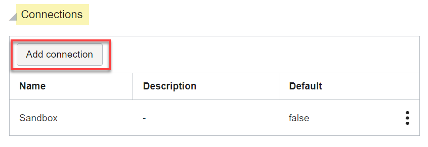

6. In the **Add Connection** panel, specify the connection details for the **moviestream_sandbox** Object Storage bucket data source as follows:

    * **Name:** **`Landing`**.
    * **Description:** Enter an optional description.
    * **Type:** Select **Pre-Authenticated Request** from the **Type** drop-down list.
    * **Pre-Authenticated Request URL:** Click **Copy** to copy the following URL, and then paste it in this field.

        ```
        <copy>
        https://objectstorage.us-ashburn-1.oraclecloud.com/p/YtpqXpUpPx1pPXFQa4Githwxx4bxp12q2yZJsCyzN0Y9-kpYr5nAOvLvwZfLHxXF/n/c4u04/b/moviestream_landing/o/
        </copy>
        ```

      * **Make this the default connection for the data asset:** Leave this checkbox unchecked.

       


7. Click **Test Connection**. A message box is displayed indicating whether or not the test was successful.

    


8. If the test was successful, click **Add**. A message box is displayed indicating whether or not the connection was added successfully. The **`Landing`** data source connection is added to the data asset and is displayed in the **Connections** section.

    

### Add a connection to the **moviestream_gold** bucket to your new **`Data Lake`** data asset as follows:

9. On the **`Data Lake`** tab, in the **Summary** tab, in the **Connections** section, click **Add Connection**.

10. In the **Add Connection** panel, specify the connection details for the **moviestream_gold** Object Storage bucket data source as follows:

    * **Name:** **`Gold`**.
    * **Description:** Enter an optional description.
    * **Type:** Select **Pre-Authenticated Request** from the **Type** drop-down list.
    * **Pre-Authenticated Request URL:** Click **Copy** to copy the following URL, and then paste it in this field.

        ```
        <copy>https://objectstorage.us-ashburn-1.oraclecloud.com/p/B4TMFWDOLh-EPrzE2ivDAfOlizm7IjpI_SY94QgUTGJNMX3jgh0jnQFAtPPZVcWq/n/c4u04/b/moviestream_gold/o/</copy>
        ```

    * **Make this the default connection for the data asset:** Leave this checkbox unchecked.

        

11. Click **Test Connection**. A message box is displayed indicating whether or not the test was successful.

    

12. If the test was successful, click **Add**. A message box is displayed indicating whether or not the connection was added successfully. The **`Gold`** data source connection is added to the data asset and is displayed in the **Connections** section.

    

## Task 5: Create a Filename Pattern and Assign it to your Oracle Object Storage Data Asset

Your data lake typically has a large number of files that represent a single data set. You can group multiple Object Storage files into logical data entities in Data Catalog using filename patterns. A filename pattern is a regular expression that is created to group multiple Object Storage files into a logical data entity that can be used for search and discovery. Using logical data entities, you can organize your data lake content meaningfully and prevent the explosion of your entities and attributes in your Data Catalog.
If an Object Storage file is matched with multiple filename patterns, it can be part of multiple logical data entities.

>**Note:** If you harvest your Object Storage data source files without creating filename patterns, Data Catalog creates an individual logical entity for each file under each root bucket. Imagine this situation with hundreds of files in your data source resulting in hundreds of data entities in your Data Catalog.

Create a filename pattern as follows:

1. On the **Data Lake** tab from the previous task, click the **Plus** tab, and then select **Filename Patterns** from the **Context** menu.

    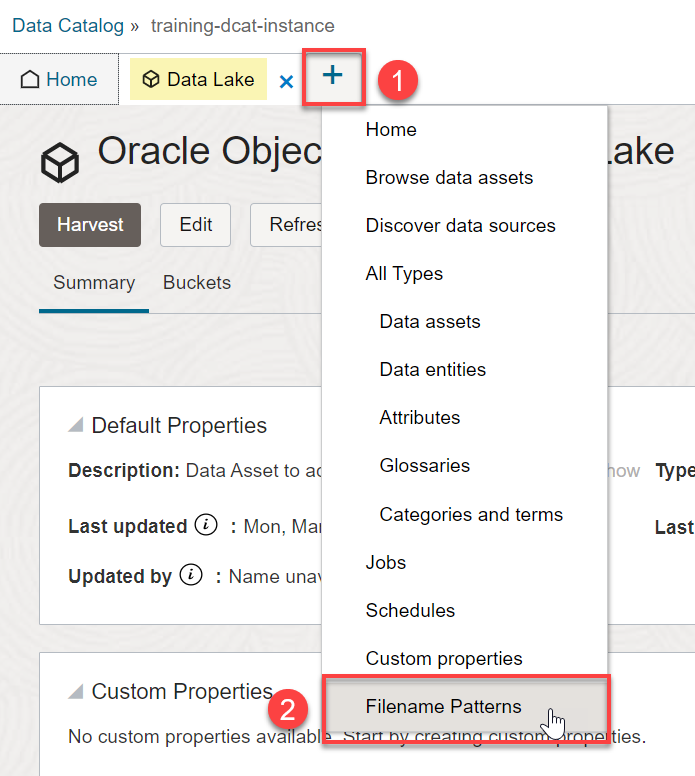

    The **Filename Patterns** tab is displayed.

    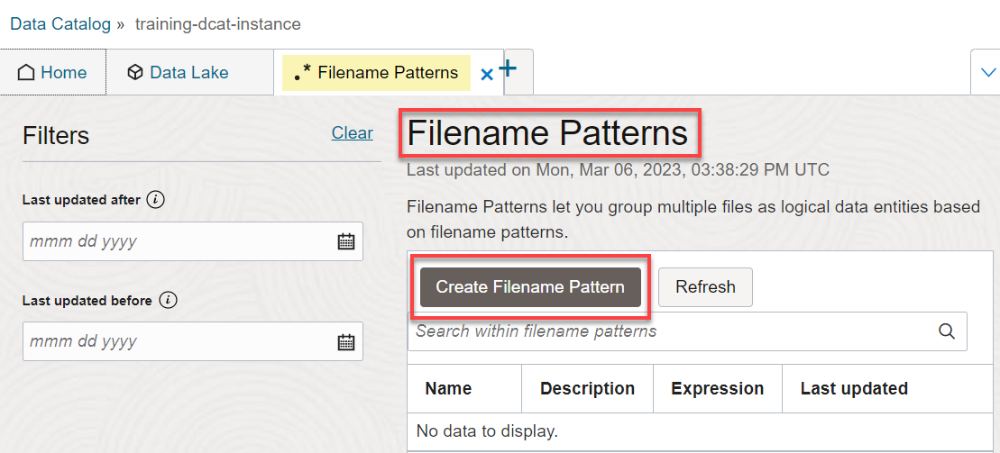

2. Click **Create Filename Pattern**. In the **Create Filename Pattern** panel, specify the following information:

    * **Name:** `folderLE`.
    * **Description:** `Map each Object Storage folder off the moviestream_sandbox, moviestream_landing, and moviestream_gold root buckets to Data Catalog Logical Entities using the selected regular expression`.
    * **Filename Pattern Option**: Select the **Regular expression** option.

        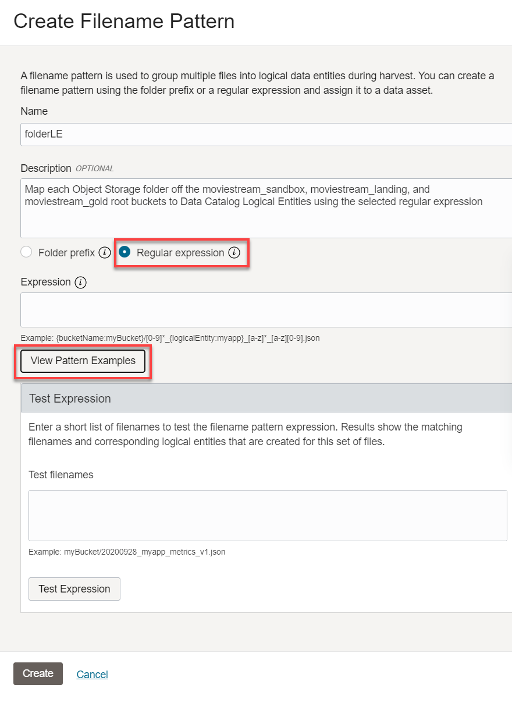

3. Click **View Pattern Examples** for examples file pattern styles, sample files, pattern expressions, and the resulting logical data entities that are derived based on the pattern expression. A list of different pattern examples is displayed. Scroll-down the page to the **Hive Style Folders Without Database** section, expand it, and then click **Select**.

    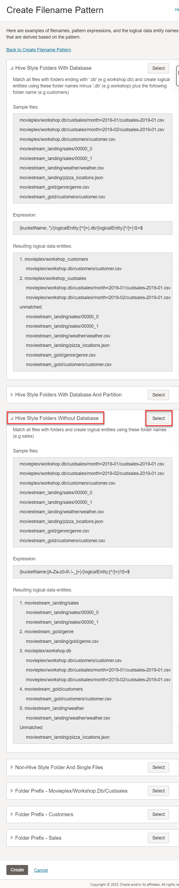

    The **Create Filename Pattern** panel is re-displayed. The selected file pattern is displayed in the **Expression** field and the respective test filenames are displayed in the **Test filenames** field.

    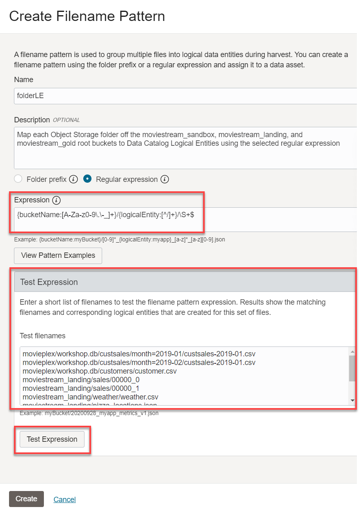

    Here's the explanation of the preceding regular expression:

    * **``{bucketName:[A-Za-z0-9\.\-_]+}``**:
    This section, between the opening and closing **{ }**, represents the derived bucket name. You can use the **`bucketName`** qualifier to specify that the bucket name should be derived from the path that matches the expression that follows. In this example, the bucket name is comprised of the characters leading up to first **`/`** character (which is outside the name section). **``[A-Za-z0-9\.\-_]``** stands for match anything contained within the brackets. The valid characters are **`A-Z`**, **`a-z`**, **`0-9`**, **\.** (period), **\-** (hyphen), and **\_** (underscore). The **`+`** (plus) indicates any number of occurrences of the preceding expression inside the **[ ]**.

    * **``{logicalEntity:[^/]+}``**:
    This section, between the second set of opening and closing **{ }**, represents the derived logical entity name. You can use the **`logicalEntity`** qualifier to specify that the logical entity name should be derived from the path that matches the expression that follows. In this example, the logical entity name is comprised of the characters leading up to the second **`/`** character (which is outside the name section). The logical entity name starts after the "/" and ends with the “/” following the closing "}". It can contain any character (+ sign) that is not a forward slash, `/` as represented by the not **`^`** (caret) symbol.

    * **\S+$**:
    Finally, the logical data entities names will be zero or more non-whitespace characters (represented by **`\S+`**). **$** signifies the end of the line.

4. Click **Test Expression**. The **Resulting Logical Entities** based on the regular expression that you specified are displayed.

    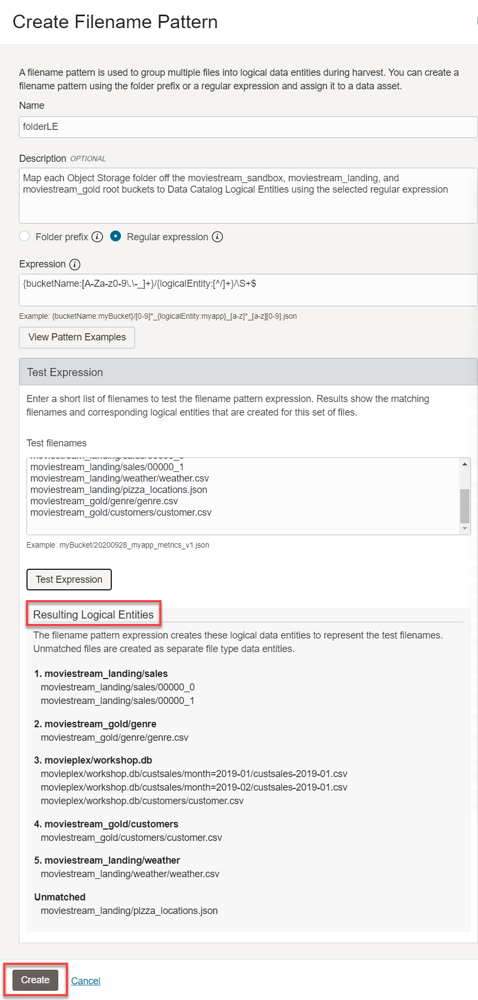

    A message box is displayed indicating whether or not the test was successful.

5. Click **Create**. The **File Patterns** tab is re-displayed. The newly created file pattern is displayed in the **Filename Patterns** list. You might need to click **Refresh** to display the file pattern.

    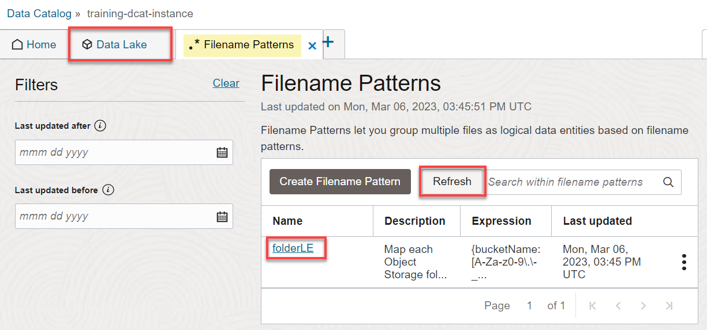

6. Click the **Data Lake** details tab to assign the filename pattern that you just created to your **Data Lake** data asset.

7. In the **Summary** tab on the **Data Lake** details tab, scroll-down the page to the **Filename Patterns** section, and then click **Assign Filename Patterns**.

    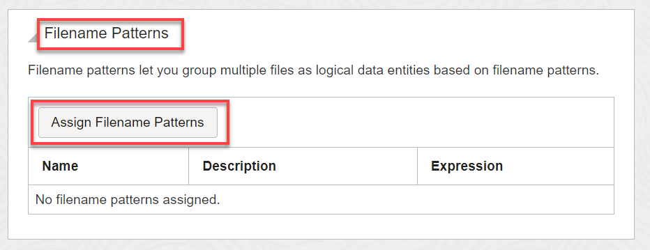

8. In the **Assign Filename Patterns** panel, select the checkbox next to the filename pattern(s) that you want to assign to this data asset, **folderLE**. You can use the **Filter** box to filter the filename patterns by name. You can also de-select already assigned filename patterns to un-assign them from this data asset.

    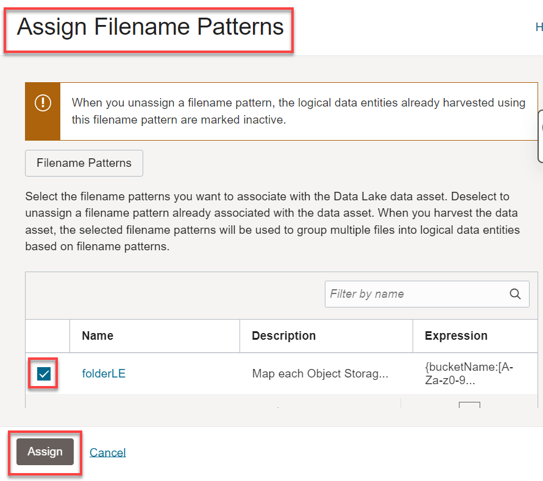

10. Click **Assign**. A message box is displayed indicating whether or not the file pattern assignment was successful. The selected filename pattern is assigned to the data asset. When you harvest the data asset, the filename pattern is used to derive logical data entities. The names of the files in the Object Storage bucket are matched to the pattern expression and the logical data entities are formed.

    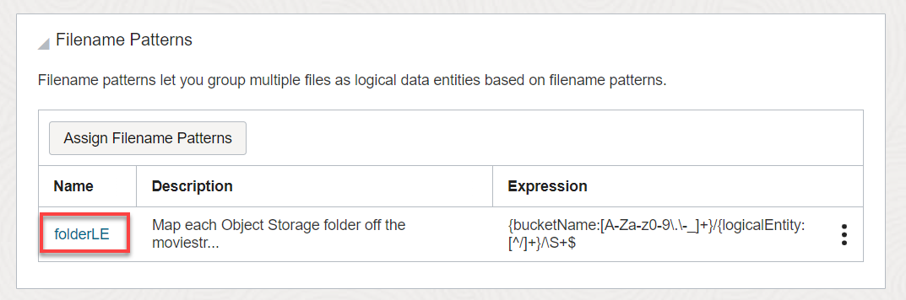

    >**Note:**
    When you assign a new filename pattern to a data asset, the status of any harvested logical data entities is set to **Inactive**. You need to harvest the data asset again to derive the valid logical data entities again.

## Task 6: Harvest the Data Asset

After you create a data asset in the Data Catalog repository, you harvest it to extract the data structure information into the Data Catalog and view its data entities and attributes. In this task, you will harvest the **moviestream\_sandbox**, **moviestream\_landing**, and **moviestream\_gold** Oracle Object Storage buckets that contain the data.

### Harvest the data entities from the **Data Lake** data asset starting with the _**moviestream\_sandbox**_ bucket.

1. Click the **Data Assets** tab which should still be displayed from the previous task. If it's not displayed, click the **+** icon in the Tabs toolbar, and then select **Data assets** from the context menu.

2. In the **Data Assets** list, click the **Data Lake** data asset.

    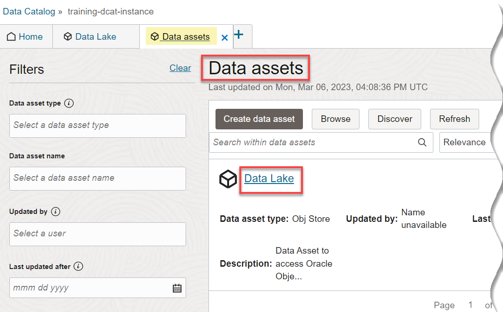

    The **Oracle Object Storage: Data Lake** page is displayed.

    

3. Click **Harvest**. The **Select a Connection** page of the **Harvest** wizard (Step 1 of 3) is displayed in the **Harvest Data Entities** tab. Select **`Sandbox`** from the **Select a connection for the data asset you want to harvest** drop-down list. Click **Next**.

    

4. The **Select Data Entities** page of the **Harvest** wizard (Step 2 of 3) is displayed. The **`moviestream-sandbox`** bucket is already displayed in the **Available Bucket** section. Click the **Plus** icon next it to add it to the **Selected Bucket / Data Entities** section to include it in the harvest job.

    

    >**Note:** You can use this page to view and add the bucket(s) and/or data entities you want to harvest from the **Available Buckets** section. Click the **Plus** icon for each data entity you want to include in the harvest job. Click a bucket link to display its nested data entities. Click the **Plus** icon next to each data entity that you want to include in the harvest job. You can also search for a bucket or entity using the **Filter Bucket** and **Filter Bucket / data entities** search boxes.

5. Click **Next**. The **Create Job** page of the **Harvest** wizard (Step 3 of 3) is displayed. Specify the following for the job details:

    * **Job Name:** Enter `Harvest_Data_Lake_Sandbox`.
    * **Job Description:** Enter an optional description.
    * **Incremental Harvest:** Select this check box. This indicates that subsequent runs of this harvesting job will only harvest data entities that have changed since the first run of the harvesting job.
    * **Include Unrecognized Files:** Leave this check box unchecked. Select this check box if you want Data Catalog to also harvest file formats that are not currently supported such as `.log`, `.txt`, `.sh`, `.jar`, and `.pdf`.
    * **Include matched files only:** Select this check box. If you are harvesting an Oracle Object Storage data asset, select this check box if you want Data Catalog to harvest only the files that match the assigned filename patterns that you specified. When you select this check box, the files that do not match the assigned filename patterns are ignored during the harvest and are added to the skipped count.
    * **Time of Execution:** Select one of the three options to specify the time of execution for the harvest job:
    * **Run job now**: Select this option (default). This creates a harvest job and runs it immediately.
    * **Schedule job run**: Displays more fields to schedule the harvest job. Enter a name and an optional description for the schedule. Specify how frequently you want the job to run from the **Frequency** drop-down list. Your choices are **Hourly**, **Daily**, **Weekly**, and **Monthly**. Finally, select the start and end time for the job. You will not use this option, it is only selected for informational purposes.

        

    * **Save job configurations for later**: Creates a job to harvest the data asset, but the job is not run.

        

6. Click **Create Job**. A message is briefly displayed about the job execution starting. The **Jobs** tab is displayed and the job is displayed in the list of jobs. If the harvest is successful, the harvest job **Last run status** column displays **Succeeded**. To display the job details, click the job name link in the **Name** column.

    

7. The harvest job name tab is displayed. On the **Jobs** tab, click the job name link to track the status of your job and view the job details. The **Logical data entities harvested** field shows **3** as the number of logical entities that were harvested using the filename pattern that you assigned to this Object Storage asset. This number represents the number of sub-folders under the **`moviestream_sandbox`** root bucket. There are **3** corresponding files under the sub-folder under the root bucket. You can drill-down on the **Log Messages** icon to display the job log. Close this tab.

    

    > **Note:** The **logical data entities harvested** and the corresponding number of files shown in the above image might not match your results. The buckets that we are using in this workshop are shared by several other workshops that will add more folders and files; therefore, your results will always have more logical entities and files than what we show here.

### Harvest the data entities from the _**moviestream\_landing**_ data asset.

8. Return to the **Data Lake** tab from the previous step.

    

9. Click **Harvest**. The **Select a Connection** page of the **Harvest** wizard (Step 1 of 3) is displayed in the **Harvest Data Entities** tab. Select **`Landing`** from the **Select a connection for the data asset you want to harvest** drop-down list. Click **Next**.

10. The **Select Data Entities** page of the **Harvest** wizard (Step 2 of 3) is displayed. The **`moviestream-landing`** bucket is already displayed in the **Available Bucket** section. Click the **Plus** icon next it to add it to the **Selected Bucket / Data Entities** section to include it in the harvest job.

    

11. Click **Next**. The **Create Job** page of the **Harvest** wizard (Step 3 of 3) is displayed. Specify the following for the job details:

    * **Job Name:** Enter `Harvest_Data_Lake_Landing`.
    * **Job Description:** Enter an optional description.
    * **Incremental Harvest:** Select this check box.
    * **Include Unrecognized Files:** Leave this check box unchecked.
    * **Include matched files only:** Select this check box.
    * **Time of Execution:** Select the **Run job now** option (default). This creates a harvest job and runs it immediately.

        

12. Click **Create Job**. A message is briefly displayed about the job execution starting. The **Jobs** tab is displayed and the job is displayed in the list of jobs. If you have left the **Jobs** tab open from the previous step, you need to refresh your browser to display the new **`Harvest_Data_Lake_Landing`** submitted job. If the harvest is successful, the harvest job **Last run status** column displays **Succeeded**. To display the job details, click the job name link in the **Name** column.

    

13. The harvest job name tab is displayed. On the **Jobs** tab, you can track the status of your job and view the job details. The **Logical data entities harvested** field shows **11** as the number of logical entities that were harvested using the filename pattern that you assigned to this Object Storage asset. This number represents the number of sub-folders under the **`moviestream_landing`** root bucket. There are **57** corresponding files under the sub-folders under the root bucket. You can drill-down on the **Log Messages** icon to display the job log. Close this tab.

    

    > **Note:** The **logical data entities harvested** and the corresponding number of files shown in the above image might not match your results.

### Harvest the data entities from the _**moviestream\_gold**_ Object Storage bucket.

14. Return to the **Data Lake** tab from the previous step.

15. Click **Harvest**. The **Select a Connection** page of the **Harvest** wizard (Step 1 of 3) is displayed in the **Harvest Data Entities** tab. Select **`Gold`** from the **Select a connection for the data asset you want to harvest** drop-down list. Click **Next**.

16. The **Select Data Entities** page of the **Harvest** wizard (Step 2 of 3) is displayed. The **`moviestream-gold`** bucket is already displayed in the **Available Bucket** section. Click the **Plus** icon to add it to the **Selected Bucket / Data Entities** section to include it in the harvest job.

17. Click **Next**. The **Create Job** page of the **Harvest** wizard (Step 3 of 3) is displayed. Specify the following for the job details:

    * **Job Name:** Enter `Harvest_Data_Lake_Gold`.
    * **Job Description:** Enter an optional description.
    * **Incremental Harvest:** Select this check box.
    * **Include Unrecognized Files:** Leave this check box unchecked.
    * **Include matched files only:** Select this check box.
    * **Time of Execution:** Select the **Run job now** option.

        

18. Click **Create Job**. The harvest job is created successfully and the **Jobs** tab is displayed. If you have left the **Jobs** tab open from the previous step, you need to refresh your browser to display the new submitted job. Click the job name link in the **Name** column.

    

    >**Note:** If the **Jobs** tab was already displayed from the previous harvesting job, refresh your browser to display the **`Harvest_Data_Lake_Gold`** job.

19. The harvest job name tab is displayed. On the **Jobs** tab, you can track the status of your job and view the job details. The **Logical data entities harvested** field shows **4** as the number of logical entities that were harvested using the filename pattern that you assigned to this Object Storage asset. This number represents the number of sub-folders under the **`moviestream_gold`** root bucket. There are **27** corresponding files under the sub-folders under this root bucket. You can drill-down on the **Log Messages** icon to display the job log especially if there are errors or warnings.

    

    > **Note:** The **logical data entities harvested** and the corresponding number of files shown in the above image might not match your results.

After you harvest your data asset, you can browse or explore your data asset to view the data entities and attributes.

## Task 7: View the Harvested Data Entities

1. On the Data Catalog instance **Home** tab, click **Data Entities**.

    

    > **Note:** The **logical data entities harvested** shown in the above image might not match your results.

    The **Data Entities** tab is displayed. Remember, in our example (your results might be different) there were a total of **18** logical entities that were derived from the three Object Storage buckets during the harvesting process: **3** from the **`moviestream_sandbox`** bucket, **11** from the **`moviestream_landing`** bucket, and **4** from the **`moviestream_gold`** bucket. Again, your results might be different than what we are showing here. You can use the different **Filters** on the page to refine the **Data Entities** list.

    


2. In the **Data Entities** list, click the name link for the data entity you want to view. Click the **`custsales`** logical data entity that was derived from the **`moviestream_gold`** bucket.

    

3. View the default properties, custom properties, tags, business glossary terms and categories, and recommendations, if any, for the data entity from the **Summary** tab.

    

4. Click the **Attributes** tab to view the data entity attribute details.

    

## Task 8: Customize the Business Name for the Object Storage Buckets

Customize the business names for each of the three Oracle Object Storage buckets that you use in this workshop.
When you later perform the synchronization process between your ADB and Data Catalog instances, the schemas and tables are created automatically for you. By default, the names of the schemas will start with **DCAT$** concatenated with the data asset's name, **Data Lake**, and the folder's (bucket's) name such as **moviestream\_sandbox**. All three bucket names start with **moviestream\_** followed by **sandbox**, **landing**, or **gold**. To make the generated schema names a bit shorter, you will customize the business name for each bucket and remove the **moviestream_** prefix from their names. For example, the generated schema name for the **moviestream\_sandbox** will be **DCAT$DATA\_LAKE\_SANDBOX** instead of the default name of  **DCAT$DATA\_LAKE\_MOVIESTREAM\_SANDBOX**.

In **Lab 3**, you will also provide a custom property override for the schema name to use a short prefix instead of the data asset name as part of the generated schema name.

1. If the **Data Lake** tab is still displayed, click it to display the **Oracle Object Storage: Data Lake** page, and then skip over to step 4 below; Otherwise, on the **Data Catalogs** page, click the **`training-dcat-instance`** Data Catalog instance link.

    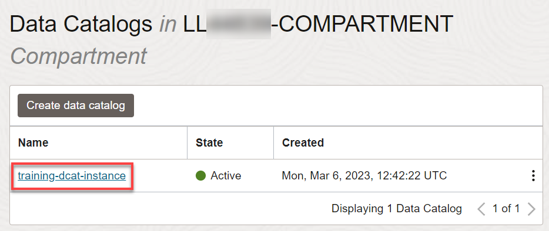

2. On the **`training-dcat-instance`** **Home** page, click **Browse data assets** in the **Quick Actions** tile.

    

3. If you only have the one Data Asset created in this workshop, the **Oracle Object Storage: Data Lake** page is displayed.

4. Click the **Buckets** tab. The three Oracle Object Storage buckets are displayed, if not, click **Refresh**.

    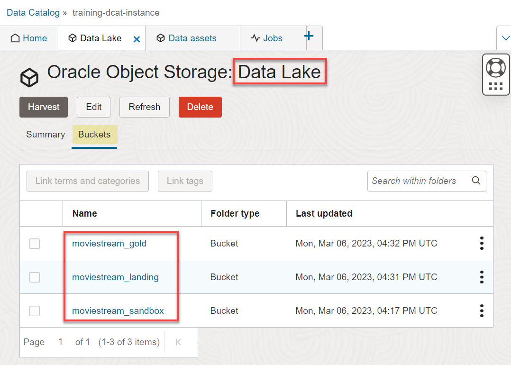

5. Click the **`moviestream_gold`** link in the **Name** column. The **Bucket: moviestream_gold** details tab is displayed. In the **Summary** tab, click **Edit**.

      

6. In the **Edit Name** panel, change the **Business Name** from **moviestream_gold** to **Gold**, and then click **Save Changes**.

    A **Successfully updated business name** message is displayed and the **Bucket: Gold** details tab is displayed. The bucket's new business name is displayed. The **Original Name** field displays the bucket's original name, **moviestream_gold**.

    

7. Close the **moviestream_gold** details tab. Click the **Data Lake** tab to display the **Oracle Object Storage: Data Lake** page.

    >**Note:** If the new name, **Gold**, is not displayed, click the **Refresh** button.

    

### Repeat the same above steps to rename the **`moviestream_landing`** bucket to **`Landing`**.

8. On the **Oracle Object Storage: Data Lake** page, click the **Buckets** tab. The three Oracle Object Storage buckets are displayed.

9. Click the **`moviestream_landing`** link in the **Name** column. The **Bucket: moviestream_landing** details tab is displayed. In the **Summary** tab, click **Edit**.

10. In the **Edit Name** panel, change the **business Name** to **Landing**, and then click **Save Changes**. A **Successfully updated business name** message is displayed and the **Bucket: moviestream_landing** details tab is re-displayed. The bucket's new business name is displayed. The **Original Name** field displays the bucket's original name.

11. Close the **moviestream_landing** tab. Click the **Data Lake** tab to display the **Oracle Object Storage: Data Lake** page.

    

    >**Note:** If the new name, **Landing**, is not displayed, click the **Refresh** button.


### Repeat the same above steps to rename the **`moviestream_sandbox`** bucket to **`Sandbox`**.

12. On the **Oracle Object Storage: Data Lake** page, click the **Buckets** tab.

13. Click the **`moviestream_sandbox`** link in the **Name** column. The **Bucket: moviestream_sandbox** details tab is displayed. In the **Summary** tab, click **Edit**.

14. In the **Edit Name** panel, change the **Business Name** to **Landing**, and then click **Save Changes**. A **Successfully updated business name** message is displayed and the **Bucket: moviestream_sandbox** details tab is re-displayed. The bucket's new business name is displayed. The **Original Name** field displays the bucket's original name.

15. Close the **moviestream_sandbox** details tab. Click the **Data Lake** tab to display the **Oracle Object Storage: Data Lake** page.

    

    >**Note:** If the new name, **Sandbox**, is not displayed, click the **Refresh** button.

<if type="freetier">
</if>

<!-- End LiveLabs section of lab -->

You may now proceed to the next lab.

## Learn More

* [Get Started with Data Catalog](https://docs.oracle.com/en-us/iaas/data-catalog/using/index.htm)
* [Data Catalog Overview](https://docs.oracle.com/en-us/iaas/data-catalog/using/overview.htm)
* [Oracle Cloud Infrastructure Documentation](https://docs.cloud.oracle.com/en-us/iaas/Content/GSG/Concepts/baremetalintro.htm)
* [What Is a Data Catalog and Why Do You Need One?](https://www.oracle.com/big-data/what-is-a-data-catalog/)
* [Harvesting Object Storage Files as Logical Data Entities](https://docs.oracle.com/en-us/iaas/data-catalog/using/logical-entities.htm)


## Acknowledgements
* **Author:** Lauran Serhal, Consulting User Assistance Developer, Oracle Autonomous Database and Big Data
* **Contributor:** Marty Gubar, Product Manager, Server Technologies
* **Last Updated By/Date:** Lauran Serhal, March 2023

Data about movies in this workshop were sourced from Wikipedia.

Copyright (C) Oracle Corporation.

Permission is granted to copy, distribute and/or modify this document under the terms of the GNU Free Documentation License, Version 1.3 or any later version published by the Free Software Foundation; with no Invariant Sections, no Front-Cover Texts, and no Back-Cover Texts. A copy of the license is included in the section entitled [GNU Free Documentation License](https://oracle-livelabs.github.io/adb/shared/adb-15-minutes/introduction/files/gnu-free-documentation-license.txt)
