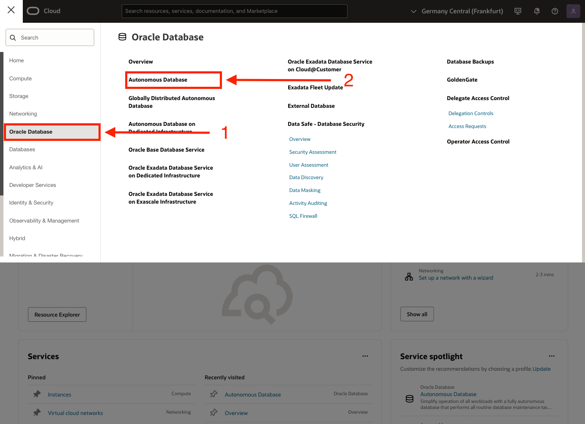
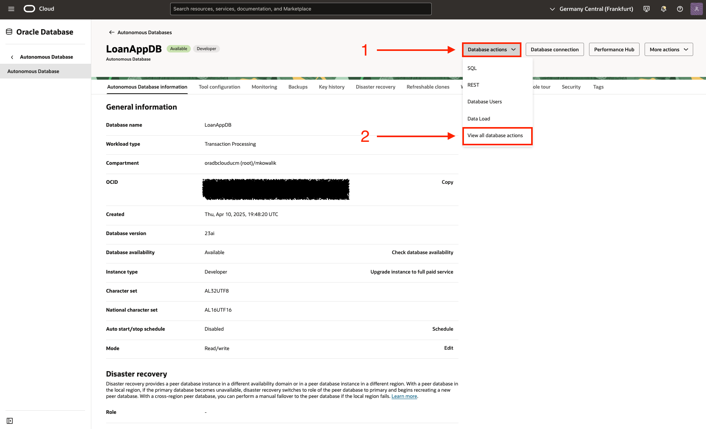
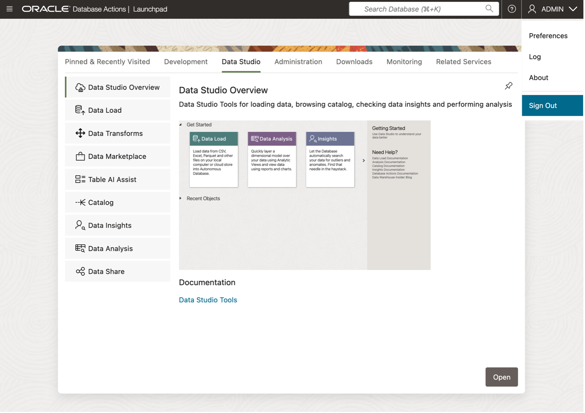
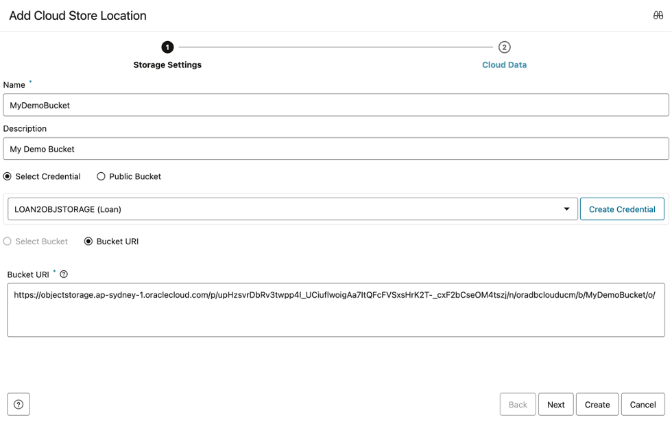
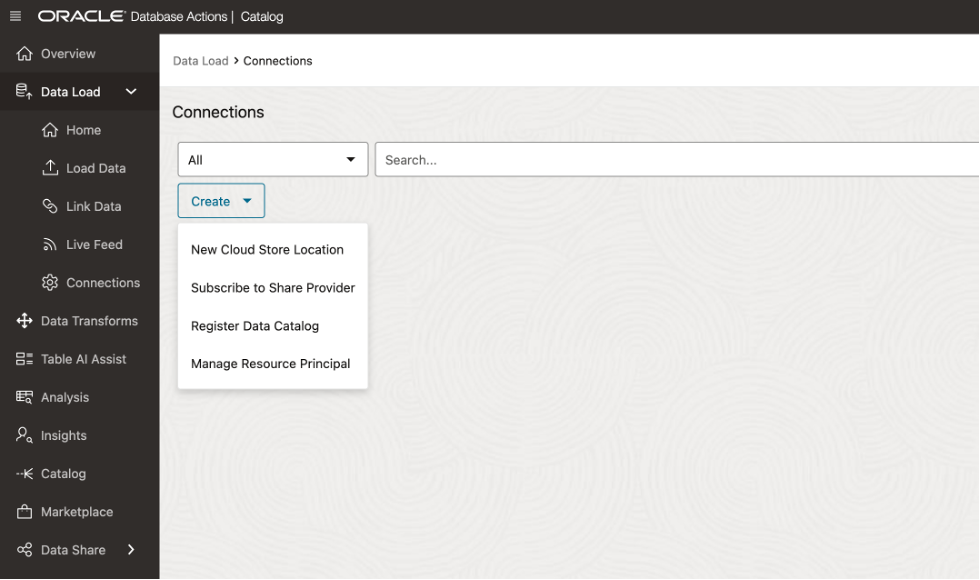
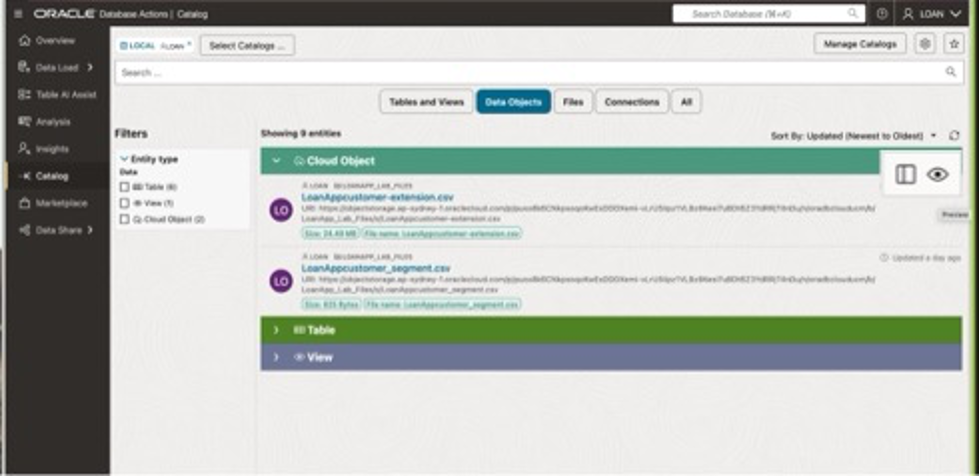

# 🔍 Discover and View your Database and Data Lake Assets from your Data Catalog

#### Estimated Lab Time: 45 minutes

## Introduction

In this lab, you’ll learn how to find, connect, and use data from **Object Storage** via **Oracle’s Data Catalog** and **Autonomous Database (ADB)**. Follow these steps to set up everything you need for seamless, real-time data access—without jumping through complicated hoops. After these steps, you’ll have a smooth setup that lets you **discover**, **connect**, and **query** data no matter where it lives—in Oracle Database or in Object Storage—giving you a powerful, unified view of all your information. 🌐📊

Enjoy exploring! 🚀

<!-- Comments -->
<!-- liveLabs section starts on line 466 (big monitor) -->
<!-- Comments -->
<!-- Comments -->
<!-- Comments -->

### Objectives

In this lab, you will:

* Connect to Autonomous Database
* Connect to local Data Catalog
* Discover and Create object storage connections
* View database object in Object Storage Files from Catalog
* Preview Object Storage file data from Catalog
* Load Object Storage Data into Autonomous Database from Catalog
* Link Object Storage Data via External Tables from Catalog

### Prerequisites

* This lab assumes that you have successfully completed all of the preceding labs in the **Contents** menu.

## Task 1: Access Local Data Catalog

First, you’ll log into your Autonomous Database and connect to your local Data Catalog, so you can discover and manage all the data you have access to all from one location.

* Navigate to your ADB instance




* Select View all Database Actions



* On the Database Actions page, In Upper right under dropdown next to **ADMIN**, select "**Sign out**"

    

* Login to Database Actions as **LOAN User** using credential shown on **View Lab Info Page**

    

* Click on Data Studio

    

* Click Catalog on left rail for the ADB Catalog to be displayed

    

**Congratulations you can now see your data objects from your Catalog!**

## Task 2: Add Connections to Catalog for Object Storage Buckets & Data Shares

Let’s continue our data discovery journey by visiting how to set up a connection between the Data Catalog and your specific buckets of data and available data shares.

* On the left rail of the Database Actions Page, Select Data Load
* Then select Connections Tile


* On the connections page you will note that this lab already has 4 bucket connections established.


* Now Let’s add our own connection for an Object Storage bucket named MyDemoBucket
* On the Connections Page --> Click **Create** --> Then select New Cloud Store Location


### On the Add Cloud Store Location page displayed

* For Name, enter: **MyDemoBucket**
* For Description, enter: **My Demo Object Storage Bucket**
* For Credential, select **LOAN2OBJStorage**
* For Bucket URI enter the following:

```
  <copy>
  https://objectstorage.ap-sydney-1.oraclecloud.com/p/31HyV1uUAICNzXfQjKbC-iiWKWLVx9Y5vIus6kjCc-yyl2gCc8nvmheoHSIr4Git/n/oradbclouducm/b/MyDemoBucket/o/ 
  </copy>
```



* Click on **Create** button to proceed


**Congratulations you have successfully added your own object storage connection to the Catalog!**

## Task 3: Search for items discovered by your Catalog

With our Connections in place, we will explore how to search the catalog for the items you want to see, by selecting what schemas, and what entity types to display

* On the left rail, select **Catalog**


* On the landing page, you will note that the Catalog has quick filters to help you display the output of your tailored searches in the display area.

* If you do not select a quick filter, the Tables and Views filter is selected by default.

**Note:** You can combine multiple filters for more refined results. 🔍

The catalog quick filters include:

* ### **Tables and Views**

  This filter searches for database tables (both internal and external) and views, including both standard database views and analytic views.

* ### **Data Objects**

  This filter searches for data objects in the database and on connected cloud storage.
  **Note:** This is a superset of the Tables and Views and Files filters.

* ### **Files**

  This filter searches for files in connected cloud storage only.

* ### **OCI**

  This filter searches for other Oracle Cloud Infrastructure objects, such as Autonomous Databases, OCI cloud storage buckets, or registered OCI Data Catalogs.
  This option is available if you have an OCI credential, which can be created from the **Data Studio Settings** icon.

* ### **Connections**

  This filter searches for connections registered in Data Studio, such as those to external Data Catalogs or databases.

* ### **All**

  This filter searches for all objects in the catalog. Since there can be thousands of objects, this scope may result in slower performance.


* Select Connections quick filter to display available connections in the Catalog accessible to the LOAN schema.
* From here we can validate that our catalog sees the defined connections we made.
**Note** that our MyDemoBucket is displayed.



* Select Data Objects quick filter to display available items in the Catalog visible to the LOAN schema. Notice that this view shows us the available database objects and the listing of the files available in our object storage.

## Task 4: Preview Data in Catalog

Check out the list of discovered data inside the Catalog. From this view we can see the available files that reside in the Object storage buckets.

* Hover over file name to see data preview option and click preview Icon to display data preview

  

  > ⚠️ **Note:** `<PIXELATED IMAGE... NEEDS UPDATING>`

* This displays the contents of the file being previewed without needing to first load it into the database.

* Click on **Close** button to return to Data Catalog listings

**Congratulations you have successfully previewed the contents of your Object Storage Data!**

**You may now proceed to the next lab.**

## Learn More

* [Get Started with Data Catalog](https://docs.oracle.com/en-us/iaas/data-catalog/using/index.htm)
* [Data Catalog Overview](https://docs.oracle.com/en-us/iaas/data-catalog/using/overview.htm)
* [Oracle Cloud Infrastructure Documentation](https://docs.cloud.oracle.com/en-us/iaas/Content/GSG/Concepts/baremetalintro.htm)
* [What Is a Data Catalog and Why Do You Need One?](https://www.oracle.com/big-data/what-is-a-data-catalog/)
* [Harvesting Object Storage Files as Logical Data Entities](https://docs.oracle.com/en-us/iaas/data-catalog/using/logical-entities.htm)

## Acknowledgements

* **Author:** Otis Barr
* **Contributor:** Matt Kowalik
* **Last Updated By/Date:** TBD

Copyright (C) Oracle Corporation.
