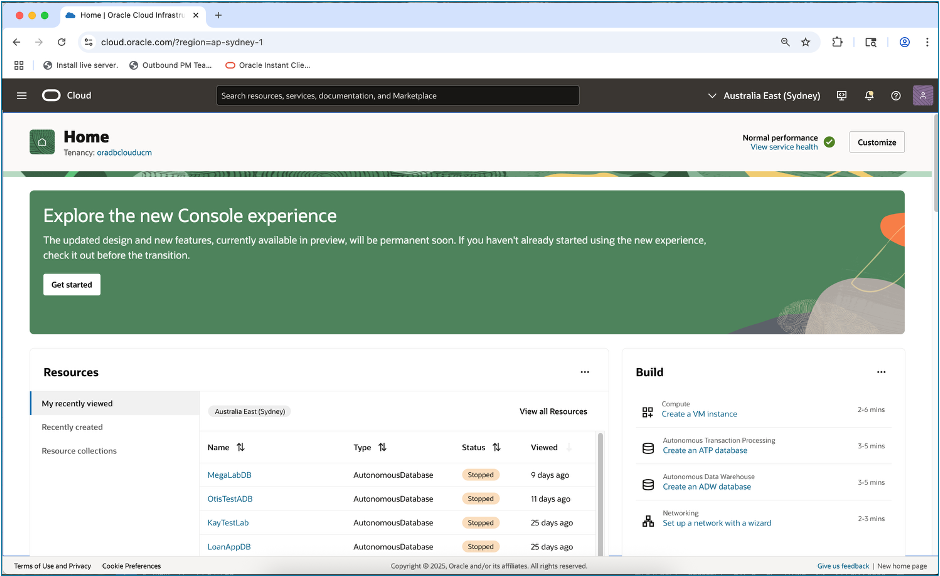
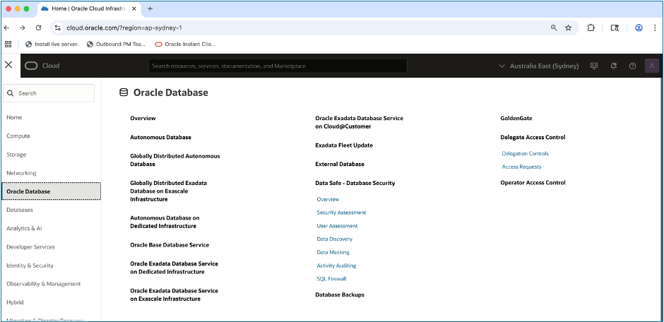
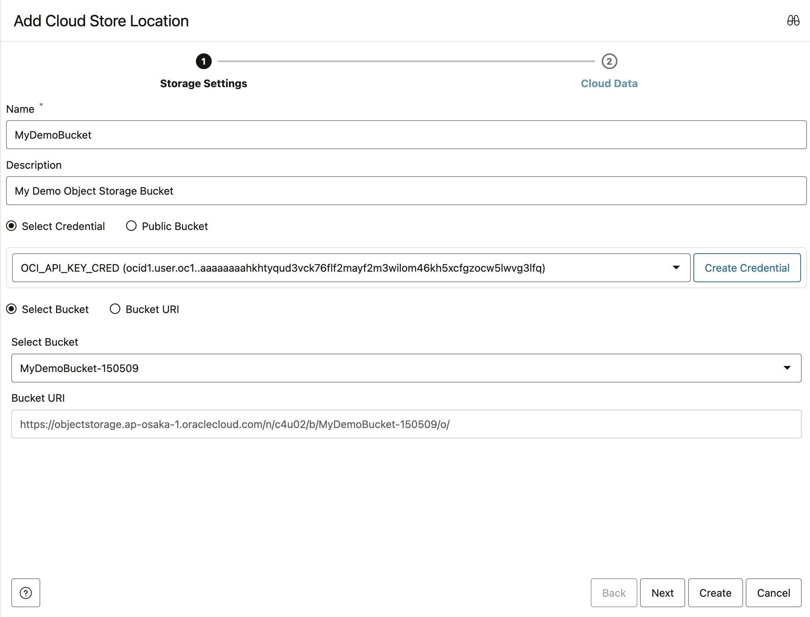

# 🔍 Discover and View your Database and Data Lake Assets from your Data Catalog

## Introduction

This lab is designed to demonstrate how tools in Oracle’s Data Platform can be used to discover and provide access data in cloud object storage.   

Having this access is crucial for someone,such as the loan approval officer in our demo, because it directly impacts their ability to efficiently, securely, and compliantly perform their duties.  

Estimated Lab Time: 45 minutes

<!-- Comments -->
<!-- liveLabs section starts on line 466 (big monitor) -->
<!-- Comments -->
<!-- Comments -->
<!-- Comments -->

### Objectives

In this lab, you will:

* Find your LiveLabs Sandbox reservations

### Prerequisites

This lab assumes you have:

* An Oracle account to submit your a LiveLabs Sandbox reservation.

## Task 1: Navigate to Autonomous Database

To begin, we will log onto the assigned Autonomous Database and launch Database Actions (as the LOAN user), so you can discover and manage all the data you have access to all from one location.

1. Log onto Oracle Cloud account at cloud.oracle.com

      

    Click the menu icon (three horizontal lines) in top left corner to open the Navigation Menu  

1. Select Oracle Database from the Navigation Menu.  

    

1. Choose the database type  

    
    Click on Autonomous Database.

1. Select the desired database  

    
    Click the name of the Autonomous Database you want to use  

1. Launch Database Actions  

      

    Click Database Actions, then select Data Load from the dropdown list   

## Task 2: Setup Connection to Object Storage

Starting where we ended Task 1, let’s set up a connection between the Data Catalog and your specific buckets of data and available data shares.  

1. Navigate to Connections  

      
    Expand the Data Load options on the left rail, then select Connections 

1. Review Existing Connections  

      
    On the connections page you will note that this lab already has 4 bucket connections established.

1. Create New Connection  

      
    Click **Create**, then select **New Cloud Store Location**  

1. Enter Connection Details

      
    Enter details about the cloud store location as shown, then click Create button

1. Confirm Connection Creation

      
    Review available connections in the Data Catalog, that are accessible to the LOAN schema. 

    **Congratulations you have successfully added your own object storage connection to the Catalog!**  

## Task 3: Explore the Data Catalog

With our Connections in place, we will explore how to search the catalog for the items you want to see, by selecting what schemas, and what entity types to display  

1. Launch Catalog Landing Page  

      
    Select Catalog from the left rail to proceed to the landing page.  

1. Identify Data Objects in the Catalog

      
    To help customize search results, you will find “quick filters” on the landing page, to limit output to all or a selected schema

1. Preview Data in the Catalog

      

    Locate the file named LoanAppCustomer-Extensions.csv.  Hover over it to display the file's contents 
    
    
    >**NOTE:**Notice we are able to preview the contents of a file without having to load it into the database.  

    Click on **Close**

    **Congratulations you have successfully previewed the contents of your Object Storage Data!**  

## Learn More

* [Get Started with Data Catalog](https://docs.oracle.com/en-us/iaas/data-catalog/using/index.htm)
* [Data Catalog Overview](https://docs.oracle.com/en-us/iaas/data-catalog/using/overview.htm)
* [Oracle Cloud Infrastructure Documentation](https://docs.cloud.oracle.com/en-us/iaas/Content/GSG/Concepts/baremetalintro.htm)
* [What Is a Data Catalog and Why Do You Need One?](https://www.oracle.com/big-data/what-is-a-data-catalog/)
* [Harvesting Object Storage Files as Logical Data Entities](https://docs.oracle.com/en-us/iaas/data-catalog/using/logical-entities.htm)

## Acknowledgements

* **Author:** Eddie Ambler, Otis Barr
* **Contributor:** Mike Matthews, Marty Gubar, Matt Kowalik
* **Last Updated By/Date:** 05-04-2025

Copyright (C) Oracle Corporation.
