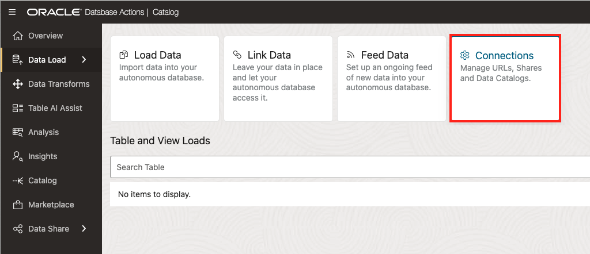
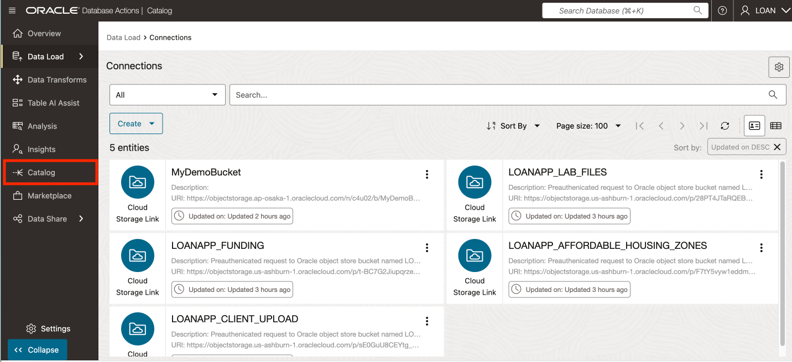
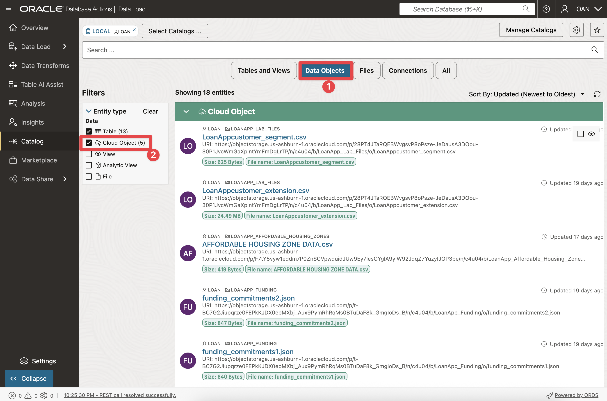

# 🔍 Discover and View your Database and Data Lake Assets from your Data Catalog

## Introduction

To build better loan products, SeersEquities’ data team must pull insights from everywhere—internal systems and external sources alike. But before they can transform that data, they need to find it. In this lab, you’ll step into that role. 

You’ll use Oracle Autonomous Database's Catalog Tool to **discover, connect to, and query data** stored in cloud object storage and databases. By the end, you’ll have a single view across your data landscape—so you can spend less time hunting for data and more time using it to power smarter decisions.

Estimated Time: 30 minutes

### Objectives

* **Discover and browse data assets** across Autonomous Database and cloud object storage using the Catalog Tool

* Set up **secure connections** to access and unify data from multiple sources

* Query and explore data from a unified catalog to support faster, insight-driven decisions

## Task 1: Access Local Data Catalog

First, log into your Autonomous Database and connect to the Catalog Tool to discover and manage all your data from one place.

1. Click **View Login Info**. Copy your **DB ADMIN Password** and click the **SQL Worksheet** link.

      

2. For your Username enter **LOAN**. Paste in the password you copied in the previous step.

      

3. Click on **Data Studio**.  

      

4. Click on **Catalog** on left rail for the **ADB Catalog** to be displayed.  

      

>You’ve now unlocked a unified view of your data—no matter where it lives. With this foundation in place, you’re ready to explore, connect, and start building data products that drive real insights.

## Task 2: Add Connections to Catalog for Object Storage Buckets & Data Shares  

🚀 Next, you’ll connect your catalog to the specific data buckets and shared datasets you need—so you can start exploring what’s inside.

1. On the left rail of the Database Actions page, select **Data Load**.  

      

2. Then select the **Connections** tile.  

      

3. On the connections page, you will note that this lab already has 4 bucket connections established.  

      

4. Now, create a connection to the **Object Storage** bucket called **MyDemoBucket**. On the Connections page, click **Create**, then choose **New Cloud Store Location**.

      

5. On the **Add Cloud Store Location** page displayed:

    - For Name, enter: **MyDemoBucket**
    - For Description, enter: **My Demo Object Storage Bucket**
    - For Credential, select **OCI\_API\_KEY_CRED**
    - Choose the **Select Bucket** radio button
    - From the dropdown list choose the Bucket Named: **MyDemoBucket**

   Click the **Create** button to proceed.

      

6. You’ve just added your own object storage connection to the Catalog—now you can easily discover, track, and query external data alongside your database assets. This step lays the foundation for building richer data products and speeding up access to the insights that matter.

      

## Task 3: Search for items discovered by your Catalog  

With your connections in place, it’s time to search the catalog. You’ll choose which schemas and entity types to display—so you can quickly find the data that matters.

1. On the left rail, select **Catalog**.  

      

2. Select the **Connections** quick filter. This shows available connections in the catalog accessible to the **LOAN** schema. Confirm that **MyDemoBucket** appears in the list.

    >**Note**: On the landing page, the catalog offers quick filters to narrow your search results. If you don’t choose one, it defaults to **Tables and Views**. You can also limit results to all schemas or just a selected one.

      

3. Select the **Data Objects** quick filter to view items in the catalog visible to the **LOAN** schema. Also, select **Cloud Objects** in the filter section.

    >**Note**: This view shows the database objects and object storage files available to you. You’ll use these files in the next exercises.

    

By searching the Catalog with filters and schema selections, you’ve learned how to quickly surface the data that matters. This step helps you cut through clutter and find the right assets faster—so you can spend less time searching and more time building with trusted data.

## Task 4: Preview Data in Catalog  

Preview the data discovered in the catalog. From this view, you’ll see the files available in your object storage buckets.

1. Click the preview icon for the file named **LoanAppCustomer_segment.csv**.  

      

2. This displays the contents of the file being previewed without needing to first load it into the database.  

      

3. Click **Close** to return to Data Catalog listings  

## Conclusion

Well done! In this lab, you discovered how to connect, browse, and preview data across your database and object storage—all from a single, unified catalog. You’ve built the foundation SeersEquities needs to turn scattered data into trusted data products.

With these skills, you can now help the team evaluate new data faster, integrate it seamlessly, and drive smarter, real-time decisions that power better loan products and risk strategies.

## Learn More

* [Harvesting Object Storage Files as Logical Data Entities](https://docs.oracle.com/en-us/iaas/data-catalog/using/logical-entities.htm)

## Acknowledgements

* **Author:** Eddie Ambler, Otis Barr
* **Last Updated By/Date:** Kamryn Vinson, June 2025