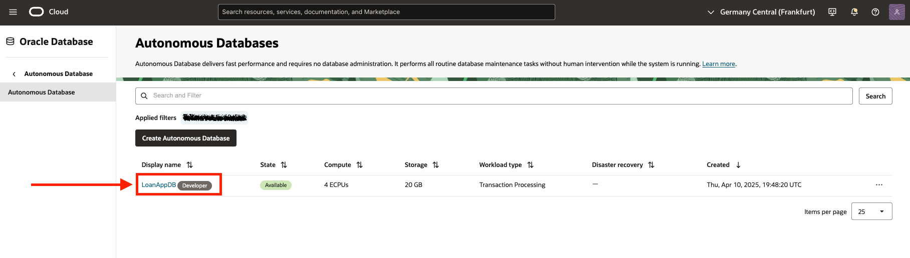
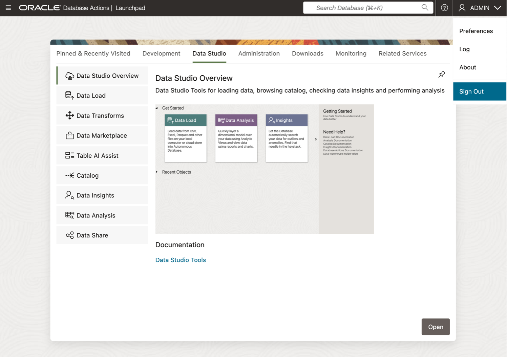
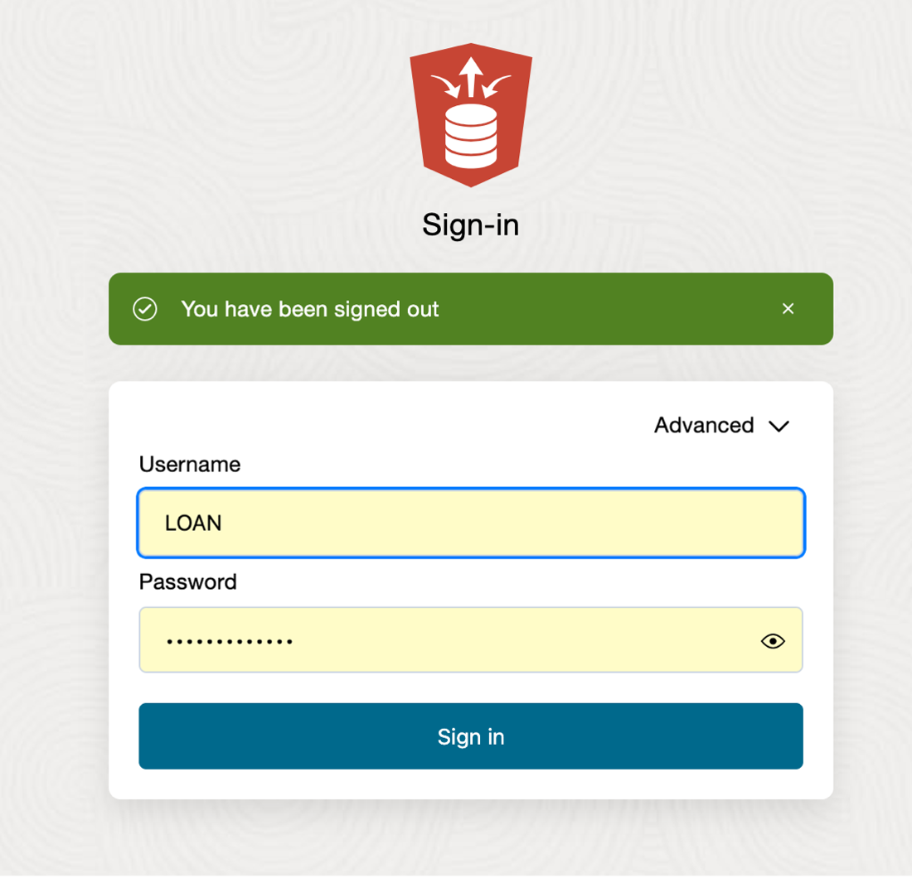
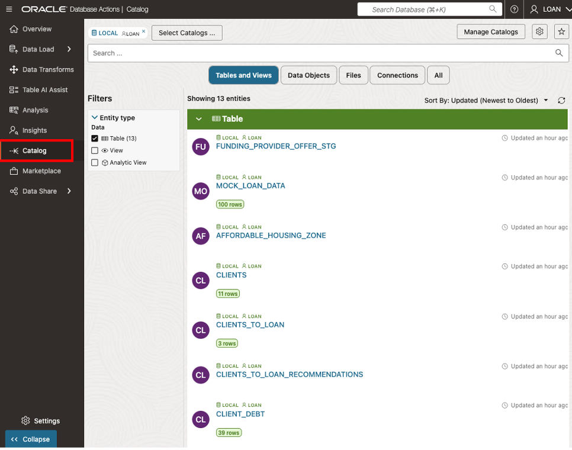
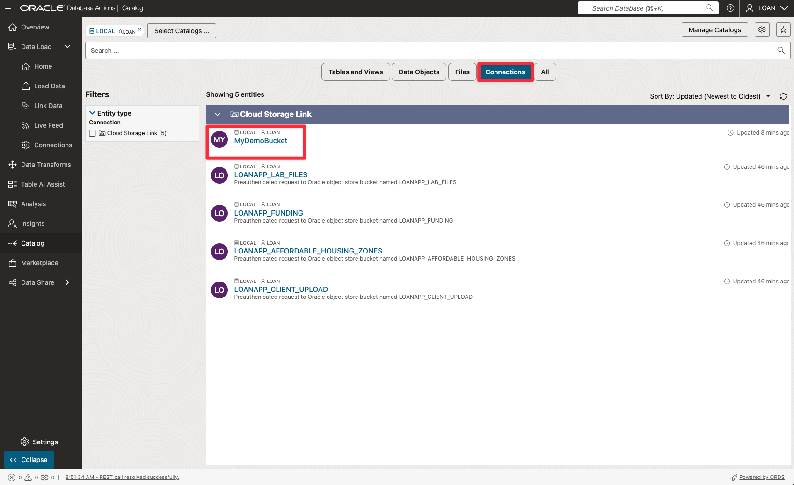

# 🔍 Discover and View your Database and Data Lake Assets from your Data Catalog

#### Estimated Lab Time: 45 minutes

## Introduction

In this lab, you’ll learn how to find, connect, and use data from **Object Storage** via **Oracle’s Data Catalog** and **Autonomous Database (ADB)**. Follow these steps to set up everything you need for seamless, real-time data access—without jumping through complicated hoops. After these steps, you’ll have a smooth setup that lets you **discover**, **connect**, and **query** data no matter where it lives—in Oracle Database or in Object Storage—giving you a powerful, unified view of all your information. 🌐📊

Enjoy exploring! 🚀

<!-- Comments -->
<!-- liveLabs section starts on line 466 (big monitor) -->
<!-- Comments -->
<!-- Comments -->
<!-- Comments -->

## Task 1: Access Local Data Catalog

First, you’ll log into your Autonomous Database and connect to your local Data Catalog, so you can discover and manage all the data you have access to all from one location.

* Navigate to your ADB instance

  

  

1. Navigate to your assigned ADB Instance.

    * Open Navigation Menu 
    * Select Oracle Database 
    * Select Autonomous Database 

2. Select the name of your assigned database.

3. Select View all Database Actions

  

4. **On the Database Actions page, In Upper right under dropdown next to ADMIN, select "Sign out"**

  

5. **Login to Database Actions as LOAN User** using credential shown on View Lab Info Page

  

6. Click on **Data Studio**

  

* **Click Catalog** on left rail for the **ADB Catalog** to be displayed

  

**Congratulations you can now see your data objects from your Catalog!**

## Task 2: Add Connections to Catalog for Object Storage Buckets & Data Shares

🚀 Let’s continue our data discovery journey by visiting how to set up a connection between the Data Catalog and your specific buckets of data and available data shares.

* On the left rail of the **Database Actions** Page, **Select Data Load**
* Then select **Connections** Tile

  

* On the connections page you will note that this lab already has 4 bucket connections established.

  

Now Let’s add our **own connection** for an Object Storage bucket named **MyDemoBucket**

* On the **Connections Page** --> Click **Create** --> Then select **New Cloud Store Location**

  

### On the Add Cloud Store Location page displayed

* For **Name**, enter: **MyDemoBucket**
* For **Description**, enter: **My Demo Object Storage Bucket**
* For **Credential**, select **OCI\_API\_KEY_CRED**
* Choose **Select Bucket** radio button
* From DropDown List choose **Bucket Named:** ***MyDemoBucket***

  

* Click on **Create** button to proceed

  

**Congratulations you have successfully added your own object storage connection to the Catalog!**

## Task 3: Search for items discovered by your Catalog

With our Connections in place, we will explore how to search the catalog for the items you want to see, by selecting what schemas, and what entity types to display

* On the left rail, select **Catalog**

  

* On the landing page, you will note that the Catalog has quick filters to help display the results of your customized searches in the main area.
If no quick filter is selected, the Tables and Views filter is applied by default.

* If you do not select a quick filter, the Tables and Views filter is selected by default.

**Note:** the output of the object shown can be limited to all or a selected schema.

2. Select **Connections** quick filter. This displays available connections in the Catalog accessible to the LOAN schema. From here we can validate that our catalog sees the defined connections we made.

> **Note** that our **MyDemoBucket** is displayed.

  

* Select **Data Objects** quick filter to display available items in the Catalog visible to the LOAN schema. Notice that this view shows us the available database objects and the listing of the files available in our object storage.

**Note:** that this view shows us the available database objects and the listing of the files available in our object storage.  These files will be used in upcoming exercises.

  

## Task 4: Preview Data in Catalog

Check out the list of discovered data inside the Catalog. From this view we can see the available files that reside in the Object storage buckets.

* Hover over file named **LoanAppCustomer-Extensions.csv**.

  

* This displays the contents of the file being previewed without needing to first load it into the database.

  

* Click on **Close** button to return to Data Catalog listings

**Congratulations you have successfully previewed the contents of your Object Storage Data!**

**You may now proceed to the next lab.**

## Learn More

* [Get Started with Data Catalog](https://docs.oracle.com/en-us/iaas/data-catalog/using/index.htm)
* [Data Catalog Overview](https://docs.oracle.com/en-us/iaas/data-catalog/using/overview.htm)
* [Oracle Cloud Infrastructure Documentation](https://docs.cloud.oracle.com/en-us/iaas/Content/GSG/Concepts/baremetalintro.htm)
* [What Is a Data Catalog and Why Do You Need One?](https://www.oracle.com/big-data/what-is-a-data-catalog/)
* [Harvesting Object Storage Files as Logical Data Entities](https://docs.oracle.com/en-us/iaas/data-catalog/using/logical-entities.htm)

## Acknowledgements

* **Author:** Eddie Ambler, Otis Barr
* **Contributor:** Mike Matthews, Marty Gubar, Matt Kowalik
* **Last Updated By/Date:** 04-28-2025

Copyright (C) Oracle Corporation.
