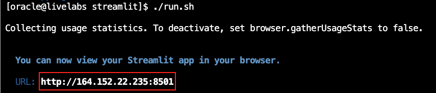

# Code Property Graph using Graph Query

## Introduction

This lab walks you through the steps to...

Estimated Time: 60 minutes

### Objectives

In this lab, you will:
* 
### Prerequisites

This lab assumes you have:
* An Oracle Cloud account


## Task 1: Graph Developer Coding Exercise Answer

**Task**:

The loan officer needs to visualize additional data points in the decision-making process. Specifically, they want to display an additional graph that shows two key metrics: required credit score on one axis and debt-to-income ratio on the other.

**Instructions**:

1. Update the Decision.py file to add functionality for an additional graph that displays the following metrics: Required Credit Score and Debt-to-Income Ratio (%). The graph should display scatter plots similar to the example provided below, Required Credit Score and Debt-to-Income Ratio (%) are plotted:

    

2. Implement a dropdown that allows the user to select the new graph view.

    

**Answer**:

1. To navigate to the development environment, click **View Login Info**. Copy the Development IDE Login Password. Click the Start Development IDE link.

    

2. Paste in the Development IDE Login Password that you copied in the previous step. Click **Login**.

    

3. Click **Pages**.

    

4. Select **Decision.py**.

    

5. Copy the following code block and paste it at line 272 in the Decision.py file.

    ````
    <copy>
# --- Graph Visualization in Collapsible Section ---
# Create a collapsible section in the Streamlit app with a magnifying glass icon and label for the dot plot
with st.expander("🔍 View Dot Plot: Credit Score vs. Debt-to-Income Ratio", expanded=False):
    # Start a try block to catch any errors that might occur during graph creation
    try:
        # **Set up the Graph 
        # Call the function to connect to the Oracle database
        conn = get_db_connection()
        # Check if the database connection was successful
        if conn:
            # Create a cursor object to execute SQL queries on the database
            cursor = conn.cursor()


            # Execute the graph query, passing the customer_id as a parameter
            cursor.execute(graph_query, {'customer_id': customer_id})
            # Fetch all the rows returned by the query
            rs = cursor.fetchall()

            # **Convert to Pandas DataFrame for Visualization**
            # Get the column names from the query result description
            column_names = [desc[0] for desc in cursor.description]
            # Create a Pandas DataFrame from the query results with the column names
            result_df = pd.DataFrame(rs, columns=column_names)

            # Check if the DataFrame has any data (i.e., is not empty)
            if not result_df.empty:
                # Add a subheader in the Streamlit app to label the graph
                st.subheader("Just Out Of Reach Loans for Customer")
                # Create a new Matplotlib figure with a size of 12 inches wide by 8 inches tall
                plt.figure(figsize=(12, 8))

                # Color based on action needed (no legend)
                # Initialize an empty list to store colors for each data point
                colors = []
                # Loop through each action needed in the DataFrame
                for action in result_df['ACTION_NEEDED']:
                    # Check if the action is missing or empty
                    if pd.isna(action) or not action:
                        # If action is missing, use gray color for the point
                        colors.append('gray')
                    # Check if the action involves increasing the credit score
                    elif 'credit score' in action.lower():
                        # Use blue color for credit score-related actions
                        colors.append('blue')
                    # Check if the action involves debt-to-income ratio (DTI)
                    elif 'debt-to-income' in action.lower() or 'dti' in action.lower():
                        # Use red color for DTI-related actions
                        colors.append('red')
                    # Check if the action involves employment length
                    elif 'employment length' in action.lower():
                        # Use green color for employment length-related actions
                        colors.append('green')
                    # If action doesn’t match any known type, use gray color
                    else:
                        colors.append('gray')

                # Scatter plot 
                # Create a scatter plot with DTI on the x-axis and required credit score on the y-axis
                plt.scatter(
                    result_df[],  # X-axis data: debt-to-income ratio from the DataFrame
                    result_df[],  # Y-axis data: required credit score from the DataFrame
                    alpha=0.7,  # Set transparency of points to 70% for better visibility
                    edgecolors=colors,  # Set the edge colors of points based on action needed
                    linewidths=1.5,  # Set the thickness of the point edges to 1.5
                    s=250  # Set the size of the scatter points to 250
                )

                # Set the label for the x-axis to "Debt-to-Income Ratio (%)"
                plt.xlabel()
                # Set the label for the y-axis to "Required Credit Score"
                plt.ylabel()
                # Set the title of the plot, including the customer ID
                plt.title()

                # Adjust x-axis limits based on DTI
                # Calculate the minimum DTI value and subtract 5 for a buffer
                min_dti = result_df[].min() - 5
                # Calculate the maximum DTI value and add 5 for a buffer
                max_dti = result_df[].max() + 5
                # Set the x-axis limits to the calculated min and max DTI values
                plt.xlim(min_dti, max_dti)

                # Adjust y-axis limits based on required credit score
                # Calculate the minimum credit score and subtract 20 for a buffer
                min_credit = result_df[].min() - 20
                # Calculate the maximum credit score and add 20 for a buffer
                max_credit = result_df[].max() + 20
                # Set the y-axis limits to the calculated min and max credit scores
                plt.ylim(min_credit, max_credit)

                # Annotate each point with Loan ID and Action Needed (manual positioning)
                # Loop through each row in the DataFrame with an index
                for i, row in result_df.iterrows():
                    # Get the action needed text, or use a default if it’s missing
                    action_text = row['ACTION_NEEDED'] if pd.notna(row['ACTION_NEEDED']) else "No action specified"
                    # If the action text is too long (over 39 characters), shorten it and add "..."
                    if len(action_text) > 39:
                        action_text = action_text[:36] + "..."
                    # Set the vertical offset for the annotation: 50 above for even indices, -50 below for odd
                    v_offset = 50 if i % 2 == 0 else -50
                    # Get the y-position of the point (required credit score)
                    y_pos = row[]
                    # Set the height of the annotation box for boundary checking
                    annotation_height = 50
                    # If the annotation would go above the max y-limit, move it below the point
                    if y_pos + v_offset + annotation_height > max_credit:
                        v_offset = -50 - annotation_height
                    # If the annotation would go below the min y-limit, move it above the point
                    elif y_pos + v_offset - annotation_height < min_credit:
                        v_offset = 50 + annotation_height
                    # Add an annotation to the point with loan details
                    plt.annotate(
                        f"Loan ID: {row['LOAN_ID']}\nDTI: {row[]}%\nReq. Credit: {row[]}\nAction: {action_text}",  # Text to display
                        (row[], row[]),  # Position of the point
                        textcoords="offset points",  # Use offset points for positioning
                        xytext=(0, v_offset),  # Offset the text by v_offset vertically
                        ha='center',  # Center-align the text horizontally
                        fontsize=8,  # Set the font size to 8
                        alpha=0.9  # Set the transparency of the text to 90%
                    )
    </copy>
    ````
 

6. Copy the graph query below. Paste the graph query in at line 285.
    ````
    <copy>
            # Define the SQL query to fetch data from the LOANS_GRAPH property graph
            graph_query = """
                SELECT * FROM GRAPH_TABLE (LOANS_GRAPH
                    MATCH (v IS CLIENTS) -[e1 IS client_to_application]-> (v1 IS LOAN_APPLICATIONS),
                          (v) -[e IS CLIENTS_TO_LOAN]-> (v2 IS MOCK_LOAN_DATA)
                    WHERE v.customer_id = :customer_id
                    COLUMNS (
                        v.customer_id AS customer_id,
                        v.credit_score AS customer_credit_score,
                        v2.credit_score AS required_credit_score,
                        v2.debt_to_income_ratio AS debt_to_income_ratio,
                        v1.total_debt AS total_debt,
                        v.income AS customer_income,
                        e.id AS edge_id,
                        e.action_needed AS action_needed,
                        v2.loan_id AS loan_id,
                        v2.income AS required_income,
                        v2.loan_type AS loan_type,
                        v2.time_to_close AS time_to_close
                    )
                )
            """
    </copy>
    ````

Edit the part of the script that edits the scatter plot. Change the X and Y axis of the graph to reflect the "DEBT\_TO\_INCOME\_RATIO" and "REQUIRED\_CREDIT\_SCRORE" requested by the loan officer

7. Paste 'DEBT\_TO\_INCOME_RATIO' in the empty bracket at line 353 and 'REQUIRED\_CREDIT\_SCORE' in the empty bracket at line 354.

    ````
    <copy>
    'DEBT_TO_INCOME_RATIO'
    </copy>
    ````

    ````
    <copy>
    'REQUIRED_CREDIT_SCORE'
    </copy>
    ````
 

8. Paste 'Debt-to-Income Ratio (%)' in the empty parentheses at line 362.

    ````
    <copy>
    'Debt-to-Income Ratio (%)'
    </copy>
    ````

9. Paste 'Required Credit Score' in the empty parentheses at line 364.

    ````
    <copy>
    'Required Credit Score'
    </copy>
    ````

10. Paste f'Loans Just Out of Reach for Customer ID {customer_id}' in the empty parentheses at line 366.

    ````
    <copy>
    f'Loans Just Out of Reach for Customer ID {customer_id}'
    </copy>
    ````

 

 11. Paste 'DEBT\_TO\_INCOME\_RATIO' in the empty brackets at lines 370 and 372.

     ````
    <copy>
    'DEBT_TO_INCOME_RATIO'
    </copy>
    ````

 

12. Paste 'REQUIRED\_CREDIT\_SCORE' in the empty brackets at lines 378 and 380.

    ````
    <copy>
    'REQUIRED_CREDIT_SCORE'
    </copy>
    ````

 

13. Paste 'REQUIRED\_CREDIT\_SCORE' in the empty brackets at line 395.

    ````
    <copy>
    'REQUIRED_CREDIT_SCORE'
    </copy>
    ````   

    

14. Paste 'DEBT\_TO\_INCOME\_RATIO' and 'REQUIRED\_CREDIT\_SCORE' in the empty brackets at lines 406 and 407.

    ````
    <copy>
    'DEBT_TO_INCOME_RATIO'
    </copy>
    ````   
    ````
    <copy>
    'REQUIRED_CREDIT_SCORE'
    </copy>
    ````   
    

15. Save the Decision.py file.

    

16. Open the terminal. 

    

17. Copy the ./run.sh command and paste it into the terminal.

    ````
    <copy>
    ./run.sh
    </copy>
    ````

18. Click the URL displayed in the terminal to launch the SeerEquities Loan Management application.

    

19. Enter in a username and click **Login**.

    

20. On the Dashboard page, from the pending review list, select the Customer ID for **James Woods**.

    

21. This will display the customers loan application details. In approximately 15 seconds, the AI generated loan recommendations will be displayed. Click the **Navigate To Decisions** button.

    

22. Expand the drop down to view the newly added graph.

    

**Congratulations, you have successfully completed the Graph Developer Coding Exercise!**


## Learn More

*(optional - include links to docs, white papers, blogs, etc)*

* [URL text 1](http://docs.oracle.com)
* [URL text 2](http://docs.oracle.com)

## Acknowledgements
* **Author** - <Name, Title, Group>
* **Contributors** -  <Name, Group> -- optional
* **Last Updated By/Date** - <Name, Month Year>
