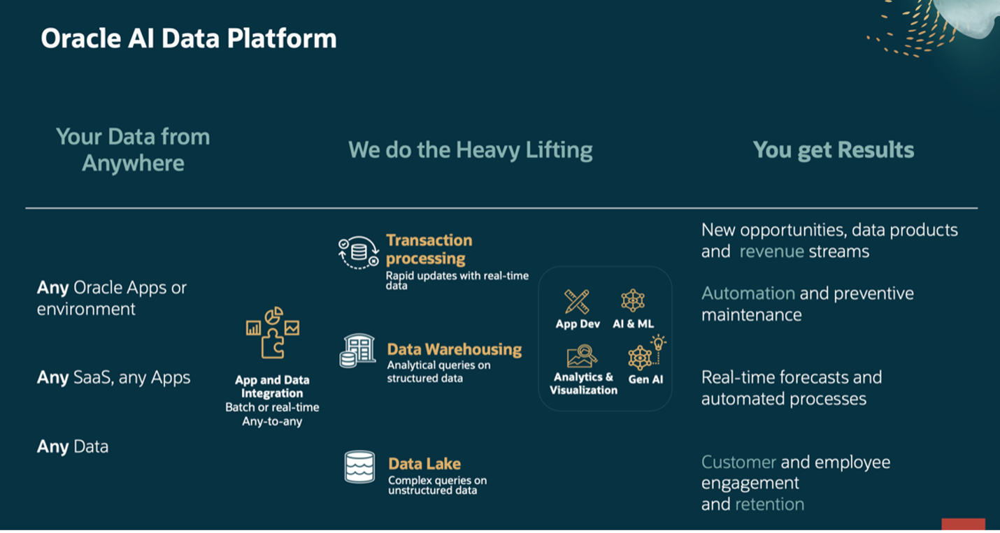
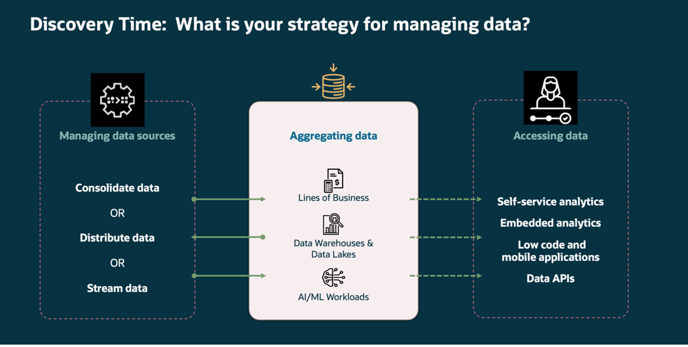
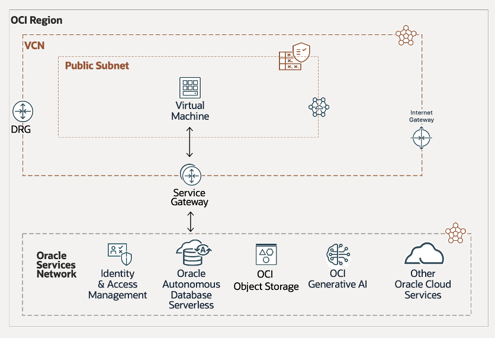
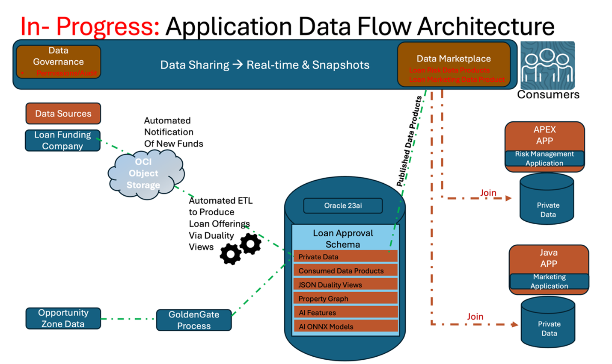

# Introduction

## About this Workshop 

In this workshop, you will explore the comprehensive suite of tools, services and applications available in Oracle’s Data Platform, and how they help businesses efficiently manage and analyze enterprise data by simplifying the end-to-end data lifecycle.

The labs in this workshop are based on tasks performed in a typical loan funding company and they are designed to highlight the centralized data management, streamlined data workflows and empowered data analytics available using Oracle's Data Platform.  

You will:
*   build an end-to-end solution to easily ingest and consolidating disparate data from various sources, creating a unified view and preventing data silos.
*   walk through the steps to create consumable data products for informed risk analysis; maximizing the full value of the data and enabling timely decision-making.
*   share loan portfolio data for future marketing campaigns, facilitating collaboration across departments while protecting sensitive data. 

By completing this workshop, you will gain insight on how Oracle’s Data Platform can serve as a scalable foundation for modern organizations looking to stay competitive and future-proof their business success.
 
## Key Terms 

### AI Data Platform  

A data platform is a technology solution that enables the collection, storage, cleaning, transformation, analysis and governance of data. Data platforms can include both hardware and software components. They make it easier for organizations to use their data to improve decision making and operations. Data platforms are increasingly more popular with the need for a centralized solution to meet today’s AI needs.  AI applications and solutions need access to data in real time to enable better solutions and greater innovation. 

### Data Lake 

A data lake is a substantial repository designed to store a wide variety of data, such as text, images, and videos, in their original and unstructured formats. Rather than categorizing or formatting the data up front, everything is gathered into one “pool.” This flexible approach allows analysts and researchers to determine how best to structure and interpret the data later on. However, maintaining clear governance and organization is crucial to prevent the data lake from becoming a disorganized “data swamp.” 

### Data Lakehouse 

Combines the flexibility of a data lake with the data management and querying capabilities of a data warehouse. This hybrid approach allows users to determine how best to structure and interpret the data, while still benefiting from higher reliability and query efficiency.  It is aimed at facilitating machine learning, business intelligence, and predictive analytics. 

### Data Product 

A data product is a reusable, curated data asset designed to solve a specific business problem or provide actionable insights. Data products aim to transform raw data into valuable, usable information for decision-making, whether internally within an organization or externally as a service. They are designed to be used across multiple applications and use cases and includes metadata, data lineage, and other mechanisms to ensure data quality and provenance. 

### Data Warehouse 

A data warehouse stores structured, cleaned, and preprocessed data for business intelligence and analytics. Primarily used for business intelligence (BI) and reporting, providing historical data analysis for trends and insights 

### Oracle Autonomous Database (ADB)  

Oracle Autonomous Database is a converged database that allows users to work with structured and unstructured data, and external data within in a single unified platform, which simplifies data management and reduces the need for multiple specialized databases. 

All kinds of data types, workload and perform any kind of analytics against it.  Both internal and external, all in a single united platform.  This unification and the ability to work with structured and unstructured data simplifies the data architecture and reduces the need for multiple specialized databases 

### Oracle Cloud Infrastructure (OCI) Data Catalog 

Oracle Cloud Infrastructure (OCI) Data Catalog is a fully managed, self-service metadata discovery and governance solution for your enterprise data. With Data Catalog, you get a single collaborative environment to manage technical, business, and operational metadata. You can collect, organize, find, access, understand, enrich, and activate this metadata. 

## Workshop Setup 

This workshop is configured into 2 sections: 

1) A Demo section, which enables you to start a Loan Management Application and gain hands on experience using the application to approve loans, evaluate loan portfolio risks, and find marketing opportunities by going through the provided user interaction stories for the Loan Officer, and showing how the Risk Management Officer, and Marketing Officer personas interact with data that is share with them to deliver data-driven feedback to the business. 

2) A Hands-On section, where you will be given data access and data management tasks to perform. For the data engineering development tasks, you will be provided with requirements that reflect a set of requested application enhancement requests for which you will need to conduct the required data discovery, data transformation, & data sharing to accomplish the enhancement requests to support the requested front-end changes. 

### Database Tier 

The workshop has a single Autonomous Database that is pre-created with 2 schemas. 

The first schema is used to run the Loan Management Application Demo Lab. Spinning up the workshop includes creating the demo schema, creating and loading the application objects, and loading the ONNX Model to be used by the application.  

The second schema is used to run the Hands-On Developer Coding Tasks. Here the developer will need to create and load the application objects and also load the ONNX Model to be used by the application into the Autonomous Database.  

### Application Tier 

The workshop includes a set of docker images hosted on an OCI VM for the middle tier each with connectivity to its respective schema on the Autonomous Database to support the Demo Application and the Hands-On application that you will build & run. 

### Physical Architecture 

### Logical Architecture 

## Learn More

* [Oracle Database 23ai Documentation](https://docs.oracle.com/en/database/oracle/oracle-database/23/)
* [URL text 2](http://docs.oracle.com)

## Acknowledgements
* **Authors** - Linda Foinding, Francis Regalado
* **Contributors** - Kamryn Vinson, Otis Barr, Eddie Ambler, Ramona Magadan
* **Last Updated By/Date** - Kamryn Vinson, March 2025
