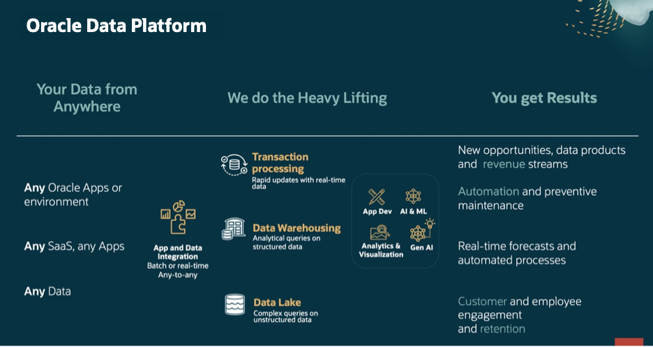
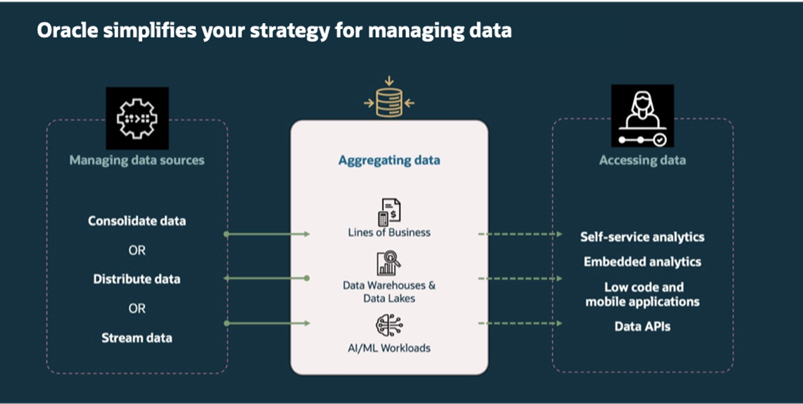

# Introduction  

## About this Workshop  

**Data isn't just an asset—it's the lifeblood of modern enterprises**.  

Investing in the right platform isn't optional; it's the foundation for staying competitive and future-proofing business success.  

In this hands-on workshop, you'll explore the full breadth of tools, services, and applications offered by **Oracle's Data Platform**, and discover how they help organizations simplify the end-to-end data lifecycle — from ingestion and transformation to analysis and secure sharing.  

Through a series of guided labs modeled on real-world tasks from a loan funding company, you'll experience how centralized data management, streamlined workflows, and intelligent analytics come together to unlock the value of enterprise data.  

### You will:  

* **Gain Access to Data** from multiple sources to build a unified view, breaking down data silos and enabling comprehensive analysis.  

* **Create and publish data products** for actionable insights, empowering other departments to be able to provide timely, data-driven decision-making feedback.  

* **Securely share selected datasets** across departments, such as marketing, to support campaign planning while maintaining data governance and privacy.  

By the end of this workshop, you'll understand how **Oracle’s Data Platform** provides a **scalable, future-ready foundation** for financial organizations seeking to:  

* ✅ Increase agility  
* ✅ Enhance collaboration  
* ✅ Drive business success through data driven decision making  

### **Objectives**

  Apply your skills through guided development tasks that simulate real-world data requests.

  In this section, you will:
  *	Receive a set of **enhancement requests** designed to support new requests for data access.
  *	Perform **data discovery**, **data transformation**, and **data sharing** tasks to fulfil those requests.
  *	Use **integrated data platform tools** to **manage data access**, **improve data quality**, and deliver **fit-for-purpose data products**.

### **Prerequisites**

This lab assumes you have:

* An Oracle account to submit your a LiveLabs Sandbox reservation.
* Basic knowledge of Oracle Database.

## Key Terms

___

### **About Oracle Autonomous Database (ADB)**

Oracle Autonomous Database is a converged, multimodel platform that enables users to seamlessly work with both structured and unstructured data, including external sources — all within a single, unified environment. This integrated approach eliminates the need for multiple specialized databases, significantly simplifying data architecture and management.
With support for all data types and workloads, Autonomous Database allows you to perform a wide range of analytics — from traditional SQL queries to machine learning and spatial analysis — across internal and external data sources. This unification empowers organizations to drive faster insights while reducing complexity and operational overhead.

### **About Data Warehouse**

A data warehouse stores structured, cleaned, and preprocessed data for business intelligence and analytics. Primarily used for business intelligence (BI) and reporting, providing historical data analysis for trends and insights.

### **About Data Lake**

A data lake is a substantial repository designed to store a wide variety of data, such as text, images, and videos, in their original and unstructured formats. Rather than categorizing or formatting the data up front, everything is gathered into one “pool.” This flexible approach allows analysts and researchers to determine how best to structure and interpret the data later on. However, maintaining clear governance and organization is crucial to prevent the data lake from becoming a disorganized “data swamp.”

### **About Data Lakehouse**

Combines the flexibility of a data lake with the data management and querying capabilities of a data warehouse. This hybrid approach allows users to determine how best to structure and interpret the data, while still benefiting from higher reliability and query efficiency.  It is aimed at facilitating machine learning, business intelligence, and predictive analytics.

### **About Data Platform**

A data platform is a technology solution that enables the collection, storage, cleaning, transformation, analysis and governance of data. Data platforms can include both hardware and software components. They make it easier for organizations to use their data to improve decision making and operations. Data platforms are increasingly more popular with the need for a centralized solution to meet today’s AI needs.  AI applications and solutions need access to data in real time to enable better solutions and greater innovation.

### **About Data Product**

A data product is a reusable data asset designed to address a specific business need or deliver actionable insights. It transforms raw data into trusted, consumable information that can be easily accessed and used across various applications, teams, and use cases — both internally and externally.
Data products are built with quality, context, and usability in mind. They include essential elements such as metadata, data lineage, and governance policies to ensure trust, transparency, and consistency. By treating data as a product, organizations can scale data sharing, accelerate innovation, and enable data-driven decision-making across the enterprise.

### **About Data Catalog**

Oracle Cloud Infrastructure (OCI) Data Catalog is a fully managed, self-service solution for data discovery, governance, and metadata management across your enterprise data landscape. It provides a centralized, collaborative environment where users can manage technical, business, and operational metadata in one place.
With Data Catalog, you can collect, organize, search, access, enrich, and activate metadata—making it easier to understand your data assets, ensure governance, and drive greater data utilization across your organization.

## Learn More

* [The Catalog Tool](https://docs.oracle.com/en/cloud/paas/autonomous-database/serverless/adbsb/catalog-entities.html)
* [Autonomous Database](https://docs.oracle.com/en/cloud/paas/autonomous-database/index.html)

## Acknowledgements
* **Authors** - Eddie Ambler, Otis Barr, Matt Kowalik, Ramona Magadan
* **Contributors** - Francis Regalado
* **Last Updated By/Date** - Kamryn Vinson, June 2025
