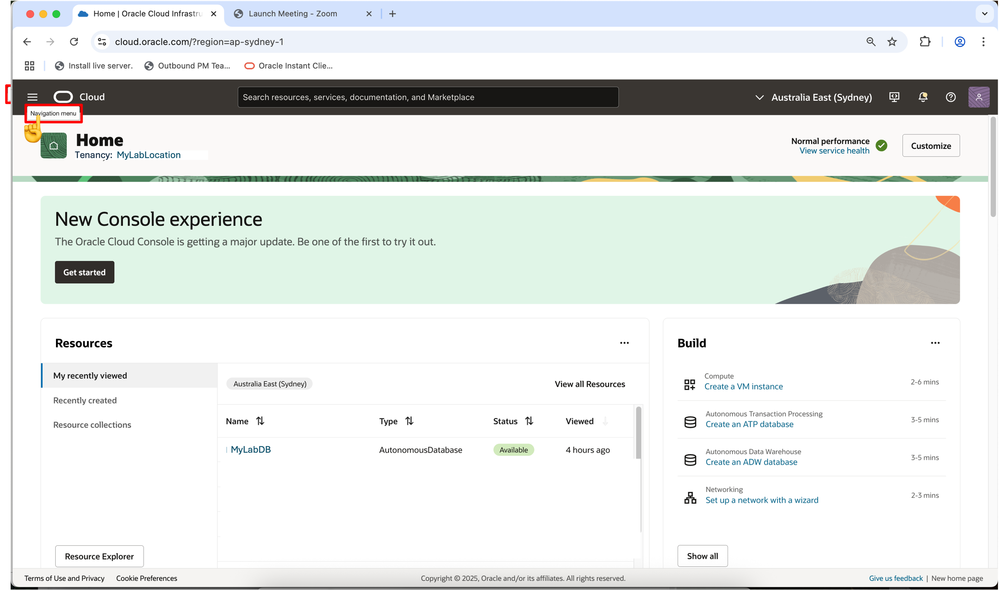
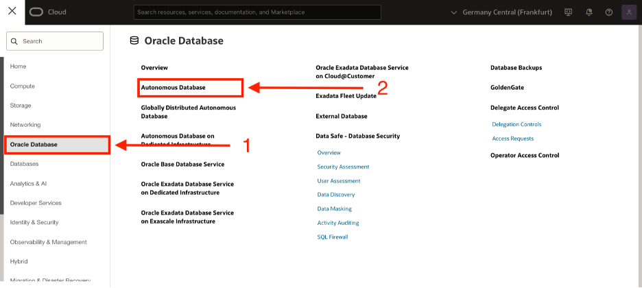

# 🏗️ Build your Data Pipeline: Load & Transform Data (optional lab)

## Introduction

In this lab, you’ll practice setting up the live feed capabilities, that can be used to load data that is continuously collected into cloud object storage.  When a load job is enabled for live feed, it is connected to the OCI event notification and subscription mechanism, so that every time a new object is created in the object store bucket, it triggers the live feed, loading the contents to the database

## Estimated Lab Time: 45 minutes

## Objectives
  * Login to LiveLabs Sandbox
  * Find your LiveLabs Sandbox reservations

## Prerequisites
  This lab assumes you have:
  * Completed the Get Started lab
  * Successfully launched the hands-on lab environment

## Task 1: Create a Notifications Service Subscription Topic  

  1. Open the OCI Console at cloud.oracle.com, then click the icon in the upper left corner to open the **Navigation Menu**.

  

  2. Select **Developer Services** from the Navigation Menu  

  

  3. Click **Notifications** under the **Application Integration** heading.

  

  4. Click **Create Topic**

  

  5. Enter details, then click the **Create** button.

  

## Task 2: Create a Events Service Rule.

1. Open the **Navigation Menu** Click the icon in the upper left corner to 

  

2. Select **Observations & Management** from the Navigation Menu

  

3. Click **Rules** under the **Events Services** heading.

  

4. Click **Create Rule** and enter details.

  

5. Enter Rule details, as shown below:

  

  Click **Create Rule**.

## Task 3: Access Local Data Catalog   

1. Navigate to your assigned ADB Instance.

  a. Open Navigation Menu  
  b. Select Oracle Database  
  c. Select Autonomous Database  

      

1. Select the name of your assigned database.  

    

1. Click on Database Actions, then select Data Load from the drop-down list  

      

1. Click on **Catalog** on left rail for the **ADB Catalog** to be displayed  

      

    **Congratulations you can now see your data objects from your Catalog!**  

## Task 4: Create a Live Table Feed and Copy the notification URL

   

5. Select **Feed Data** from the options listed at top of page.

  

6. Click the **Create Live Table Feed** button to enter the **Create Live Feed** wizard.

  

7. Select desired Cloud Store location, then click **Next**.

      

8. Enter desired Table Settings, then click **Next**.

  

9. Review the information shown on the Preview page, then click **Next**.

  

10. Complete the creation of the Live Table Feed 
  
  \* Take the following actions \...
    \* Enter the **Live Table Feed Name:**
    \* Check box to **Enable for Notification**
    \* Uncheck box to **Enable for Scheduling**
  \* Click **Create**

  

11. When the popup box appears, select **Yes** to run the Live Feed.

  

12. **Review** the details for the newly created Live Feed.  Then click the hamburger button in the upper right corner of the panel.

  

13. Select **Show Notification URL** from the dropdown list.

  

14. Copy the notification URL for the live table feed and click OK to proceed to next task.

  

  >**NOTE:** The notification URL will be used later in Task #4.

## Task 4: Create a Notifications Service Subscription

  1. Click on the **Navigation Menu**, then select **Developer Services**.

  

  2. Click **Notifications** under the **Application Integration** heading.

  

  3. Select **Subscriptions** (on the left side of the page, just below Topics).  The status will be **Active**.

  

  4. Click **Create Subscription**.

  5. Enter the Subscription details.

  

    * Provide the following:
    * **Subscription topic:** Select the subscription topic you created in Task 2
    * **Protocol:** Email
    * **URL** Paste in the URL you copied in Task 3

    * Click **Create**

  6. Switch to the Database Actions tab to review the card for the live table feed you are configuring for a notification-based feed.  It should reflect an **Active** notification status..

  

  * You will receive email notifications when specific live feed events occur and any new files uploaded to the bucket will automatically be loaded into the live feed table.

## Learn More

* [The Catalog Tool](https://docs.oracle.com/en/cloud/paas/autonomous-database/serverless/adbsb/catalog-entities.html)
* [Autonomous Database](https://docs.oracle.com/en/cloud/paas/autonomous-database/index.html)

## Acknowledgements

* **Authors** - Eddie Ambler, Otis Barr, Matt Kowalik
* **Contributors** - Mike Matthews, Marty Gubar, Francis Regalado, Ramona Magadan
* **Last Updated By/Date** - 04-28-2025

Copyright (C) Oracle Corporation.
