# 🏗️ Build your Data Pipeline: Load & Transform Data

## Introduction

In this lab, you’ll practice setting up the live feed capabilities, that can be used to load data that is continuously collected into cloud object storage.  When a load job is enabled for live feed, it can be  connected to the OCI event notification and subscription mechanism, so that every time a new object is created in the object store bucket, it triggers the live feed, loading the contents to the database.

Estimated Lab Time: 45 minutes

### Objectives
  * Login to LiveLabs Sandbox
  * Find your LiveLabs Sandbox reservations

### Prerequisites
  This lab assumes you have:
  * Completed the Get Started lab
  * Successfully launched the hands-on lab environment

## Task 1: Prepare to Build a Data Pipeline

  1. Click **View Login Info**. Copy your **DB ADMIN Password**, and click the **SQL Worksheet** link.  

        

  2. For your Username enter **LOAN**. Paste in the password you copied in the previous step  

        

      Click **Sign-in** button  

  3. Select the **Development** tab, then click **SQL** to open the **SQL Worksheet**.

      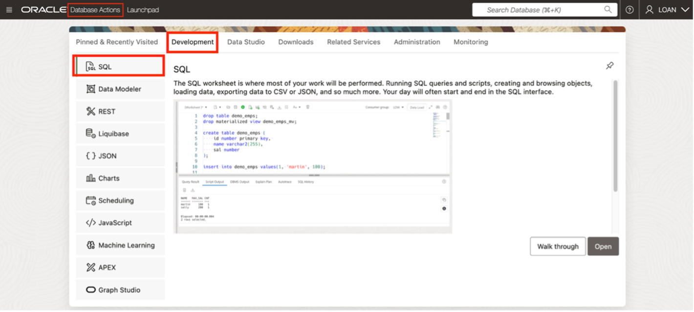  

   4. Copy the following PL/SQL code to your clipboard, then paste it in the **SQL Worksheet**.  We will be using it to copy objects from one storage bucket to another.  

      ```
      <copy>
          DECLARE
            object_name     VARCHAR2(200) := 'funding_commitments1.json';
            credential_name VARCHAR2(200) := 'OCI_API_KEY_CRED';
            folder_name     VARCHAR2(200) := ‘FUNDING/’;
            source_uri      VARCHAR2(200);
            target_uri      VARCHAR2(200);;
           BEGIN
            source_uri := source_uri||object_name;
            target_uri := target_url||folder_name ||object_name;

            DBMS_CLOUD.COPY_OBJECT (credential_name, source_uri, target_uri);
           END;
           /
      </copy>
      ```
  5. Right-click on your browser tab and select **Duplicate** from the context menu to open another tab.  Click **Database Actions** in the top banner of the new tab.

      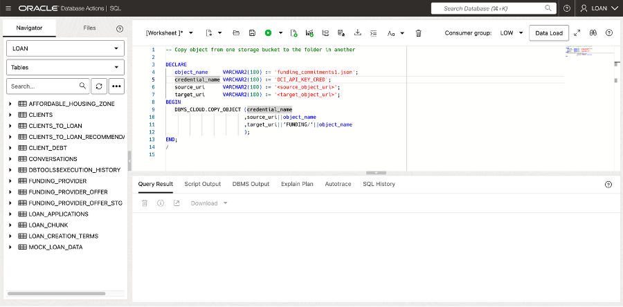  

  6. Click **Data Studio** from the Launchpad page.

      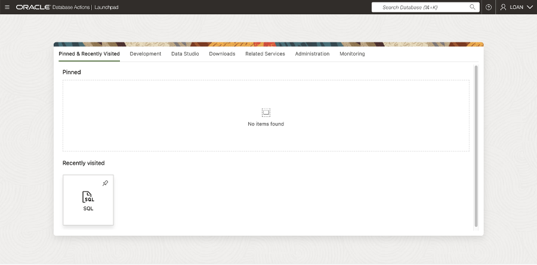  

  7. Select **Data Load** from the Launchpad page.

      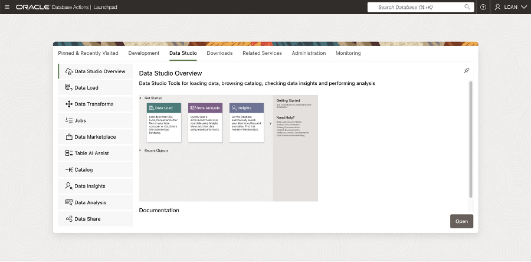  

  8. Then select the **Connections** tile.

      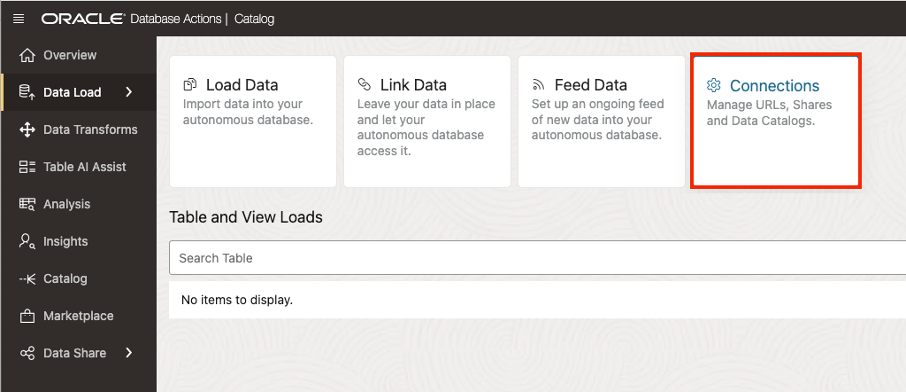  

  9. Select the **LOANAPP\_FUNDING** panel, on the **Connections** page.

      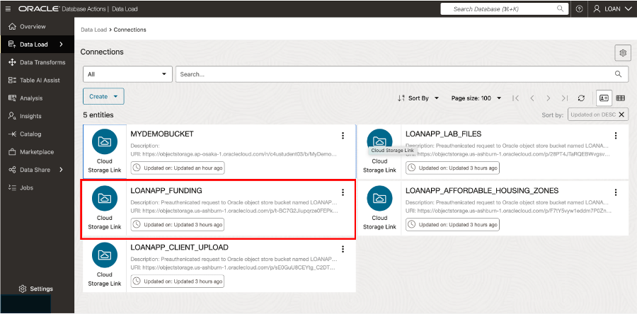  

10.	Copy the source URI for **LOANAPP\_FUNDING** cloud storage to your clipboard

      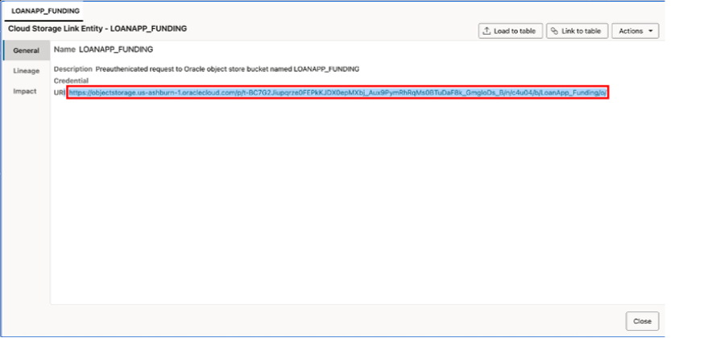  

11.	Return to **SQL | Oracle Database Actions** tab.  Modify the source\_uri definition in the **SQL Worksheet**, as shown below:  

      ```
      source_uri    VARCHAR2(100) := ‘< the LOANAPP_FUNDING uri you copied >';
      ```

12.	Return to the **Data Load | Oracle Database** tab.  Select the **MyDemoBucket** panel.  

      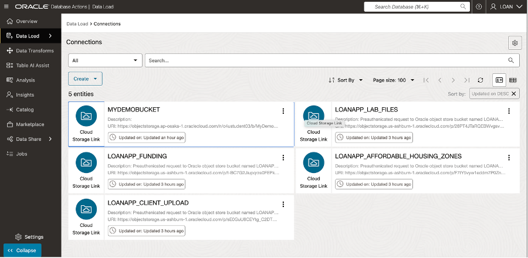  

13.	Copy the URI for **MYDEMOBUCKET** cloud storage to your clipboard.  

      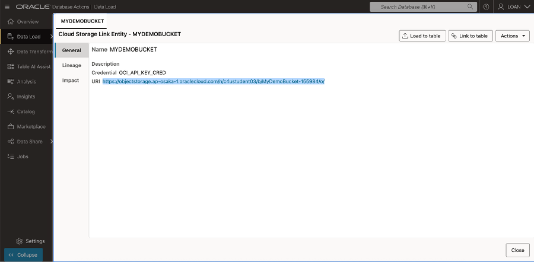  

  Click **Close** to exit.  

14.	Return to **SQL | Oracle Database Actions** tab.  Modify the target\_uri definition in the **SQL Worksheet**, as shown below:  

      ```
      target_uri    VARCHAR2(100) := ‘< the MYDEMOBUCKET uri you copied >';
      ```

15.	Click the **Run Script** button.  A message indicating the PL/SQL code completed successfully will appear near the bottom of the screen.

      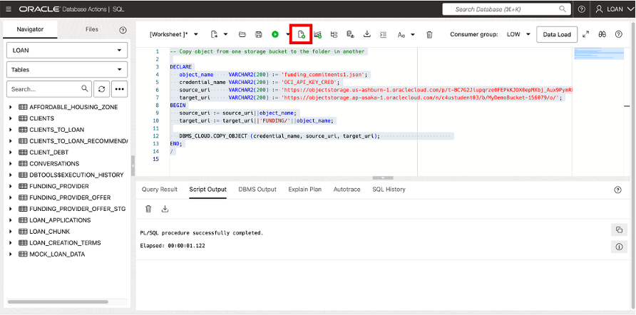  

16.	Return to **Data Load | Oracle Database** tab.  Click the **Actions** icon in the **MyDemoBucket** panel and select Objects from the context menu.

    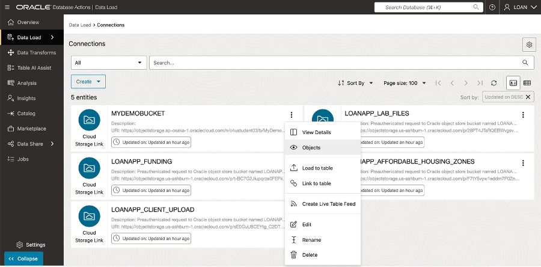 

17.	Click the folder icon to confirm that the **funding\_commitments1.json** file in the **LOANAPP\_FUNDING** bucket has been successfully copied here.  

    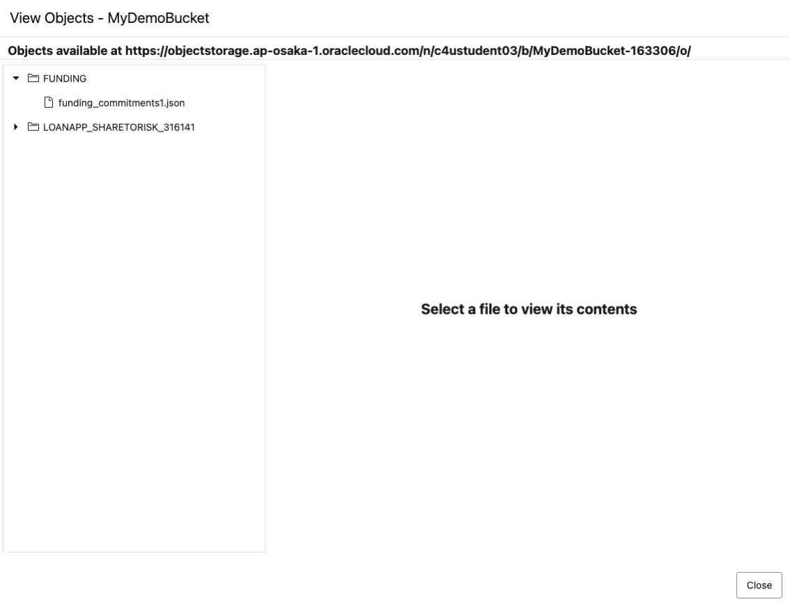 

  Click **Close** to exit.  

## Task 2: Build Initial Table Feed

  1. Navigate to the **Data Load | Oracle Database** tab.  Select **Feed Data**.

       


  2.  Click the **Create Live Table Feed** button to enter the Create Live Feed wizard  

        

  3. Enter details for the Live Table Feed Preview.  
  
     Cloud Store Location: **MyDemoBucket**  
     Check box:            **Advanced**  
     Object Filter:        **FUNDING\\*.json**  

      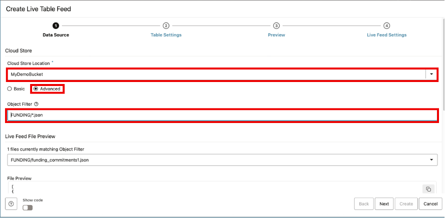  

     Click the **Next** button to proceed.

  4. Enter  the name of the target table -- **FUNDING\_PROVIDER\_OFFER\_STG**.  Then modify **Mapping** details exactly as shown below:  

       

     Click the **Next** button to proceed.

  5. Review the information shown on the Preview page.  

      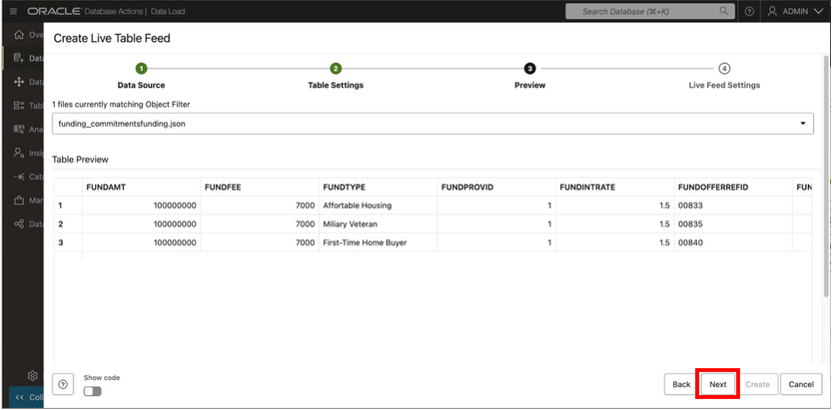 

    Click **Next** to proceed.  

   6. Enter remaining details for the **Live Table Feed**

      a. Enter live feed name **LoanApp\_Funding\_Feed**  
      b. Check box to **Enable for Scheduling**.  
      c. Select every **2 minutes** for the polling time interval  

        

      Click **Create**  

  6. When the popup box appears, select **Yes** to run the Live Feed.

      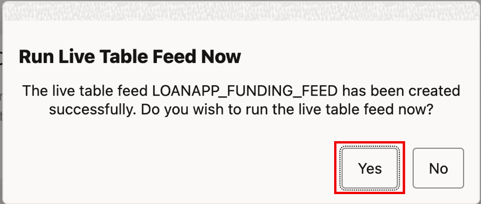

## Task 3: Perform Live Table Feed and Populate Production

1.	Return to the **SQL | Oracle Database Actions** tab.  Modify the object\_name definition in the SQL Worksheet, as shown below:

      ```
      object_name     VARCHAR2(200) := 'funding_commitments2.json';
      ```

2.	Click the **Run Script** button.  A message indicating the PL/SQL code completed successfully will appear near the bottom of the screen.

  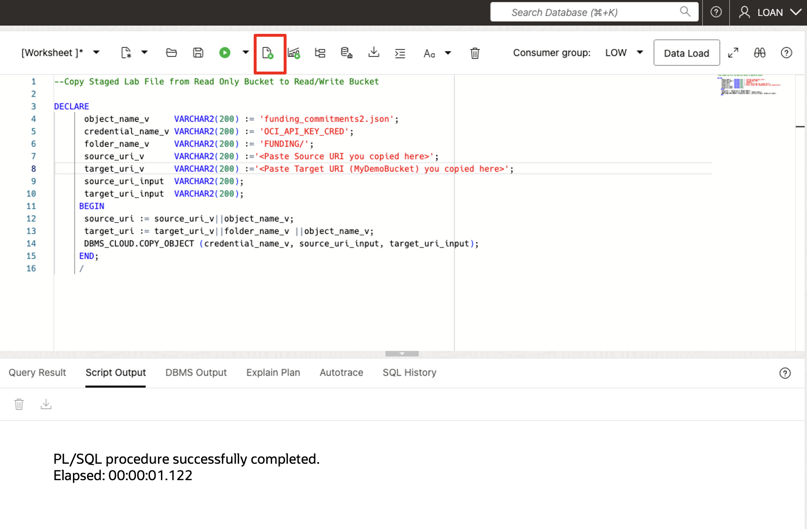

3. Navigate to the **Data Load | Oracle Database** tab.  Review the details for the Live Table Feed.  

  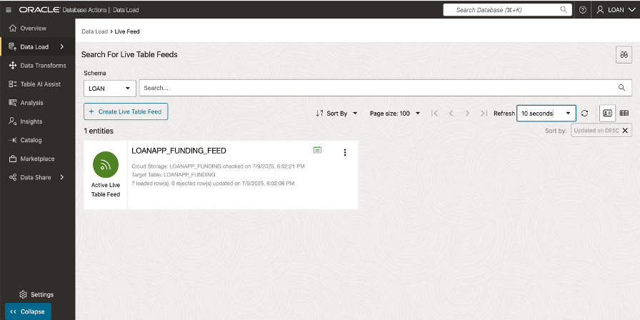

4.	Return to the **SQL | Oracle Database Actions** tab.  Execute the following code to populate production with new loan products.

      ```
      <copy>
           DECLARE
              new_add  NUMBER;
              new_bal  NUMBER;
              add_dte  VARCHAR2(100);
           BEGIN
              SELECT TO_CHAR(SYSDATE,'mm-dd-yyyy hh:mi') INTO add_dte FROM dual;
              SELECT count(*) INTO new_add FROM funding_provider_offer_stg;  

              CONVERT_FUNDING_TO_LOAN_PRODUCT;

              SELECT count(*) INTO new_bal FROM mock_loan_data;  

              DBMS_OUTPUT.put_line('On '||add_dte||', '||new_add||' rows of data were added to production for a total of '||new_bal||' loan products.')
           END;
           /.  

      </copy>
      ```

## Conclusion
In this lab, you built a data pipeline using Oracle Live Table Feed and successfully queried live data from Autonomous Database. You’ve seen how Oracle’s Data Share tool helps teams like SeersEquities’ Risk Department securely access the latest loan data—without duplication, delays, or manual handoffs.
This workflow ensures faster risk analysis, smarter decisions, and tighter collaboration across the business—all powered by governed, trusted data.


## Learn More

* [The Catalog Tool](https://docs.oracle.com/en/cloud/paas/autonomous-database/serverless/adbsb/catalog-entities.html)
* [Autonomous Database](https://docs.oracle.com/en/cloud/paas/autonomous-database/index.html)

## Acknowledgements

* **Authors** - Eddie Ambler, Otis Barr, Matt Kowalik
* **Contributors** - Mike Matthews, Marty Gubar, Francis Regalado, Ramona Magadan
* **Last Updated By/Date** - 04-28-2025

Copyright (C) Oracle Corporation.
