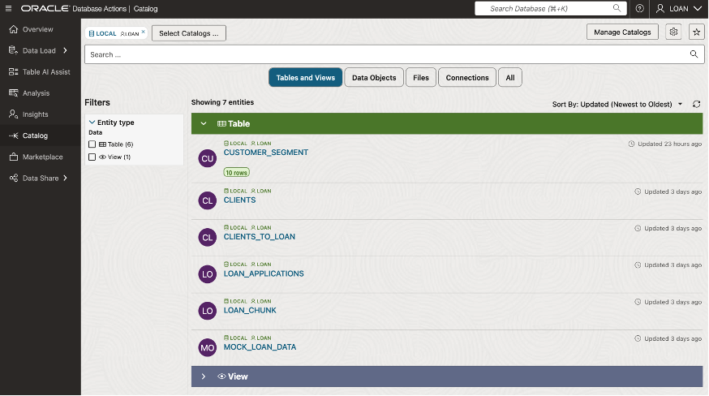
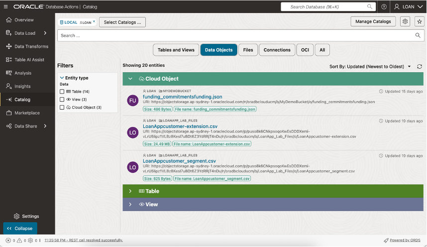
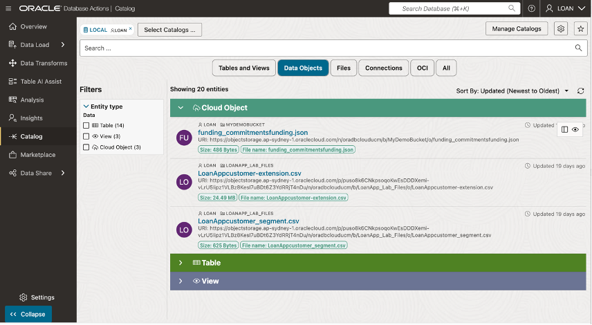
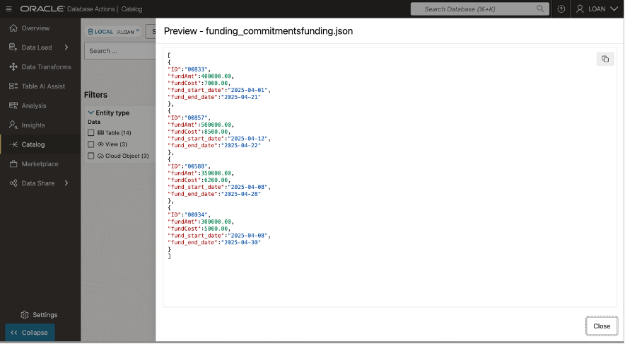
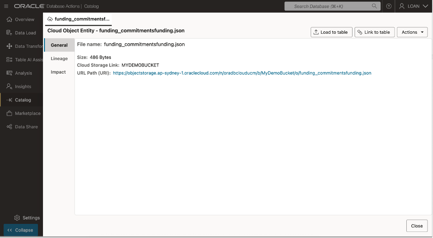
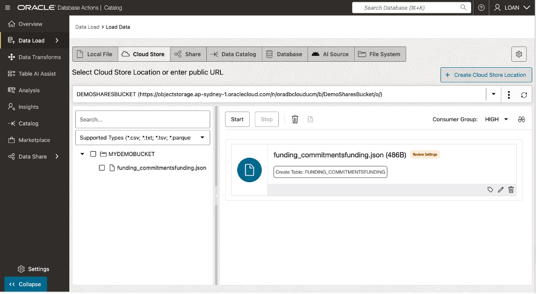
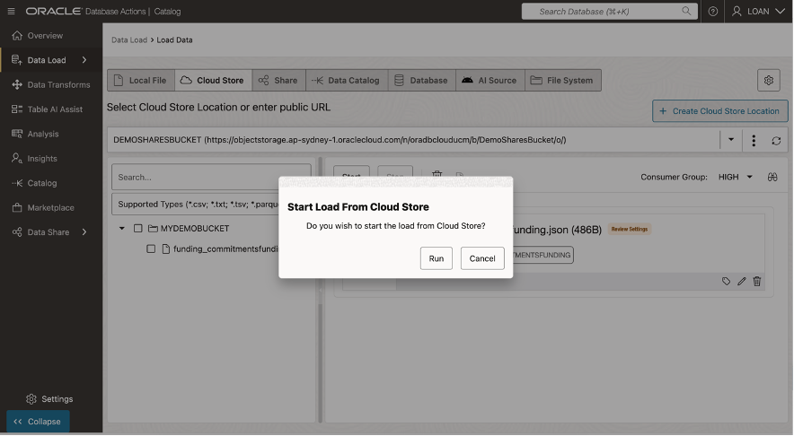

# 🏗️ Build your Data Pipeline: Load & Transform Data (optional lab)

#### Estimated Lab Time: 45 minutes

## Introduction

In this lab, you’ll practice importing data from Oracle Object Storage and preparing it for analysis in various formats. You’ll learn how to load JSON data into the Oracle Autonomous Database and prepare it for use.

## Task 1: Extract Data from Object Storage.

In this task, you’ll work with a JSON-formatted file stored in your Oracle Object Storage bucket. 

Here’s what you’ll do:

📥 **Access the Object Storage Bucket**

  1.	Access the Object Storage Bucket 
  On the left rail, select Catalog  to locate the file containing loan funding data in your Object Storage bucket.
 
  

  2.  Select Data Objects to display the available database objects and the listing of the files available in our object storage
 
  

  3.	Hover over file name to see data preview option and Click the Preview Icon on the far right, to display data preview. 
 
  

  4.	This displays the contents of the file being previewed without needing to first load it into the database.   

  

  Click on Close button to return to Data Catalog listings. 
 
## Task 2: Load Data from Object Storage.

  1.	Hover over file name to see data preview option and Click the View Details icon  on the far right, to display file details. 

  

  2.	Select the Load to Table button and the Load Data page will appear 

  

  3.	Select the Start button and the Load Data page will appear.  

  

  4.	Select the Start button to submit data load job.  

  

  5.	Select the Start button to submit data load job.  

  At the end of this task, you’ll have successfully imported and validated JSON data, making it available for use within the Oracle Autonomous Database.

## Task 3: Combine Data from Object Storage

🔄 **Transform JSON Data Using ELT**

* Extract meaningful information from **nested JSON structures** using SQL/JSON functions like `JSON_TABLE` or `JSON_VALUE`.

Clean and reformat the data as needed:

- **Normalize nested structures** into relational tables.
- **Convert inconsistent formats** (e.g., dates or currency) into standard formats.
- Store **transformed data** in a new table optimized for querying.

🔗 **Join Loan Offers with Other Data**

* Combine loan offer data with other tables in your database using **SQL joins**.

For example:

- Link loan offers with **customer demographics** or **property details**.
- Run advanced queries to gain insights:
  - Identify **trends in loan offers** by region or applicant type.
  - Analyze **loan approval rates** based on interest rates or terms.

✅ **Validate and Test Queries**

* Verify that transformations were applied correctly by running **test queries** on the transformed data.

* Ensure that all **key fields are accessible** and properly formatted for analysis.

By completing this task, you’ll understand how to handle complex JSON files, transform them using ELT processes, and integrate them with other datasets for deeper insights.

> **Note:** `<SCREENSHOTS!>`

<!--
* You’ll grab a CSV (comma-separated values) file from your Object Storage bucket—think of it like a simple spreadsheet.

* You’ll import this data into your database, so you can easily analyze home zone data right inside Oracle.

* Next, you’ll handle JSON files—these are more like structured text that show data in pairs of names and values.

* You’ll run an ETL (Extract, Transform, Load) process to clean or reformat that JSON data and get it ready for queries.

* Once it’s loaded, you can join it with other information in your database to see loan offers in a whole new light. -->

---

## Key Terms

### **Affordable Housing Zone**

Affordable Housing Zones are an economic development tool that allows people to invest in distressed areas in the United States. Their purpose is to spur economic growth and job creation in low-income communities while providing tax benefits to investors.

---

## Learn More

* [The Catalog Tool](https://docs.oracle.com/en/cloud/paas/autonomous-database/serverless/adbsb/catalog-entities.html)
* [Autonomous Database](https://docs.oracle.com/en/cloud/paas/autonomous-database/index.html)

## Acknowledgements

* **Authors** - Eddie Ambler, Otis Barr, Matt Kowalik
* **Contributors** - Francis Regalado, Ramona Magadan
* **Last Updated By/Date** - TBC

Copyright (C) Oracle Corporation.
