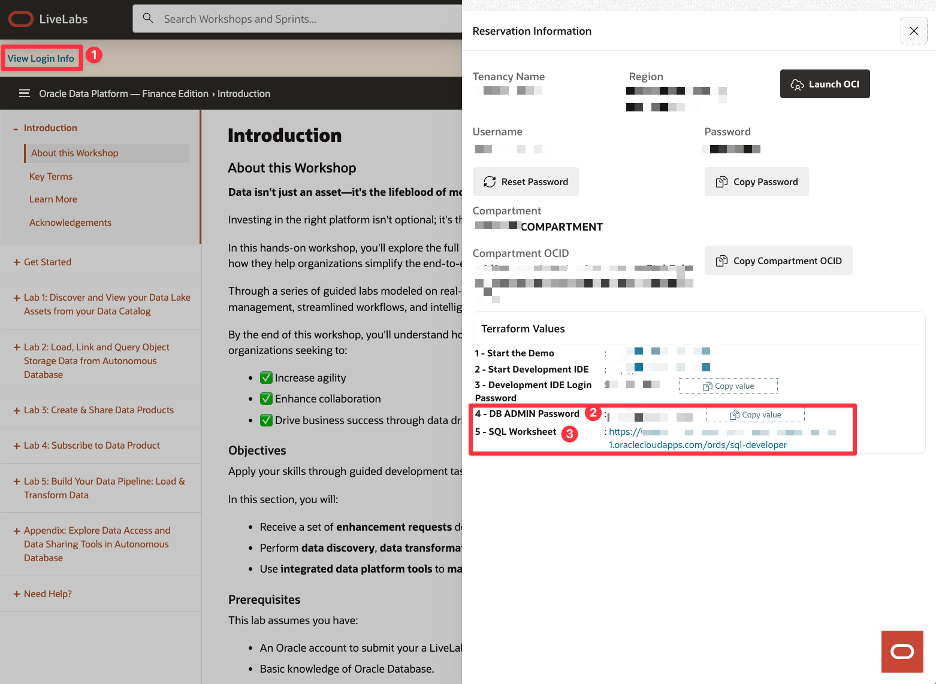
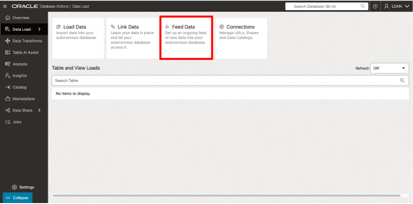
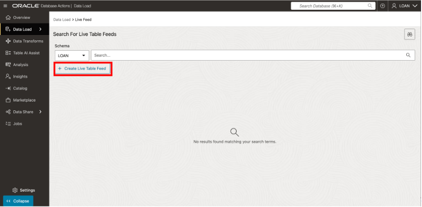
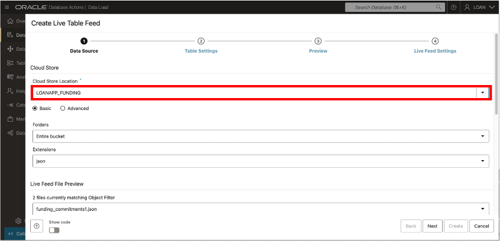
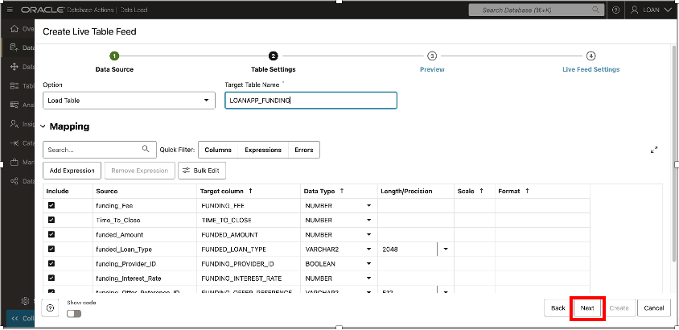
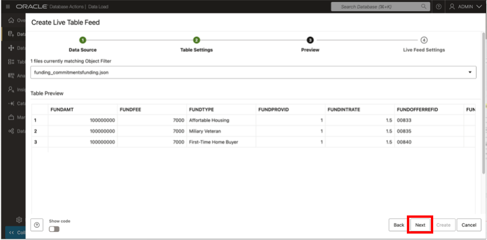
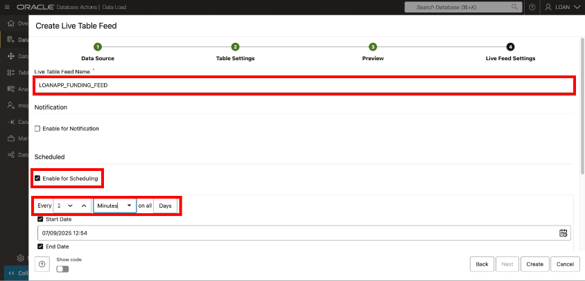
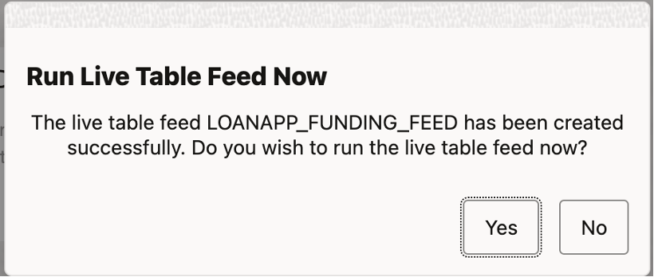
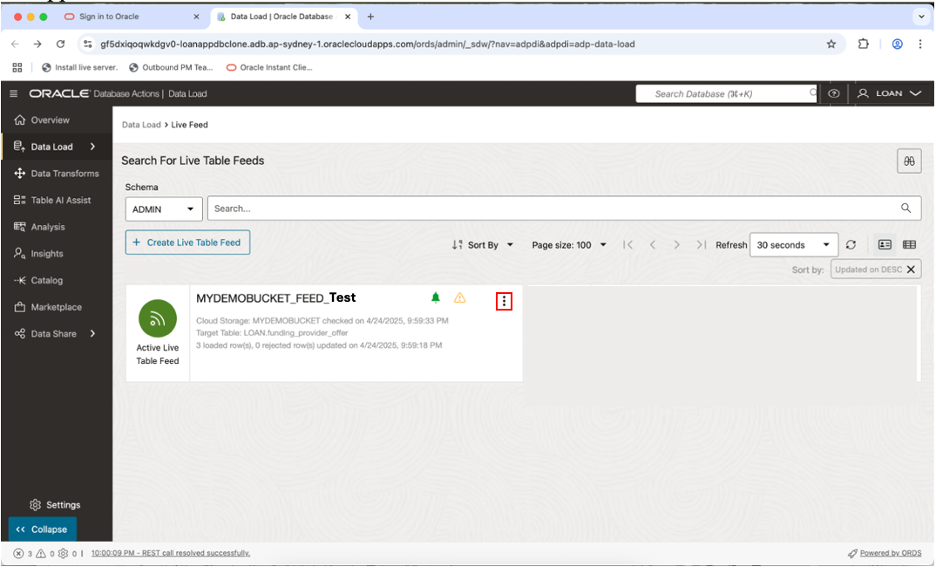

# 🏗️ Build your Data Pipeline: Load & Transform Data (optional lab)

## Introduction

In this lab, you’ll practice setting up the live feed capabilities, that can be used to load data that is continuously collected into cloud object storage.  When a load job is enabled for live feed, it can be  connected to the OCI event notification and subscription mechanism, so that every time a new object is created in the object store bucket, it triggers the live feed, loading the contents to the database.

Estimated Lab Time: 45 minutes

### Objectives
  * Login to LiveLabs Sandbox
  * Find your LiveLabs Sandbox reservations

### Prerequisites
  This lab assumes you have:
  * Completed the Get Started lab
  * Successfully launched the hands-on lab environment

## Task 1: Prepare to Build a Data Pipeline

  1. Click **View Login Info**. Copy your **DB ADMIN Password**, and click the **SQL Worksheet** link.
  
        
  
  2. For your Username enter **LOAN**. Paste in the password you copied in the previous step  
  
       

      Click **Sign-in** button  

  3.  Click **Data Load** button  

       

  4.  Select **Feed Data** from the options listed at top of page  

       

## Task 2: Create and Run Live Table Feed

  1.  Click the **Create Live Table Feed** button to enter the Create Live Feed wizard  

        

  2.  Select desired **Cloud Store location**, then click **Next**  

        

  3.  Accept the default Table Settings, then click **Next**  

       

  4.  Review the information shown on the Preview page, then click **Next**  

       

  5.  Complete the creation of the Live Table Table  

      a. Enter the **Live Table Feed Name**  
      b. Check box to **Enable for Scheduling**.  
      c. Select every **2 minutes** for the polling time interval  

        

      Click **Create**  

  6. When the popup box appears, select **Yes** to run the Live Feed.

      

  7. **Review** the details for the newly created Live Feed.  

  

## Learn More

* [The Catalog Tool](https://docs.oracle.com/en/cloud/paas/autonomous-database/serverless/adbsb/catalog-entities.html)
* [Autonomous Database](https://docs.oracle.com/en/cloud/paas/autonomous-database/index.html)

## Acknowledgements

* **Authors** - Eddie Ambler, Otis Barr, Matt Kowalik
* **Contributors** - Mike Matthews, Marty Gubar, Francis Regalado, Ramona Magadan
* **Last Updated By/Date** - 04-28-2025

Copyright (C) Oracle Corporation.
