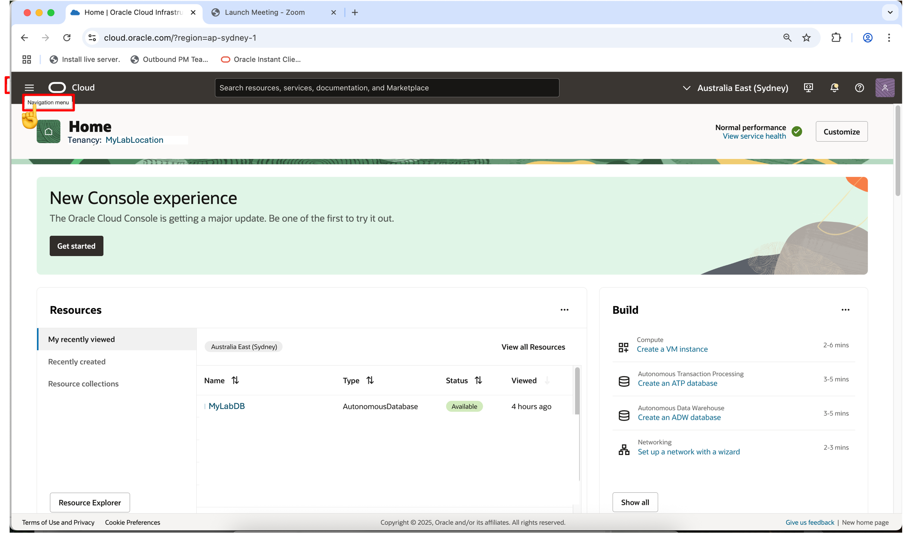
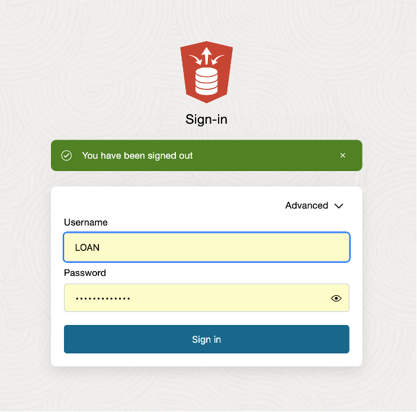

# 🏗️ Build your Data Pipeline: Load & Transform Data (optional lab)

Estimated Lab Time: 45 minutes

## Introduction

In this lab, you’ll practice setting up the live feed capabilities, that can be used to load data that is continuously collected into cloud object storage.  When a load job is enabled for live feed, it is connected to the OCI event notification and subscription mechanism, so that every time a new object is created in the object store bucket, it triggers the live feed, loading the contents to the database

<**NOTE:** To complete this lab, you will alternate between **Oracle Cloud Infrastructure Console** pages and **Oracle Database Actions** pages.  Selecting **Database Actions** will open a new tab.

## Task 1: Create a Notifications Service Subscription Topic  

  1. Open the OCI Console at cloud.oracle.com, then click the icon in the upper left corner to open the **Navigation Menu**.

  

  2. Select **Developer Services** from the Navigation Menu  

  

  3. Click **Notifications** under the **Application Integration** heading.

  

  4. Click **Create Topic**

  

  5. Enter details, then click the **Create** button.

  

## Task 2: Create a Events Service Rule.

1. Open the **Navigation Menu** Click the icon in the upper left corner to 

  

2. Select **Observations & Management** from the Navigation Menu

  

3. Click **Rules** under the **Events Services** heading.

  

4. Click **Create Rule** and enter details.

  

5. Enter Rule details.

  

    * Enter the following Details under **Rule Conditions**:
         * **Condition:** Event Type
         * **Service Name:** Object Storage
         * **Event Type:** Object – Create
         * **Action Type:** Notifications

    * Click **Create Rule**.

## Task 3: Create a Live Table Feed and Copy the notification URL

   >**NOTE:** If continuing from lab 4, click on **Database Actions** link and skip to step 6.

1. Navigate to your Assigned ADB Instance

    \* Open Navigation Menu  
    \* Select Oracle Database  
    \* Select Autonomous Database  

    

2. Select the name of your assigned database.

   

3. Select **Database Actions** then View all database actions.

    

4. On the **Database Actions Launchpad**, click the user icon in the top right corner.  

    \* Select **Sign Off** from the drop-down options. Enter credentials in the popup window shown below, to login as the LOAN user.  

    >**NOTE:** Use the same **ADMIN** password as shown on View Lab Info page

    

    \* Enter LOAN user credentials.  
    \* Press Sign-In button.  

5. Select **Feed Data** from the options listed at top of page.

  

6. Click the **Create Live Table Feed** button to enter the **Create Live Feed** wizard.

  

7. Select desired Cloud Store location, then click **Next**.

      

8. Enter desired Table Settings, then click **Next**.

  

9. Review the information shown on the Preview page, then click **Next**.

  

10. Complete the creation of the Live Table Feed 
  
  \* Take the following actions \...
    \* Enter the **Live Table Feed Name:**
    \* Check box to **Enable for Notification**
    \* Uncheck box to **Enable for Scheduling**
  \* Click **Create**

  

11. When the popup box appears, select **Yes** to run the Live Feed.

  

12. **Review** the details for the newly created Live Feed.  Then click the hamburger button in the upper right corner of the panel.

  

13. Select **Show Notification URL** from the dropdown list.

  

14. Copy the notification URL for the live table feed and click OK to proceed to next task.

  

  >**NOTE:** The notification URL will be used later in Task #4.

## Task 4: Create a Notifications Service Subscription

  1. Click on the **Navigation Menu**, then select **Developer Services**.

  

  2. Click **Notifications** under the **Application Integration** heading.

  

  3. Select **Subscriptions** (on the left side of the page, just below Topics).  The status will be **Active**.

  

  4. Click **Create Subscription**.

  5. Enter the Subscription details.

  

    * Provide the following:
    * **Subscription topic:** Select the subscription topic you created in Task 2
    * **Protocol:** Email
    * **URL** Paste in the URL you copied in Task 3

    * Click **Create**

  6. Switch to the Database Actions tab to review the card for the live table feed you are configuring for a notification-based feed.  It should reflect an **Active** notification status..

  

  * You will receive email notifications when specific live feed events occur and any new files uploaded to the bucket will automatically be loaded into the live feed table.

## Learn More

* [The Catalog Tool](https://docs.oracle.com/en/cloud/paas/autonomous-database/serverless/adbsb/catalog-entities.html)
* [Autonomous Database](https://docs.oracle.com/en/cloud/paas/autonomous-database/index.html)

## Acknowledgements

* **Authors** - Eddie Ambler, Otis Barr, Matt Kowalik
* **Contributors** - Mike Matthews, Marty Gubar, Francis Regalado, Ramona Magadan
* **Last Updated By/Date** - 04-28-2025

Copyright (C) Oracle Corporation.
