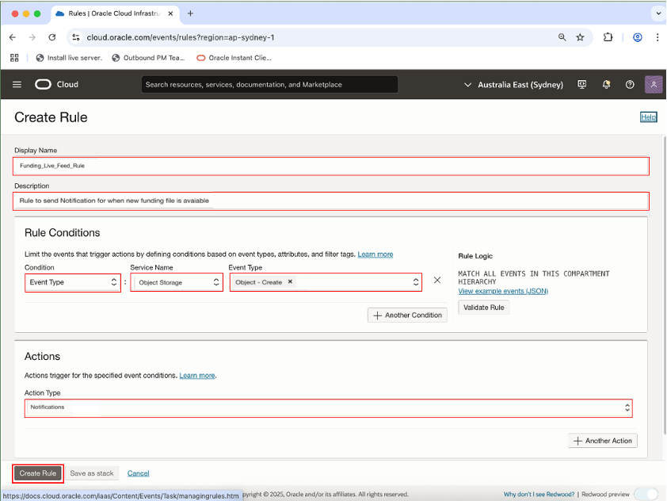

# 🏗️ Build your Data Pipeline: Load & Transform Data (optional lab)

#### Estimated Lab Time: 45 minutes

## Introduction

In this lab, you’ll practice setting up the live feed capabilities,that can be used to load data that is continuously collected into cloud object storage.  When a load job is enabled for live feed, it is connected to the OCI event notification and subscription mechanism, so that every time a new object is created in the object store bucket, it triggers the live feed, loading the contents to the database

**Note:** To complete this lab, you will alternate between Oracle Cloud Infrastructure Console pages and Oracle Database Actions pages.  It may be convenient for you to open the Cloud Console in one browser page or tab and Database Actions in another, so it’s easy to move back and forth.

## Task 1: Create a Notifications Service Subscription Topic.##

  1.	Open the OCI Console at cloud.oracle.com, click the hamburger icon in the upper left corner to display the **Navigation Menu**.

  

  2. Select **Developer Services** from the Navigation Menu

  

  3. Click **Notifications** under the **Application Integration** heading.

  

  4. Click **Create Topic**

  

  5. Enter Topic Details, then click **Create**.

  

## Task 2: Create a Events Service Rule.

1. Open the OCI Console at cloud.oracle.com, click the hamburger icon in the upper left corner to display the **Navigation Menu**.

2. Select **Observations & Management** from the Navigation Menu

3. Click **Rules** under the **Events Services** heading.

  

4. Click **Create Rule** and enter details.

  

* Enter the following Details under **Rule Conditions**:
    * **Condition:** Event Type
    * **Service Name:** Object Storage
    * **Event Type:** Object – Create
* Enter the following Details under Actions
    * **Action Type:** Notifictions
    * **Notifications Component:** Select the compartment to use for the notifications
    * **Topic:** Select the name of the topic you created in Task 2.

* Click **Create Rule**.

5. **Review** the Rule details  

  

## Task 3: Create a Live Table Feed and Copy the notification URL

  1. Open the OCI Console at cloud.oracle.com, and select the **Clone-of-LoanAppDB** ADB Instance.

  

  2. Select **Data Load** from DropDown Menu.

  

  3. Select **Feed Data** from the options listed at top of page.

  

  4. Click the **Create Live Table Feed** button to enter the **Create Live Feed** wizard.

  

  5. Select desired Cloud Store location, then click **Next**.

  

  6. Enter desired Table Settings, then click **Next**.

  

  7. Verify that the expected results are shown on the Preview page, then click **Next**.

  

  8. Enter details on the page below...

  

    **Live Table Feed Name:**
    **Enable for Notification check box:** check
    **Enable for Scheduling check box:** uncheck

  * Click **Create**

  9. When the popup box appears, select **Yes** to run the Live Feed.

  

  10. **Review** the details for the newly created Live Feed.  Then click the hamburger button in the upper left corner.

  

  11. Select **Show Notification URL** from the dropdown list.

  

  12. Copy the notification URL for the live table feed.  Show Notification URL from the dropdown list.

  

## Task 4: Create a Notifications Service Subscription

 1.	Open the OCI Console at cloud.oracle.com, click the hamburger icon in the upper left corner to display the **Navigation Menu**.

  

  2. Select **Developer Services** from the Navigation Menu

  

  3. Click **Notifications** under the **Application Integration** heading.

  

  4. Select **Subscriptions** (on the left side of the page, just below Topics).  The status will be **Active**.

  

  5. Click **Create Subscription**.

  

  6. Enter the Subscription details.

  

    * Provide the following:
    * **Subscription topic:** Select the subscription topic you created in Step 2
    * **Protocol:** Email
    * **URL** Paste in the URL you copied in Step 4

  * Click **Create**

  7. **Review** the Subscription details

  

## Task 5: Confirm that Endpoint Can Receive Notifications

  1. Open the OCI Console at cloud.oracle.com, and select the **Clone-of-LoanAppDB** ADB Instance.

  

  2. Select **Data Load** from DropDown Menu.

  

  3. Select **Feed Data** from the options listed at top of page.

  

  4.	**Review** the card for the live table feed you are configuring for a notification-based feed.  It should reflect an **Active** status..

  

  * You will receive email notifications when specific live feed events occur and any new files uploaded to the bucket will automatically be loaded into the live feed table.

## Learn More

* [The Catalog Tool](https://docs.oracle.com/en/cloud/paas/autonomous-database/serverless/adbsb/catalog-entities.html)
* [Autonomous Database](https://docs.oracle.com/en/cloud/paas/autonomous-database/index.html)

## Acknowledgements

* **Authors** - Eddie Ambler, Otis Barr, Matt Kowalik
* **Contributors** - Mike Matthews, Marty Gubar, Francis Regalado, Ramona Magadan
* **Last Updated By/Date** - 04-28-2025

Copyright (C) Oracle Corporation.
