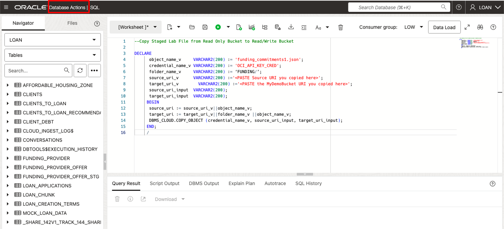
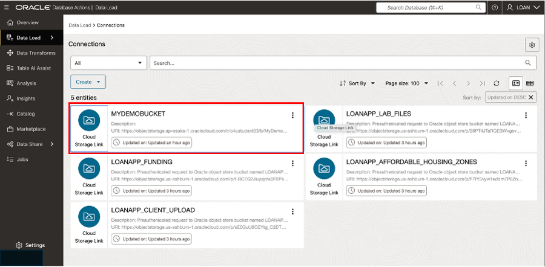
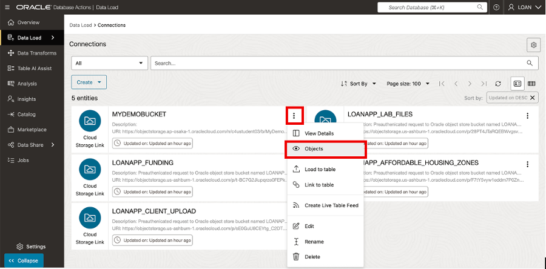
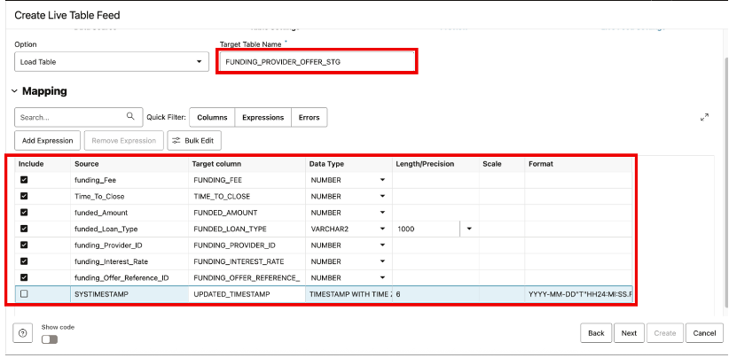

# 🏗️ Build your Data Pipeline: Load & Transform Data (optional lab)

## Introduction

In this lab, you’ll practice setting up the live feed capabilities, that can be used to load data that is continuously collected into cloud object storage.  When a load job is enabled for live feed, it can be  connected to the OCI event notification and subscription mechanism, so that every time a new object is created in the object store bucket, it triggers the live feed, loading the contents to the database.

Estimated Lab Time: 45 minutes

### Objectives
  * Login to LiveLabs Sandbox
  * Find your LiveLabs Sandbox reservations

### Prerequisites
  This lab assumes you have:
  * Completed the Get Started lab
  * Successfully launched the hands-on lab environment

## Task 1: Prepare to Build a Data Pipeline

  1. Click **View Login Info**. Copy your **DB ADMIN Password**, and click the **SQL Worksheet** link.
  
        
  
  2. For your Username enter **LOAN**. Paste in the password you copied in the previous step  
  
       

      Click **Sign-in** button  

  3. Select the Development tab, then click SQL to open the SQL Worksheet.

       

   4. Copy the following PL/SQL code to your clipboard, then paste it in the SQL Worksheet.  We will be using it to copy objects from one storage bucket to another. 
  

      ```
      <copy>
          DECLARE
            object_name     VARCHAR2(200) :=    'funding_commitments1.json';
            credential_name VARCHAR2(200) := 'OCI_API_KEY_CRED';
            folder_name     VARCHAR2(200) := ‘FUNDING/’;
            source_uri      VARCHAR2(200);
            target_uri      VARCHAR2(200);;
           BEGIN
            source_uri := source_uri||object_name;
            target_uri := target_url||folder_name ||object_name;
      
            DBMS_CLOUD.COPY_OBJECT (credential_name, source_uri, target_uri);
           END;
           /
      </copy>
      ```

  5. Right-click on your browser tab and select Duplicate from the context menu to open another browser tab.  Click Database Actions in the top banner of the new tab.

<<<<<<< Updated upstream

  1.  Click the **Create Live Table Feed** button to enter the Create Live Feed wizard  
=======
       

  6. Click Data Studio from the Launchpad page.

       

  7. Select Data Load from the Launchpad page.

       

  8. Then select the Connections tile.

       

  9. Select the LOANAPP_FUNDING panel, on the Connections page.

       

10.	Copy the source URI for LOANAPP_FUNDING cloud storage to your clipboard

       

11.	Return to SQL | Oracle Database Actions browser tab.  Modify the source_uri definition in the SQL Worksheet, as shown below:

      Before:
      source_uri   VARCHAR2(100);

      After:
      source_uri    VARCHAR2(100) := ‘< the LOANAPP_FUNDING uri you copied >';
      

12.	Return to the Data Load | Oracle Database browser tab.  Select the MyDemoBucket panel.

        

13.	Copy the URI for MYDEMOBUCKET cloud storage to your clipboard.  

        

  Click **Close** to exit.  

14.	Return to SQL | Oracle Database Actions browser tab.  Modify the target_uri definition in the SQL Worksheet, as shown below:

        Before:
        target_uri  VARCHAR2(100);

        After:
        target_uri   VARCHAR2(100) := ‘< the MYDEMOBUCKET uri you copied >';

15.	Click the Run Script button.  A message indicating the PL/SQL code completed successfully will appear near the bottom of the screen.

        

16.	Return to Data Load | Oracle Database browser tab.  Click the Actions icon in the MyDemoBucket panel and select Objects from the context menu.

     

17.	Click the folder icon to confirm that the funding_commitments1.json file in the LOANAPP_FUNDING bucket has been successfully copied here.  

     

  Click **Close** to exit.  

## Task 2: Build Initial Table Feed

  1. Navigate to the Data Load | Oracle Database tab.  Select Feed Data.

       


  2.  Click the **Create Live Table Feed** button to enter the Create Live Feed wizard  
>>>>>>> Stashed changes

        

  2.  Select desired **Cloud Store location**, then click **Next**  

        

  3. Select details for the Live Table Feed Preview.  
  

    - For Cloud Store Location: **MyDemoBucket**
    - For Check box:    **Advanced**
    - For Folders:      **FUNDING**
    - From Extensions:  **\*.json**
    
   Click the **Create** button to proceed.
       

  4. Enter  the name of the target table -- FUNDING_PROVIDER_OFFER_STG.  Then modify mapping details exactly as shown below:  

       

  5. Review the information shown on the Preview page.  

       

  Click **Next** to proceed.  

5. Enter remaining details for the **Live Table Feed**

      a. Enter live feed name **LoanApp_Funding_Feed**  
      b. Check box to **Enable for Scheduling**.  
      c. Select every **2 minutes** for the polling time interval  

        

      Click **Create**  

  6. When the popup box appears, select **No** to run the Live Feed.

      

8.	Manually execute the Live Table Feed. Click the Action icon and select xxx from the context menu.

      

## Task 3: Perform Live Table Feed

1.	Return to the SQL | Oracle Database Actions.browser tab.  Modify the object_name definition in the SQL Worksheet, as shown below:

2.	Click the Run Script button.  A message indicating the PL/SQL code completed successfully will appear near the bottom of the screen.

  

3. Navigate to the Data Load | Oracle Database browser tab.  Review the details for the Live Table Feed. 

  

4.	Return to SQL | Oracle Database Actions browser tab and query the target table --- FUNDING_PROVIDER_OFFER_STG to verify that 7 rows were loaded. 

    Before:
    target_uri  VARCHAR2(100);

    After:
    target_uri   VARCHAR2(100) := ‘< the MYDEMOBUCKET uri you copied >';

## Task 4: Populate Production with Pipeline Data

1.	Execute the following code to populate production tables with loan products derived from the data pipeline.


      ```
      <copy>
           DECLARE
              new_add  NUMBER;
              new_bal  NUMBER;
              wow      VARCHAR2(100);
           BEGIN
              select to_char(sysdate,'mm-dd-yyyy hh:mi') into wow;
              select count(*) into new_add from funding_provider_offer_stg;
              CONVERT_FUNDING_TO_LOAN_PRODUCT;
              select count(*) into new_bal from mock_loan_data;
           
              dbms_output.put_line('There are '||new_bal||' loan productions in production');
              dbms_output.put_line(new_add || ' were added on '||wow);
           END;
           /
           
      </copy>
      ```

## Conclusion
In this lab, you built a data pipeline using Oracle Live Table Feed and successfully queried live data from Autonomous Database. You’ve seen how Oracle’s Data Share tool helps teams like SeersEquities’ Risk Department securely access the latest loan data—without duplication, delays, or manual handoffs.
This workflow ensures faster risk analysis, smarter decisions, and tighter collaboration across the business—all powered by governed, trusted data.


## Learn More

* [The Catalog Tool](https://docs.oracle.com/en/cloud/paas/autonomous-database/serverless/adbsb/catalog-entities.html)
* [Autonomous Database](https://docs.oracle.com/en/cloud/paas/autonomous-database/index.html)

## Acknowledgements

* **Authors** - Eddie Ambler, Otis Barr, Matt Kowalik
* **Contributors** - Mike Matthews, Marty Gubar, Francis Regalado, Ramona Magadan
* **Last Updated By/Date** - 04-28-2025

Copyright (C) Oracle Corporation.
