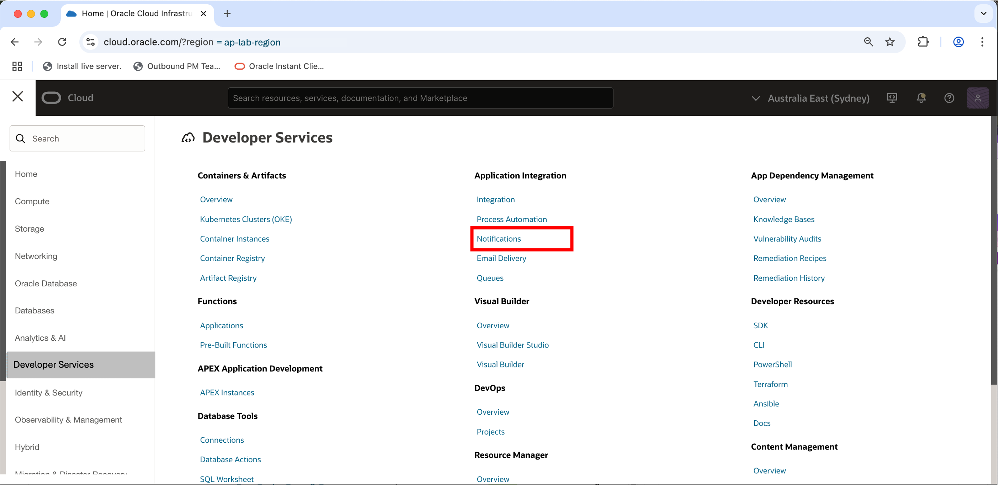
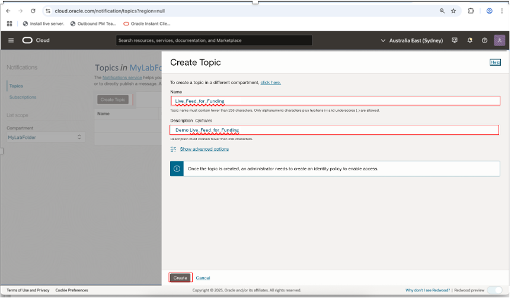
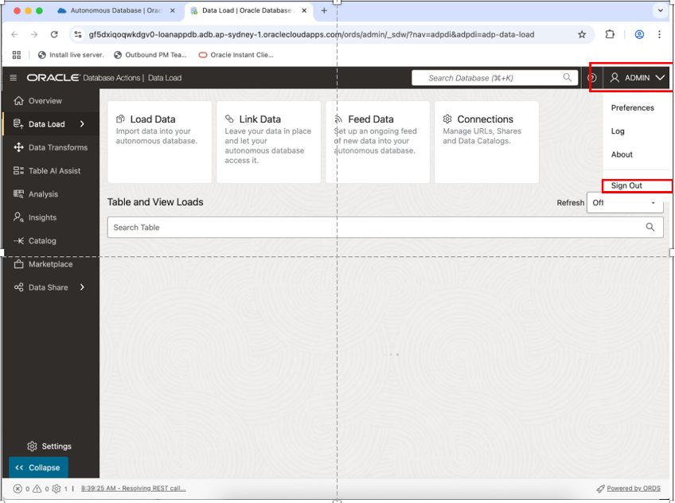
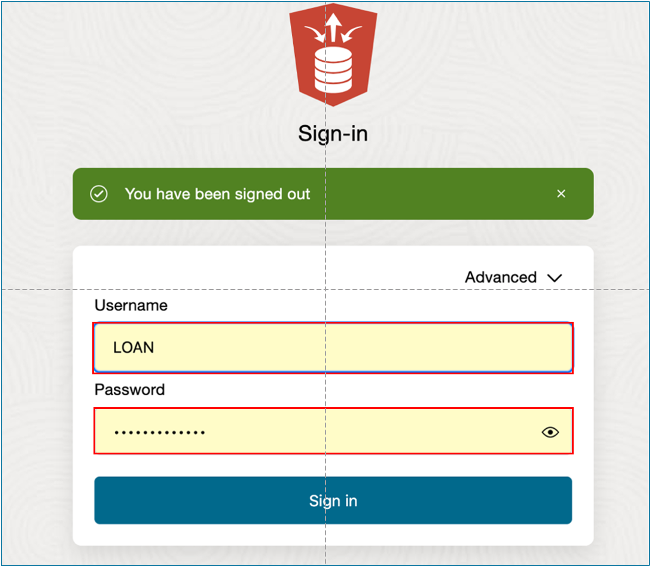

# 🏗️ Build your Data Pipeline: Load & Transform Data (optional lab)

#### Estimated Lab Time: 45 minutes

## Introduction

In this lab, you’ll practice setting up the live feed capabilities,that can be used to load data that is continuously collected into cloud object storage.  When a load job is enabled for live feed, it is connected to the OCI event notification and subscription mechanism, so that every time a new object is created in the object store bucket, it triggers the live feed, loading the contents to the database

**Note:** To complete this lab, you will alternate between Oracle Cloud Infrastructure Console pages and Oracle Database Actions pages.  Selecting Database Actions will open a new tab.

## Task 1: Create a Notifications Service Subscription Topic.

  1. Open the OCI Console at cloud.oracle.com, then click the icon in the upper left corner to open the **Navigation Menu**.

  

  2. Select **Developer Services** from the Navigation Menu

  

  3. Click **Notifications** under the **Application Integration** heading.

  

  4. Click **Create Topic**

  

  5. Enter details, then click the **Create** button.

  

## Task 2: Create a Events Service Rule.

  1.	Open the **Navigation Menu** Click the icon in the upper left corner to 

  

  2. Select **Observations & Management** from the Navigation Menu

  

  2. Click **Rules** under the **Events Services** heading.

  

  3. Click **Create Rule** and enter details.

  

  4. Enter Rule details.

  

    * Enter the following Details under **Rule Conditions**:
         * **Condition:** Event Type
         * **Service Name:** Object Storage
         * **Event Type:** Object – Create
    * Enter the following Details under Actions
         * **Action Type:** Notifictions
         * **Notifications Compartment:** Select the compartment to use for the notifications
         * **Topic:** Select the name of the topic you created earlier.

    * Click **Create Rule**.

## Task 3: Create a Live Table Feed and Copy the notification URL

 1.	Click the icon in the upper left corner to open the **Navigation Menu**.

  

  2. Select **Oracle Database** from the Navigation Menu

  

  3. Select **Autonomous Database**

  

  4. Navigate to the assigned Autonomous Database.

    * Confirm the assigned **Tenancy** is being used.  If not, use the drop-down provided to select the assigned one.
    * Confirm the assigned **Compartment** is being used.  If not, click on the icon and navigate to the assigned one.

    * Select the assigned **Autonomous Database** from list displayed.

    

  5. Open the **Database Actions** menu from the Autonomous Database General Information page, and select **Data Load**.

      

    >**Note:** This will open a new tab, giving us two tabs that we will alternate between for the rest of the workshop.

  6. Click the user icon in the upper right corner of the **Database Actions** landing page, to sign-off as the ADMIN user.

      

  7. Sign-in at **Database Actions Launchpad** as LOAN user.

      

  8. Select **Feed Data** from the options listed at top of page.

      

  9. Click the **Create Live Table Feed** button to enter the **Create Live Feed** wizard.

      

  10. Select desired Cloud Store location, then click **Next**.

      

  11. Enter desired Table Settings, then click **Next**.

      

  12. Verify that the expected results are shown on the Preview page, then click **Next**.

      

  13. Enter details on the page below...

    * **Live Table Feed Name:**
    * **Enable for Notification check box:** check
    * **Enable for Scheduling check box:** uncheck

    

    * Click **Create**

  14. When the popup box appears, select **Yes** to run the Live Feed.

      

  15. **Review** the details for the newly created Live Feed.  Then click the hamburger button in the upper left corner.

      

  16. Select **Show Notification URL** from the dropdown list.

      

  17. Copy the notification URL for the live table feed and click OK to proceed to next task.

      

## Task 4: Create a Notifications Service Subscription

  1. Click on the **Navigation Menu**, then select **Developer Services**.

  

  3. Click **Notifications** under the **Application Integration** heading.

  

  4. Select **Subscriptions** (on the left side of the page, just below Topics).  The status will be **Active**.

  

  5. Click **Create Subscription**.

  

  6. Enter the Subscription details.

  

    * Provide the following:
    * **Subscription topic:** Select the subscription topic you created in Task 2
    * **Protocol:** Email
    * **URL** Paste in the URL you copied in Task 3

    * Click **Create**

  7. Switch to the Database Actions tab to review the card for the live table feed you are configuring for a notification-based feed.  It should reflect an **Active** notification status..

  

  * You will receive email notifications when specific live feed events occur and any new files uploaded to the bucket will automatically be loaded into the live feed table.

## Learn More

* [The Catalog Tool](https://docs.oracle.com/en/cloud/paas/autonomous-database/serverless/adbsb/catalog-entities.html)
* [Autonomous Database](https://docs.oracle.com/en/cloud/paas/autonomous-database/index.html)

## Acknowledgements

* **Authors** - Eddie Ambler, Otis Barr, Matt Kowalik
* **Contributors** - Mike Matthews, Marty Gubar, Francis Regalado, Ramona Magadan
* **Last Updated By/Date** - 04-28-2025

Copyright (C) Oracle Corporation.
