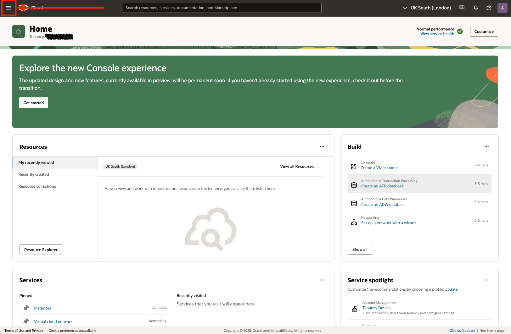
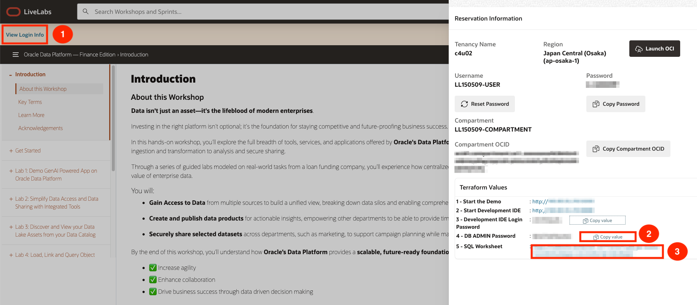
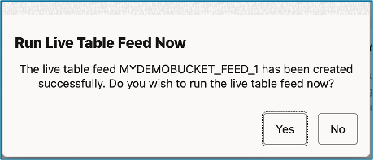

# 🏗️ Build your Data Pipeline: Load & Transform Data (optional lab)

## Introduction

As SeerEquities scales its lending operations, speed is becoming a competitive edge. Executives want delinquency alerts as they happen, risk teams want real-time updates on loan applications, and data analysts want to eliminate the delays caused by batch pipelines.

But SeerEquities’ current approach—periodic data loads and manual triggers—can’t keep up. Delays in data ingestion mean missed insights and late decisions.

**That’s where live feeds come in**. In this lab, you’ll bring SeerEquities one step closer to a real-time data ecosystem by enabling continuous data ingestion using Oracle’s event-driven architecture. As new data lands in cloud object storage, it will flow automatically into the Autonomous Database—no waiting, no manual refreshes.

By implementing this live feed, you're not just optimizing a pipeline—you’re unlocking faster reporting, proactive fraud detection, and just-in-time decision making. It’s a vital step in transforming SeerEquities’ data platform from reactive to real-time.

Estimated Time: 45 minutes

### Objectives

* Set up a Notifications Service Topic to receive event messages from Object Storage

* Create an Event Service Rule that monitors new object uploads

* Configure a Live Feed-enabled load job that triggers on new data

* Automate ingestion of new files from cloud object storage into the database

* Enable continuous, real-time data availability for downstream analytics and reporting

> **NOTE:** To complete this lab, you will alternate between **Oracle Cloud Infrastructure Console** pages and **Oracle Database Actions** pages. Selecting **Database Actions** will open a new tab.

## Task 1: Create a Notifications Service Subscription Topic

  1. First we will have to access OCI. Right above the workshop instruction you will find **View Login Info**.  

  

  2. Click **View Login Info** to see detailed reservation information such as user and password. Click **Launch OCI**  

  

  3. Follow the instructions provided to log in to your Oracle Cloud account, change your password, if prompted, and complete your login to Oracle Cloud.  

   a. Check the tenancy. If it is different, click on change tenancy.

  

   b. Add the user name and the password from the reservation information.

  

   c. Change the password, then click on Reset Password.

  

  4. Congratulations! You are now connected to an Oracle Cloud Infrastructure tenancy. You can now execute the different tasks and steps in this LiveLabs workshop.

  

  5. Now, let's navigate to **Developer Services**. Click on the **hamburger menu** on the top left.

  

  6. Select **Developer Services** from the Navigation Menu  

  

  7. Click **Notifications** under the **Application Integration** heading.

  

  8. Click **Create Topic**

  

  9. You can use the values below, or plug in your own. Just make sure to remember what you choose—you’ll need it again later in the lab!
  
  * **Name**: Live\_Feed\_for_Funding  
  * **Description**: This is to demo LiveFeed for Funding as a topic.  
  
  Click the **Create** button.

  

You’ve now successfully created a Notification Service topic—laying the foundation for event-driven data pipelines. Next, you’ll define the Events Service rule to detect when new data arrives and trigger the live feed automatically.

## Task 2: Create a Events Service Rule.

1. Open the **Navigation Menu** Click the icon in the upper left corner to 

  

2. Select **Observations & Management** from the Navigation Menu

  

3. Click **Rules** under the **Events Services** heading.

  

4. Click **Create Rule** and enter details.

  

5. Enter Rule details.

  

    * Enter the following Details under **Rule Conditions**:
         * **Condition:** Event Type
         * **Service Name:** Object Storage
         * **Event Type:** Object – Create
         * **Action Type:** Notifications

    * Click **Create Rule**.

## Task 3: Create a Live Table Feed and Copy the notification URL

1. Click **View Login Info**. Click the **SQL Worksheet** link.

       

    >**NOTE:** Use the same **ADMIN** password as shown on View Lab Info page

    

    \* Enter LOAN user credentials.  
    \* Press Sign-In button.  

5. Select **Feed Data** from the options listed at top of page.

  

6. Click the **Create Live Table Feed** button to enter the **Create Live Feed** wizard.

  

7. Select desired Cloud Store location, then click **Next**.

      

8. Enter desired Table Settings, then click **Next**.

  

9. Review the information shown on the Preview page, then click **Next**.

  

10. Complete the creation of the Live Table Feed 
  
  \* Take the following actions \...
    \* Enter the **Live Table Feed Name:**
    \* Check box to **Enable for Notification**
    \* Uncheck box to **Enable for Scheduling**
  \* Click **Create**

  

11. When the popup box appears, select **Yes** to run the Live Feed.

  

12. **Review** the details for the newly created Live Feed.  Then click the hamburger button in the upper right corner of the panel.

  

13. Select **Show Notification URL** from the dropdown list.

  

14. Copy the notification URL for the live table feed and click OK to proceed to next task.

  

  >**NOTE:** The notification URL will be used later in Task #4.

## Task 4: Create a Notifications Service Subscription

  1. Click on the **Navigation Menu**, then select **Developer Services**.

  

  2. Click **Notifications** under the **Application Integration** heading.

  

  3. Select **Subscriptions** (on the left side of the page, just below Topics).  The status will be **Active**.

  

  4. Click **Create Subscription**.

  5. Enter the Subscription details.

  

    * Provide the following:
    * **Subscription topic:** Select the subscription topic you created in Task 2
    * **Protocol:** Email
    * **URL** Paste in the URL you copied in Task 3

    * Click **Create**

  6. Switch to the Database Actions tab to review the card for the live table feed you are configuring for a notification-based feed.  It should reflect an **Active** notification status..

  

  * You will receive email notifications when specific live feed events occur and any new files uploaded to the bucket will automatically be loaded into the live feed table.

## Learn More

* [The Catalog Tool](https://docs.oracle.com/en/cloud/paas/autonomous-database/serverless/adbsb/catalog-entities.html)
* [Autonomous Database](https://docs.oracle.com/en/cloud/paas/autonomous-database/index.html)

## Acknowledgements

* **Authors** - Eddie Ambler, Otis Barr, Matt Kowalik
* **Contributors** - Mike Matthews, Marty Gubar, Francis Regalado, Ramona Magadan
* **Last Updated By/Date** - 04-28-2025

Copyright (C) Oracle Corporation.
