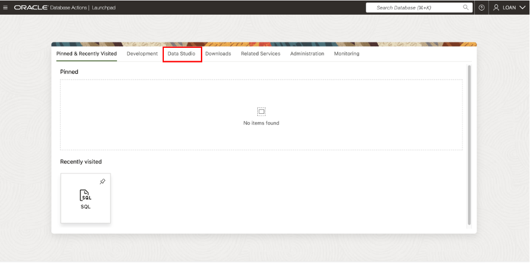
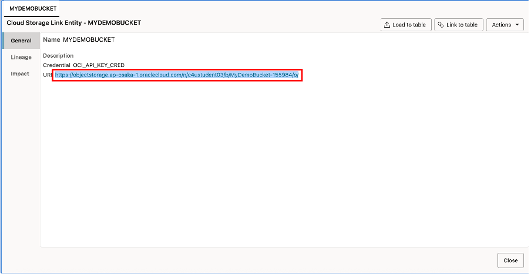
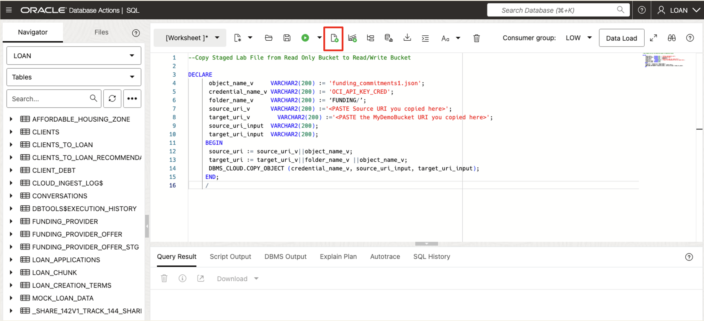

# 🏗️ Build your Data Pipeline: Load & Transform Data

## Introduction

In this lab, you’ll practice setting up the live feed capabilities, that can be used to load data that is continuously collected into cloud object storage. <br>
When a load job is enabled for live feed, it can be a scheduled job or connected to the OCI event notification and subscription mechanism, so that every time a new object is created in the object store bucket, it triggers the live feed, that then loads the contents to the database.

Estimated Lab Time: 45 minutes

### Objectives

Leverage Data Studio Tools to Build a Live Feed Data Pipeline
 * Explore using PL/SQL to interact with data in object storage
 * Create a Live Feed table in Autonomous Database
 * Simulate how new data loaded into object storage triggers Live Feed automation

### Prerequisites

  This lab assumes you have:
  * Completed Lab 1 --> Task 2 which creates the **Cloud Store Location named MyDemoBucket**

## Task 1: Prepare to Build a Live Feed Data Pipeline

>For this lab, we will **close the previous data share browser tab** and **launch a new SQL Worksheet browser tab** and login as **Loan** user.

  1. Click **View Login Info**. Copy your **DB ADMIN Password**, and click the **SQL Worksheet** link.

      

  2. For your Username enter **LOAN**. Paste in the password you copied in the previous step

      

      Click **Sign-in** button

  3. Select the **Development** tab, then click **SQL** to open the **SQL Worksheet**.

      

  4. Copy the following PL/SQL code to your clipboard, then paste it in the **SQL Worksheet**.  <br>

  >Note: This PL/SQL block will be used to copy staged exercise files from the **LoanApp_Funding** Object Storage Bucket into a **folder named FUNDING** in our **Object Storage Location named MyDemoBucket**, which we will use to create a Live Feed Table that auto loads data into a staging table.

      ```text
      <copy>
           DECLARE
            object_name_v     VARCHAR2(200) := 'funding_commitments1.json';
            credential_name_v VARCHAR2(200) := 'OCI_API_KEY_CRED';
            folder_name_v     VARCHAR2(200) := 'FUNDING/';
            source_uri_v      VARCHAR2(200) :='<Paste the Source URI you copied here>';
            target_uri_v        VARCHAR2(200) :='<Paste the Target (MyDemoBucket) URI you copied here>';
            source_uri_input  VARCHAR2(200);
            target_uri_input  VARCHAR2(200);
           BEGIN
            source_uri_input := source_uri_v||object_name_v;
            target_uri_input := target_uri_v||folder_name_v ||object_name_v;
            DBMS_CLOUD.COPY_OBJECT (credential_name_v, source_uri_input, target_uri_input);
           END;
           /
      </copy>
      ```

  5. Right-click on your browser tab and select **Duplicate** from the context menu to open another tab. <br>
  * Click **Database Actions** in the top banner **of the new tab**.

      

  6. Click **Data Studio** from the Launchpad page.

      

  7. Select **Data Load** from the Launchpad page.

      

  8. Then select the **Connections** tile.

      

  9. Select the **LOANAPP\_FUNDING** link, on the **Connections** page.

      

  10. Copy the source URI for **LOANAPP\_FUNDING** cloud storage to your clipboard

      

      >Press **Close** button proceed with lab

  11. Return to **SQL | Oracle Database Actions** browser tab.  <br>

  * In the PL/SQL block modify the ***source\_uri*** definition in the **PL/SQL Block in the SQL Worksheet**, as shown below:

      ```text
      source_uri    VARCHAR2(100) := ‘Paste the LOANAPP_FUNDING uri you copied here';
      ```

  12. Return to the **Data Load | Oracle Database** browser tab and Select the **MyDemoBucket** link.

      

  13. Copy the URI for **MYDEMOBUCKET** cloud store location to your clipboard.

      

  Click **Close** to exit.

  14. Return to **SQL | Oracle Database Actions** browser tab.  <br>

  * In the PL/SQL block modify the ***target\_uri*** definition in the **PL/SQL block we placed in the SQL Worksheet**, as shown below:

      ```text
      target_uri    VARCHAR2(100) := ‘Paste the MYDEMOBUCKET uri you copied here';
      ```

  15. Click the **Run Script** button.

      >If all is well, a message indicating the PL/SQL code completed successfully will appear near the bottom of the screen.

      

16.	Return to **Data Load | Oracle Database** tab.

* Click the **Actions** icon in the **MyDemoBucket** panel, then select **Objects** from the context menu.

    

17.	Click the folder icon to confirm that the **funding\_commitments1.json** file in the **LOANAPP\_FUNDING** bucket has been successfully copied here.

    

  Click **Close** to exit.

  ***Congratulations!*** You have now successfuly interacted with data in object storage using PL/SQL from the Data Studio tools and your Autonomous Database.

## Task 2: Build Initial Live Feed Table

  1. From the **Data Load | Oracle Database** tab - Navigate to Live Feed.

  * On Left rail expand **Data Load**, then click on **Live Feed**.

    

      >You should now see the Live Feed Page


  2.  Click the **Create Live Table Feed** button to enter the Create Live Feed wizard

      

  3. Enter details for the Live Table Feed Preview.

     * Select Cloud Store Location: **MyDemoBucket**
     * Select Radial Box: **Basic**
     * For Folders Select: **FUNDING**
     * For Extensions Select: json

      

     >Note: that you should now see the funding commitments file matching the object filter and a preview of its content.

     * Click the **Next** button to proceed.


  4. Configure Live Feed Table Settings as follows:

     * **For Option**: Choose **Merge Into Table** from drop-down list

     * **For target Table Name**: Enter the name of the target table of the Live Feed -- **FUNDING\_PROVIDER\_OFFER\_STG**. ***In ALL CAPS*** <br>

     * Then modify **Mapping** details exactly as shown below:
       >**Modify mapping to update Data Type** to NUMBER for: FUNDING_PROVIDER_ID and FUNDING_OFFER_REFERENCE_ID <br>
       >**For Merge Key**: Select FUNDING_PROVIDER_ID and FUNDING_OFFER_REFERENCE_ID

      

     * Click the **Next** button to proceed.

  5. Review the information shown on the Preview page.

      

      * Click **Next** to proceed.

   6. Enter remaining details for the **Live Table Feed**

      a. Enter live feed name **LOANAPP\_FUNDING\_FEED** <br>
      b. Check box to **Enable for Scheduling**. <br>
      c. Select every **2 minutes** for the polling time interval

      

      * Click **Create**

   7. When the popup box appears, select **Yes** to run the Live Feed.

      

   8. Review Live Feed Table and set page Refresh Interval

      * **You should see 3 rows loaded**
      * **Set page refresh interval to 10 seconds** to see when new data is loaded

      

***Congratulations!*** You have successfully created your Live Feed table.

## Task 3: Test Live Feed Table Data Population

1. Return to the **SQL | Oracle Database Actions** tab where your PL/SQL Block exists.

* Load a file into our Live Feed Bucket to trigger the Live Feed process by modifying the **object\_name** definition in the PL/SQL block, as shown below:

      ```text
      object_name     VARCHAR2(200) := 'funding_commitments2.json';
      ```

2. Click the **Run Script** button.

     >A message indicating the PL/SQL code completed successfully will appear near the bottom of the screen.

     

3. Navigate to the **Data Load | Oracle Database** tab.

     * Review the details for the Live Table Feed.  **Here we see that 4 new rows were loaded.**
     >Remember that it may take up to 2 minutes to display the new data, as we have configured a 2 minute polling schedule for our Live Feed process.

     

4. Return to the **SQL | Oracle Database Actions** tab, so that we can invoke an example of an automated procedure that would be run to convert our new funding data into new Loan Products for the Banks loan officers to sell.

    * Clear the SQL Worksheet and Run the following code to populate new loan products.

      ```text
      <copy>
        DECLARE
            New_Funding_Offers  NUMBER;
            New_Offers_Date  VARCHAR2(100);
            Old_Loan_Product_Count  NUMBER;
            New_Loan_Product_Count  NUMBER;

        BEGIN
            SELECT TO_CHAR(SYSDATE,'mm-dd-yyyy hh:mi') INTO New_Offers_Date FROM dual;
            SELECT count(*) INTO New_Funding_Offers FROM funding_provider_offer_stg;
            SELECT count(*) INTO Old_Loan_Product_Count FROM mock_loan_data;

            -- Funding to Loan Product Conversion Procedure
            CONVERT_FUNDING_TO_LOAN_PRODUCT;

            SELECT count(*) INTO New_Loan_Product_Count FROM mock_loan_data;

            -- Procedure Result Output Display
            DBMS_OUTPUT.put_line('There were ' || Old_Loan_Product_Count || ' Loan Products before the additional funding.' );
            DBMS_OUTPUT.put_line('There are : '|| New_Funding_Offers || ' new funding offers.'  );
            DBMS_OUTPUT.put_line('On '|| New_Offers_Date|| ', '|| New_Funding_Offers || ' funding offers were converted into Loan products, creating a total of '|| New_Loan_Product_Count || ' loan products for our Loan Officers to sell.');
        END;
        /

      </copy>
      ```

        

        ***Congratulations!*** On creating a Live Feed that can automatically load data from object storage into your database and be integrated into an automated business process.

## Conclusion
In this lab, you built a data pipeline using the Oracle Live Table Feed tool and successfully used the data from the pipeline in a PL/SQL block that was run from Oracle Autonomous Database to automate business processes.

In this workshop, you’ve also seen how Oracle’s Data Share tool helps teams like SeersEquities’ Risk Department securely access loan data without needing to duplicate the data, or incur delays in data access due to manual handoffs between the teams.
Having dependable access to data ensures faster risk analysis, smarter decisions, and tighter collaboration across the business.
Oracle makes it easy to use and share data on it's data platform powered by Oracle Autonomous Database, that unlocks the value of governed, AI-ready data.


## Learn More

* [The Catalog Tool](https://docs.oracle.com/en/cloud/paas/autonomous-database/serverless/adbsb/catalog-entities.html)
* [Autonomous Database](https://docs.oracle.com/en/cloud/paas/autonomous-database/index.html)

## Acknowledgements

* **Authors** - Eddie Ambler
* **Contributors** - Mike Matthews
* **Last Updated By/Date** - September 2025

Copyright (C) Oracle Corporation.
