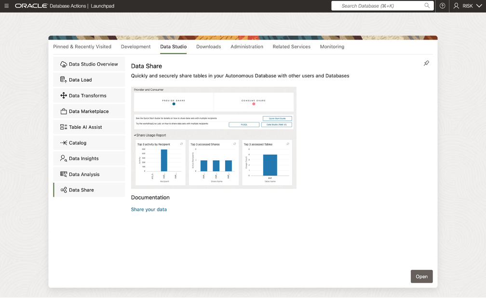
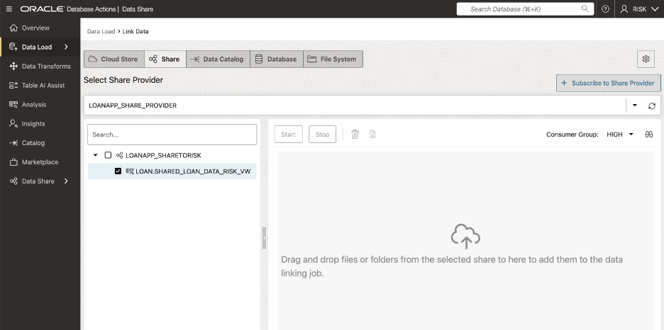
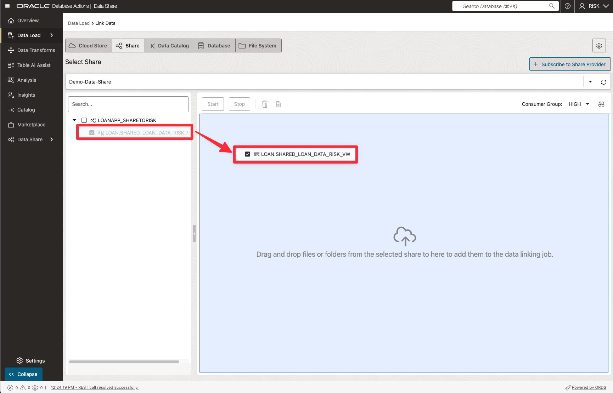
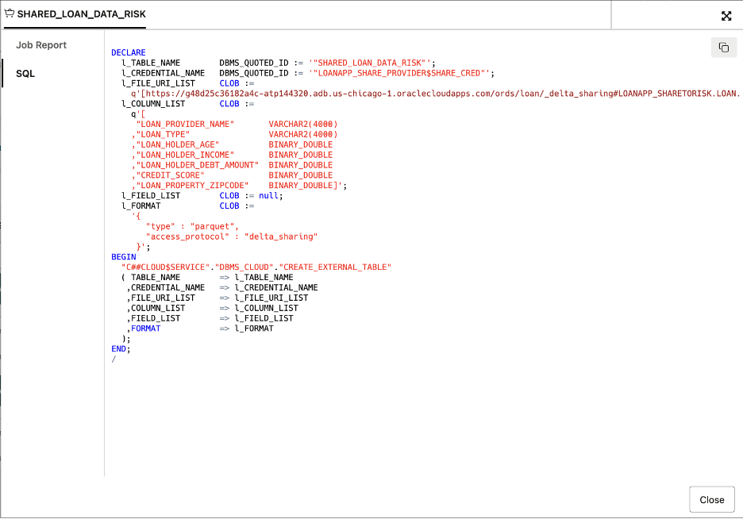

# 🛒 Subscribe to Data Products via Data Share Tool

## Estimated Lab Time: 30 minutes

## Introduction

In this lab, you’ll learn how to **subscribe** to data products published by the **LOAN** officer via the **Data Share tool**. Subscribing works like **“following”** a channel, ensuring you receive the **latest updates** as new information becomes available.

By the end of this lab, you’ll understand how the **Data Share** tool enables the **RISK** team to easily **access customized data products**, keeping everyone aligned and ready to act on **up-to-date information.**

### Prerequisites

* Requires Completion of Lab 5

## Task 1: Access Local Data Catalog

> **NOTE:** If continuing from lab 5, click on Data Share in bread crumb link and skip to step 4.

First, you’ll log into your Autonomous Database and connect to your local Data Catalog, so you can discover and manage all the data you have access to all from one location.

1. Navigate to your assigned ADB Instance.

    a. Open Navigation Menu  
    b. Select Oracle Database  
c   . Select Autonomous Database  

      

1. Select the name of your assigned database.  

    

1. Click on Database Actions, then select Data Load from the drop-down list  

      

1. Click on **Catalog** on left rail for the **ADB Catalog** to be displayed  

      

    **Congratulations you can now see your data objects from your Catalog!**  

## Task 2: Subscribe to Data Product Share as RISK user

1. On the left rail, click on the **Data Share** option.

      

1. On the **Provider and Consumer** page, click on **Consume Share**.

      

1. Click on **Subscribe to Share Provider** to display drop-down list, on the **Consume Share** page 
      

      Select **Subscribe to Delta Share Provider** from the list of options   

1. Enter details to subscribe to share provider as shown below:

   

   >**NOTE:** Click the open dialog box, navigate to the location where the data share resides, select the JSON file and click **Open**

   Click on **Next** to proceed

1. Select the **LoanApp\_ShareToRisk** share in the **Available Shares** column, on the **Add Shares** page.  Then, click the **move (>)** button to transfer the share to the **Selected Shares** column  

   

   Click on **Subscribe** to proceed.

## Task 3: Link Data: Create External Tables to Data Share

1. On the Link Data page, open **Share Provider** drop-down list and select **LoanApp\_Share\_Provider**

   

1. Now, let's create an external table based on the **LOAN.Shared\_Loan\_Data\_Risk\_VW** file by dragging and dropping the file onto the data linking job section.  

   

   >**NOTE:** This causes the external table to be created and displayed in the data linking job section.  

   

1. Click on the **Settings** (pencil Icon) to display the Link Data from Cloud Store Location panel. Edit Table Name to be **Shared\_Loan\_Data\_Risk**

   

   >**NOTE:** You can use the various tabs listed on the left rail to perform actions like change the name of the external table name to be created, view the table's properties, view the table's data, view the SQL code used to create the table and more.

   Click **Close** to proceed

1. Click **Start** to create shared link, then click **Run** in the popup box that appears  

      

1. After the link job is completed, make sure that the data link card has the link icon next to it.

      

## Task 4: Confirm Access to Object Storage Data

1. Click the Report button for this link job to view a report of the total rows processed successfully and failed for the selected table and the SQL used.

   

   Click **Close** when done.

1. In the **Table and View Loads** section, click the external table link named **Shared\_Loan\_Data\_Risk** to preview its data.  

   

   >**NOTE:** Remember, that the source data for this external table is from the **Shared\_Loan\_Data\_Risk\_VW** data share.

1. The **Shared\_Loan\_Data\_Risk\_VW** panel is displayed with the **Preview** tab selected by default that displays the external table's data.

   

1. Click **Close** to exit the panel and to return to the Data Share Dashboard.

1. Click on **Query** button to run a query from ADB against the Linked Shared Data

   

   ***Congratulations you have now subscribed to the data shared with you from ADB via Data Share and confirmed you can query the data.***

## Learn More

* [Get Started with Data Catalog](https://docs.oracle.com/en-us/iaas/data-catalog/using/index.htm)
* [Data Catalog Overview](https://docs.oracle.com/en-us/iaas/data-catalog/using/overview.htm)
* [Oracle Cloud Infrastructure Documentation](https://docs.cloud.oracle.com/en-us/iaas/Content/GSG/Concepts/baremetalintro.htm)
* [What Is a Data Catalog and Why Do You Need One?](https://www.oracle.com/big-data/what-is-a-data-catalog/)
* [Harvesting Object Storage Files as Logical Data Entities](https://docs.oracle.com/en-us/iaas/data-catalog/using/logical-entities.htm)

## Acknowledgements

* **Authors** -  Eddie Ambler, Otis Barr
* **Contributors** - Mike Matthews, Marty Gubar, Matt Kowalik, Ramona Magadan
* **Last Updated By/Date** - 04-28-2025

Copyright (C) Oracle Corporation.
