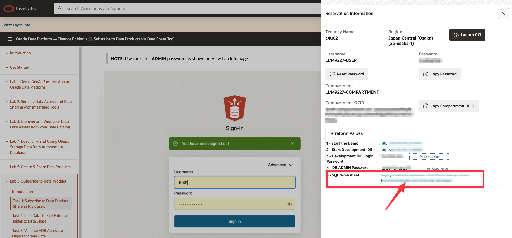
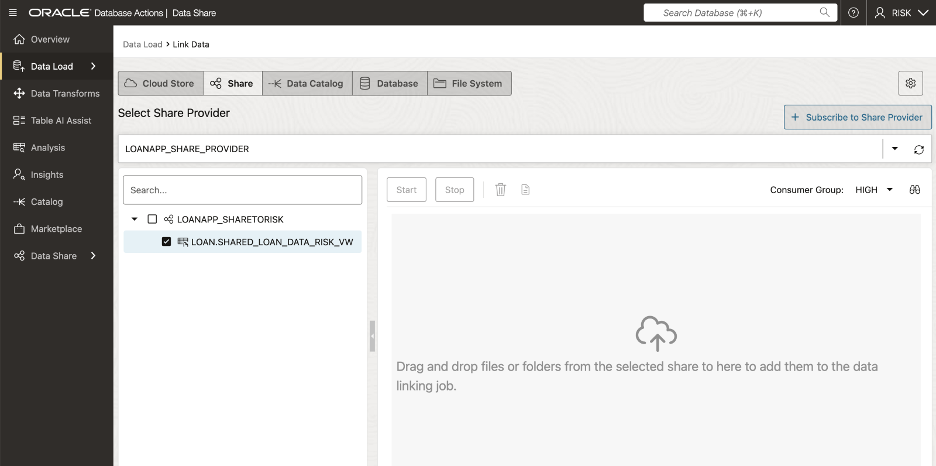

# 🛒 Subscribe to Data Products via Data Share Tool

## Introduction

In this lab, you’ll learn how to subscribe to data products published by the LOAN officer via the Data Share tool. Subscribing works like “following” a channel, ensuring you receive the latest updates as new information becomes available.

### Objectives
By the end of this lab, you’ll understand how the Data Share tool enables the RISK team to easily access customized data products, keeping everyone aligned and ready to act on up-to-date information.

Estimated Time: 30 minutes

### Prerequisites

* Requires Completion of Lab 5

## Task 1: Subscribe to Data Product Share as RISK user

1. Click **View Login Info**. Click the **SQL Worksheet** link.

      

1. Logon as the **RISK** user.

   🔘 On the **Database Actions Launchpad**, click the user icon in the top right corner.  Select **Sign Off** from the drop-down options.  

      

   🔘 Enter credentials in the popup window that appears below, to login as the **RISK** user.

      >**NOTE:** Use the same **ADMIN** password as shown on View Lab Info page

      

   🔘 Click **Sign in** button.

1. At the **Database Actions Launchpad**, click **Data Studio**.

      

1. On the left rail, click on the **Data Share** option.

      

1. On the **Provider and Consumer** page, click on **Consume Share**.

      

1. On the **Consume Share** Page

   🔘 Click on **Subscribe to Share Provider** drop-down button.  
   🔘 Select **Subscribe to Delta Share Provider** from the drop-down list  

      

1. The opening page of the **Subscribe to Share Provider** wizard will be displayed.  

   🔘 Enter the following details:

   For **Share Source**, select the **Delta Share Provider JSON** radio button  
   For **Share Provider JSON**, select the **From File** radio button  
   Click the open dialog box, navigate to the location where the data share resides, select the JSON file and click **Open**
   Enter **LoanApp\_Share\_Provider** for the **Provider Name:**  
   Enter **Subscribing to data share of closed mortgage loan details for risk analysis** for the **Description:** of the Share Provider  

   

   Click on **Next** to proceed

1. On the **Add Shares** screen, execute the following action:  

   🔘 Select the **LoanApp\_ShareToRisk** share in the **Available Shares** column  
   🔘 Click the **move (>)** button to transfer the share to the **Selected Shares** column  

   

   🔘 Click on **Subscribe** to proceed.

## Task 2: Link Data: Create External Tables to Data Share

1. On the Link Data page **select drop-down list**for Select Cloud Store Location or enter a public URL.  

1. Select the **LoanApp\_Share\_Provider.**

   

1. Expand the drill down tab for the share named **LoanApp\_Share\_Provider** to display the available data.

1. Now Let's create an external table based on the **LOAN.Shared\_Loan\_Data\_Risk\_VW** file by dragging and dropping the file onto the data linking job section.  

   

      >**NOTE:** This causes the external table to be created is displayed in the data linking job section.  

   

1. Click on the **Settings** (pencil Icon) to display the Link Data from Cloud Store Location panel. You can use the various tabs listed on the left rail to perform actions like change the name of the external table name to be created, view the table's properties, view the table's data, view the SQL code used to create the table and more.

   🔘 Edit Table Name to be **Shared\_Loan\_Data\_Risk**

   

   🔘 Click **Close** to proceed

1. Click **Start** to create shared link.

1. On the popup box that appears click **Run**

      

1. After the link job is completed, make sure that the data link card has the link icon next to it.

      

## Task 3: Validate ADB Access to Object Storage Data

1. Click the Report button for this link job to view a report of the total rows processed successfully and failed for the selected table and the SQL used.

   🔘 Click **Close** when done.

   

1. In the **Table and View Loads** section:

   🔘 Click the external table link named **Shared\_Loan\_Data\_Risk** to preview its data.  Remember, that the source data for this external table is from the **Shared\_Loan\_Data\_Risk\_VW** data share.

   

   The **Shared\_Loan\_Data\_Risk\_VW** panel is displayed with the **Preview** tab selected by default that displays the external table's data.

   

1. Click **Close** to exit the panel and to return to the Data Share Dashboard.

1. Click on **Query** button to run a query from ADB against the Linked Shared Data

   

***Congratulations you have now subscribed to the data shared with you from ADB via Data Share and confirmed you can query the data.***

## Learn More

* [Get Started with Data Catalog](https://docs.oracle.com/en-us/iaas/data-catalog/using/index.htm)
* [Data Catalog Overview](https://docs.oracle.com/en-us/iaas/data-catalog/using/overview.htm)
* [Oracle Cloud Infrastructure Documentation](https://docs.cloud.oracle.com/en-us/iaas/Content/GSG/Concepts/baremetalintro.htm)
* [What Is a Data Catalog and Why Do You Need One?](https://www.oracle.com/big-data/what-is-a-data-catalog/)
* [Harvesting Object Storage Files as Logical Data Entities](https://docs.oracle.com/en-us/iaas/data-catalog/using/logical-entities.htm)

## Acknowledgements

* **Authors** -  Eddie Ambler, Otis Barr
* **Contributors** - Mike Matthews, Marty Gubar, Matt Kowalik, Ramona Magadan
* **Last Updated By/Date** - 04-28-2025

Copyright (C) Oracle Corporation.
