# 🛒 Subscribe to Data Products via Data Share Tool

## Introduction

At SeersEquities, speed and precision are everything—especially for the Risk team. They need access to the latest loan data the moment it's available, without hunting it down or requesting manual updates.

In this lab, you’ll step into the role of a data share recipient and learn how to subscribe to live data products published by the Loan team using Oracle’s Data Share tool. Subscribing is like following a trusted data source: you always get the latest updates, automatically and securely.

By the end of this lab, you’ll understand how subscriptions help the Risk team stay aligned with the business—so they can evaluate changes quickly, adjust risk models, and support smarter decisions in real time.

Estimated Time: 30 minutes

### Objectives

In this lab, you will use the Data Studio tools to Consume a Data Share as a Recipient:

* **Create a Data Share Recipient**

* **Subscribe to a published data product** using the Data Share tool

* **Access shared datasets** from objet storage that were published by the LOAN team

### Prerequisites

* You must complete the lab **Create & Share Data Products**.

## Task 1: Subscribe to Data Product Shares as RISK user

> ***Note:*** For this lab, we will **close the Provide Share browser tab** and **launch a new SQL worksheet browser tab** logged in as the **Risk schema**, so that we can subscribe to the Data Share that was created in the previous lab.

1. Click **View Login Info**. Copy your **DB ADMIN Password**, and click the **SQL Worksheet** link.

      

2. For your Username enter **RISK**. Paste in the password you copied in the previous step.

   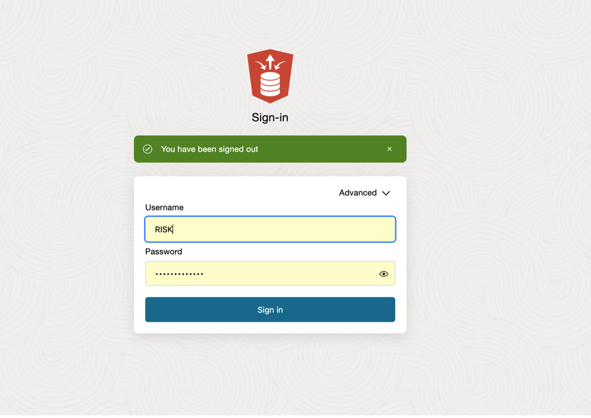

   Click **Sign in** button.

3. From the Launchpad, click **Data Studio**, then **Data Share**.

   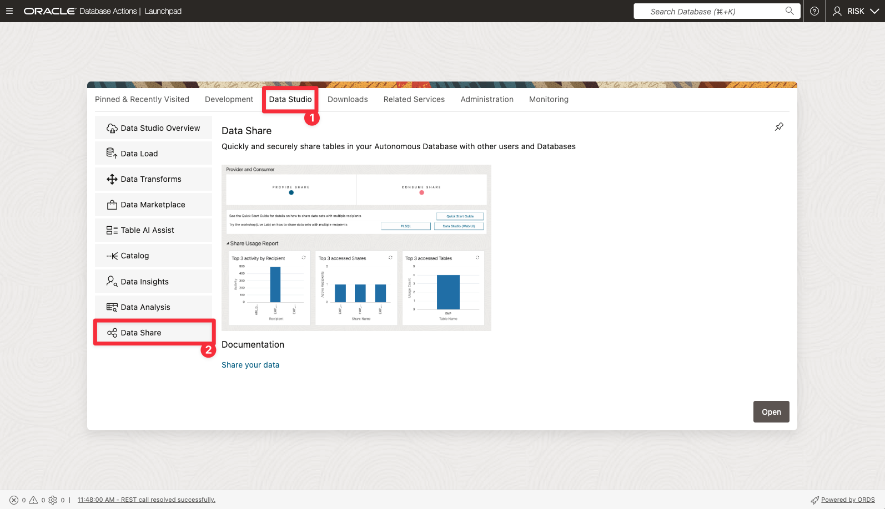

4. On the **Provider and Consumer** page, click on **Consume Share**.

      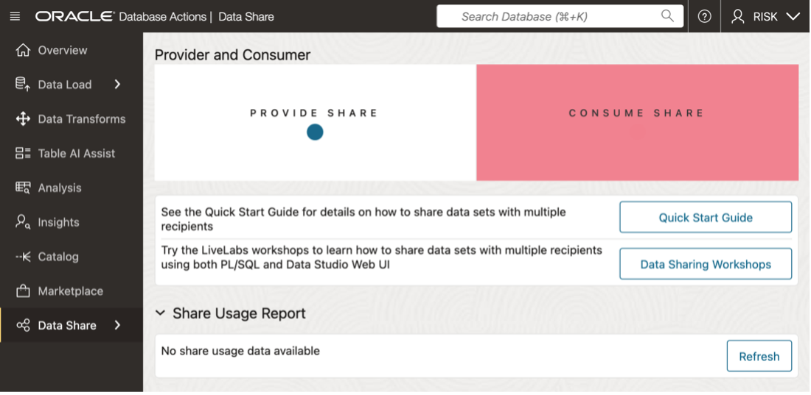

5. On the **Consume Share** Page

      * Click on **Subscribe to Share Provider** drop-down button.  
      * Select **Subscribe to Delta Share Provider** from the drop-down list  

      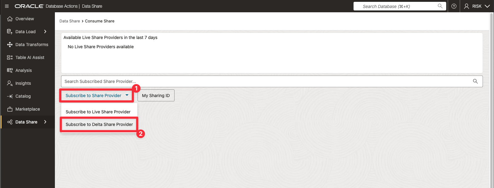

6. In the **Subscribe to Share Provider** wizard enter the following details:

      * Select **Create Share Provider** as share source
      * Select **From File** as **Share Provider JSON** 
        * Select the file you downloaded in the lab  **Create & Share Trusted Data Products**
      * In **Provider Name** text box enter: **Demo-Data-Share**  
      * In **Description** text box enter: **Demo-Data-Share**

      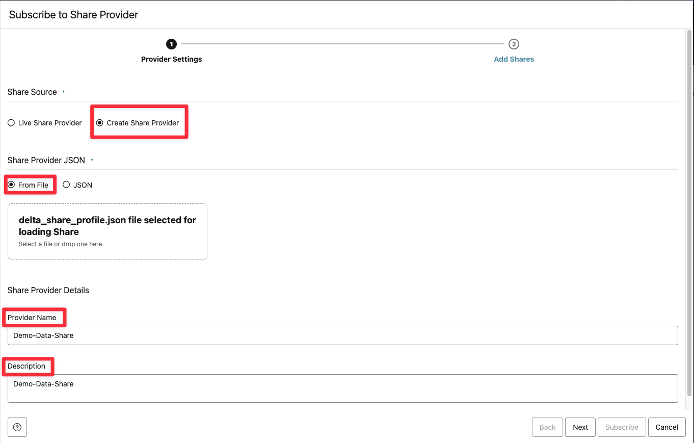

   Click on **Next** to proceed

7. On the **Add Shares** screen:

   Select the **LoanApp\_ShareToRisk** share in the **Available Shares** column  
   Click the **move (>)** button to transfer the share to the **Selected Shares** column  

   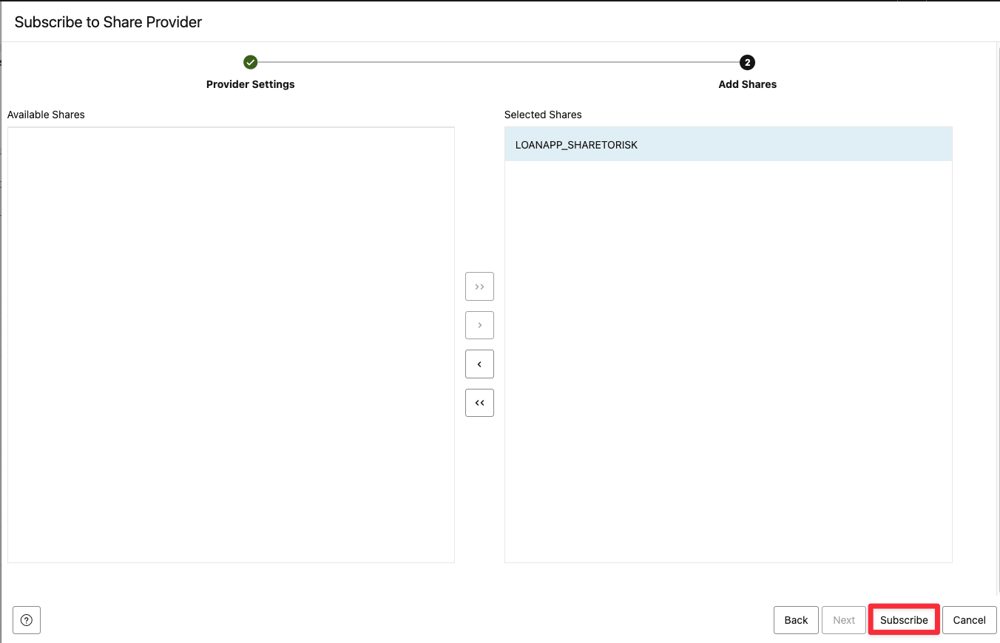

   Click on **Subscribe** to proceed.

***Congratulations!*** You have successfully subscribed to a data share, which is now accessible from your Autonomous Database.

## Task 2: Link Data: Create External Tables to link to the Data Share

1. On the Link Data page, **Expand the drop-down list** and then select **Demo-Data-Share.**

   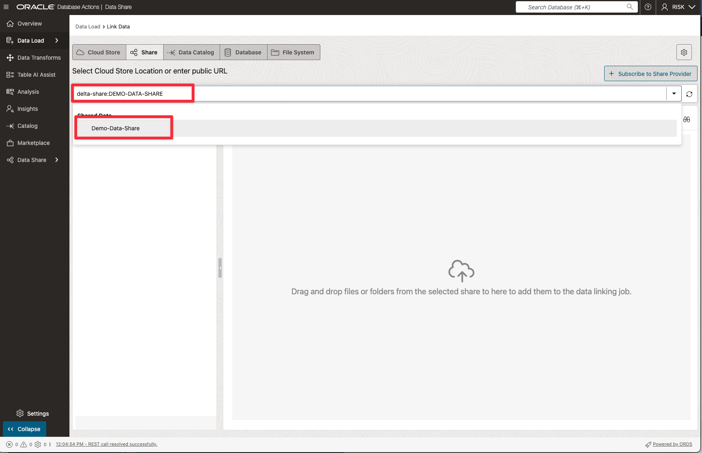

2. Expand the drill down tab for the share named **LoanApp\_ShareToRisk** to display the available data.

   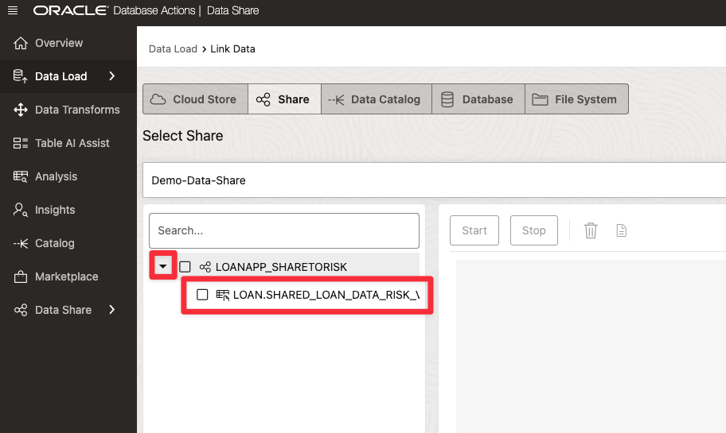

3. Drag and drop the file named **LOAN.Shared\_Loan\_Data\_Risk\_VW** into the data linking job area.

   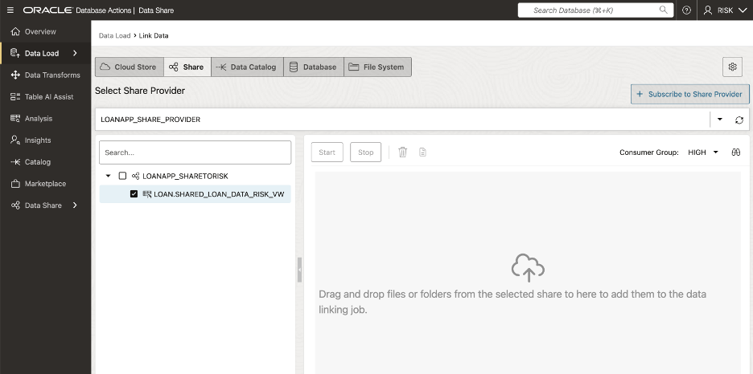

      >**NOTE:** This stages the creation of the external table that is displayed in the data linking job section.  

   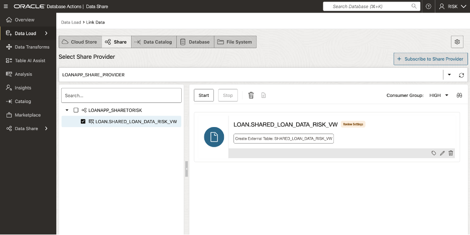

4. To modfy the external table configuration, click the **Settings** icon (pencil) to open the configuration panel. 

      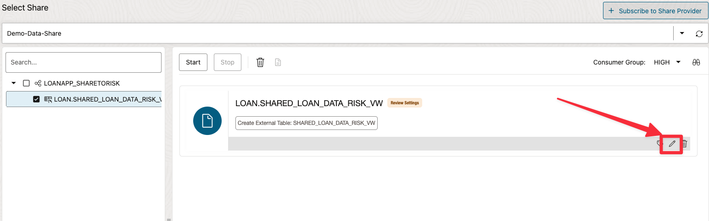

      * Rename the external table to: **SHARED\_LOAN\_DATA\_RISK**

      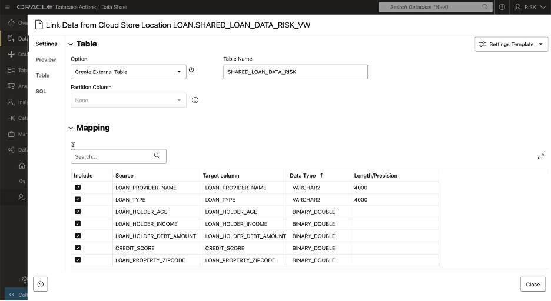

      * Click **Close** to proceed

5. Click **Start** to create shared link.

6. Click **Run** in the pop window.

      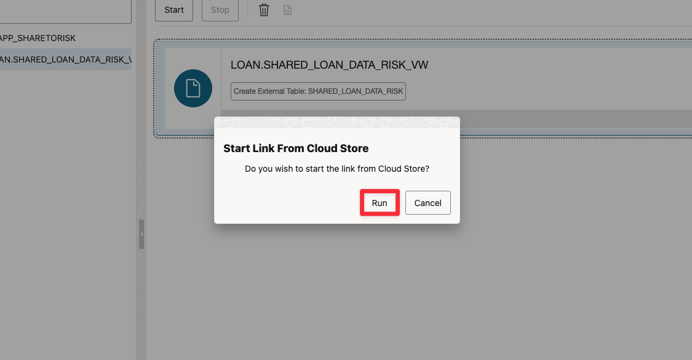

7. Once the job is complete, check that you see the link icon next to the data link card to confirm success.

   >If after a few seconds the status does not update, click the refresh icon on the right.

      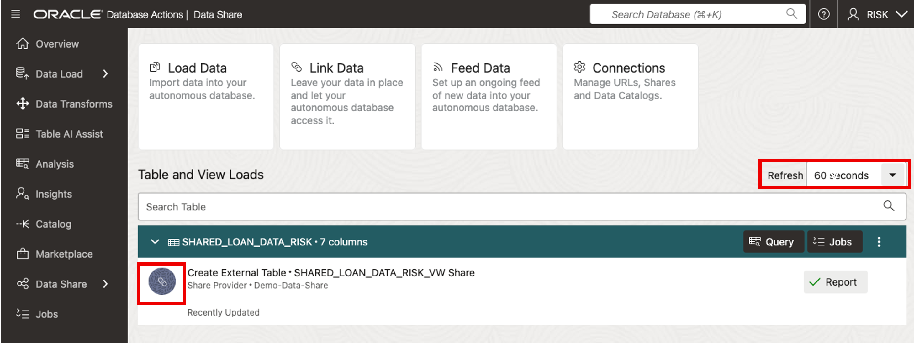

***Congratulations!*** You have successfuly created an external table to a shared dataset that links the shared loan data directly into your environment without needing to copying it.   This step gives the Risk team immediate, governed access to trusted data, that is ready for queries and analysis.

## Task 3: Validate ADB Access to Shared Object Storage Data

1. Click the **Report** button for this link job to view details on rows processed and then click on **SQL** on left rail to see the SQL used.

   Click **Close** when finished.

   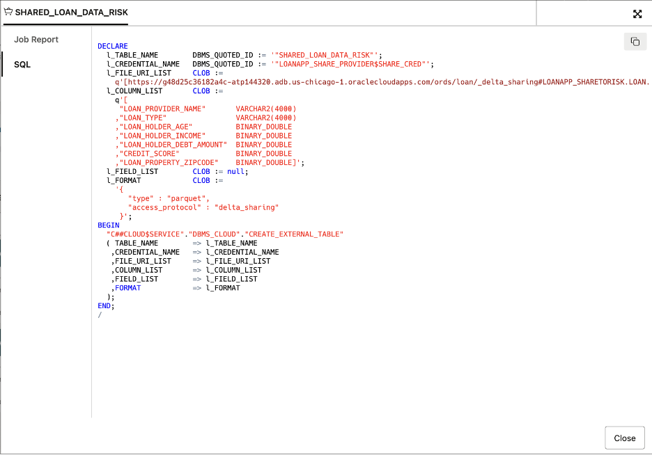

2. In the Table and View Loads section, click the external table link **Shared\_Loan\_Data\_Risk** to preview the data.   The source for this external table is the **Shared\_Loan\_Data\_Risk\_VW** data share.

   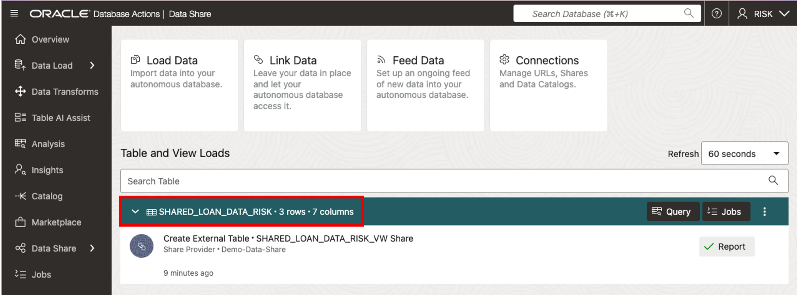

   The preview panel opens by default, showing the external table’s data.

   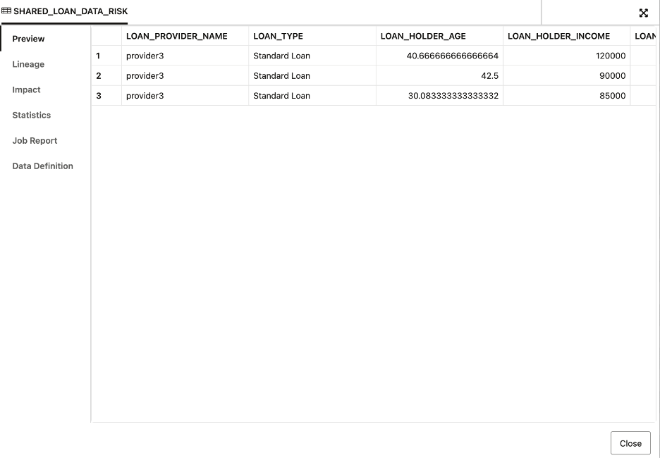

3. Click **Close** to return to the **Data Share Dashboard**.

4. Click **Query** to run a query against the linked shared data from Autonomous Database.

   

***Congratulations!*** You’ve now subscribed to a shared data product and validated that you can query it directly from Autonomous Database.   This ensures the Risk team at SeersEquities can work with live, trusted data—ready for real-time analysis without unnecessary data movement.

## Conclusion

In this lab, you subscribed to a shared data product, linked it as an external table, and successfully queried live data from Autonomous Database.   You’ve seen how Oracle’s Data Share tool helps teams like SeersEquities’ Risk Department securely access the latest loan data—without data duplication, delays, or manual handoffs.

This workflow ensures faster risk analysis, smarter decisions, and tighter collaboration across the business—all powered by governed, trusted data.

## Learn More

* [What Is a Data Catalog and Why Do You Need One?](https://www.oracle.com/big-data/what-is-a-data-catalog/)
* [Harvesting Object Storage Files as Logical Data Entities](https://docs.oracle.com/en-us/iaas/data-catalog/using/logical-entities.htm)

## Acknowledgements
* **Authors** - Eddie Ambler
* **Last Updated By/Date** - September 2025, Eddie Ambler

