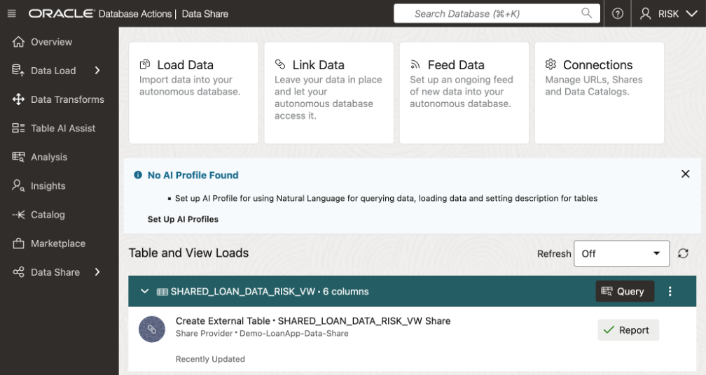

# Subscribe to Data Product Share

## Lab Objectives
 
In this Lab, you will:
•	Create a data share Consumer (RISK user) that will leverage data shared from the LoanAp along with other internal data in its schema to conduct risk analysis on the closed loans.

## Prerequisites
 
•	An Oracle account
•	Prerequisites for Share Recipients
•	The share recipient must have a valid email address a provider can use to register the recipient to use the share tool. Oracle Data Share allows you to share the recipient's activation link by email.
 
 
Features of Autonomous Database Serverless Share
 
With Autonomous Database Share you can: 
•	Share objects easily across Autonomous Databases and all tools or APIs that support the open delta sharing protocol.
•	Share versioned data with many recipients without data replication for all recipients.
•	Establish secure and centrally managed data sharing and collaboration within and across organizations.

## Share Terminology
 
Share: 
A Share is a named entity in the provider’s instance. 
It can be a group of datasets shared as a single entity. 
 
Example: A SALES table that needs to be shared within an organization.
 
Provider: 
The Autonomous Database Serverless enables the provider to share existing objects. 
The share can contain a single table, a set of related tables, or a set of tables with some logical grouping. 
It could be a person, an institution, or a software system that shares the objects. 
 
Example: An institution, such as NASA, that makes a data set available via data.gov.
 
Recipient: 
A Share recipient is an entity that associates an individual, an institution or a software system that receives a share from a provider. A recipient can have access to multiple shares. If you remove a recipient, that recipient loses access to all shares it could previously access. 
 
Example: An external system, such as Microsoft Power BI, that supports the Delta Sharing REST API.
 
Overview of Providers and Recipients
A Data Share is the logical container that contains objects (such as tables) that share recipients will get access to a share and all tables within this share. A Data Share also implements security mechanisms on a high object level which simplifies the authorization for a set of individual objects. A provider creates and publishes share of a versioned type. The recipient is given access to a share. The provider can modify shares (both data and metadata) after the provider publishes the share to the recipients.
 
Use Case of Data Share
A marketing agency can share sales information with multiple interested parties. 
 
How the Data Share tool works?
Data is made accessible by the data sharing provider (that is an Oracle Autonomous Database) to the data sharing recipient at query time in parquet format for a versioned share. 
A live share uses cloud links and can only be consumed in an Oracle database 
 
The provider can only share data which they have access to when they log into an autonomous database instance.
As a data provider, you create a share and select other additional entities to share. 
The Oracle Data Sharing for general recipients is based on the open delta sharing standard protocol, providing a simple REST-based API to share data in parquet format. 
For near real-time access to shared data, customers can use Live Shares accessed using the consumer's ADB-S instance.
 
The Autonomous Database Serverless Versioned Sharing protocol works as follows:
o	The provider creates and publishes a share that can be shared with one or multiple recipients. 
Every recipient will get a personal activation link to download their own JSON profile with the necessary information to access their share.
o	The versioned share recipient registers with the share server by entering the URL for the end point along with a client ID, secret key and a bearer token.
o	The versioned share recipient retrieves data from the share by calling the /shares/../tables/../query endpoint to obtain a list of URLs. The recipient then sends a GET request on these URLs to obtain the parquet files.
 
The Autonomous Database Serverless Live Sharing protocol works as follows: 
o	For a Live Share, the intended recipient will copy the sharing ID from the consumer page and publish the share that can be shared with recipients. This is the case when provider shares to only one database.
o	A provider can share also share to ALL_REGIONS, ALL_TENANCY, or ALL_COMPARTMENTS. 
 
## Share Architecture

   

## Task 1: Subscribe to Data Product Share as RISK user.

1. Navigate to your Assigned ADB Instance

   

1. Select name of desired database.

   

1. Select **Database Actions**., then **View All Database Actions**

   

1. Sign-out of **Database Actions Launchpad** as ADMIN user.

   

1. Sign-on to **Data Studio** as RISK user.

   

1. At the **Database Actions Launchpad**, click **Data Studio**.

   

1. At the **Data Share** on the navigation tree.

        

1. Click on **Consumer Share** on the **Provider and Consumer** page.

   

1. Select **Subscribe to Delta Share Provicer** from the drop-down list on page, click on **Consumer Share** page.

   

1. The **Subscribe to Share Provider** wizard will be displayed.

   

   * Enter the following:
      * **Share Source:** Accept the default selection, Delta Share Provider JSON.
      * **Share Provider JSON:** Accept the default selection, From File.
      * **Delta Share Profile JSON:** Click this box. In the Open dialog box, navigate to the location where you downloaded the data share profile, select it, and then click Open.
      *  **Provider Name:** Enter Demo-LoanApp-Data-Share

1. On the **Add Shares** screen will appear. 

   

   * Select the **LoanApp_Share2Risk** share in the Available Shares column.
   * Click the ">" button to reloate the share in the Shared Shares column
   * Click **Next**.

    The LoanApp_Share2Risk share is displayed in the **Selected Shares** section.  Click **Subscribe**.

   

## Task 2: Link Data: Create External Tables to Data Share.

1. On the Link Data page, click the Select Cloud Store Location or enter a public URL drop-down list.
 
     
 
1. Select the **Demo-LoanApp-Data-Share**.  The **DELTA_SHARING** data share to which you subscribed is now displayed. 
 
1. Expand the drill down tab for **Demo-LoanApp-Data-Share**  to display the available data. 

1. Now Let's create an external table based on the **LOAN.Shared_Loan_Data_Risk_VW** file. 
Drag and drop this file onto the data linking job section.
 
     

    The external table to be created is displayed in the data linking job section. 
  
     

1. You can click the **Settings** (pencil Icon) to display the Link Data from Cloud Store Location panel. 
You can use the various tabs listed on the left rail to perform actions like change the name of the external table name to be created, view the table's properties, view the table's data, view the SQL code used to create the table and more. 

Click **Close** when you're done.
   
     
 
1. Click **Start**.

A Start Link From Cloud Store message box is displayed. 

Click **Run**.
 
     
 
1.  After the link job is completed, make sure that the data link card has the link icon next to it. 
  
     

## Task 3: Validate ADB Access to Object Storage Data.

1.  Click the **Report** button for this link job to view a report of the total rows processed successfully and failed for the selected table and the SQL used.

Click **Close** when done.
 
     
 
1.  In the Table and View Loads section, Click the external table link named **Shared_Loan_Data_Risk_VW** to preview its data. 

Remember, that the source data for this external table is from the **Shared_Loan_Data_Risk_VW** data share.
 

     
 
The **Clients_To_Loan** panel is displayed with the **Preview** tab selected by default that displays the external table's data.

     
 
1. Click **Close** to exit the panel and to return to the Data Share Dashboard.

1. Click on Query button to run a query from ADB against the Linked Shared Data

     

* On the left rail, Click on Catalog to return to Dashboard

     

***Congratulations you have now subscribed to the data shared with you from ADB via Data Share.***

## Acknowledgements
* **Author** - <Name, Title, Group>
* **Contributors** -  <Name, Group> -- optional
* **Last Updated By/Date** - <Name, Month Year>
